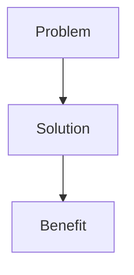
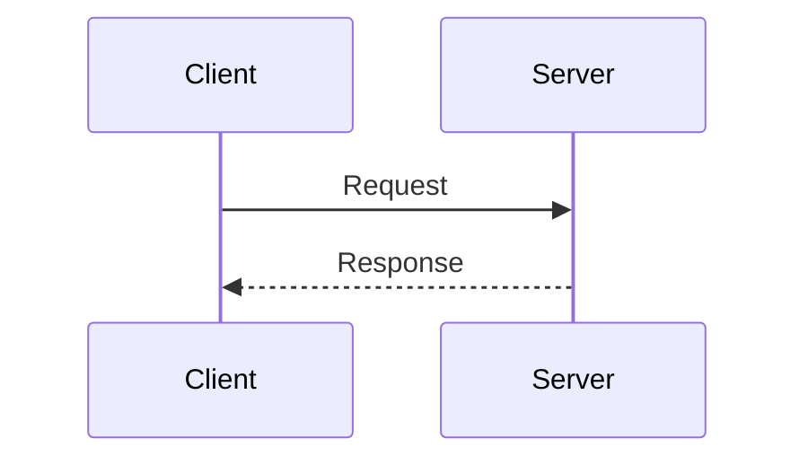
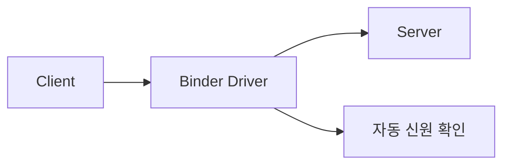
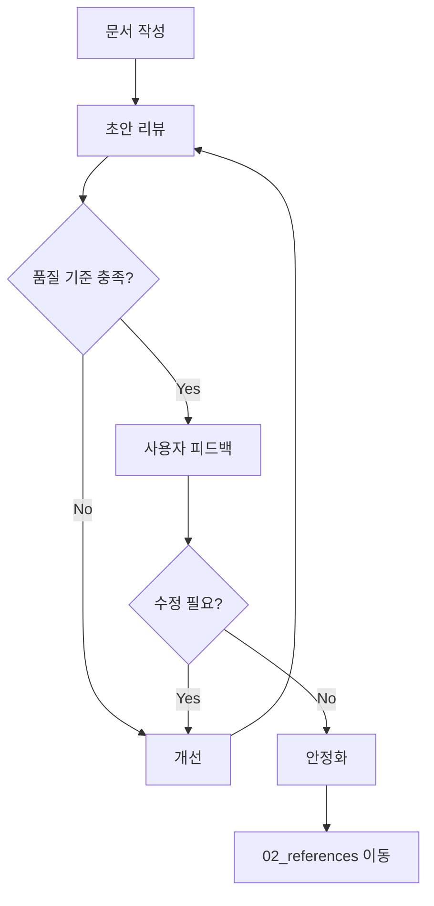

# Technical Documentation Improvement Guide

이 가이드는 기술 문서를 깊이 있고 체계적으로 개선하는 방법을 정의합니다.

---

## 📋 문서 개선 체크리스트

### 1. 구조 분석
- [ ] 현재 문서 길이와 내용 파악
- [ ] 관련 문서들 식별
- [ ] 중복 내용 확인
- [ ] 폴더 구조 적절성 평가

### 2. 내용 개선
- [ ] 역사적 맥락 추가 ("왜 필요했나")
- [ ] 문제-해결 서사 구성
- [ ] 기술적 상세 추가
- [ ] 코드 예시 포함
- [ ] Mermaid 다이어그램 2-3개 추가
- [ ] 디버깅/도구 섹션 포함

### 3. 연결성
- [ ] 관련 문서 링크 추가
- [ ] 용어집 링크
- [ ] 상위/하위 개념 연결

### 4. 검증
- [ ] 목표 길이 달성 (400-700줄)
- [ ] 일관된 스타일
- [ ] 모든 섹션 완성도 확인

---

## 📝 문서 템플릿

```markdown
---
title: [topic-name]
tags: [category, subcategory, keywords]
aliases: [Alternative Names, 한글명]
date modified: YYYY-MM-DD HH:MM:SS +09:00
date created: YYYY-MM-DD HH:MM:SS +09:00
---

## [Topic Name]

[Opening paragraph: 1-2 sentences explaining what this is]

### 왜 [Topic]이 필요한가

#### [Historical Context]

**[시대/상황] ([연도])**:

[문제 상황 설명]

**문제**:
1. **[Problem 1]**: [설명]
2. **[Problem 2]**: [설명]
3. **[Problem 3]**: [설명]

**측정된 문제** (if applicable):
- [Metric 1]: [value]
- [Metric 2]: [value]

#### [Solution Name]의 해결책

**핵심 아이디어**: [1-2 sentences]



**이점**:
1. **[Benefit 1]**: [설명]
2. **[Benefit 2]**: [설명]

---

## [Main Architecture/Concept]

### [Component 1]

[설명]

```[language]
// 코드 예시
```

### [Component 2]

[설명]

```mermaid
[diagram type]
    [content]
```

---

## [Advanced Topics]

### [Topic 1]

[상세 설명]

**예시**:
```[language]
// 실전 코드
```

### [Topic 2]

| Feature | Description |
|---------|-------------|
| [항목] | [설명] |

---

## [Performance/Optimization]

### [Optimization 1]

**Before**:
```[language]
// 비효율적 코드
```

**After**:
```[language]
// 최적화 코드
```

**효과**: [측정 결과]

---

## 디버깅

### [Debugging Method 1]

```bash
# 명령어
adb/dumpsys/etc
```

**출력 해석**:
- [항목]: [의미]

### [Debugging Method 2]

[도구 사용법]

---

## 학습 리소스

**공식 문서**:
- [Link Name](url)

**소스 코드**:
- [Component](url)

**도구**:
- [Tool name]: [설명]

---

## 연결 문서

[[related-doc-1]] - [관계 설명]  
[[related-doc-2]] - [관계 설명]  
[[related-doc-3]] - [관계 설명]
```

---

## 🎨 작성 스타일 가이드

### 문체

1. **명확성 우선**
   - 기술 용어는 정확하게
   - 첫 사용 시 설명 또는 링크
   - 예시로 보충

2. **맥락 제공**
   - "무엇"만이 아닌 "왜"와 "어떻게"
   - 역사적 배경
   - 설계 결정 이유

3. **단계적 깊이**
   - 개요 → 상세 → 고급
   - 초보자도 따라올 수 있게
   - 전문가도 배울 것이 있게

### 코드 예시

```markdown
// ❌ 나쁜 예: 설명 없음
public void process() {
    data.forEach(item -> transform(item));
}

// ✅ 좋은 예: 주석과 맥락
public void process() {
    // 각 항목을 병렬 처리하여 성능 향상
    data.parallelStream()
        .map(this::transform)
        .collect(Collectors.toList());
}
```

### Mermaid 다이어그램 사용

**언제 사용하나**:
- 프로세스 흐름 (graph, sequenceDiagram)
- 구조/계층 (graph TB/LR)
- 시간 흐름 (sequenceDiagram)
- 상태 전환 (stateDiagram)

**예시**:

````markdown

````

### 표 사용

비교나 옵션 나열 시:

```markdown
| 항목 | A 방식 | B 방식 |
|------|--------|--------|
| 성능 | 빠름 | 느림 |
| 메모리 | 많음 | 적음 |
```

---

## 🔗 크로스 레퍼런스 패턴

### Obsidian 링크

```markdown
# 기본 링크
[[filename]]

# 별칭 링크
[[filename|Display Text]]

# 섹션 링크
[[filename#Section Name]]

# 혼합
[[filename#Section|Custom Text]]
```

### 링크 전략

1. **첫 언급 시 링크**
   ```markdown
   [[binder|Binder]]는 안드로이드의 IPC 메커니즘이다.
   이후 Binder 언급 시에는 링크 불필요 (동일 문서 내).
   ```

2. **관련 개념 링크**
   ```markdown
   메모리 관리는 [[virtual-memory|가상 메모리]]와 
   [[buffer|버퍼링]]을 통해 최적화된다.
   ```

3. **상세 정보 링크**
   ```markdown
   **상세**: [[android-init-and-services]]
   또는
   [[android-init-and-services|Init 상세]] 참고.
   ```

---

## 📐 목표 메트릭

### 길이

- **핵심 시스템 문서**: 600-800줄
- **일반 기술 문서**: 400-600줄
- **개요/참조 문서**: 200-400줄

### 구성 비율

- 서론/맥락: 10-15%
- 핵심 내용: 60-70%
- 고급/최적화: 10-15%
- 디버깅/리소스: 5-10%

### 다이어그램

- 최소 2개
- 권장 3-5개
- 복잡한 개념마다 1개

---

## 🚀 실행 프롬프트

다음 프롬프트를 복사하여 사용:

```
다음 문서를 개선해주세요:

**대상 파일**: [파일명]
**현재 상태**: [현재 줄 수]줄, [현재 문제점]

**개선 방향**:
1. 역사적 맥락 추가 - "왜 이 기술이 필요했는지" 설명
2. 문제-해결 서사 구성
3. 기술적 상세 추가 (구현 메커니즘, 아키텍처)
4. Mermaid 다이어그램 2-3개 추가
5. 코드 예시 포함
6. 디버깅/도구 섹션 추가
7. 관련 문서 크로스 레퍼런스

**참고 스타일**: 
- kernel.md, selinux.md, cpu-privilege-levels.md 패턴 따르기
- 단일 통합 설명 (dual-level 피하기)
- 맥락 있는 기술 설명

**목표 길이**: ~600줄

**필수 포함 섹션**:
- "왜 [주제]가 필요한가" (역사적 배경)
- 핵심 아키텍처/메커니즘
- 실전 예시
- 성능/최적화
- 디버깅
- 학습 리소스
- 연결 문서

**Mermaid 다이어그램 사용**:
- 아키텍처: graph TB/LR
- 프로세스 흐름: sequenceDiagram
- 상태: stateDiagram
```

---

## 🛠️ 폴더 구조 최적화

### Before (평면 구조)
```
/docs
  ├─ topic-a.md
  ├─ topic-b.md
  ├─ topic-c.md
  └─ ... (수십 개 파일)
```

### After (카테고리 구조)
```
/docs
  ├─ core/           # 핵심 개념
  ├─ advanced/       # 고급 주제
  ├─ tools/          # 도구/디버깅
  ├─ reference/      # 참조/용어
  └─ README.md       # 구조 설명
```

### 폴더 생성 스크립트

```bash
# 카테고리 폴더 생성
mkdir -p core advanced tools reference

# 파일 분류 이동
mv *-core-*.md core/
mv *-advanced-*.md advanced/
mv *-tools-*.md tools/
mv *-glossary*.md reference/

# README 생성
cat > README.md << 'EOF'
# Documentation Structure

## 📁 Folders
- `/core` - Core concepts
- `/advanced` - Advanced topics
- `/tools` - Tools and debugging
- `/reference` - Glossary and reference

## 📚 Reading Path
1. Start with `reference/overview.md`
2. Read `core/` files in order
3. Explore `advanced/` as needed
EOF
```

---

## 📊 품질 체크리스트

문서 완성 후 확인:

### 내용
- [ ] "왜 필요한가" 섹션 있음
- [ ] 역사적 배경 설명
- [ ] 문제-해결 서사
- [ ] 코드 예시 2개 이상
- [ ] 디버깅 섹션
- [ ] 학습 리소스

### 시각화
- [ ] Mermaid 다이어그램 2개 이상
- [ ] 표가 적절히 사용됨
- [ ] 코드 블록 syntax highlighting

### 연결성
- [ ] 관련 문서 링크 3개 이상
- [ ] 용어 링크
- [ ] "연결 문서" 섹션

### 형식
- [ ] YAML frontmatter 완전
- [ ] 섹션 계층 일관성
- [ ] 목표 길이 달성
- [ ] 맞춤법/문법 확인

---

## 🎯 실전 예시

### Before (개선 전)

```markdown
---
title: binder
---

## Binder

안드로이드 IPC.

- 프로세스 간 통신
- Kernel driver 사용
- transact() 메서드로 호출
```

### After (개선 후)

```markdown
---
title: binder
tags: [android, ipc, kernel]
aliases: [Binder, Android IPC]
date modified: 2025-12-17
date created: 2025-12-17
---

## Binder와 Android IPC

Binder는 안드로이드의 **프로세스 간 통신(IPC)** 메커니즘이다. 

### 왜 Binder가 필요했나

#### 모바일 환경의 IPC 요구사항 (2000년대 초반)

구글이 안드로이드를 개발할 당시:
- 빈번한 프로세스 간 통신 (수천 번/초)
- 제한된 메모리와 배터리
- 보안 격리 필요

**전통적인 Unix IPC의 한계**:
- Socket: 오버헤드 큼
- Pipe: 양방향 어려움
- 신원 확인 복잡

#### Binder의 해결책



[... 상세 내용 계속 ...]

## 연결 문서

[[kernel]] - Binder 드라이버  
[[selinux]] - Binder 서비스 보안
```

---

## 💡 Tips & Tricks

### 1. 역사적 맥락 리서치

```
검색 키워드 예시:
- "[Technology] history"
- "[Technology] why designed"
- "[Technology] original paper"
- "[Technology] evolution timeline"
```

### 2. 다이어그램 선택

- **아키텍처**: `graph TB` (Top to Bottom)
- **데이터 흐름**: `graph LR` (Left to Right)
- **시간/호출**: `sequenceDiagram`
- **상태 변화**: `stateDiagram-v2`
- **계층 구조**: `graph TB` with subgraphs

### 3. 코드 예시 원칙

- **Bad Example 먼저, Good Example 나중**
- 주석으로 핵심 설명
- 실행 가능한 코드
- 간결하게 (10-20줄)

### 4. 섹션 순서

1. What (정의)
2. Why (역사/필요성)
3. How (메커니즘)
4. Examples (예시)
5. Advanced (고급)
6. Debug (디버깅)
7. Resources (리소스)

---

## 📦 재사용 가능한 프롬프트 모음

### 문서 개선 요청

```
[파일명] 문서를 다음 기준으로 개선해주세요:

1. 역사적 맥락 ("왜 필요했나")
2. 기술 상세 (아키텍처, 메커니즘)
3. Mermaid 다이어그램 3개
4. 실전 코드 예시
5. 디버깅 섹션
6. 크로스 레퍼런스

스타일: kernel.md, selinux.md 참고
목표: ~600줄
```

### 폴더 구조 정리 요청

```
다음 폴더 내 파일들을 카테고리별로 정리해주세요:

**대상**: [폴더 경로]

**분류 기준**:
- core: 핵심 개념
- advanced: 고급 주제  
- tools: 도구/디버깅
- reference: 참조

각 폴더에 README.md도 생성해주세요.
```

### 중복 파일 통합 요청

```
다음 파일들의 중복을 분석하고 통합 방안 제시:

**파일들**:
- [file1.md]
- [file2.md]
- [file3.md]

**확인 사항**:
- 내용 중복도
- 각 파일의 고유 내용
- 통합 시 구조 제안
```

---

## 🔄 지속적 개선 워크플로우



---

이 가이드를 사용하여 일관되고 깊이 있는 기술 문서를 작성할 수 있습니다.
