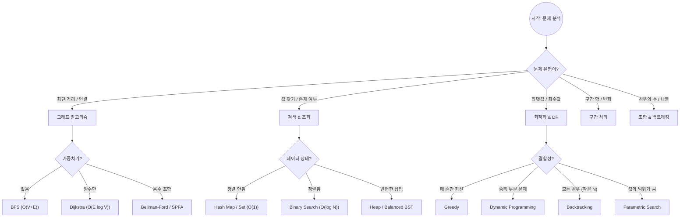

# 🧭 알고리즘 선택 결정 트리 (Decision Tree)

문제를 만났을 때 어떤 자료구조와 알고리즘을 사용할지 결정하는 **논리적 프레임워크**입니다. 데이터의 특성과 제약 조건을 따라가며 최적의 무기를 선택하세요.

---

## 🗺️ 메인 결정 트리 (High-Level Flow)

문제가 요구하는 **핵심 액션**이 무엇인지에 따라 첫 번째 방향을 결정합니다.

---

## 📊 상황별 상세 선택 논리표

### 1. 검색 및 데이터 조회 (Search & Lookup)
"어떤 값을 빠르게 찾거나, 중복을 제거해야 하는가?"

| 요구사항 | 추천 알고리즘 / 자료구조 | 시간 복잡도 | 핵심 포인트 |
|:---|:---|:---|:---|
| **단순 존재 여부 / 개수** | Hash Set / Map | $O(1)$ | 공간을 써서 속도를 얻음 |
| **연속된 범위 내 검색** | Binary Search | $O(\log N)$ | 반드시 데이터가 **정렬**되어 있어야 함 |
| **실시간 순위 / 최댓값** | Heap (Priority Queue) | $O(\log N)$ | 삽입과 삭제가 빈번할 때 유리 |
| **문자열 접두사 검색** | Trie | $O(L)$ | $L$은 문자열의 길이 |

### 2. 그래프와 네트워크 (Graph & Connectivity)
"노드들이 연결되어 있고, 경로를 찾아야 하는가?"

| 상황 | 추천 알고리즘 | 시간 복잡도 | 비고 |
|:---|:---|:---|:---|
| **모든 노드 연결 (최소 비용)** | Kruskal / Prim (MST) | $O(E \log E)$ | 간선이 적으면 Kruskal, 많으면 Prim |
| **두 노드 간 최소 이동 횟수** | BFS | $O(V+E)$ | 가중치가 없는 그래프의 최단 거리 |
| **한 지점 -> 모든 지점** | Dijkstra | $O(E \log V)$ | 가중치가 양수일 때 표준 |
| **모든 지점 -> 모든 지점** | Floyd-Warshall | $O(V^3)$ | $V \le 500$ 이하일 때만 사용 |
| **사이클 존재 여부** | Union-Find / DFS | $O(\alpha(N))$ | 무방향은 Union-Find, 방향은 DFS |

### 3. 최적화 및 경우의 수 (Optimization)
"가장 좋은 방법을 찾거나, 가능한 모든 경우를 따져야 하는가?"

| 상황 | 추천 전략 | 핵심 질문 |
|:---|:---|:---|
| **부분 문제의 해가 전체의 해** | Greedy | "지금 이 선택이 나중에도 최선인가?" (증명 필요) |
| **계산이 자꾸 반복됨** | DP | "이전에 구한 값을 어딘가 기록(Memo)했는가?" |
| **N 이 매우 작음 ($N < 20$)** | Backtracking | "모든 경우를 다 가보되, 안 되는 길은 미리 끊는가?" |
| **정답의 범위를 이분 탐색** | Parametric Search | "최댓값을 $k$로 잡았을 때 가능한가?" (결정 문제화) |

---

## ⏱️ 데이터 크기($N$)에 따른 필터링
설계한 알고리즘이 [복잡도 분석](complexity-and-big-o.md)의 $10^8$ 법칙을 통과하는지 확인하세요.

| 입력 규모 ($N$) | 허용 복잡도 | 대표 알고리즘 |
|:---|:---|:---|
| **$N \le 10$** | $O(N!)$ | 순열, 완전 탐색 |
| **$N \le 20$** | $O(2^N)$ | 백트래킹, 비트마스크 |
| **$N \le 500$** | $O(N^3)$ | 플로이드-와샬 |
| **$N \le 5,000$** | $O(N^2)$ | 브루트포스, 단순 DP |
| **$N \le 10^5$** | $O(N \log N)$ | 정렬, 이진 탐색, 세그먼트 트리 |
| **$N \le 10^7$** | $O(N)$ | 슬라이딩 윈도우, 투 포인터, 그리디 |

---

## 💡 개발자를 위한 팁
1. **역발상**: "도저히 효율적인 방법이 안 떠오른다"면, 문제를 거꾸로 풀어보거나(Reverse), 정답을 미리 정해놓고 검제하는 방법(Parametric Search)을 고민해보세요.
2. **자료구조가 먼저**: 알고리즘은 자료구조의 특성을 이용할 뿐입니다. 데이터를 어떻게 담을지(`Map`, `Stack`, `Heap` 등) 결정하면 알고리즘은 자연스럽게 따라옵니다.
3. **병목(Bottleneck) 찾기**: 전체 로직 중 가장 많이 반복되는 구간이 어디인지 파악하고 그 부분만 집중적으로 최적화하세요.

---

## 📚 관련 문서
- [문제 해결 프로세스](problem-solving-process.md) - 설계 단계의 4단계 프레임워크
- [복잡도 분석](complexity-and-big-o.md) - 성능 예측의 기준
- [최적화 전략](../03_patterns/optimization.md) - 실무적 병목 현상 개선
