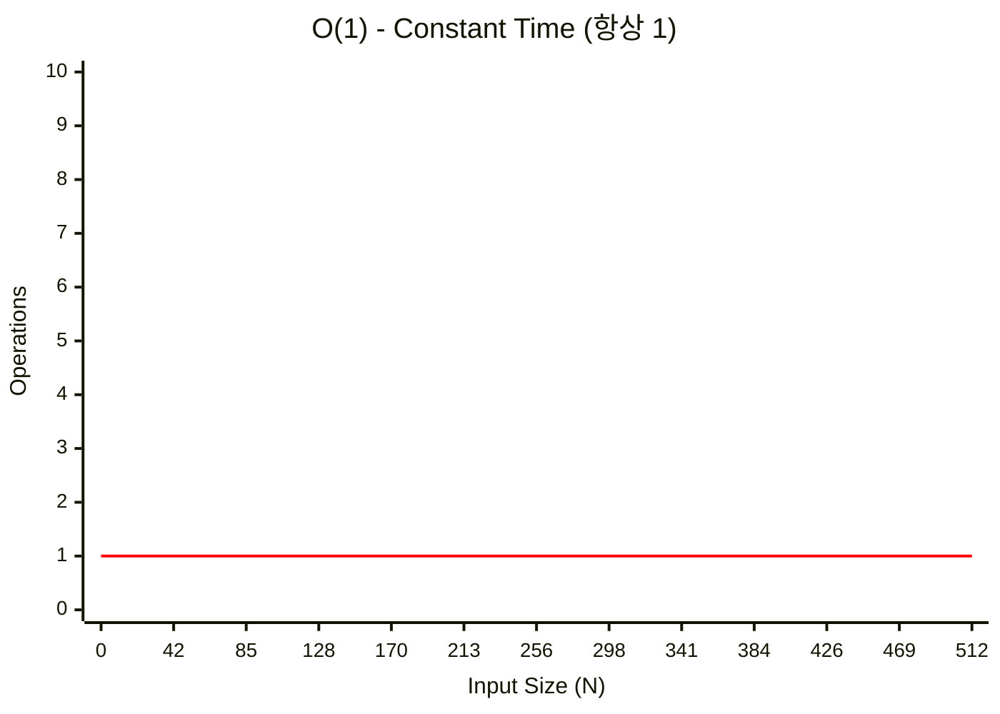
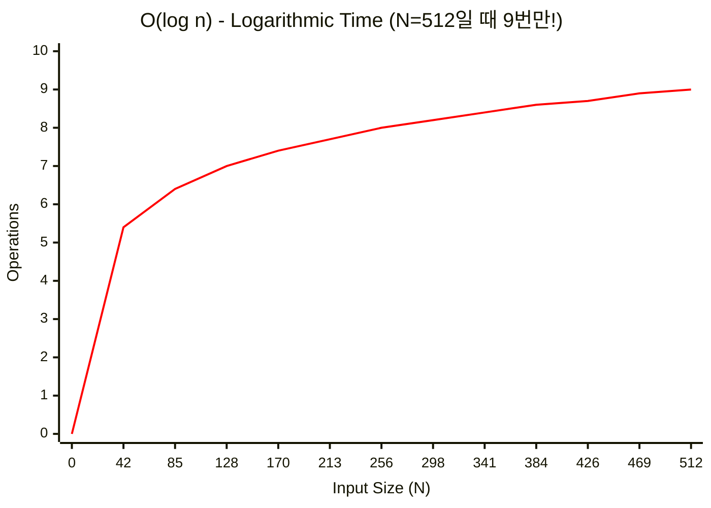
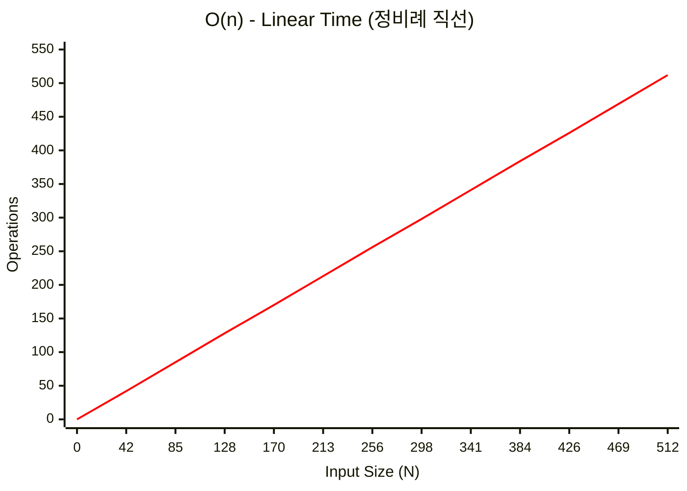
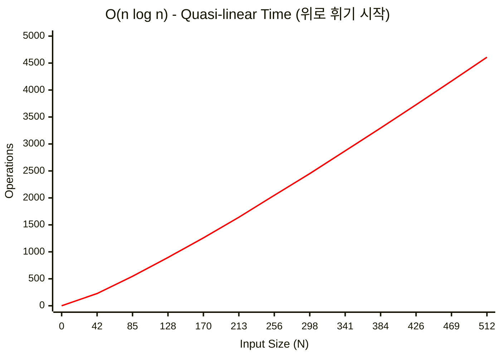
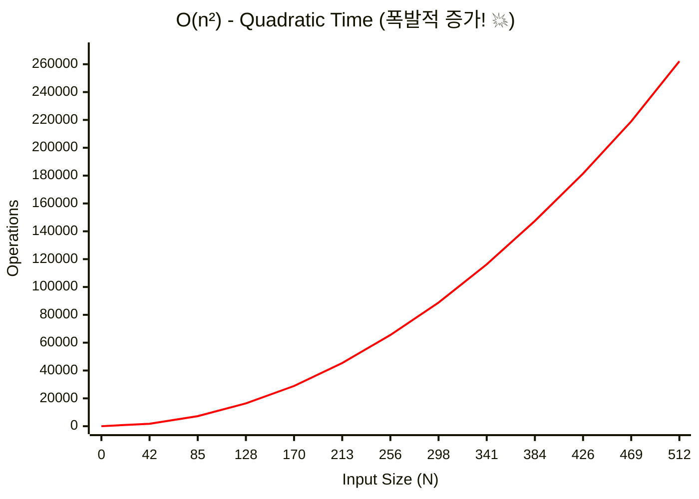
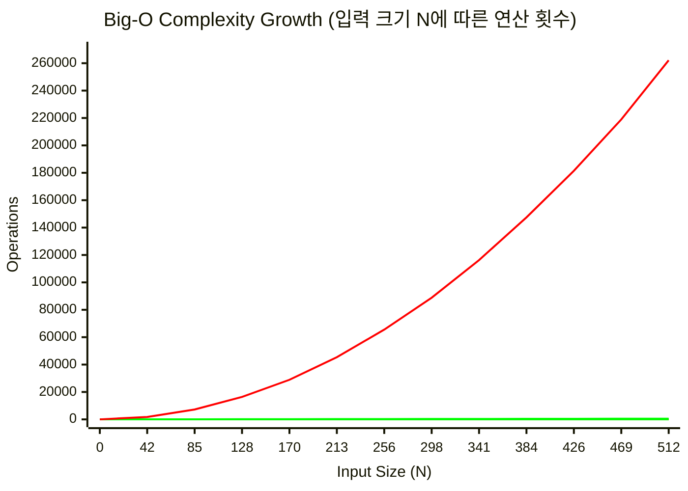

## 복잡도 이론과 Big-O: 엔지니어의 자원 관리법

"이 코드는 O(n) 입니다"라는 말은 면접용 정답이 아닙니다.

**"데이터가 10 배 늘어날 때, 서버 비용은 몇 배 늘어나는가?"** 에 대한 경제학적 대답입니다.

>[!NOTE] **쉽게 이해하기**
> - **시간 복잡도**: 프로그램이 얼마나 '빠르게' 돌아가는가? (연산 횟수)
> - **공간 복잡도**: 프로그램이 메모리를 얼마나 '많이' 쓰는가? (데이터 저장량)

### 💡 Why it matters (Context)

- **Scalability (확장성)**: 사용자가 100 명일 때 0.1 초 걸리던 API 가, 100 만 명이 되면 1000 초가 걸린다면? 그 서비스는 망합니다. 복잡도는 **서비스의 수명**을 예측하는 지표입니다.
- **DoS 공격 방어**: 해시 충돌을 유도해 O(1) 조회를 O(n) 으로 만들면 서버 CPU 가 100% 가 됩니다. 알고리즘을 모르면 보안 취약점이 됩니다. (ReDoS 등)
- **Latency Guarantee**: 실시간 시스템 (게임, 주식 거래) 에서는 O(1) 보다 **Worst Case 가 O(log n) 인 것**이 더 나을 수 있습니다. 예측 불가능한 튀는 값 (Spike) 이 없어야 하기 때문입니다.

---

### 🚦 Big-O 표기법의 실체

Big-O 는 **상한선 (Upper Bound)** 입니다. "아무리 느려도 이 정도는 보장한다"는 약속입니다.

#### 주요 복잡도 스펙트럼

| 표기             | 별명               | 실행 시간 (N=100) | 실행 시간 (N=1 만) | 예시                                            |
| :------------- | :--------------- | :------------ | :------------ | :-------------------------------------------- |
| **O(1)**       | Constant (상수)    | 1             | 1             | Hash Map 조회, Array 인덱스 접근                     |
| **O(log n)**   | Logarithmic (로그) | 7             | 14            | Binary Search, Balanced Tree (Red-Black, AVL) |
| **O(n)**       | Linear (선형)      | 100           | 10,000        | for loop, Linked List 탐색                      |
| **O(n log n)** | Lineariths       | 700           | 140,000       | Merge Sort, Quick Sort (Avg), Heap Sort       |
| **O(n^2)**     | Quadratic (제곱)   | 10,000        | 1 억 (위험)      | 2 중 for loop, Insertion Sort, Selection Sort  |
| **O(2^n)**     | Exponential (지수) | 우주 멸망         | 계산 불가         | 재귀 피보나치, 외판원 순회 (TSP)                         |

>[!TIP] **현실적인 한계**
> -   **O(n^2)**: N=10,000 을 넘어가면 타임아웃 (1 초) 위험이 큽니다.
> -   **O(n!)**: N=12 만 돼도 4 억 7 천만입니다. 순열 (Permutation) 문제는 N 이 작을 때만 가능합니다.

---

#### 📊 복잡도별 성장률 그래프

**O(1) - Constant Time**

입력 크기와 무관하게 항상 일정한 시간이 걸립니다.



**O(log n) - Logarithmic Time**

입력이 커져도 실행 시간은 완만하게 증가합니다. 매우 효율적입니다.



**O(n) - Linear Time**

입력 크기에 비례해서 시간이 증가합니다.



**O(n log n) - Quasi-linear Time**

효율적인 정렬 알고리즘들이 이 복잡도를 가집니다.



**O(n²) - Quadratic Time**

입력이 2 배가 되면 시간은 4 배가 됩니다. 큰 데이터에는 부적합합니다.



>[!WARNING] **N=10,000 이면 1 억 연산!**
>제곱 복잡도는 입력이 조금만 커져도 감당할 수 없는 수준이 됩니다.

**전체 복잡도 비교**

**코드형 인터랙티브 차트**



>[!NOTE] **차트 해석**
> - **O(1)**: 완전히 수평선 (입력 크기와 무관)
> - **O(log n)**: 거의 수평에 가까운 완만한 증가
> - **O(n)**: 정비례 직선
> - **O(n log n)**: 약간 위로 휘는 곡선
> - **O(n²)**: 급격하게 치솟는 곡선 (위험 구간)

---

### 📝 Code Examples (Dart)

실제 코드로 각 복잡도를 체험해봅시다.

#### O(1) - Constant Time

```dart
void checkFirst(List<String> names) {
  if (names.isNotEmpty) {
    print(names.first);
  } else {
    print("no names");
  }
}
```

입력 리스트의 크기와 무관하게 첫 번째 요소만 확인합니다.

#### O(log n) - Logarithmic Time

```dart
// 1. contains()의 가장 단순한 방법 - O(n)
const numbers = [1, 3, 56, 66, 68, 80, 99, 105, 450];

bool naiveContains(int value, List<int> list) {
  for (final element in list) {
    if (element == value) {
      return true;
    }
  }
  return false;
}

// 2. contains() 개선된 방법 (정렬된 경우) - O(log n)
bool betterNaiveContains(int value, List<int> list) {
  if (list.isEmpty) return false;
  final middleIndex = list.length ~/ 2;

  if (value > list[middleIndex]) {
    for (var i = middleIndex; i < list.length; i++) {
      if (list[i] == value) return true;
    }
  } else {
    for (var i = middleIndex; i >= 0; i--) {
      if (list[i] == value) return true;
    }
  }

  return false;
}
```

정렬된 리스트에서 중간값을 기준으로 범위를 절반으로 줄입니다.

#### O(n) - Linear Time

```dart
void printNames(List<String> names) {
  for (final name in names) {
    print(name);
  }
}
```

모든 요소를 정확히 한 번씩 순회합니다.

#### O(n²) - Quadratic Time

```dart
void printMoreNames(List<String> names) {
  for (final _ in names) {
    for (final name in names) {
      print(name);
    }
  }
}
```

중첩된 루프로 인해 입력 크기의 제곱만큼 연산이 발생합니다.

#### 공간 복잡도 예제

```dart
// O(n) Space
List<String> fillList(int length) {
  return List.filled(length, 'a');
}

// O(n²) Space
List<String> stuffList(int length) {
  return List.filled(length, 'a' * length);
}
```

`stuffList` 는 각 요소가 `length` 만큼의 문자열이므로 총 공간은 O(n²) 입니다.

---

## 🎮 실전 필승: 코딩테스트 측정 기준

알고리즘을 설계할 때, "이게 과연 통과될까?"를 판단하는 두 가지 절대 기준입니다.

### 1. 시간 제한과 1 억 법칙

대부분의 온라인 저지 환경에서 **1 초는 약 1 억 번의 연산**을 의미합니다.

- 내 풀이가 $N=10^5$ 일 때 $O(N^2)$ 이라면? $10^{10}$ 번 연산 $\rightarrow$ 약 100 초 소요 $\rightarrow$ **TLE (시간 초과) 확정**.
- 이럴 때는 $O(N \log N)$ 이하의 알고리즘을 찾아야 합니다.

#### 💡 입력 크기(N)에 따른 알고리즘 선택 가이드

| 데이터 크기 ($N$) | 허용 복잡도 | 대표 알고리즘 및 패턴 |
| :--- | :--- | :--- |
| **$N \le 10$** | $O(N!)$, $O(2^N)$ | 브루트 포스 (전체 순회), 순열 생성 |
| **$N \le 20$** | $O(2^N)$ | 비트마스킹 DP, 일반적인 백트래킹 (N-Queens 등) |
| **$N \le 500$** | $O(N^3)$ | 플로이드 - 워셜 (모든 정점 간 최단 경로) |
| **$N \le 2,000$** | $O(N^2)$ | 2 차원 배열 탐색, 버블/삽입 정렬, 단순 DP |
| **$N \le 1,000,000$** | $O(N \log N)$ | 퀵/병합/힙 정렬, 이진 탐색 최적화(Parametric Search), 다익스트라, 세그먼트 트리 |
| **$N \le 10,000,000$** | $O(N)$ | 투 포인터, 슬라이딩 윈도우, 누적 합, BFS/DFS |
| **$N > 10,000,000$** | $O(\log N)$ | 이진 탐색 (Binary Search), 거듭제곱 ($O(\log N)$) |

### 2. 메모리 제한과 공간 계산

공간 복잡도는 보통 여유롭지만, 대형 배열을 선언할 때 주의해야 합니다.

- **메모리 계산기**: 1MB $\approx$ 약 100 만 바이트 ($10^6$ Bytes)

#### 💾 자료형별 메모리 사용량 및 최대 배열 크기

| 자료형 | 크기 (Byte) | 128MB 제한 시 | 512MB 제한 시 | 비고 |
| :--- | :--- | :--- | :--- | :--- |
| **`char` / `bool`** | 1 | 1.2 억 개 | 5 억 개 | 1 바이트 단위 연산 |
| **`int` / `float`** | 4 | 3,200 만 개 | 1.2 억 개 | 일반적인 정수/실수 |
| **`long long` / `double`** | 8 | 1,600 만 개 | 6,400 만 개 | 큰 정수/정밀 공학 계산 |

>[!TIP] **안전 수칙 (Rule of Thumb)**
> - **128MB**: 4 바이트(`int`) 기준 **2,000 만 개** 이하로 설계하면 안전합니다.
> - **512MB**: 4 바이트(`int`) 기준 **1 억 개** 이하로 설계하면 안전합니다.
> - 2 차원 배열 `arr[10000][10000]` 은 $10^8$ 개이므로 `int` 기준 **400MB**를 차지하여 128MB 환경에서는 바로 **MLE (메모리 초과)**가 발생합니다.

### 3. 파이썬의 메모리 함정: 모든 것은 객체다

파이썬의 변수는 값을 담는 상자가 아니라, 객체를 가리키는 **참조(Reference)** 입니다.

- **오버헤드**: 단순 정수 하나도 C 언어의 원시 타입보다 훨씬 많은 메모리를 소비합니다. 리스트 역시 실제 데이터가 아닌 '데이터의 주소 목록'을 저장하는 동적 배열입니다.
- **공간 최적화 (Generator)**: 1 억 개의 숫자를 리스트로 만들면 메모리가 부족해지지만, `yield` 를 사용하는 **제너레이터**는 값을 필요할 때만 생성하여 공간 복잡도를 $O(1)$ 로 유지할 수 있습니다.

---

## 💻 언어별 성능 차이: 컴파일러 vs 인터프리터

시간 복잡도가 같더라도 사용하는 언어의 실행 방식에 따라 실제 실행 시간은 달라질 수 있습니다.

### 1. 컴파일러 언어 (C++)

- **방식**: 코드 전체를 기계어로 미리 번역하여 실행 파일을 만듭니다.
- **특징**: 실행 시점에 번역 과정이 없으므로 매우 빠릅니다.
- **BOJ 기준**: 온라인 저지에서는 '컴파일 시간'을 제외한 오직 **'실제 실행 시간'** 만 측정하므로 C++ 은 압도적인 이점을 가집니다.

### 2. 인터프리터 언어 (Python)

- **방식**: 코드를 한 줄씩 읽어가며 즉시 실행합니다.
- **특징**: 매번 번역 과정을 거치므로 실행 속도가 상대적으로 느립니다.
- **현실**: $10^8$ 연산 법칙은 보통 **C++ 을 기준**으로 합니다. 파이썬은 동일 연산 시 수십 배 더 오래 걸릴 수 있습니다.

>[!TIP] **코딩테스트에서 파이썬을 써도 될까?**
>대부분의 코딩테스트 플랫폼(프로그래머스 등)은 파이썬의 속도가 느린 것을 감안하여 시간 제한을 더 넉넉하게 주거나 전용 채점 기준을 적용합니다. 따라서 **시간 복잡도($10^8$ 법칙) 계산은 여전히 유효**합니다.

---

### ⚖️ Time vs Space Trade-off

"시간을 아끼려면 메모리를 써라. 메모리를 아끼려면 시간을 써라."

#### 1. Space-Time Trade-off

- **Hash Table**: 메모리를 많이 써서 (공간 O(n)), 검색을 빠르게 (시간 O(1)) 만듭니다.
- **Memoization (DP)**: 이미 계산한 값을 메모배열에 저장해 (공간 O(n)), 중복 계산을 없앰 (시간 O(2^n) -> O(n)).

#### 2. In-Place Algorithm

추가 메모리를 거의 안 쓰는 (O(1) Space) 알고리즘입니다.

- **Quick Sort**: 추가 배열 없이 swap 만으로 정렬합니다. 공간 효율적이라 캐시 히트율이 좋습니다.
- **Merge Sort**: 필연적으로 O(n) 의 보조 배열이 필요합니다. 메모리가 부족한 임베디드 환경에서는 Quick Sort 가 선호되는 이유입니다.

---

### 💾 Amortized Analysis (분할 상환 분석)

"가끔 비싼 비용을 치르지만, 평균내면 싸다."

**동적 배열 (Dynamic Array) 의 `append`**:
- 대부분은 O(1) 입니다 (빈 칸에 넣기만 하면 됨).
- 배열이 꽉 차면 **Capacity 를 2 배로 늘리고 복사 (Resize)** 합니다. 이때는 O(n) 이 걸립니다.
- 하지만 Resize 는 자주 일어나지 않으므로, 전체 N 번의 `append` 를 하면 총비용은 O(n) 입니다.
- 따라서 1 회 평균 비용은 **Amortized O(1)** 입니다.

>[!WARNING] **Latency Critical 시스템 주의**
>"평균 O(1)"은 믿으면 안 됩니다. Resize 가 터지는 순간 수 밀리초가 멈춥니다 (Jitter). 실시간 오디오 처리나 고빈도 거래 (HFT) 에서는 미리 용량을 확보 (`reserveCapacity`) 하거나 Linked List 를 써야 합니다.

---

### 🧪 Latency Numbers Every Programmer Should Know

알고리즘이 실제 하드웨어에서 얼마나 걸리는지 감을 잡아야 합니다. (Jeff Dean @ Google)

- **L1 Cache 참조**: 0.5 ns
- **Branch Mispredict**: 5 ns
- **L2 Cache 참조**: 7 ns
- **Mutex Lock/Unlock**: 25 ns
- **Main Memory 참조**: 100 ns (L1 보다 200 배 느림) -> [Linked List가 느린 이유](../01_data-structures/linear.md)
- **SSD [Random Read](../../../02_references/computer-science/random-access.md)**: 150,000 ns
- **Packet Roundtrip (CA->Netherlands)**: 150,000,000 ns (150ms)

👉 **결론**: 네트워크 호출 한 번 (150ms) 줄이는 게, Bubble Sort 를 Quick Sort 로 바꾸는 것 (수 ms 절약) 보다 훨씬 큰 성능 향상을 가져옵니다. **병목 (Bottleneck)** 을 먼저 찾으세요.

---

### 🎯 상한 (Upper Bound) vs 최악 (Worst Case)

Big-O 는 **상한 (Upper Bound)** 을 나타냅니다. "최악의 경우에도 이 정도 이하"라는 보장입니다.

#### Big-O 표기법의 3 형제

- **O (Big-O)**: 상한선. "최악의 경우에도 이것보다 느리지 않다"
- **Ω (Big Omega)**: 하한선. "최선의 경우에도 이것보다 빠르지 않다" (덜 유용함)
- **Θ (Big Theta)**: 상한과 하한이 같을 때. "항상 정확히 이 정도다"

>[!WARNING] **상한 ≠ 최악**
>Big-O 는 **점근적 상한 (Asymptotic Upper Bound)**이지, 특정 입력에서의 최악 케이스가 아닙니다.
>
>예: Quick Sort 의 경우
> - **평균 케이스**: O(n log n)
> - **최악 케이스**: O(n²) (이미 정렬된 경우)
>
>하지만 "Quick Sort 는 O(n²) 이다"라고 말하는 것도 틀린 표현은 아닙니다. 다만 **평균적으로 O(n log n)**이라고 말하는 것이 더 유용합니다.

---

### 🚀 병렬화 (Parallelization)

딥러닝의 등장 이후, 알고리즘의 **병렬화 가능성 (Parallelizability)** 이 중요한 평가 지표가 되었습니다.

- **병렬화 가능**: Matrix Multiplication, Map-Reduce 같은 작업은 여러 코어에서 동시에 실행할 수 있습니다. GPU 가 빠른 이유입니다.
- **병렬화 불가능**: Linked List 순회처럼 "이전 결과를 알아야 다음을 계산할 수 있는 (Sequential Dependency)" 구조는 병렬화가 어렵습니다.

>[!TIP] **현대적 관점**
> - **Single-threaded O(n log n)** 알고리즘보다
> - **Parallelizable O(n²)** 알고리즘이 GPU 환경에서 더 빠를 수 있습니다.
>
>예: Naive Matrix Multiplication (O(n³), 병렬화 쉬움) vs Strassen Algorithm (O(n^2.8), 병렬화 어려움)

---

## 📚 관련 문서

- [메모리 계층 구조](../../../02_references/computer-science/memory-layout-and-cache.md) - 하드웨어 관점의 복잡도 이해
- [문제 해결 프로세스](problem-solving-process.md) - 알고리즘 설계를 시작하는 4 단계 프레임워크
- [선형 자료구조](../01_data-structures/linear.md) - 데이터 구조에 따른 성능 실체
- [최적화 전략](../03_patterns/optimization.md) - N 의 크기에 따른 알고리즘 선택 가이드
