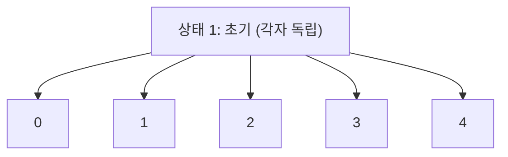
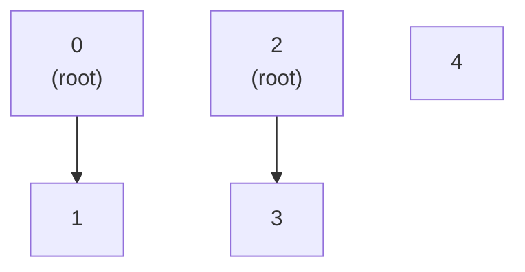
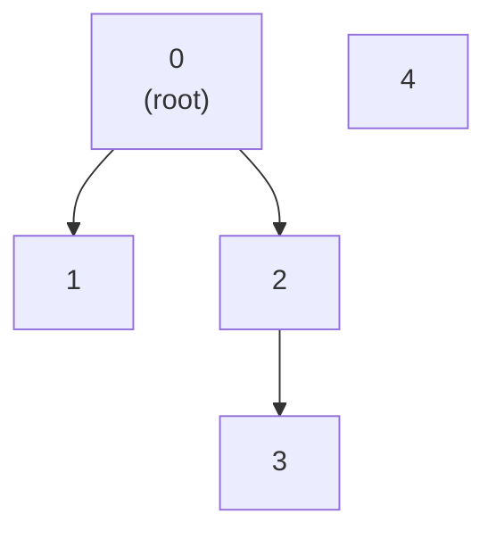
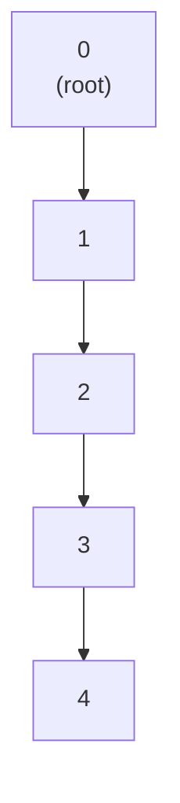
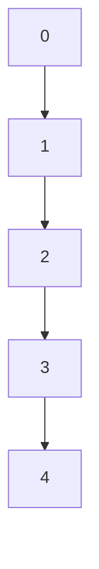
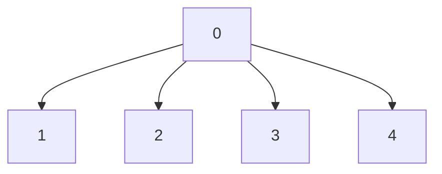

## Disjoint Set (Union-Find): 연결성의 마법사

Union-Find 는 **"이 두 노드가 연결되어 있나?"** 를 **거의 O(1)** 에 판별하는 자료구조입니다.

**용도**: 그래프 연결성, 사이클 탐지, 최소 신장 트리 (MST), 네트워크 연결 상태 등

### 💡 Why it matters (Context)

**문제**: SNS 에서 "친구의 친구"까지 고려했을 때, 두 사람이 같은 네트워크에 있는가?

**Naive 방식**:
- DFS/BFS 로 탐색 → `O(V + E)` (매번 그래프 전체 순회)

**Union-Find 방식**:
- `Find(A) == Find(B)`? → `O(α(n))` ≈ **O(1)** (아커만 역함수, 사실상 상수)

---

### 🏗️ 기본 구조

#### 개념

각 노드는 **대표자 (Representative)** 를 가집니다. 같은 집합의 모든 노드는 같은 대표자를 가리킵니다.



Union(0, 1), Union(2, 3) 후:



Union(0, 2) 후:



**핵심 연산**:
1. **Find(x)**: x 의 대표자 찾기
2. **Union(x, y)**: x 와 y 를 같은 집합으로 합치기

---

### 🔧 구현

#### 1. Naive 버전

```python
class UnionFind:
    def __init__(self, n):
        self.parent = list(range(n))  # parent[i] = i (자기 자신)
    
    # Find: 루트 찾기 - O(N) 최악
    def find(self, x):
        if self.parent[x] != x:
            return self.find(self.parent[x])  # 재귀로 루트까지
        return x
    
    # Union: 두 집합 합치기
    def union(self, x, y):
        root_x = self.find(x)
        root_y = self.find(y)
        
        if root_x != root_y:
            self.parent[root_x] = root_y  # x의 루트를 y에 연결
```

**문제점**: 트리가 한쪽으로 치우치면 (Skewed) `Find` 가 `O(N)` 이 됨

최악의 경우 (체인 형태):



---

#### 2. 최적화 1: Union by Rank

**아이디어**: 작은 트리를 큰 트리 밑에 붙이기

```python
class UnionFind:
    def __init__(self, n):
        self.parent = list(range(n))
        self.rank = [0] * n  # 트리의 "높이" 개념
    
    def find(self, x):
        if self.parent[x] != x:
            return self.find(self.parent[x])
        return x
    
    def union(self, x, y):
        root_x = self.find(x)
        root_y = self.find(y)
        
        if root_x == root_y:
            return False  # 이미 같은 집합
        
        # Rank가 낮은 쪽을 높은 쪽에 붙임
        if self.rank[root_x] < self.rank[root_y]:
            self.parent[root_x] = root_y
        elif self.rank[root_x] > self.rank[root_y]:
            self.parent[root_y] = root_x
        else:
            self.parent[root_y] = root_x
            self.rank[root_x] += 1  # 같으면 한쪽 증가
        
        return True
```

**효과**: 트리 높이를 `O(log N)` 으로 유지

---

#### 3. 최적화 2: Path Compression (경로 압축)

**핵심**: `Find` 중에 거쳐간 모든 노드를 **루트에 바로 연결**

```python
def find(self, x):
    if self.parent[x] != x:
        self.parent[x] = self.find(self.parent[x])  # 압축!
    return self.parent[x]
```

**과정**:

find(4) 호출 전:



find(4) 호출 후 (경로 압축):



**효과**: 다음 `Find` 는 `O(1)`!

---

#### 4. 최종 버전 (Both Optimizations)

```python
class UnionFind:
    def __init__(self, n):
        self.parent = list(range(n))
        self.rank = [0] * n
        self.count = n  # 집합 개수
    
    def find(self, x):
        if self.parent[x] != x:
            self.parent[x] = self.find(self.parent[x])  # Path Compression
        return self.parent[x]
    
    def union(self, x, y):
        root_x = self.find(x)
        root_y = self.find(y)
        
        if root_x == root_y:
            return False
        
        # Union by Rank
        if self.rank[root_x] < self.rank[root_y]:
            self.parent[root_x] = root_y
        elif self.rank[root_x] > self.rank[root_y]:
            self.parent[root_y] = root_x
        else:
            self.parent[root_y] = root_x
            self.rank[root_x] += 1
        
        self.count -= 1  # 집합 개수 감소
        return True
    
    def connected(self, x, y):
        return self.find(x) == self.find(y)
```

**시간 복잡도**: `O(α(n))` ≈ **O(1)** (아커만 역함수, 사실상 상수)

>[!IMPORTANT] **α(n)이란?**
> - Inverse Ackermann function
> - n = 10^80 (우주의 원자 수)일 때도 α(n) ≤ 5
> - 실전에서는 완전히 상수로 취급 가능

---

### 🎯 실전 패턴

#### Pattern 1: 사이클 탐지 (Cycle Detection)

무방향 그래프에서 사이클 존재 여부:

```python
def has_cycle(edges, n):
    uf = UnionFind(n)
    
    for u, v in edges:
        # 이미 같은 집합이면 → 사이클!
        if uf.find(u) == uf.find(v):
            return True
        uf.union(u, v)
    
    return False
```

**시간 복잡도**: `O(E × α(V))` ≈ `O(E)`

**활용**: 네트워크 루프 탐지, 교착상태 감지

---

#### Pattern 2: 최소 신장 트리 (MST - Kruskal's Algorithm)

**문제**: 모든 노드를 최소 비용으로 연결하기

```python
def kruskal_mst(n, edges):
    """edges = [(cost, u, v), ...]"""
    # 1. 간선을 비용 순으로 정렬
    edges.sort()
    
    uf = UnionFind(n)
    mst_cost = 0
    mst_edges = []
    
    # 2. 비용이 낮은 간선부터 선택
    for cost, u, v in edges:
        # 사이클을 만들지 않으면 추가
        if uf.union(u, v):
            mst_cost += cost
            mst_edges.append((u, v))
            
            # n개 노드 → n-1개 간선이면 완성
            if len(mst_edges) == n - 1:
                break
    
    return mst_cost, mst_edges
```

**시간 복잡도**: `O(E log E)` (정렬이 병목)

**활용**: 도로망 설계, 네트워크 케이블 배치, 클러스터링

---

#### Pattern 3: 연결 컴포넌트 개수

```python
def count_components(n, edges):
    uf = UnionFind(n)
    
    for u, v in edges:
        uf.union(u, v)
    
    return uf.count  # 남은 독립 집합 개수
```

**활용**: 섬의 개수, 친구 그룹 개수, 네트워크 분할 상태

---

#### Pattern 4: 동적 연결성 (Dynamic Connectivity)

**온라인 쿼리**: 간선이 실시간으로 추가되며 연결 여부 질의

```python
queries = [
    ("add", 0, 1),
    ("query", 0, 1),  # True
    ("add", 1, 2),
    ("query", 0, 2),  # True
    ("query", 0, 3),  # False
]

uf = UnionFind(4)
for op, u, v in queries:
    if op == "add":
        uf.union(u, v)
    else:  # query
        print(uf.connected(u, v))
```

**활용**: 실시간 네트워크 모니터링, 온라인 게임 매칭

---

### 🧪 심화: Weighted Union-Find

**문제**: 두 노드 간 **거리/비율** 정보까지 유지

```python
class WeightedUnionFind:
    def __init__(self, n):
        self.parent = list(range(n))
        self.weight = [0] * n  # parent[x]까지의 거리
    
    def find(self, x):
        if self.parent[x] != x:
            root = self.find(self.parent[x])
            # 경로 압축 + 가중치 누적
            self.weight[x] += self.weight[self.parent[x]]
            self.parent[x] = root
        return self.parent[x]
    
    def union(self, x, y, w):
        """x와 y를 weight=w로 연결"""
        root_x = self.find(x)
        root_y = self.find(y)
        
        if root_x != root_y:
            self.parent[root_x] = root_y
            # 가중치 관계식
            self.weight[root_x] = self.weight[y] - self.weight[x] + w
```

**활용**: 환율 계산, 상대적 좌표 시스템

---

### ⚡ 언어별 구현

```swift
// Swift
class UnionFind {
    private var parent: [Int]
    private var rank: [Int]
    
    init(_ n: Int) {
        parent = Array(0..<n)
        rank = Array(repeating: 0, count: n)
    }
    
    func find(_ x: Int) -> Int {
        if parent[x] != x {
            parent[x] = find(parent[x])  // Path Compression
        }
        return parent[x]
    }
    
    @discardableResult
    func union(_ x: Int, _ y: Int) -> Bool {
        let rootX = find(x)
        let rootY = find(y)
        
        guard rootX != rootY else { return false }
        
        if rank[rootX] < rank[rootY] {
            parent[rootX] = rootY
        } else if rank[rootX] > rank[rootY] {
            parent[rootY] = rootX
        } else {
            parent[rootY] = rootX
            rank[rootX] += 1
        }
        
        return true
    }
}
```

---

### 🚨 흔한 실수

1. **Path Compression 만 쓰기** ❌
   - Union by Rank 도 함께 써야 최적 성능

2. **Union 반환값 무시** ❌
   - `union` 이 `False` 면 이미 연결됨 (사이클)

3. **루트 비교 대신 parent 직접 비교** ❌
   ```python
   # 잘못된 방법
   if self.parent[x] == self.parent[y]:  # ❌
   
   # 올바른 방법
   if self.find(x) == self.find(y):  # ✅
   ```

---

#### 📚 연결 문서

- [tree-and-graph](tree-and-graph.md) - 그래프 기초와 연결성
- [Big-O](../00_fundamentals/complexity-and-big-o.md) - α(n) 복잡도 이해
- [최소 신장 트리](../02_algorithms/minimum-spanning-tree.md) - 크루스칼(Kruskal) MST 응용
