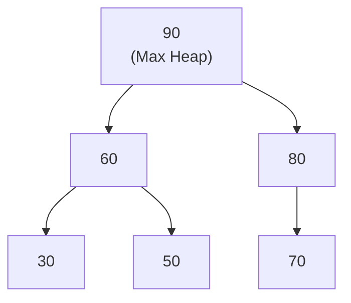

## Heap & Priority Queue: 최댓값/최솟값을 빠르게

Heap 은 "부모가 자식보다 크다 (Max Heap)" 또는 "부모가 자식보다 작다 (Min Heap)" 규칙만 지키는 **완전 이진 트리**입니다.

**핵심**: 전체 정렬 없이 **가장 큰/작은 값 하나**만 빠르게 찾기 위한 자료구조입니다.

### 💡 Why it matters (Context)

**정렬 vs 힙의 차이**:
- **정렬**: 모든 요소를 정렬 (`O(n log n)`) → 모든 순서 정보를 얻음
- **힙**: 최댓값 하나만 유지 (`O(log n)`) → 필요한 정보만 얻음

>[!IMPORTANT] **실전 활용**
> - **OS Process Scheduler**: 수천 개 프로세스 중 우선순위 가장 높은 것만 실행
> - **Top-K 문제**: "가장 큰 K 개", "가장 작은 K 개" 찾기
> - **실시간 중앙값**: 데이터가 계속 들어올 때 중앙값 유지
> - **다익스트라 알고리즘**: 최단 경로 찾기

---

### 🏗️ Heap 의 구조

#### 완전 이진 트리 (Complete Binary Tree)



**규칙 (Max Heap)**:
- 부모 ≥ 자식 (모든 부모 - 자식 쌍)
- 형제 간 순서는 무관 (60 과 80 중 누가 더 큰지 상관없음)

#### 배열로 구현

트리를 배열로 표현하면 포인터 없이 효율적입니다:

```
Index:  [0, 1,  2,  3,  4,  5,  6]
Value:  [-, 90, 60, 80, 30, 50, 70]
```

**인덱스 관계** (1-based indexing):
- 부모: `index / 2`
- 왼쪽 자식: `index * 2`
- 오른쪽 자식: `index * 2 + 1`

---

### 🔧 핵심 연산

#### 1. 삽입 (Insert) - O(log n)

**Bubble Up (위로 올리기)**:

```python
def insert(heap, value):
    heap.append(value)  # 맨 끝에 추가
    i = len(heap) - 1
    
    # 부모보다 크면 swap (Max Heap)
    while i > 1 and heap[i] > heap[i // 2]:
        heap[i], heap[i // 2] = heap[i // 2], heap[i]
        i = i // 2
```

**과정**:
1. 새 값을 트리의 **맨 끝**에 추가
2. 부모와 비교해서 규칙 위반이면 **swap**
3. 루트까지 반복 (최악: 트리 높이 = log n)

#### 2. 삭제 (Extract Max/Min) - O(log n)

**맨 위 (최댓값) 를 제거하고 재정렬**:

```python
def extract_max(heap):
    if len(heap) <= 1:
        return None
    
    max_val = heap[1]  # 루트 = 최댓값
    heap[1] = heap.pop()  # 맨 끝 값을 루트로
    heapify_down(heap, 1)  # 아래로 내리기
    return max_val

def heapify_down(heap, i):
    while i * 2 < len(heap):  # 자식이 있는 동안
        left = i * 2
        right = i * 2 + 1
        
        # 두 자식 중 더 큰 쪽 선택
        larger = left
        if right < len(heap) and heap[right] > heap[left]:
            larger = right
        
        # 부모가 자식보다 크면 종료
        if heap[i] >= heap[larger]:
            break
        
        # 아니면 swap 후 계속
        heap[i], heap[larger] = heap[larger], heap[i]
        i = larger
```

**과정**:
1. 루트를 제거
2. **맨 끝 값**을 루트로 이동
3. 자식들과 비교하며 **아래로 내림** (Heapify Down)

#### 3. Heapify (배열을 힙으로) - O(n)

놀랍게도 **O(n log n) 이 아니라 O(n)**입니다!

```python
def build_heap(arr):
    n = len(arr)
    # 리프가 아닌 마지막 노드부터 역순으로
    for i in range(n // 2, 0, -1):
        heapify_down(arr, i)
```

>[!TIP] **왜 O(n) 인가?**
>리프 노드 (전체의 절반) 는 heapify 가 불필요하고, 위로 갈수록 노드는 적지만 내려가는 거리가 김. 수학적으로 계산하면 `O(n)` 이 됩니다.

---

### 🎯 실전 패턴

#### Pattern 1: Top-K 문제

"배열에서 가장 큰 K 개 찾기" → **Min Heap (크기 K)** 사용!

```swift
func topKLargest(_ nums: [Int], _ k: Int) -> [Int] {
    var minHeap: [Int] = []
    
    for num in nums {
        minHeap.append(num)
        if minHeap.count > k {
            minHeap.removeMin()  // 가장 작은거 제거
        }
    }
    return minHeap  // K개의 가장 큰 값들
}
```

**핵심 인사이트**:
- "가장 큰 K 개" → **Min Heap** (역설적이지만 정확)
- 힙 크기를 K 로 유지하며, K+1 번째부터는 최솟값을 제거
- 시간 복잡도: `O(n log k)` (전체 정렬 `O(n log n)` 보다 빠름)

#### Pattern 2: 실시간 중앙값 (Median)

**두 개의 힙 사용**:
- **Max Heap**: 작은 절반 저장
- **Min Heap**: 큰 절반 저장

```swift
class MedianFinder {
    var maxHeap: [Int] = []  // 작은 절반 (최댓값이 중앙값 후보)
    var minHeap: [Int] = []  // 큰 절반 (최솟값이 중앙값 후보)
    
    func addNum(_ num: Int) {
        // 작은 절반에 추가
        maxHeap.insert(num)
        
        // 균형 맞추기: maxHeap 최댓값을 minHeap으로
        minHeap.insert(maxHeap.removeMax())
        
        // 크기 균형
        if maxHeap.count < minHeap.count {
            maxHeap.insert(minHeap.removeMin())
        }
    }
    
    func findMedian() -> Double {
        if maxHeap.count > minHeap.count {
            return Double(maxHeap.peek())
        }
        return (Double(maxHeap.peek()) + Double(minHeap.peek())) / 2.0
    }
}
```

**시간 복잡도**: 삽입 `O(log n)`, 중앙값 조회 `O(1)`

#### Pattern 3: K-way Merge

여러 개의 정렬된 배열을 하나로 합치기:

```python
def merge_k_sorted_lists(lists):
    import heapq
    heap = []
    
    # 각 리스트의 첫 원소를 힙에 넣기
    for i, lst in enumerate(lists):
        if lst:
            heapq.heappush(heap, (lst[0], i, 0))  # (값, 리스트 번호, 인덱스)
    
    result = []
    while heap:
        val, list_idx, elem_idx = heapq.heappop(heap)
        result.append(val)
        
        # 다음 원소가 있으면 힙에 추가
        if elem_idx + 1 < len(lists[list_idx]):
            next_val = lists[list_idx][elem_idx + 1]
            heapq.heappush(heap, (next_val, list_idx, elem_idx + 1))
    
    return result
```

**활용**: Merge Sort 의 외부 정렬 버전, 데이터베이스 쿼리 병합

---

### ⚡ 언어별 구현

```python
# Python - heapq (Min Heap 만 기본 제공)
import heapq

# Min Heap
heap = []
heapq.heappush(heap, 3)
heapq.heappush(heap, 1)
min_val = heapq.heappop(heap)  # 1

# Max Heap (음수 트릭)
max_heap = []
heapq.heappush(max_heap, -3)
heapq.heappush(max_heap, -1)
max_val = -heapq.heappop(max_heap)  # 3
```

```swift
// Swift - 직접 구현 또는 Collections 라이브러리
struct Heap<T: Comparable> {
    private var elements: [T] = []
    private let comparator: (T, T) -> Bool
    
    init(comparator: @escaping (T, T) -> Bool) {
        self.comparator = comparator
    }
    
    mutating func insert(_ value: T) {
        elements.append(value)
        siftUp(from: elements.count - 1)
    }
    
    mutating func removeRoot() -> T? {
        guard !elements.isEmpty else { return nil }
        elements.swapAt(0, elements.count - 1)
        let root = elements.removeLast()
        siftDown(from: 0)
        return root
    }
}
```

---

### 🚨 흔한 실수

1. **"가장 큰 K 개" → Max Heap?** ❌
   - 정답: **Min Heap (크기 K)**

2. **Heapify 를 삽입 반복으로?** ❌
   - `O(n log n)` 낭비. Bottom-up 방식으로 `O(n)` 가능

3. **배열 인덱스 0 부터 시작?**
   - 0-based: 부모 `(i-1)/2`, 자식 `2i+1, 2i+2`
   - 1-based: 부모 `i/2`, 자식 `2i, 2i+1` (더 깔끔)

---

#### 📚 연결 문서

---

## 🐍 실전 Python 활용 (Applied Python)

Python의 `heapq` 모듈은 이진 힙(Binary Heap) 기반의 **최소 힙(Min Heap)**을 제공합니다.

#### 💻 주요 연산
```python
import heapq

hq = []
heapq.heappush(hq, 10) # 삽입 O(log N)
min_val = heapq.heappop(hq) # 삭제 O(log N)
top_val = hq[0] # 최상단 조회 O(1)
```

> [!TIP] **최대 힙(Max Heap)이 필요한 경우**
> Python의 `heapq`는 최소 힙만 지원하므로, 값을 **음수**로 바꾸어 저장한 뒤 꺼낼 때 다시 부호를 바꾸는 트릭을 사용합니다.
> ```python
> heapq.heappush(hq, -value)
> max_val = -heapq.heappop(hq)
> ```

---

## 📚 관련 문서

- [Big-O](../00_fundamentals/complexity-and-big-o.md) - O(log n)의 힘
- [tree-and-graph](tree-and-graph.md) - 완전 이진 트리 구조
- [search-and-sort](../02_algorithms/search-and-sort.md) - Heap Sort 응용
