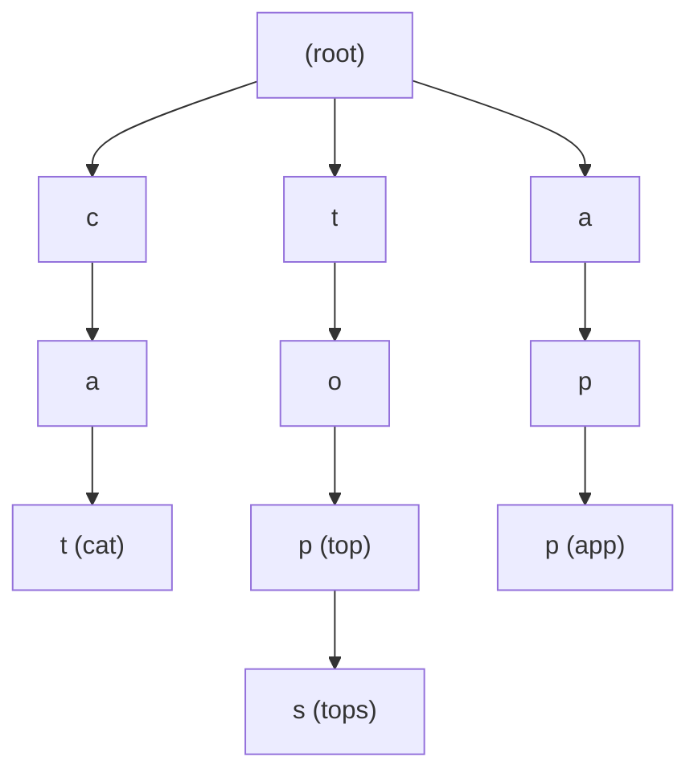

## Advanced String Data Structures: 문자열 마스터하기

문자열은 단순해 보이지만, **검색/매칭/자동완성**에서는 특수한 자료구조가 필요합니다.

### 🌲 Trie (Prefix Tree)

Trie 는 **"공통 접두사를 공유하는"** 문자열들을 효율적으로 저장하는 트리입니다.

#### 구조

단어: `["cat", "top", "tops", "app"]`



**핵심**:
- `top` 과 `tops` 는 `to` 까지 같은 경로 공유
- 공간 효율: 공통 접두사 재사용
- 각 노드는 **문자 하나**를 담음

#### 기본 연산

```python
class TrieNode:
    def __init__(self):
        self.children = {}  # 문자 -> 자식 노드
        self.is_end = False  # 단어의 끝인지

class Trie:
    def __init__(self):
        self.root = TrieNode()
    
    # 삽입: O(L) - L은 단어 길이
    def insert(self, word):
        node = self.root
        for char in word:
            if char not in node.children:
                node.children[char] = TrieNode()
            node = node.children[char]
        node.is_end = True
    
    # 검색: O(L)
    def search(self, word):
        node = self.root
        for char in word:
            if char not in node.children:
                return False
            node = node.children[char]
        return node.is_end
    
    # 접두사 검색: O(L)
    def starts_with(self, prefix):
        node = self.root
        for char in prefix:
            if char not in node.children:
                return False
            node = node.children[char]
        return True
```

#### 시간 복잡도

| 연산 | Trie | Hash Table |
|:---|:---|:---|
| **삽입** | O(L) | O(L) (해싱) |
| **검색** | O(L) | O(L) (해싱) |
| **접두사 검색** | O(L) | O(N × L) ❌ |
| **자동완성** | O(L + K) | 불가능 ❌ |

>[!IMPORTANT] **Trie 의 강점**
>Hash Table 은 **정확한 단어**만 찾지만, Trie 는:
> - **접두사 검색**: "ap"로 시작하는 모든 단어
> - **자동완성**: 입력 중인 단어의 후보 리스트
> - **사전순 정렬**: DFS 순회하면 자동으로 정렬됨

---

### 🎯 Trie 실전 활용

#### 1. 자동완성 (Autocomplete)

```python
def autocomplete(trie, prefix):
    """prefix로 시작하는 모든 단어 찾기"""
    node = trie.root
    
    # prefix까지 이동
    for char in prefix:
        if char not in node.children:
            return []
        node = node.children[char]
    
    # prefix 이후 모든 단어 수집 (DFS)
    results = []
    def dfs(node, path):
        if node.is_end:
            results.append(prefix + path)
        for char, child in node.children.items():
            dfs(child, path + char)
    
    dfs(node, "")
    return results

# 사용
trie = Trie()
for word in ["apple", "app", "application", "apply"]:
    trie.insert(word)

print(autocomplete(trie, "app"))
# ["app", "apple", "application", "apply"]
```

**활용**: 검색창, IDE 코드 자동완성, 전화번호부

#### 2. 단어 검색 게임 (Word Search II)

보드에서 여러 단어를 동시에 찾기:

```python
def find_words(board, words):
    # Trie에 모든 단어 저장
    trie = Trie()
    for word in words:
        trie.insert(word)
    
    result = set()
    rows, cols = len(board), len(board[0])
    
    def dfs(r, c, node, path):
        if node.is_end:
            result.add(path)
        
        if r < 0 or r >= rows or c < 0 or c >= cols:
            return
        
        char = board[r][c]
        if char not in node.children:
            return
        
        # 방문 표시
        board[r][c] = '#'
        
        # 4방향 탐색
        for dr, dc in [(0,1), (1,0), (0,-1), (-1,0)]:
            dfs(r+dr, c+dc, node.children[char], path+char)
        
        board[r][c] = char  # 복구
    
    # 모든 셀에서 시작
    for r in range(rows):
        for c in range(cols):
            dfs(r, c, trie.root, "")
    
    return list(result)
```

**시간 복잡도**: `O(M × N × 4^L)` (Trie 없으면 × W 배 더 걸림)

#### 3. IP 라우팅 (Longest Prefix Matching)

네트워크 라우터는 IP 주소의 **가장 긴 접두사 매칭**으로 경로 결정:

```python
# IP를 이진 트라이로 표현
class IPTrie:
    def insert(self, ip_binary, gateway):
        """192.168.1.0/24 → 11000000 10101000 00000001"""
        node = self.root
        for bit in ip_binary:
            if bit not in node.children:
                node.children[bit] = TrieNode()
            node = node.children[bit]
        node.gateway = gateway
    
    def longest_prefix(self, ip):
        """가장 긴 매칭 경로 찾기"""
        node = self.root
        last_gateway = None
        
        for bit in ip:
            if bit in node.children:
                node = node.children[bit]
                if node.gateway:
                    last_gateway = node.gateway
            else:
                break
        
        return last_gateway
```

---

### 🔍 KMP (Knuth-Morris-Pratt) 알고리즘

**문제**: 텍스트에서 패턴 찾기 (예: `"ABABCABAB"` 에서 `"ABAB"` 찾기)

#### Naive 방식의 문제

```python
# O(N × M) - 최악의 경우
def naive_search(text, pattern):
    for i in range(len(text) - len(pattern) + 1):
        match = True
        for j in range(len(pattern)):
            if text[i+j] != pattern[j]:
                match = False
                break
        if match:
            return i
    return -1
```

**문제점**: 불일치 시 처음부터 다시 비교 (정보 낭비)

#### KMP 의 핵심: Failure Function (실패 함수)

**"실패했을 때 얼마나 건너뛸 수 있는가?"**

```python
def compute_lps(pattern):
    """LPS = Longest Proper Prefix which is also Suffix"""
    lps = [0] * len(pattern)
    length = 0  # 이전 LPS 길이
    i = 1
    
    while i < len(pattern):
        if pattern[i] == pattern[length]:
            length += 1
            lps[i] = length
            i += 1
        else:
            if length != 0:
                length = lps[length - 1]  # 핵심: 건너뛰기
            else:
                lps[i] = 0
                i += 1
    
    return lps

# 예: pattern = "ABABC"
# lps = [0, 0, 1, 2, 0]
#        A  B  A  B  C
```

**해석**:
- `lps[3] = 2`: `"ABAB"` 의 앞 2 글자(`AB`)가 뒤 2 글자(`AB`)와 같음
- 불일치 시 `lps[3] = 2` 위치부터 다시 비교 (0 부터 X)

#### KMP 검색

```python
def kmp_search(text, pattern):
    lps = compute_lps(pattern)
    i = 0  # text 인덱스
    j = 0  # pattern 인덱스
    
    while i < len(text):
        if text[i] == pattern[j]:
            i += 1
            j += 1
        
        if j == len(pattern):
            return i - j  # 찾음!
        elif i < len(text) and text[i] != pattern[j]:
            if j != 0:
                j = lps[j - 1]  # 건너뛰기
            else:
                i += 1
    
    return -1
```

**시간 복잡도**: **O(N + M)** (Naive 는 O(N × M))

>[!TIP] **왜 빠른가?**
> - Text 의 각 문자를 **한 번만** 본다
> - 불일치 시 이미 본 정보 재사용 (LPS)

---

### 🎯 실전 패턴

#### 1. 여러 패턴 동시 검색 → **Aho-Corasick**

Trie + KMP 조합:

```python
# "apple", "app", "application" 동시 검색
# → Trie로 패턴 저장 + Failure Link로 빠른 전환
```

**활용**: 백신 소프트웨어(악성 코드 시그니처 검색), 광고 필터링

#### 2. 회문 (Palindrome) 판별 → **Manacher's Algorithm**

O(N)에 모든 회문 찾기:

```
"babad" → "bab", "aba"
```

---

### 💾 공간 복잡도 고려

**Trie 의 메모리 사용**:
- 최악: 모든 단어가 접두사 공유 없음 → O(N × L × 26)
- 영어 소문자만: 노드당 26 개 포인터
- **최적화**: HashMap 대신 Array (공간 trade-off)

```python
# 공간 절약 버전
class CompactTrieNode:
    def __init__(self):
        self.children = {}  # 필요할 때만 생성
        self.is_end = False
```

---

#### 📚 연결 문서

- [tree-and-graph](tree-and-graph.md) - Trie 는 트리의 특수한 형태
- [Big-O](../00_fundamentals/complexity-and-big-o.md) - 시간 복잡도 분석
- [two-pointers](../03_patterns/two-pointers.md) - KMP 의 투 포인터 활용
