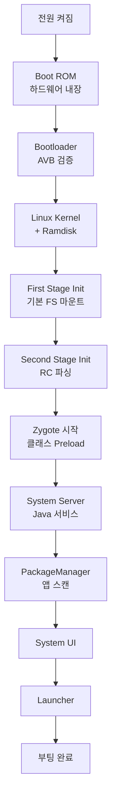

## Boot Flow - 부팅 흐름 개요

이 문서는 안드로이드 부팅 과정의 **전체 흐름**을 개괄적으로 설명한다. 각 단계의 상세 내용은 해당 문서 참고.

>[!NOTE]
>Init 프로세스 상세: [android-init-and-services](android-init-and-services.md)
>Zygote 상세: [android-zygote-and-runtime](android-zygote-and-runtime.md)
>HAL 초기화: [android-hal-and-kernel](android-hal-and-kernel.md)

### 부팅 순서 (한눈에)



### 1. Boot ROM (하드웨어)

칩에 내장된 코딩 불가능한 코드:

- 첫 부트로더를 eMMC/UFS 에서 로드
- 서명 검증 (OEM public key)
- 실패 시 Fastboot 모드

### 2. Bootloader

Android Bootloader (ABL, 대부분 Qualcomm LK 기반):

- **Verified Boot**: vbmeta 검증 → system/vendor 무결성
- **A/B 슬롯** 선택: 활성 슬롯 부팅 (a, b)
- 커널 + ramdisk 메모리에 로드

**특수 모드**:
- **Fastboot**: `fastboot flash`, `fastboot boot`
- **Recovery**: OTA 업데이트, 공장 초기화

### 3. Linux Kernel

- 드라이버 초기화 (Binder, ION, etc)
- SELinux 정책 로드 (첫 단계)
- `/init` 실행 (PID 1)

### 4. Init Process

**First Stage**:
- `/dev`, `/proc`, `/sys` 마운트
- SELinux early init

**Second Stage**:
- RC 스크립트 파싱 (`/system/etc/init/`, `/vendor/etc/init/`)
- 트리거 실행 (`on early-init`, `on init`, `on boot`)
- 서비스 시작

**상세**: [android-init-and-services](android-init-and-services.md)

### 5. Zygote

앱 프로세스 템플릿:

- Framework 클래스 preload (~4000 개)
- 소켓 대기 (`/dev/socket/zygote`)
- System Server fork

**상세**: [android-zygote-and-runtime](android-zygote-and-runtime.md)

### 6. System Server

Java 시스템 서비스 시작:

- ActivityManagerService
- PackageManagerService
- WindowManagerService
- +100 여 개 서비스

### 7. PackageManager

- `/system/app`, `/data/app` 스캔
- 앱 메타데이터 파싱
- dexopt (필요 시)

### 8. System UI + Launcher

- Status Bar, Navigation Bar
- Launcher 앱 시작
- 사용자 interaction 가능

---

## 파티션 구조

### 물리 레이아웃

```
/dev/block/sda (UFS/eMMC)
├─ boot_a              # 커널 + ramdisk
├─ boot_b
├─ vendor_boot_a       # Vendor ramdisk
├─ vendor_boot_b
├─ super               # Dynamic partitions
│  ├─ system
│  ├─ system_ext
│  ├─ vendor
│  ├─ product
│  └─ odm
├─ userdata            # 사용자 데이터
├─ metadata            # 암호화 키
└─ misc                # Boot control
```

### Dynamic Partitions (super)

```bash
# 확인
adb shell lpdump

# 출력:
# system: 2048 MB
# vendor: 1024 MB
# ...
```

**이점**: 파티션 크기 동적 조정 (OTA 시)

---

## A/B Update (Seamless Update)

### 개념

```
Slot A: [boot_a, system_a, vendor_a] ← 현재 부팅
Slot B: [boot_b, system_b, vendor_b] ← 업데이트 다운로드 중
```

**업데이트 과정**:
1. 백그라운드에서 Slot B 에 다운로드
2. 완료 후 boot control 변경: active=B
3. 재부팅 → Slot B 로 부팅
4. 성공 시 Slot B 확정, 실패 시 Slot A 로 자동 롤백

### Virtual A/B (Android 11+)

```
Slot A: [실제 파티션]
Slot B: [Snapshot (COW)] ← 공간 절약
```

**변경 부분만** 스냅샷으로 저장 → 공간 50% 절약

---

## Verified Boot (AVB)

### 서명 체인

```
OEM Key (eFuse) 
  → vbmeta.img 검증
    → boot.img 검증
    → system.img 검증 (dm-verity)
```

**dm-verity**:
- 블록별 해시 트리
- 읽기 시 실시간 검증
- 변조 감지 시 부팅 차단 or 경고

### Verified Boot States

| State | 설명 |
|-------|------|
| **Green** | 완전 검증됨 (OEM key) |
| **Yellow** | 검증됨 (사용자 key, 커스텀 ROM) |
| **Orange** | Bootloader unlocked (경고 표시) |
| **Red** | 검증 실패 (부팅 차단) |

---

## 부팅 최적화

### Bootchart

```bash
# 활성화
adb shell 'touch /data/bootchart/enabled'
adb reboot

# 데이터 수집
adb pull /data/bootchart
```

### Perfetto Trace

```bash
# 부팅 중 trace
adb shell setprop persist.debug.atrace.boottrace 1
adb reboot

# Trace 가져오기
adb pull /data/misc/perfetto-traces/
```

### 최적화 포인트

1. **서비스 지연 시작**: `class late_start`
2. **병렬 실행**: 의존성 없는 서비스 동시 시작
3. **Preload 최소화**: 불필요한 클래스 제거

---

## 디버깅

### Boot Loop

```bash
# Last kernel log
adb pull /sys/fs/pstore/console-ramoops-0

# Init log
dmesg | grep init

# SELinux denials
dmesg | grep avc
```

### Bootloader Log

```bash
# Fastboot mode
fastboot oem get-log
```

---

## 학습 리소스

**공식 문서**:
- [Boot Sequence](../../../../https:/source.android.com/docs/core/architecture/bootloader.md)
- [Verified Boot](../../../../https:/source.android.com/docs/security/features/verifiedboot.md)
- [A/B Updates](../../../../https:/source.android.com/docs/core/ota/ab.md)

---

## 연결 문서 (상세)

[android-init-and-services](android-init-and-services.md) - Init 프로세스 상세, RC 문법, Property 시스템

[android-zygote-and-runtime](android-zygote-and-runtime.md) - Zygote fork, Preloading, ART

[android-hal-and-kernel](android-hal-and-kernel.md) - HAL 초기화, 드라이버 로드

[android-kernel](android-kernel.md) - 커널 수정 사항

[android-security-and-sandboxing](../05_security_privacy/android-security-and-sandboxing.md) - Verified Boot, dm-verity

[android-customization-and-oem](android-customization-and-oem.md) - OEM bootloader 커스터마이징
