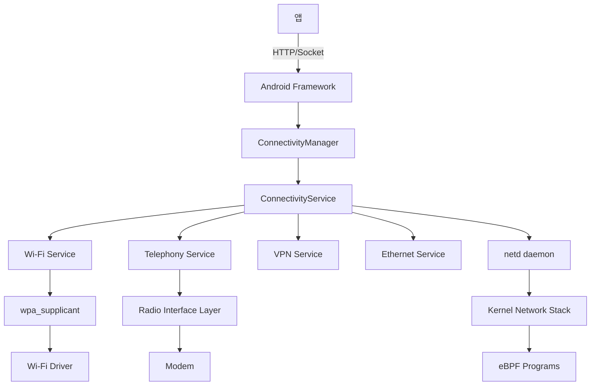

## Connectivity와 Networking

안드로이드 네트워크 스택은 Wi-Fi, 모바일 데이터, 블루투스, VPN 등 다양한 연결을 관리하고, 앱에게 최적의 네트워크를 제공한다. ConnectivityService가 중심이 되어 네트워크 선택, 전환, 정책 적용을 담당한다.

### 왜 복잡한 네트워크 관리가 필요한가

#### 모바일 네트워크의 특성

**데스크톱**:
- 유선 이더넷 or Wi-Fi (고정)
- 항상 연결
- 무제한 데이터

**모바일**:
- Wi-Fi, 4G/5G, 블루투스 동시 사용
- 이동 중 네트워크 전환 (Wi-Fi ↔ LTE)
- 데이터 제한 (요금제)
- 배터리 고려

**필요한 기능**:
1. **네트워크 선택**: 어떤 네트워크 사용?
2. **자동 전환**: Wi-Fi ↔ 모바일 데이터 seamless
3. **데이터 절약**: 백그라운드 제한
4. **네트워크 보안**: VPN, Private DNS

---

## 네트워크 아키텍처



---

## ConnectivityManager

### 네트워크 요청

```kotlin
val connectivityManager = getSystemService(ConnectivityManager::class.java)

// 현재 활성 네트워크
val activeNetwork = connectivityManager.activeNetwork
val capabilities = connectivityManager.getNetworkCapabilities(activeNetwork)

if (capabilities?.hasTransport(NetworkCapabilities.TRANSPORT_WIFI) == true) {
    // Wi-Fi 연결
}

// 네트워크 콜백
val request = NetworkRequest.Builder()
    .addCapability(NetworkCapabilities.NET_CAPABILITY_INTERNET)
    .addTransportType(NetworkCapabilities.TRANSPORT_WIFI)
    .build()

connectivityManager.registerNetworkCallback(request, object : NetworkCallback() {
    override fun onAvailable(network: Network) {
        // 네트워크 사용 가능
    }
    
    override fun onLost(network: Network) {
        // 네트워크 끊김
    }
    
    override fun onCapabilitiesChanged(
        network: Network,
        capabilities: NetworkCapabilities
    ) {
        val bandwidth = capabilities.linkDownstreamBandwidthKbps
    }
})
```

### Network Selection

**우선순위** (Android 9+):
1. **Default**: Wi-Fi > Ethernet > Mobile
2. **사용자 선택**: 설정에서 우선 네트워크 지정
3. **앱 요구사항**: `NetworkRequest`로 특정 네트워크 요청

**예시**:
```kotlin
// 계량제가 아닌 네트워크 (Wi-Fi)만
val request = NetworkRequest.Builder()
    .addCapability(NetworkCapabilities.NET_CAPABILITY_NOT_METERED)
    .build()

connectivityManager.requestNetwork(request, callback)
```

---

## Wi-Fi 관리

### WifiManager

```kotlin
val wifiManager = getSystemService(WifiManager::class.java)

// Wi-Fi 상태
val isEnabled = wifiManager.isWifiEnabled

// 스캔
wifiManager.startScan()

// 스캔 결과
val results = wifiManager.scanResults
for (result in results) {
    Log.d(TAG, "SSID: ${result.SSID}, Level: ${result.level} dBm")
}
```

### WPA Supplicant

사용자 공간 Wi-Fi 데몬:

```bash
# 설정 파일
/data/misc/wifi/wpa_supplicant.conf

network={
    ssid="MyNetwork"
    psk="password"
    key_mgmt=WPA-PSK
}
```

**연결 과정**:
```
1. WifiManager.connect()
2. WifiService → wpa_supplicant
3. wpa_supplicant → 인증 (WPA2/WPA3)
4. DHCP로 IP 할당
5. ConnectivityService에 알림
```

### Wi-Fi Aware (거리 인식 네트워크)

```kotlin
val wifiAwareManager = getSystemService(WifiAwareManager::class.java)

wifiAwareManager.attach(object : AttachCallback() {
    override fun onAttached(session: WifiAwareSession) {
        val config = PublishConfig.Builder()
            .setServiceName("MyService")
            .build()
        
        session.publish(config, object : DiscoverySessionCallback() {
            override fun onPublishStarted(session: PublishDiscoverySession) {
                // 발행 시작
            }
        }, null)
    }
}, null)
```

---

## 모바일 데이터

### Telephony

```kotlin
val telephonyManager = getSystemService(TelephonyManager::class.java)

// 네트워크 타입
val networkType = when (telephonyManager.dataNetworkType) {
    TelephonyManager.NETWORK_TYPE_LTE -> "4G LTE"
    TelephonyManager.NETWORK_TYPE_NR -> "5G NR"
    else -> "Unknown"
}

// 신호 강도
telephonyManager.listen(object : PhoneStateListener() {
    override fun onSignalStrengthsChanged(signalStrength: SignalStrength) {
        val level = signalStrength.level  // 0-4
    }
}, PhoneStateListener.LISTEN_SIGNAL_STRENGTHS)
```

### RIL (Radio Interface Layer)


**RILD**:
- Vendor 제공 (Qualcomm, MediaTek 등)
- AT 명령어 → 모뎀 제어
- 통화, SMS, 데이터 연결

---

## 데이터 절약

### Data Saver

```kotlin
val connectivityManager = getSystemService(ConnectivityManager::class.java)

// Data Saver 상태
val isDataSaverEnabled = connectivityManager.restrictBackgroundStatus == 
    ConnectivityManager.RESTRICT_BACKGROUND_STATUS_ENABLED

// 예외 앱 확인
if (connectivityManager.restrictBackgroundStatus == 
    ConnectivityManager.RESTRICT_BACKGROUND_STATUS_WHITELISTED) {
    // 이 앱은 예외
}
```

### Network Policy

```bash
# 앱별 데이터 제한
adb shell cmd netpolicy list restrict

# 백그라운드 데이터 차단
adb shell cmd netpolicy set restrict-background true
```

**eBPF 필터**:
```c
// netd가 eBPF 프로그램으로 패킷 필터링
SEC("cgroupskb/ingress/stats")
int bpf_cgroup_ingress(struct __sk_buff *skb) {
    uint32_t uid = bpf_get_socket_uid(skb);
    
    if (is_background_restricted(uid)) {
        return 0;  // Drop
    }
    
    return 1;  // Accept
}
```

---

## VPN

### VpnService

```kotlin
class MyVpnService : VpnService() {
    override fun onStartCommand(intent: Intent?, flags: Int, startId: Int): Int {
        val builder = Builder()
            .addAddress("10.0.0.2", 24)
            .addRoute("0.0.0.0", 0)  // 모든 트래픽
            .addDnsServer("8.8.8.8")
            .setSession("MyVPN")
        
        val vpnInterface = builder.establish()
        
        // 패킷 읽기/쓰기
        thread {
            val buffer = ByteBuffer.allocate(32767)
            while (true) {
                val length = vpnInterface.read(buffer)
                // 패킷 처리 (암호화, 터널링 등)
            }
        }
        
        return START_STICKY
    }
}
```

**작동 원리**:
```
앱 → VPN Interface (tun0) → VpnService
VpnService → 암호화 → VPN 서버
VPN 서버 → 인터넷
```

### Always-On VPN

```bash
# 설정
adb shell settings put secure always_on_vpn_app com.example.vpn
adb shell settings put secure always_on_vpn_lockdown 1

# VPN 없으면 네트워크 차단
```

---

## Private DNS (DNS-over-TLS)

```bash
# 설정
adb shell settings put global private_dns_mode hostname
adb shell settings put global private_dns_specifier dns.google

# 확인
adb shell getprop net.dns1  # 1.1.1.1 (Cloudflare)
```

**동작**:
```
앱 → getaddrinfo() → netd
netd → DNS-over-TLS (포트 853)
→ dns.google (8.8.8.8)
```

**이점**:
- ISP가 DNS 쿼리 감청 불가
- DNS 변조 방지

---

## Captive Portal 감지

```kotlin
// 커피숍 Wi-Fi 등의 로그인 페이지 감지
val cm = getSystemService(ConnectivityManager::class.java)
val capabilities = cm.getNetworkCapabilities(network)

if (capabilities?.hasCapability(
    NetworkCapabilities.NET_CAPABILITY_CAPTIVE_PORTAL) == true) {
    // Captive portal 존재
    startCaptivePortalApp(network)
}
```

**감지 방법**:
```
1. 연결 후 http://connectivitycheck.gstatic.com/generate_204 접근
2. HTTP 204 응답 예상
3. 302 Redirect 받으면 → Captive Portal
4. 브라우저 팝업
```

---

## 네트워크 보안

### Network Security Config

```xml
<!-- res/xml/network_security_config.xml -->
<network-security-config>
    <base-config cleartextTrafficPermitted="false">
        <trust-anchors>
            <certificates src="system" />
        </trust-anchors>
    </base-config>
    
    <domain-config cleartextTrafficPermitted="true">
        <domain includeSubdomains="true">example.com</domain>
    </domain-config>
    
    <!-- Certificate Pinning -->
    <domain-config>
        <domain>secure.example.com</domain>
        <pin-set expiration="2025-01-01">
            <pin digest="SHA-256">base64==</pin>
        </pin-set>
    </domain-config>
</network-security-config>
```

### HTTPS 강제

```kotlin
// OkHttp
val client = OkHttpClient.Builder()
    .connectionSpecs(listOf(ConnectionSpec.MODERN_TLS))
    .build()
```

---

## Traffic Stats

```kotlin
// 앱별 네트워크 사용량
val uid = android.os.Process.myUid()
val rxBytes = TrafficStats.getUidRxBytes(uid)  // 수신
val txBytes = TrafficStats.getUidTxBytes(uid)  // 송신

Log.d(TAG, "Received: ${rxBytes / 1024} KB")
Log.d(TAG, "Sent: ${txBytes / 1024} KB")

// 총 사용량
val totalRx = TrafficStats.getTotalRxBytes()
val totalTx = TrafficStats.getTotalTxBytes()
```

**eBPF 기반 추적** (Android 9+):
```c
// BPF map으로 UID별 트래픽 카운트
struct stats_key {
    uint32_t uid;
    uint32_t tag;
    uint32_t interface_index;
};

struct stats_value {
    uint64_t rx_bytes;
    uint64_t tx_bytes;
    uint64_t rx_packets;
    uint64_t tx_packets;
};
```

---

## Netd (Network Daemon)

```bash
# Netd 명령
adb shell cmd netd network list

# Routing table
adb shell ip route

# iptables 규칙
adb shell iptables -L -n -v
```

**Netd 역할**:
- 네트워크 인터페이스 설정
- 라우팅 테이블 관리
- 방화벽 (iptables/nftables)
- DNS 해석
- 대역폭 제어 (tc - traffic control)

---

## 테더링

### Wi-Fi Hotspot

```kotlin
val wifiManager = getSystemService(WifiManager::class.java)

// Android 13+
val tetheringManager = getSystemService(TetheringManager::class.java)
val request = TetheringRequest.Builder(TETHERING_WIFI)
    .setShouldShowEntitlementUi(false)
    .build()

tetheringManager.startTethering(request, executor, callback)
```

**동작**:
```
Mobile Data → 공유 → Wi-Fi AP 모드
다른 기기 → Wi-Fi → 인터넷
```

### USB Tethering

```bash
# USB 연결 후
adb shell svc usb setFunctions rndis

# 확인
adb shell ip addr show rndis0
```

---

## 디버깅

### dumpsys

```bash
# 연결된 네트워크
adb shell dumpsys connectivity

# Wi-Fi 상태
adb shell dumpsys wifi

# 네트워크 정책
adb shell dumpsys netpolicy

# Netd 통계
adb shell dumpsys netd
```

### tcpdump

```bash
# 패킷 캡처 (root 필요)
adb shell tcpdump -i wlan0 -s 0 -w /sdcard/capture.pcap

# PC로 가져오기
adb pull /sdcard/capture.pcap
```

### Wireshark (PC)

```bash
# adb를 통한 실시간 캡처
adb shell tcpdump -i any -U -w - | wireshark -k -i -
```

---

## 성능 최적화

### Connection Pooling

```kotlin
val client = OkHttpClient.Builder()
    .connectionPool(ConnectionPool(5, 5, TimeUnit.MINUTES))
    .build()
```

### HTTP/2

```kotlin
// OkHttp는 기본적으로 HTTP/2 지원
val client = OkHttpClient()
```

**이점**:
- 멀티플렉싱 (하나의 연결로 여러 요청)
- 헤더 압축
- 서버 푸시

### QUIC (HTTP/3)

```kotlin
// Cronet (Chrome Network Stack)
val engine = CronetEngine.Builder(context)
    .enableQuic(true)
    .build()
```

---

## 학습 리소스

**공식 문서**:
- [Connectivity](../../../../https:/developer.android.com/training/basics/network-ops/managing.md)
- [Network Security Config](../../../../https:/developer.android.com/training/articles/security-config.md)
- [VpnService](../../../../https:/developer.android.com/reference/android/net/VpnService.md)

**소스 코드**:
- [ConnectivityService](../../../../https:/cs.android.com/android/platform/superproject/+/master:frameworks/base/services/core/java/com/android/server/ConnectivityService.java.md)
- [netd](../../../../https:/cs.android.com/android/platform/superproject/+/master:system/netd/.md)

---

## 연결 문서

[android-kernel](android-kernel.md) - eBPF 네트워크 필터링  
[android-hal-and-kernel](android-hal-and-kernel.md) - Wi-Fi/Modem HAL  
[android-security-and-sandboxing](../05_security_privacy/android-security-and-sandboxing.md) - 네트워크 보안 정책  
[android-activity-manager-and-system-services](android-activity-manager-and-system-services.md) - ConnectivityService
