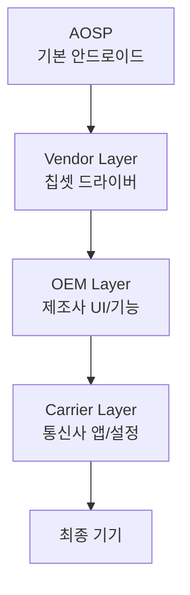
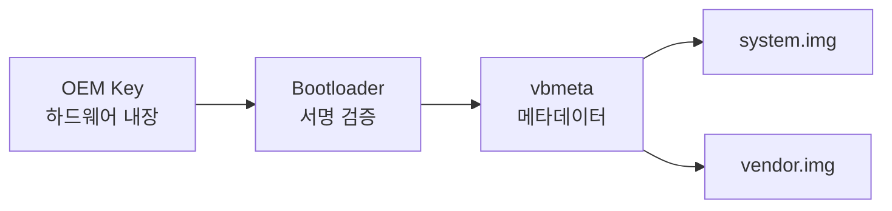

## OEM Customization과 AOSP

안드로이드는 **오픈소스**(AOSP)이지만, 실제 출시되는 기기는 각 제조사(OEM)가 커스터마이징한다. Samsung의 One UI, Xiaomi의 MIUI, Google의 Pixel Experience는 모두 AOSP를 기반으로 하지만 매우 다른 경험을 제공한다.

### 왜 OEM Customization이 필요한가

#### AOSP의 한계

**AOSP (Android Open Source Project)**:
- Google이 공개하는 기본 안드로이드
- Google Play Services **없음**
- 기본 앱만 포함 (전화, 메시지, 설정 등)
- 하드웨어 드라이버 없음

**OEM이 해야 할 일**:
1. 하드웨어 지원 (칩셋, 카메라, 센서 등)
2. Google 인증 (GMS, CTS, VTS)
3. 차별화된 기능
4. 지역별 요구사항 (통신사, 규제)

---

## 커스터마이징 계층



### 1. AOSP Layer

**포함**:
- Android Framework (Java/Kotlin)
- System Server
- 기본 앱 (Phone, Contacts, Settings)
- Native 라이브러리 (libc, libm 등)

**제외**:
- Google Play Services
- Gmail, Maps, YouTube 등 Google 앱
- Pixel 독점 기능

### 2. Vendor Layer (Chipset)

Qualcomm/MediaTek/Exynos 등 칩셋 벤더가 제공:

```
/vendor/
├─ lib/
│  ├─ libril-qc-hal-qmi.so       # Modem HAL
│  └─ camera.msm8998.so          # Camera HAL
├─ etc/
│  ├─ init/hw/init.qcom.rc       # Init script
│  └─ permissions/               # 기능 선언
└─ firmware/                     # 펌웨어 바이너리
```

### 3. OEM Layer

삼성, 샤오미 등이 추가:

```
/system/product/
├─ app/
│  ├─ SamsungHealth.apk
│  └─ GalaxyStore.apk
├─ overlay/                      # 리소스 오버레이
│  └─ framework-res__auto_generated_rro_product.apk
└─ etc/
   └─ sysconfig/                 # 권한 설정
```

### 4. Carrier Layer

통신사가 추가:

```
/carrier/
├─ app/
│  └─ CarrierApp.apk             # 통신사 앱
└─ etc/
   └─ apns-conf.xml              # APN 설정
```

---

## Runtime Resource Overlay (RRO)

### Static Overlay

빌드 시 리소스 교체:

```xml
<!-- AOSP: frameworks/base/core/res/res/values/colors.xml -->
<color name="system_accent">@color/google_blue</color>

<!-- OEM Overlay: vendor/overlay/framework/res/values/colors.xml -->
<color name="system_accent">@color/samsung_blue</color>
```

**빌드 결과**: OEM 색상으로 교체됨

### Dynamic Overlay (Android 10+)

런타임에 교체:

```bash
# Overlay 목록
adb shell cmd overlay list

# 활성화
adb shell cmd overlay enable com.example.overlay

# 비활성화
adb shell cmd overlay disable com.example.overlay
```

**사용 예**:
- 테마 변경 (다크 모드)
- 폰트 변경
- 아이콘 스타일

---

## OEM 주요 커스터마이징

### Samsung One UI

**주요 변경**:
1. **UI 재디자인**:
   - 큰 헤더 (한 손 조작)
   - 둥근 모서리
   - 커스텀 아이콘

2. **추가 기능**:
   - Edge Panel
   - Bixby
   - DeX (데스크톱 모드)
   - Good Lock (고급 커스터마이징)

3. **시스템 수정**:
   - Permission Monitor
   - Game Launcher / Game Booster
   - Secure Folder (Knox 기반)

**구현**:
```java
// frameworks/base 수정
// SystemUI 완전 재작성
// Settings 앱 재작성
```

### Xiaomi MIUI

**특징**:
- iOS 스타일 디자인
- 광고 내장 (일부 지역)
- MIUI 최적화 (배터리, 성능)
- 테마 스토어

### Google Pixel

**추가 기능**:
- Pixel Launcher
- Call Screen (전화 스크리닝)
- Now Playing (음악 인식)
- Magic Eraser (사진 편집)

**구현**: APK 형태로 추가 (AOSP는 수정 최소화)

---

## GMS (Google Mobile Services)

### GMS Core

```
com.google.android.gms (Google Play Services)
```

**포함**:
- Location Services
- Firebase Cloud Messaging
- Google Sign-In
- SafetyNet / Play Integrity
- Google Pay

**없으면**:
- 대부분의 앱 작동 불가 (FCM 의존)
- 지도 API 사용 불가
- 위치 정확도 낮아짐

### GMS 인증

OEM이 Google 인증 받으려면:

1. **CTS (Compatibility Test Suite)** 통과
2. **VTS (Vendor Test Suite)** 통과 (Treble)
3. **GTS (GMS Test Suite)** 통과
4. 계약 체결 및 비용 지불

**인증 실패 시**:
- Play Store 없음
- GMS 없음
- "Android" 상표 사용 불가

---

## 빌드 시스템

### Product Configuration

```make
# device/samsung/galaxy/device.mk
PRODUCT_NAME := lineage_galaxy
PRODUCT_DEVICE := galaxy
PRODUCT_BRAND := samsung
PRODUCT_MANUFACTURER := Samsung

# Overlays
PRODUCT_PACKAGES += \
    FrameworkResOverlay \
    SystemUIOverlay

# Apps
PRODUCT_PACKAGES += \
    SamsungCamera \
    SamsungGallery

# HAL
PRODUCT_PACKAGES += \
    android.hardware.camera.provider@2.4-service-samsung
```

### Soong Build System

```go
// Android.bp
android_app {
    name: "CustomSettings",
    overrides: ["Settings"],  // AOSP Settings 대체
    srcs: ["src/**/*.java"],
    resource_dirs: ["res"],
    platform_apis: true,
    certificate: "platform",
    privileged: true,
}
```

---

## Treble의 영향

### Before Treble (Android 7.x)

```
/system
├─ framework
├─ vendor 코드 섞임
└─ HAL 구현 섞임
```

업데이트 시 vendor 코드 재빌드 필요 → 지연

### After Treble (Android 8.0+)

```
/system  (Google, 독립 업데이트)
/vendor  (OEM/Chipset, 고정)
```

**VINTF**로 호환성 보장:

```xml
<!-- /vendor/etc/vintf/manifest.xml -->
<hal>
    <name>android.hardware.camera.provider</name>
    <version>2.4</version>
</hal>
```

**이점**:
- Google이 /system만 업데이트 가능
- OEM 작업 최소화
- 업데이트 빨라짐

---

## Mainline (Project Mainline, Android 10+)

**APEX 모듈**로 Google Play를 통해 시스템 컴포넌트 업데이트:

```
com.android.media            # Media 코덱
com.android.wifi             # Wi-Fi 스택
com.android.tethering        # 테더링
com.android.conscrypt        # 암호화 라이브러리
```

**확인**:
```bash
adb shell pm list packages -apex
```

**효과**:
- 보안 패치 빠름
- 버그 수정 신속
- OEM 업데이트 불필요

---

## Verified Boot (AVB)

### 서명 체인



**OEM이 해야 할 일**:
1. OEM private key로 vbmeta 서명
2. Public key를 기기 eFuse에 기록 (영구)
3. Bootloader에 검증 로직 추가

**사용자가 bootloader unlock 시**:
```bash
fastboot flashing unlock

# 경고: 모든 데이터 삭제
# Boot 화면에 "unlocked" 표시
```

---

## OEM-specific APIs

### Samsung Knox

```java
// Knox SDK
KnoxContainerManager kcm = KnoxContainerManager.getInstance(context);
ContainerConfigurationPolicy ccp = kcm.getContainerConfigurationPolicy();
ccp.setPasswordMinimumLength(8);
```

### Xiaomi MIUI APIs

```java
// MIUI 전용
import miui.os.Build;

if (Build.IS_MIUI) {
    // MIUI 전용 기능
}
```

**문제**: AOSP 호환성 깨질 수 있음

---

## 디버깅

### Build Fingerprint

```bash
adb shell getprop ro.build.fingerprint

# 출력:
# samsung/galaxy/SM-G991B:13/TP1A.220624.014/G991BXXU5DVKB:user/release-keys
```

**형식**:
```
brand/product/device:version/ID/incremental:type/tags
```

### Overlay 확인

```bash
# 활성 RRO
adb shell dumpsys overlay

# 어떤 리소스가 오버라이드되었는지
adb shell dumpsys package overlays
```

### Treble 검증

```bash
# VNDK 버전
adb shell getprop ro.vndk.version

# Treble 지원 여부
adb shell getprop ro.treble.enabled
```

---

## Custom ROM 개발

### LineageOS

AOSP 기반, Google 없이:

**특징**:
- Privacy Guard
- Trust (보안 상태 표시)
- Lineage Recovery
- microG 지원 (GMS 대체)

**빌드**:
```bash
# 소스 다운로드
repo init -u https://github.com/LineageOS/android.git -b lineage-20.0
repo sync

# 환경 설정
source build/envsetup.sh
breakfast <device>

# 빌드
brunch <device>
```

### GrapheneOS (Privacy-focused)

**강화 사항**:
- Hardened malloc
- Exec spawning
- MAC randomization
- 센서 권한 강화

---

## 학습 리소스

**공식 문서**:
- [AOSP](https://source.android.com/)
- [Treble](https://source.android.com/docs/core/architecture/treble)
- [Building for Devices](https://source.android.com/docs/setup/build)

**커뮤니티**:
- XDA Developers
- LineageOS Wiki
- Android Platform Development (reddit)

---

## 연결 문서

[[android-hal-and-kernel]] - Treble, VINTF, HAL  
[[android-init-and-services]] - Init RC 커스터마이징  
[[android-boot-flow]] - Verified Boot  
[[android-kernel]] - 커널 수정  
[[android-security-and-sandboxing]] - Knox, SafetyNet
