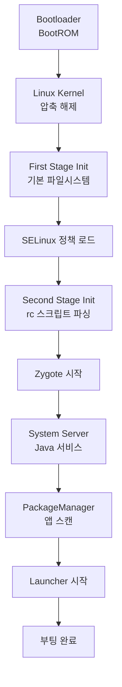
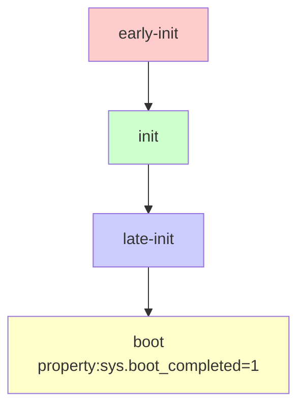
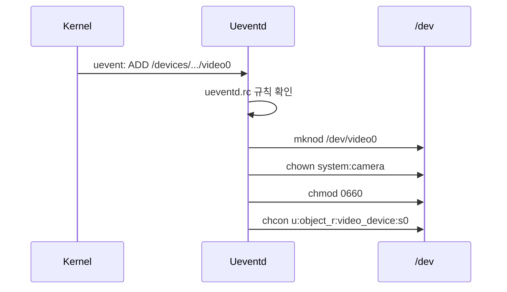

## Init과 Service Lifecycle

`init`은 안드로이드 부팅 후 **가장 먼저 실행되는 프로세스**(PID 1)다. 모든 시스템 서비스를 시작하고, 파일시스템을 마운트하며, [SELinux](../../../../selinux.md) 정책을 로드하고, property 시스템을 관리한다. Unix/Linux 전통의 init 프로세스 역할을 하면서도 안드로이드 고유의 요구사항을 반영한 독특한 구조를 가진다.

### 왜 init이 중요한가

#### PID 1의 특수성

Unix/Linux에서 PID 1은 특별한 의미를 가진다:

1. **커널이 직접 실행**: 부트로더 → 커널 → `/init` 실행
2. **절대 종료 불가**: PID 1이 종료하면 커널 패닉
3. **고아 프로세스 수양**: 부모가 죽은 프로세스의 새 부모가 됨
4. **시그널 무시**: 일반 시그널로 종료 불가

#### 안드로이드 init의 독특한 역할

**표준 Linux init** (systemd, SysV init):
- 서비스 시작/정지
- 런레벨 관리
- 의존성 해결

**Android init 추가 기능**:
- **Property 시스템**: key-value 저장소 (`setprop`/`getprop`)
- **Ueventd**: 커널 디바이스 이벤트 처리 (`/dev` 노드 생성)
- **[SELinux](../../../../selinux.md) 강제**: 정책 로딩 및 컨텍스트 설정
- **파일 암호화**: FBE(File-Based Encryption) 조기 마운트
- **Vendor 분리**: [[android-hal-and-kernel#Treble 아키텍처|Treble]] 지원

---

## 부팅 과정과 Init

### 전체 부팅 흐름



### First Stage Init

**목적**: 최소한의 파일시스템 마운트 (커널 모듈 로딩 전)

```cpp
// system/core/init/first_stage_init.cpp
int main(int argc, char** argv) {
    // 1. /dev, /proc, /sys 마운트
    mount("tmpfs", "/dev", "tmpfs", MS_NOSUID, "mode=0755");
    mount("proc", "/proc", "proc", 0, nullptr);
    mount("sysfs", "/sys", "sysfs", 0, nullptr);
    
    // 2. /dev/kmsg 열기 (로그)
    SetupKernelLogging();
    
    // 3. SELinux 초기 설정
    FirstStageMain(argc, argv);
    
    // 4. Second Stage로 전환
    execv("/system/bin/init", argv);
}
```

**마운트된 파일시스템** (First Stage 후):
```
/dev     tmpfs
/proc    procfs
/sys     sysfs
/dev/pts devpts
```

### Second Stage Init

**목적**: 본격적인 시스템 초기화

```cpp
// system/core/init/init.cpp
int SecondStageMain(int argc, char** argv) {
    // 1. Property 시스템 초기화
    property_init();
    
    // 2. SELinux 정책 로드
    selinux_initialize();
    selinux_restore_context();
    
    // 3. 기본 디렉토리 생성
    epoll_fd = epoll_create1(EPOLL_CLOEXEC);
    InstallSignalHandlers();
    
    // 4. RC 파일 파싱
    LoadBootScripts();
    
    // 5. 초기 트리거 실행
    ActionManager::GetInstance().QueueEventTrigger("early-init");
    ActionManager::GetInstance().QueueEventTrigger("init");
    
    // 6. 메인 루프
    while (true) {
        ExecuteCommands();
        RestartProcesses();
        HandlePropertySet();
    }
}
```

---

## RC (RunControl) 스크립트

### 문법 구조

**파일 위치**:
```
/system/etc/init/          # AOSP 기본
/vendor/etc/init/          # OEM/칩셋 벤더
/odm/etc/init/             # ODM
/apex/*/etc/init/          # APEX 모듈
```

**기본 문법**:

```bash
# 주석

# 서비스 정의
service <name> <pathname> [ <argument> ]*
    <option>
    <option>
    ...

# 액션 정의
on <trigger> [&& <trigger>]*
    <command>
    <command>
    ...

# Import
import /vendor/etc/init/hw/init.$(ro.hardware).rc
```

### 핵심 예시

**Zygote 시작**:
```bash
# /system/etc/init/zygote64.rc
service zygote /system/bin/app_process64 -Xzygote /system/bin --zygote --start-system-server --socket-name=zygote
    class main
    priority -20
    user root
    group root readproc reserved_disk
    socket zygote stream 660 root system
    socket usap_pool_primary stream 660 root system
    onrestart exec_background - system system -- /system/bin/vdc volume abort_fuse
    onrestart write /sys/power/state on
    onrestart restart audioserver
    onrestart restart cameraserver
    onrestart restart media
    onrestart restart netd
    onrestart restart wificond
    task_profiles ProcessCapacityHigh MaxPerformance
```

**분석**:
- `class main`: 서비스 그룹
- `priority -20`: 최고 우선순위
- `socket zygote stream 660`: Unix 도메인 소켓 생성 (`/dev/socket/zygote`)
- `onrestart`: Zygote 재시작 시 다른 서비스도 재시작 (앱 프로세스 전부 죽기 때문)

---

## Trigger와 Action

### 부팅 트리거 순서



### 주요 트리거

#### 1. early-init

가장 먼저 실행. 파일시스템 마운트, 커널 파라미터 설정.

```bash
on early-init
    # cgroup 마운트
    mount cgroup none /dev/cpuctl cpu
    mount cgroup none /dev/cpuset cpuset
    
    # SELinux 시작
    start ueventd
    
    # 기본 디렉토리
    mkdir /dev/socket 0755 root root
    mkdir /dev/graphics 0775 root graphics
```

#### 2. init

기본 서비스 시작, 파티션 마운트.

```bash
on init
    # /data 마운트
    wait /dev/block/bootdevice/by-name/userdata
    mount_all /vendor/etc/fstab.${ro.hardware} --early
    
    # Property 초기화
    setprop ro.build.version.sdk ${ro.system.build.version.sdk}
    
    # 클래스 시작
    class_start core
```

#### 3. late-init

대부분의 서비스 시작.

```bash
on late-init
    # 모든 서비스 시작
    trigger early-fs
    trigger fs
    trigger post-fs
    trigger late-fs
    trigger post-fs-data
    
    # Boot animation 시작
    trigger load_persist_props_action
    trigger firmware_mounts_complete
    
    # Main 클래스 시작 (Zygote!)
    trigger early-boot
    trigger boot
```

#### 4. boot

앱 시작 준비 완료.

```bash
on boot
    # 서비스 클래스 시작
    class_start main
    class_start late_start
    
    # 부팅 완료 property
    setprop sys.boot_completed 1
```

### Property 트리거

Property 값 변화에 반응:

```bash
# 사용자 잠금 해제 시
on property:vold.decrypt=trigger_restart_framework
    class_start main
    class_start late_start

# USB 연결 시
on property:sys.usb.config=mtp,adb
    start adbd
```

---

## Service 옵션

### 기본 옵션

```bash
service <name> <executable>
    class <class_name>      # 서비스 그룹 (core, main, late_start)
    user <username>         # UID
    group <groupname>       # GID
    seclabel <context>      # SELinux 컨텍스트
    capabilities <caps>     # Linux capabilities
    priority <priority>     # 스케줄링 우선순위
    ioprio <class> <level>  # I/O 우선순위
```

### 재시작 정책

```bash
service example /system/bin/example
    # 한 번만 실행
    oneshot
    
    # 비활성화 (수동 시작만)
    disabled
    
    # 크래시 시 재시작
    restart_period 5  # 5초 타임아웃
    
    # 재시작 시 액션
    onrestart restart dependent-service
    onrestart exec -- /system/bin/cleanup.sh
```

### 리소스 제한

```bash
service memory-intensive /system/bin/service
    # OOM 점수 (낮을수록 보호)
    oom_score_adjust -900
    
    # cgroup 설정
    writepid /dev/cpuset/system-background/tasks
    
    # 파일 디스크립터 제한
    rlimit RLIM_NOFILE 8192 8192
```

---

## Property 시스템

### 개요

key-value 저장소로 시스템 전역 상태 공유.

```bash
# 설정
setprop sys.example.key "value"

# 읽기
getprop sys.example.key

# 대기 (값이 설정될 때까지 블록)
wait_for_prop sys.boot_completed 1
```

### Property 네임스페이스

| 접두사 | 설명 | 예시 |
|--------|------|------|
| `ro.*` | 읽기 전용 (부팅 시 1회만 설정) | `ro.build.version.sdk` |
| `persist.*` | 재부팅 후에도 유지 | `persist.sys.timezone` |
| `sys.*` | 시스템 property | `sys.boot_completed` |
| `ctl.*` | 서비스 제어 (특수) | `ctl.start`, `ctl.stop` |
| `vendor.*` | Vendor partition | `vendor.audio.hal` |

### Property Contexts ([SELinux](../../../../selinux.md))

```bash
# /system/etc/selinux/plat_property_contexts
sys.boot_completed  u:object_r:system_boot_completed_prop:s0
persist.sys.        u:object_r:system_prop:s0
vendor.             u:object_r:vendor_prop:s0
```

권한이 없는 프로세스가 property 설정 시도 → 거부:
```bash
# 앱이 시도
setprop sys.boot_completed 0

# 로그
avc: denied { set } for property=sys.boot_completed \
     scontext=u:r:untrusted_app:s0 \
     tcontext=u:object_r:system_boot_completed_prop:s0
```

### 서비스 제어 Property

```bash
# 서비스 시작
setprop ctl.start zygote

# 서비스 정지
setprop ctl.stop zygote

# 서비스 재시작
setprop ctl.restart adbd
```

---

## Ueventd

`init`의 특수 모드로, 커널 uevent 처리.

### 역할

커널이 `/sys/class`, `/sys/devices`에 디바이스 추가 → uevent 전송 → ueventd가 `/dev` 노드 생성



### Ueventd RC

```bash
# /vendor/etc/ueventd.rc
/dev/video*  0660  system  camera
/dev/binder  0666  root    root
/dev/hwbinder 0666 root    root

# SELinux 레이블
subsystem adf
    devname uevent_devname
    dirname /dev/graphics

/sys/devices/system/cpu/cpu* cpufreq/scaling_max_freq 0664 system system
```

---

## 파일시스템 마운트

### fstab

**위치**: `/vendor/etc/fstab.${ro.hardware}`

**예시** (`/vendor/etc/fstab.qcom`):
```fstab
# <device>   <mount_point>  <type>  <mount_flags>  <fs_mgr_flags>
system       /system        ext4    ro,barrier=1   wait,slotselect,avb=vbmeta_system,logical,first_stage_mount
vendor       /vendor        ext4    ro,barrier=1   wait,slotselect,avb=vbmeta,logical,first_stage_mount
product      /product       ext4    ro,barrier=1   wait,slotselect,avb=vbmeta_system,logical,first_stage_mount
/dev/block/bootdevice/by-name/userdata  /data  f2fs  noatime,nosuid,nodev,discard  wait,check,formattable,quota,reservedsize=128M,checkpoint=block,fileencryption=aes-256-xts:aes-256-cts,keydirectory=/metadata/vold/metadata_encryption
```

**플래그 설명**:
- `wait`: 디바이스 나타날 때까지 대기
- `check`: `fsck` 실행
- `formattable`: 포맷 가능 (공장 초기화 시)
- `slotselect`: A/B 파티션 슬롯 자동 선택
- `avb`: Android Verified Boot
- `fileencryption`: [[android-security-and-sandboxing#FBE|파일 기반 암호화]]

### Early Mount

**문제**: `/vendor`의 rc 파일을 읽으려면 `/vendor` 마운트 필요 → 순환 의존성

**해결**: First Stage Init에서 critical 파티션 먼저 마운트

```cpp
// first_stage_init.cpp
DoFirstStageMount();  // /system, /vendor만

// second_stage_init.cpp
mount_all /vendor/etc/fstab.${ro.hardware} --late  // 나머지
```

---

## 부팅 최적화

### Bootchart

부팅 과정 시각화:

```bash
# 활성화
adb shell 'touch /data/bootchart/enabled'
adb reboot

# 데이터 수집 (부팅 후)
adb pull /data/bootchart

# 시각화 (bootchart2)
bootchart bootchart/
```

출력: CPU/IO/프로세스 타임라인 → 병목 지점 확인

### Parallel 실행

```bash
# 순차 실행 (느림)
on boot
    start serviceA
    start serviceB

# 병렬 실행 (빠름)
on boot
    class_start early_hal

on property:vendor.all.early_hal.ready=true
    class_start late_hal
```

### 지연 시작

불필요한 서비스는 부팅 후로 연기:

```bash
# 부팅 중 시작하지 않음
service non-critical /system/bin/service
    class late_start
    disabled

# 부팅 완료 후 시작
on property:sys.boot_completed=1
    start non-critical
```

---

## 디버깅

### Init 로그

```bash
# dmesg로 early log
adb shell dmesg | grep init

# logcat
adb logcat -s init

# 특정 서비스 시작 실패
adb logcat | grep "service 'zygote'"
```

### 서비스 상태 확인

```bash
# Property로 확인
getprop init.svc.zygote  # running / stopped / restarting

# 모든 서비스 상태
getprop | grep init.svc

# 출력:
# [init.svc.adbd]: [running]
# [init.svc.zygote]: [running]
# [init.svc.vendor.camera-provider]: [running]
```

### 수동 서비스 제어

```bash
# 시작
setprop ctl.start <service>

# 정지
setprop ctl.stop <service>

# 재시작
setprop ctl.restart <service>

# 예시
setprop ctl.restart zygote  # 모든 앱 재시작!
```

### RC 파싱 오류

```bash
# RC 문법 오류는 부팅 로그에
dmesg | grep "init:"

# 출력 예:
# init: parser: /vendor/etc/init/hw/init.qcom.rc: 123: invalid command 'strat'
```

---

## 보안

### [SELinux](../../../../selinux.md) 통합

Init의 도메인 전환:

```bash
# Init 자체
u:r:init:s0

# 서비스별 도메인
service example /system/bin/example
    seclabel u:r:example_service:s0
```

정책 예:
```bash
# init이 example_service로 전환 가능
allow init example_service:process transition;

# example 바이너리가 entrypoint
allow example_service example_exec:file entrypoint;
```

### Capabilities

```bash
service network-service /system/bin/netd
    capabilities NET_ADMIN NET_RAW NET_BIND_SERVICE
```

**최소 권한 원칙**: root가 아니어도 필요한 권한만 부여.

---

## 고급 주제

### Apex Module Init

APEX 모듈이 자체 rc 제공:

```
/apex/com.android.wifi/etc/init/wifi-service.rc
```

Init이 자동으로 로드 → 모듈 업데이트 시 독립적으로 관리.

### Recovery Mode Init

**일반 부팅**:
```
bootloader → kernel → /init → system rc → Zygote
```

**Recovery 모드**:
```
bootloader → recovery kernel → /init → recovery.rc → recovery binary
```

Recovery rc는 최소한의 서비스만:
```bash
# /system/etc/init/recovery.rc
service recovery /system/bin/recovery
    console
    seclabel u:r:recovery:s0
```

### Charger Mode

배터리 충전 전용 모드 (부팅 안 함):

```bash
on charger
    class_start charger
    
service charger /system/bin/charger
    class charger
    seclabel u:r:charger:s0
```

화면만 켜고 전력 최소화.

---

## 학습 리소스

**공식 문서**:
- [Init Language](../../bash-scripting-summary/README.md)
- [Property System](../../../../https:/source.android.com/docs/core/architecture/configuration/add-system-properties.md)

**소스 코드**:
- [Init](../../../../https:/android.googlesource.com/platform/system/core/+/refs/heads/main/init/.md)
- [RC Files](../../../../https:/android.googlesource.com/platform/system/core/+/refs/heads/main/rootdir/.md)

**도구**:
- `bootchart`: 부팅 프로파일링
- `dmesg`: 커널/init 로그
- `getprop` / `setprop`: Property 확인/설정

---

## 연결 문서

[android-boot-flow](android-boot-flow.md) - 전체 부팅 과정  
[android-zygote-and-runtime](android-zygote-and-runtime.md) - Zygote 시작  
[android-hal-and-kernel](android-hal-and-kernel.md) - HAL 서비스 시작  
[selinux](../../../../selinux.md) - Init의 SELinux 정책  
[android-security-and-sandboxing](../05_security_privacy/android-security-and-sandboxing.md) - 부팅 보안 (Verified Boot)
