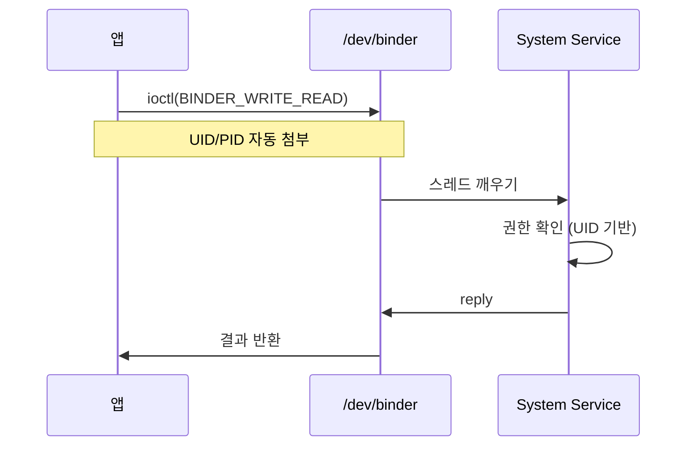
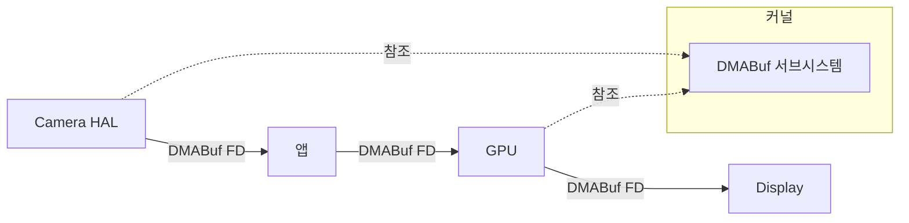
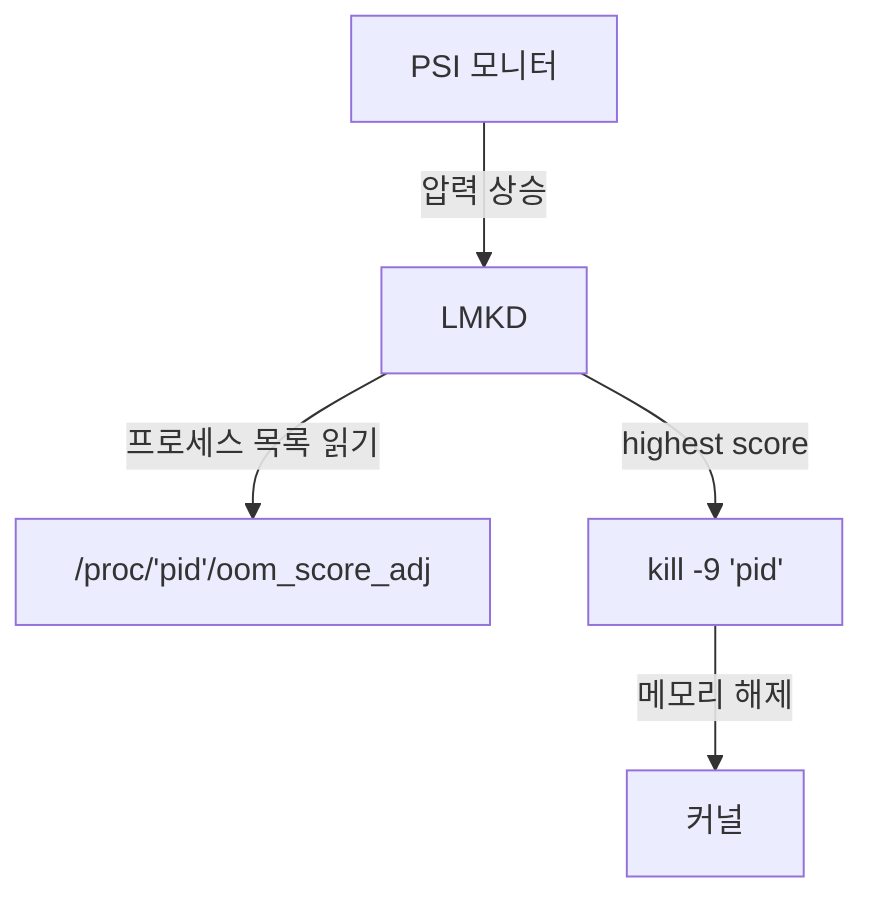
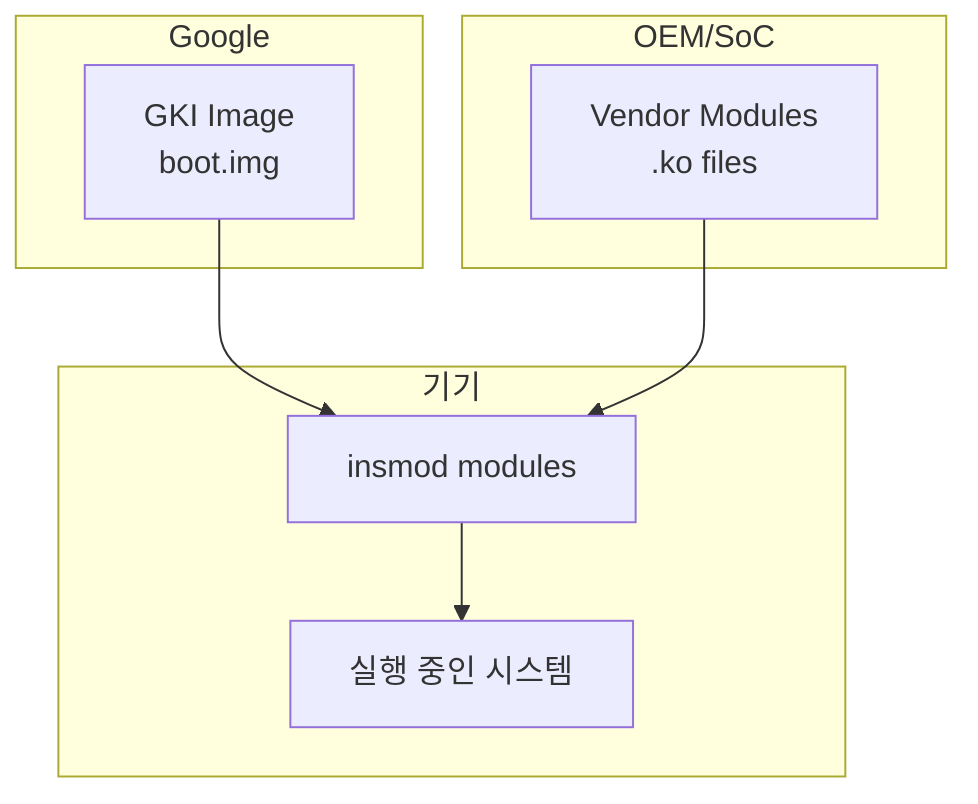
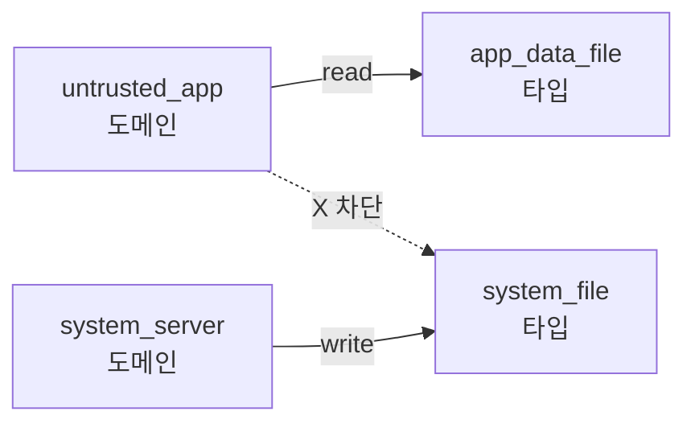
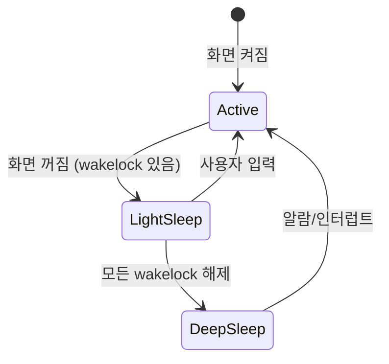

## 안드로이드 커널의 탄생 배경

안드로이드 커널은 리눅스 커널을 기반으로 하지만, 스마트폰과 모바일 기기의 특수한 요구사항을 해결하기 위해 상당한 수정이 가해졌다. 일반적인 커널의 기초는 [kernel](../../../../kernel.md) 문서를 먼저 참고하고, 여기서는 **왜 안드로이드가 리눅스를 수정해야 했는지**, 그리고 **어떤 문제를 해결하려 했는지** 에 집중한다.

### 모바일 환경의 제약과 도전 과제

2000 년대 초반, 구글이 안드로이드를 개발할 당시 스마트폰은 다음과 같은 특성을 가졌다:

1. **배터리 제약**: 데스크톱은 항상 전원에 연결되어 있지만, 스마트폰은 배터리로 8~12 시간 버텨야 한다.
2. **제한된 메모리**: 초기 안드로이드 기기는 128MB~512MB [RAM](../../../../random-access.md) 을 가졌다 (현재는 8~16GB).
3. **빈번한 절전**: 사용자가 화면을 끄면 대부분의 시스템이 정지해야 한다. 하지만 알림, 타이머, 배경 동기화는 작동해야 한다.
4. **신뢰할 수 없는 앱**: 앱 스토어에서 수백만 개의 써드파티 앱이 설치된다. 악의적이거나 버그가 있는 앱이 시스템 전체를 멈추면 안 된다.
5. **멀티미디어 중심**: 카메라, 비디오, 게임이 주 용도다. 큰 [버퍼](../../../../buffer.md) 를 여러 하드웨어 (GPU, Camera, Display) 간에 효율적으로 공유해야 한다.

일반 리눅스 커널은 서버와 데스크톱 환경에 최적화되어 있었다. **"항상 켜져 있고, 충분한 메모리가 있고, 신뢰할 수 있는 소프트웨어만 실행된다"** 는 가정 하에 설계되었다. 안드로이드는 이 모든 가정을 뒤집어야 했다.

---

## 핵심 추가 기능과 설계 이유

### 1. Binder: 모바일에 최적화된 IPC

#### 기존 IPC 의 한계

전통적인 Unix IPC(파이프, Unix 소켓, SysV 메시지 큐) 는 몇 가지 문제가 있었다:

1. **성능**: 프로세스 간 통신이 너무 자주 일어난다. 앱이 화면을 그리려면 SurfaceFlinger 와 통신하고, 위치 정보를 얻으려면 LocationService 와 통신한다. 기존 IPC 는 이런 빈번한 통신에 최적화되지 않았다.
2. **신원 확인**: 호출자의 UID/PID 를 신뢰할 수 없다. 악의적인 앱이 신원을 위조할 수 있다.
3. **객체 레퍼런스**: 복잡한 데이터 구조 (예: 파일 디스크립터, 콜백 객체) 를 전달하기 어렵다.

#### Binder 의 해결책

**Binder**는 OpenBinder 프로젝트에서 파생되어 안드로이드에 통합되었다 (2008 년). 주요 특징:

- **커널 수준의 IPC**: `/dev/binder` 캐릭터 디바이스를 통해 통신. 커널이 중재하므로 신원 위조가 불가능하다.
- **자동 신원 전달**: 커널이 호출자의 UID/PID 를 자동으로 전달. 시스템 서비스는 이를 신뢰할 수 있다.
- **객체 지향**: `IBinder` 객체를 다른 프로세스에 전달 가능. 커널이 레퍼런스 카운팅을 관리한다.
- **동기 RPC**: 함수 호출처럼 느껴진다. 호출자는 응답을 받을 때까지 block 된다 (oneway 키워드로 비동기도 가능).



#### 성능 비교

초기 벤치마크 (2008 년) 에서:

- **Unix Socket**: 라운드트립 시간 ~50μs
- **Binder**: 라운드트립 시간 ~25μs

메모리 복사를 최소화하고, 커널 스케줄링을 최적화한 결과다.

#### 보안 강화

Binder 는 [SELinux](../../../../selinux.md) 정책과 통합된다. 예를 들어:

```
allow untrusted_app surfaceflinger_service:service_manager find;
allow untrusted_app surfaceflinger:binder call;
```

위 정책이 없으면, 일반 앱은 SurfaceFlinger 에 접근할 수 없다. 루트 권한을 얻어도 SELinux 가 차단한다.

---

### 2. Ashmem 과 공유 메모리의 진화

#### 문제: 멀티미디어 [버퍼](../../../../buffer.md) 공유

카메라로 사진을 찍으면:

1. Camera HAL 이 [버퍼](../../../../buffer.md) 에 이미지 데이터를 쓴다.
2. 앱이 [버퍼](../../../../buffer.md) 를 처리한다 (회전, 필터 등).
3. MediaStore 에 JPEG 로 저장한다.
4. Gallery 앱이 썸네일을 표시한다.

각 단계마다 데이터를 복사하면 수백 MB 의 메모리와 CPU 시간이 낭비된다.

#### Ashmem(Anonymous Shared Memory)

안드로이드 초기 (Cupcake, 2009) 에 도입된 Ashmem 은 다음 기능을 제공했다:

- **공유 메모리**: 여러 프로세스가 같은 물리 메모리 영역을 매핑.
- **Pin/Unpin**: 메모리 압박 시 커널이 unpinned 영역을 회수 가능. 디스크 swap 없이 메모리 확보.
- **파일 디스크립터**: Ashmem 영역을 FD 로 표현, Binder 를 통해 전달.

```c
int fd = ashmem_create_region("my_buffer", size);
void *ptr = mmap(NULL, size, PROT_READ | PROT_WRITE, MAP_SHARED, fd, 0);
// Binder로 fd 전달
```

#### ION → DMABuf Heaps

Ashmem 은 CPU 접근용이었다. 하지만 GPU, Camera, Video Decoder 같은 하드웨어 가속기는 **물리적으로 연속된 메모리**가 필요하거나, **IOMMU(Input-Output Memory Management Unit)**를 통해 접근한다.

**ION**(2011~2019) 은 다양한 메모리 heap 을 제공했다:
- **System heap**: 일반 메모리.
- **Carveout heap**: 부팅 시 예약된 물리 연속 메모리.
- **CMA heap**: Contiguous Memory Allocator.

**DMABuf**(2012 년 리눅스 메인라인) 는 하드웨어 간 [버퍼](../../../../buffer.md) 공유를 표준화했다. 안드로이드는 ION 에서 DMABuf Heaps 으로 마이그레이션 중이다 (Android 11+).



**제로카피 (Zero-Copy)** 달성: 데이터는 한 번만 메모리에 쓰이고, 각 컴포넌트는 포인터만 전달받는다.

---

### 3. Wakelock: 공격적인 절전 전략

#### 배경: 서버 vs 모바일

일반 리눅스의 suspend(S3 sleep) 는 **시스템 전체를 정지** 시킨다. 메모리만 유지하고 CPU, 디스크, 네트워크를 끈다. 하지만 이는 서버에 적합하지 않다 (네트워크 요청에 응답 불가).

모바일은 정반대다:

- **화면 꺼짐 ≠ 시스템 정지**: 음악 재생, 파일 다운로드, 알림 수신이 계속되어야 한다.
- **기본 상태는 절전**: 화면이 꺼지면 가능한 한 빨리 suspend 로 진입해 배터리를 아낀다.

#### Wakelock 의 메커니즘

**Wakelock**(2009~2012, 초기 구현) 은 "지금은 sleep 하지 마"를 커널에 알리는 메커니즘이었다. 앱이나 서비스가 wakelock 을 잡으면 (acquire), 커널은 suspend 를 연기한다.

```bash
echo "my_wakelock" > /sys/power/wake_lock  # 잡기
echo "my_wakelock" > /sys/power/wake_unlock  # 풀기
```

**문제**: 앱이 wakelock 을 풀지 않으면 배터리가 급격히 소모된다. 초기 안드로이드의 악명 높은 "배터리 킬러" 문제의 주범이었다.

#### Wakeup Sources 로의 통합

리눅스 커뮤니티는 wakelock 패치를 거부했다 (메인라인에 맞지 않는 설계). 결국 양측이 타협해 **Wakeup Sources**(2012, Linux 3.5) 가 메인라인에 통합되었다. 안드로이드는 이를 사용하도록 마이그레이션했다.

```c
// 커널 코드
struct wakeup_source *ws = wakeup_source_register("my_wakelock");
__pm_stay_awake(ws);  // 잡기
__pm_relax(ws);       // 풀기
```

유저 공간에서는 `PowerManager` API 를 통해 간접적으로 사용한다:

```java
PowerManager pm = (PowerManager) getSystemService(Context.POWER_SERVICE);
PowerManager.WakeLock wl = pm.newWakeLock(PowerManager.PARTIAL_WAKE_LOCK, "MyWakeLock");
wl.acquire();  // CPU 깨어있음, 화면/센서는 끄기 가능
// 작업 수행
wl.release();
```

#### 배터리 최적화

Android 6.0(Marshmallow) 부터 **Doze 모드**가 도입되었다. 기기가 오랫동안 움직이지 않으면, 백그라운드 작업과 wakelock 을 제한한다. "유지 관리 기간 (maintenance window)"에만 작업을 허용한다.

---

### 4. LMKD: 선제적 프로세스 종료

#### OOM Killer 의 한계

리눅스의 **OOM(Out of Memory) Killer**는 메모리 할당이 **실패한 후**에 반응한다. 이는 데스크톱에서는 괜찮지만, 모바일에서는 너무 늦다. 이미 시스템이 느려지고, 앱이 멈춘 후에 종료가 일어난다.

#### Low Memory Killer (커널 버전)

초기 안드로이드 (Cupcake~Oreo) 는 **커널 내 LMK(Low Memory Killer)**를 사용했다. 메모리 임계값 (`minfree`) 을 설정하고, 특정 레벨에 도달하면 `oom_adj` 점수가 높은 프로세스를 종료했다.

```
minfree:    72MB  90MB  108MB  126MB  144MB  162MB
oom_adj:      0    1     2      4      9      15
```

예: 사용 가능한 메모리가 108MB 이하로 떨어지면, oom_adj >= 2 인 프로세스를 종료.

**문제**: 하드코딩된 임계값은 기기마다 달라야 한다 (RAM 이 2GB 인 기기와 8GB 인 기기는 다르다).

#### LMKD: 유저 공간 데몬

Android 9(Pie) 부터 **lmkd**라는 유저 공간 데몬이 메모리 관리를 담당한다.

**PSI(Pressure Stall Information)**를 활용한다. 리눅스 커널 (4.20+) 은 메모리, CPU, I/O 압박 정도를 수치화해 `/proc/pressure/*` 에 노출한다.

```bash
cat /proc/pressure/memory
some avg10=0.00 avg60=0.05 avg300=0.10 total=12345
full avg10=0.00 avg60=0.00 avg300=0.00 total=0
```

**some**: 적어도 하나의 태스크가 메모리를 기다림.
**full**: 모든 태스크가 블록됨.

lmkd 는 PSI 값을 모니터링하다가, 임계값을 초과하면 `oom_score_adj` 가 높은 프로세스를 찾아 `kill` 시그널을 보낸다.

#### 프로세스 우선순위

ActivityManager 가 각 프로세스의 중요도를 평가해 `oom_score_adj` 를 설정한다:

| 상태              | oom_score_adj | 설명                                    |
| --------------- | ------------- | ------------------------------------- |
| **Foreground**  | 0             | 화면에 표시 중                              |
| **Visible**     | 100           | 보이진 않지만 영향을 줌 (예: foreground service) |
| **Perceptible** | 200           | 사용자가 인지 가능 (예: 음악 재생)                 |
| **Service**     | 500+          | 백그라운드 작업                              |
| **Cached**      | 900+          | 최근 사용했지만 현재는 안 씀                      |
|                 |               |                                       |



---

### 5. GKI(Generic Kernel Image): 업데이트 딜레마 해결

#### 파편화 문제

안드로이드 초기 (2008~2015), 각 OEM/SoC 업체는 커널을 마구 수정했다:

- Qualcomm 은 자사 칩셋용 드라이버를 추가.
- Samsung 은 Knox 보안 기능을 추가.
- Xiaomi 는 MIUI 최적화를 추가.

결과적으로:

1. **보안 패치 지연**: 구글이 커널 취약점을 패치해도, OEM 이 자신의 커널에 백포트하기까지 몇 달 걸림.
2. **업스트림 통합 불가**: 수정된 커널은 mainline Linux 와 너무 달라져, 새 커널로 업그레이드가 불가능.
3. **테스트 부담**: 수천 가지 기기 변형마다 별도 커널.

#### GKI 의 목표

**GKI(Generic Kernel Image)**는 Android 11 부터 강제되었다:

1. **표준 커널 이미지**: 구글이 빌드한 ACK(Android Common Kernel) 를 **모든** 기기가 사용.
2. **Vendor Module 분리**: OEM/SoC 는 기기별 드라이버를 **동적 모듈 (`.ko`)**로 빌드. 표준 커널에 로드.
3. **KMI(Kernel Module Interface)**: 커널과 모듈 간 ABI 를 안정화. 커널이 업데이트되어도 모듈은 재컴파일 불필요.



#### 구체적인 구조

- **boot.img**: GKI 커널 + 초기 램디스크.(구글 유지보수)
- **vendor_boot.img** 또는 `/vendor/lib/modules/`: OEM 드라이버 모듈.
- **KMI Symbol Whitelist**: 모듈이 사용 가능한 커널 함수/변수 목록. 이 외 심볼은 접근 불가.

```bash
# 로드된 모듈 확인
adb shell lsmod

# 모듈 정보
adb shell modinfo /vendor/lib/modules/wlan.ko
```

#### 보안 패치 속도 향상

구글은 매달 **월간 보안 패치**를 GKI 로 제공한다. OEM 은 벤더 모듈만 업데이트하면 된다. 과거 6 개월 걸리던 패치가 1 달로 단축되었다.

---

### 6. [SELinux](../../../../selinux.md): 강제 접근 제어

#### DAC 의 한계

전통적인 Unix 권한 (UID/GID/permission bits) 은 **DAC(Discretionary Access Control)**다. 파일 소유자가 권한을 결정한다.

문제:

- 루트 권한을 얻으면 모든 제약이 사라진다.
- setuid 바이너리 (예: `su`, `passwd`) 가 뚫리면 공격자도 루트 권한을 얻는다.

#### SELinux 의 도입

안드로이드 4.3(2013) 부터 **SELinux**가 permissive 모드로 도입되었고, 5.0(2014) 부터 enforcing 모드가 필수가 되었다.

**MAC(Mandatory Access Control)**: 시스템 관리자가 정책을 설정하고, 프로세스는 이를 우회할 수 없다.

#### 도메인과 타입

- **Domain**: 프로세스의 SELinux 레이블. 예: `untrusted_app`, `system_server`, `init`.
- **Type**: 파일/소켓/Binder 서비스의 레이블. 예: `app_data_file`, `system_file`, `surfaceflinger_service`.

정책 예:

```
# untrusted_app은 자기 데이터 파일만 읽기/쓰기 가능
allow untrusted_app app_data_file:file { read write };

# system_server는 모든 앱에 Binder 호출 가능
allow system_server appdomain:binder call;

# untrusted_app은 system_file을 절대 쓸 수 없음
neverallow untrusted_app system_file:file write;
```



#### Binder 와의 통합

Binder 호출도 SELinux 로 제어된다:

```
allow untrusted_app activity_service:service_manager find;
allow untrusted_app system_server:binder call;
```

이 정책이 없으면, 앱이 `ActivityManager` 를 찾을 수 없다.

#### 디버깅

위반 시 로그 확인:

```bash
adb shell dmesg | grep avc
# 예: avc: denied { read } for pid=1234 comm="app_process" 
#      scontext=u:r:untrusted_app:s0 tcontext=u:object_r:system_file:s0
```

`audit2allow` 도구로 규칙 생성 제안 (단, 보안 리뷰 필수):

```bash
audit2allow -i avc_log.txt
```

---

### 7. eBPF: 동적 커널 확장

#### 전통적인 방법의 문제

네트워크 트래픽 통계를 수집하거나, 방화벽을 구현하려면 **커널 모듈**이 필요했다. 하지만:

- 커널 재컴파일 및 재부팅.
- 버그가 있으면 커널 패닉.
- 보안 검증 어려움.

#### eBPF 의 등장

**eBPF**(2014 년 리눅스 메인라인, Android 9 부터 활용) 는 "안전한 커널 프로그램"을 삽입할 수 있게 한다.

**검증기 (Verifier)**가 프로그램을 분석해:
- 무한 루프 불가.
- 잘못된 메모리 접근 불가.
- 허용된 헬퍼 함수만 호출.

통과하면 JIT 컴파일되어 커널에서 실행된다.

#### 안드로이드에서의 활용

**네트워크 통계**:
`netd` 데몬이 eBPF 프로그램을 소켓에 부착해, 앱별 트래픽을 추적한다.

```bash
ls /sys/fs/bpf/map_*
# map_netd_app_uid_stats_map
# map_netd_cookie_tag_map
```

**방화벽**:
UID 기반 패킷 필터링. iptables 보다 빠르다.

```c
// eBPF 프로그램 예시
SEC("cgroup/skb")
int bpf_cgroup_skb(struct __sk_buff *skb) {
    __u32 uid = bpf_get_socket_uid(skb);
    if (uid == BLOCKED_UID)
        return 0;  // drop
    return 1;  // accept
}
```

**성능 향상**:
iptables 는 선형 탐색 (O(n)). eBPF 는 해시 맵으로 O(1).

---

## 전원 관리 심화

### Suspend 와 Deep Sleep



**Light Sleep**: CPU 는 저전력 상태 (CPUIdle), 하지만 suspend 는 아님. wakelock 이 있는 상태.

**Deep Sleep**: `echo mem > /sys/power/state` 실행. CPU/대부분 주변기기 정지. RTC(Real-Time Clock), GPIO 인터럽트만 깨울 수 있음.

### Thermal Management

CPU/GPU 가 과열되면:

1. 온도 센서가 임계값 초과 감지.
2. `thermal_core` 가 cooling device 실행.
3. CPU 주파수 제한 (throttling), GPU 주파수 제한.
4. 극단적인 경우 시스템 종료.

```bash
watch -n1 'cat /sys/class/thermal/thermal_zone*/temp'
```

---

## 메모리 관리 최적화

### zRAM

**Swap**을 디스크가 아닌 **압축된 메모리**로 사용. 쓰기 수명이 제한된 플래시 메모리를 보호하고, 속도도 빠르다.

```bash
cat /proc/swaps
# /dev/block/zram0  partition  2097148  153600  5
```

### CMA(Contiguous Memory Allocator)

Camera, GPU 는 물리적으로 연속된 메모리가 필요할 수 있다. CMA 는 부팅 시 영역을 예약하되, 사용하지 않을 때는 일반 페이지로 활용한다.

---

## 부팅 최적화

### Systrace 로 병목 찾기

```bash
python systrace.py -b 32768 -t 10 -o boot.html am wm ss dalvik sched binder_driver
```

브라우저로 `boot.html` 열어 각 서비스의 시작 시간, Binder 호출 시간을 시각화.

### 최적화 전략

1. **병렬 시작**: `init.rc` 에서 `class_start core` 로 여러 서비스 동시 실행.
2. **지연 시작**: `on property:sys.boot_completed=1` 로 중요하지 않은 서비스는 부팅 후 시작.
3. **Preload 최소화**: Zygote 가 preload 하는 클래스/리소스 줄이기.

---

## 보안 강화 메커니즘

### Verified Boot (AVB)

부트로더가 boot.img, vendor.img 의 서명을 검증. vbmeta 파티션에 해시 트리와 공개키 저장.

```
Bootloader → vbmeta → boot.img 서명 확인 → 커널 로드
```

변조 시 부팅 차단 또는 경고 표시.

### dm-verity

파일시스템 (system, vendor) 의 블록 단위 해시 트리. 읽기 시 실시간 검증.

```bash
veritysetup --hash-offset=<offset> /dev/block/dm-0
```

변조 감지 시 I/O 에러 또는 커널 패닉.

### CFI(Control Flow Integrity)

간접 함수 호출 (함수 포인터, vtable) 을 검증해 ROP(Return-Oriented Programming) 공격 방어.

LLVM LTO + CFI 플래그로 빌드:

```makefile
LOCAL_CFLAGS += -fsanitize=cfi
```

---

## 실전: 안드로이드 커널 빌드

### ACK 다운로드

```bash
repo init -u https://android.googlesource.com/kernel/manifest -b common-android14-6.1
repo sync
```

### 빌드

```bash
BUILD_CONFIG=common/build.config.gki.aarch64 build/build.sh
```

결과물: `out/android14-6.1/dist/Image`.

### 기기에 플래시

```bash
mkbootimg --kernel Image --ramdisk ramdisk.img -o boot.img
adb reboot bootloader
fastboot flash boot boot.img
fastboot reboot
```

---

## 디버깅 팁

### dmesg

```bash
adb shell dmesg | grep -i error
```

### Perfetto

실시간 트레이싱:

```bash
adb shell perfetto -c trace_config.pbtxt -o /data/misc/perfetto-traces/trace
adb pull /data/misc/perfetto-traces/trace
```

[perfetto.dev](../../../../https:/ui.perfetto.dev.md) 에서 분석.

---

## 주요 ACK 브랜치

| 브랜치 | 안드로이드 버전 | 커널 버전 | 특징 |
|--------|-----------------|-----------|------|
| android12-5.10 | Android 12 | 5.10 LTS | GKI 1.0 |
| android13-5.15 | Android 13 | 5.15 LTS | GKI 2.0, KMI 안정화 |
| android14-6.1 | Android 14 | 6.1 LTS | Rust 지원 확장 |

---

## 리눅스 메인라인과의 관계

초기 안드로이드 커널 (2008~2010) 은 out-of-tree 패치가 많았다 (Binder, Ashmem, Wakelock). 리눅스 커뮤니티는 이를 거부했다.

점진적인 협력 끝에:

- **Binder**: 2014 년 메인라인 포함 (drivers/android/binder.c).
- **Ashmem**: memfd_create() 로 대체 진행 중.
- **Wakelock**: Wakeup Sources 로 통합.

현재 ACK 는 메인라인 LTS 커널 + 안드로이드 전용 패치 (~5%).

---

## 학습 리소스

**소스**:
- [Android Common Kernel](../../../../https:/android.googlesource.com/kernel/common/.md)
- [AOSP Kernel Docs](../../../../https:/source.android.com/docs/core/architecture/kernel.md)

**도구**:
- [Perfetto](../../../../https:/perfetto.dev.md): 트레이싱.
- [Systrace](../../../../https:/developer.android.com/topic/performance/tracing.md): 부팅 분석.

**책**:
- *Embedded Android* (Karim Yaghmour)
- *Android Internals* (Jonathan Levin)

---

## 연결 문서

[kernel](../../../../kernel.md) - 범용 커널 기초 개념

[android-hal-and-kernel](android-hal-and-kernel.md) - HAL 과 커널의 연결

[android-architecture-stack](../00_foundations/android-architecture-stack.md) - 안드로이드 전체 아키텍처

[android-boot-flow](android-boot-flow.md) - 부팅 과정에서 커널의 역할

[android-binder-and-ipc](android-binder-and-ipc.md) - Binder 상세

[android-process-and-memory](android-process-and-memory.md) - 프로세스/메모리 관리

[android-security-and-sandboxing](../05_security_privacy/android-security-and-sandboxing.md) - SELinux 정책
