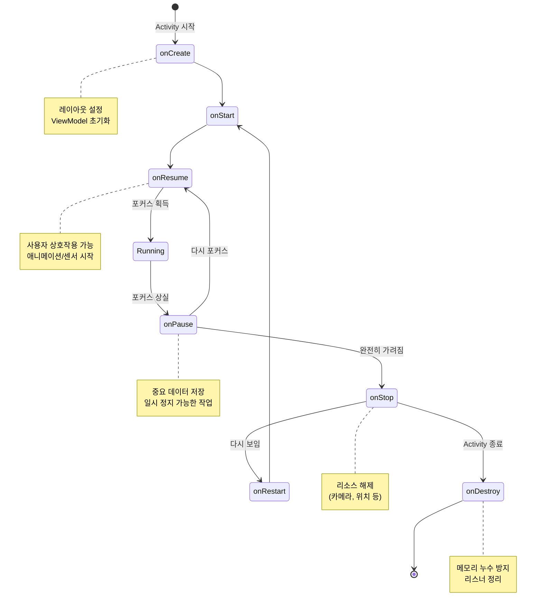

## Android App Components Deep Dive

안드로이드 앱을 이루는 네 가지 핵심 컴포넌트를 깊이 있게 다룬다. 기본은 [android-foundations](../00_foundations/android-foundations.md) 에서 확인한다.

### Activity 생명주기 상세

Activity 는 사용자가 보는 화면이며, 복잡한 생명주기를 가진다.

#### 생명주기 콜백 순서

1. **onCreate()**: Activity 가 처음 만들어질 때. `setContentView()` 로 레이아웃을 설정하고, ViewModel 을 초기화한다.
2. **onStart()**: 화면에 보이기 시작. 아직 포커스는 없다.
3. **onResume()**: 포커스를 받아 사용자와 상호작용 가능. 애니메이션/센서를 시작하기 좋은 시점.
4. **onPause()**: 포커스를 잃음. 다른 Activity 가 위에 뜨거나 멀티윈도우 상태. 중요한 데이터를 저장한다.
5. **onStop()**: 완전히 가려짐. 무거운 리소스 (카메라, 위치 리스너) 를 해제한다.
6. **onDestroy()**: Activity 가 종료됨. 메모리 누수를 막기 위해 리스너를 정리한다.



#### 설정 변경과 상태 보존

화면 회전이나 언어 변경 시 Activity 가 재생성된다.

```kotlin
// ViewModel 사용 (권장)
class MyViewModel : ViewModel() {
    val data = MutableLiveData<String>()
}

class MyActivity : AppCompatActivity() {
    private val viewModel: MyViewModel by viewModels()
    
    override fun onCreate(savedInstanceState: Bundle?) {
        super.onCreate(savedInstanceState)
        // ViewModel 의 데이터는 설정 변경 시에도 유지됨
        viewModel.data.observe(this) { value ->
            // UI 업데이트
        }
    }
}

// onSaveInstanceState 사용 (간단한 데이터)
override fun onSaveInstanceState(outState: Bundle) {
    super.onSaveInstanceState(outState)
    outState.putString("key", "value")
}

override fun onCreate(savedInstanceState: Bundle?) {
    super.onCreate(savedInstanceState)
    savedInstanceState?.getString("key")?.let {
        // 복원된 데이터 사용
    }
}
```

더 자세한 내용은 [android-viewmodel](android-viewmodel.md) 참고.

#### Task 와 Back Stack

Task 는 사용자가 작업을 수행하는 Activity 의 스택이다.

- **Standard**: 기본 모드. 매번 새 인스턴스 생성.
- **SingleTop**: 스택 최상단에 이미 있으면 `onNewIntent()` 호출, 아니면 새로 생성.
- **SingleTask**: Task 내에 하나만 존재. 이미 있으면 위의 Activity 들을 모두 제거.
- **SingleInstance**: 독립된 Task 에 혼자 존재. 다른 Activity 와 스택을 공유하지 않음.

```xml
<!-- AndroidManifest.xml -->
<activity
    android:name=".MainActivity"
    android:launchMode="singleTop" />
```

```kotlin
// 프로그래밍 방식으로 제어
val intent = Intent(this, DetailActivity::class.java).apply {
    flags = Intent.FLAG_ACTIVITY_NEW_TASK or Intent.FLAG_ACTIVITY_CLEAR_TOP
}
startActivity(intent)
```

#### Intent Filter 와 암시적 Intent

Activity 가 어떤 작업을 처리할 수 있는지 선언한다.

```xml
<activity android:name=".ShareActivity">
    <intent-filter>
        <action android:name="android.intent.action.SEND" />
        <category android:name="android.intent.category.DEFAULT" />
        <data android:mimeType="text/plain" />
    </intent-filter>
</activity>
```

```kotlin
// 암시적 Intent 로 공유
val sendIntent = Intent().apply {
    action = Intent.ACTION_SEND
    putExtra(Intent.EXTRA_TEXT, "공유할 텍스트")
    type = "text/plain"
}
val shareIntent = Intent.createChooser(sendIntent, null)
startActivity(shareIntent)
```

### Service 심화

Service 는 백그라운드에서 오래 실행되는 작업을 처리한다.

#### Service 종류

1. **Foreground Service**: 사용자가 인지할 수 있는 작업 (음악 재생, 운동 추적). 알림이 필수.
2. **Background Service**: Android 8.0+ 에서 크게 제한됨. WorkManager 사용 권장.
3. **Bound Service**: 클라이언트 - 서버 인터페이스 제공. 바인드된 컴포넌트가 없으면 종료.

#### Foreground Service 예시

```kotlin
class MusicService : Service() {
    private val CHANNEL_ID = "music_channel"
    private val NOTIFICATION_ID = 1
    
    override fun onCreate() {
        super.onCreate()
        createNotificationChannel()
    }
    
    override fun onStartCommand(intent: Intent?, flags: Int, startId: Int): Int {
        val notification = NotificationCompat.Builder(this, CHANNEL_ID)
            .setContentTitle("음악 재생 중")
            .setContentText("노래 제목")
            .setSmallIcon(R.drawable.ic_music)
            .build()
        
        startForeground(NOTIFICATION_ID, notification)
        
        // 작업 수행
        
        return START_STICKY // 시스템이 종료했다가 재시작
    }
    
    private fun createNotificationChannel() {
        if (Build.VERSION.SDK_INT >= Build.VERSION_CODES.O) {
            val channel = NotificationChannel(
                CHANNEL_ID,
                "음악 재생",
                NotificationManager.IMPORTANCE_LOW
            )
            val manager = getSystemService(NotificationManager::class.java)
            manager.createNotificationChannel(channel)
        }
    }
    
    override fun onBind(intent: Intent?): IBinder? = null
}
```

```xml
<!-- AndroidManifest.xml -->
<service
    android:name=".MusicService"
    android:foregroundServiceType="mediaPlayback"
    android:exported="false" />
```

#### Bound Service 와 AIDL

[android-binder-and-ipc](../01_system_internals/android-binder-and-ipc.md) 를 통해 프로세스 간 통신이 가능하다.

```kotlin
// 같은 프로세스 내 Binder
class LocalService : Service() {
    private val binder = LocalBinder()
    
    inner class LocalBinder : Binder() {
        fun getService(): LocalService = this@LocalService
    }
    
    override fun onBind(intent: Intent): IBinder = binder
    
    fun getRandomNumber(): Int = Random.nextInt(100)
}

// Activity 에서 바인드
class MainActivity : AppCompatActivity() {
    private var service: LocalService? = null
    private var bound = false
    
    private val connection = object : ServiceConnection {
        override fun onServiceConnected(name: ComponentName?, binder: IBinder?) {
            val localBinder = binder as LocalService.LocalBinder
            service = localBinder.getService()
            bound = true
        }
        
        override fun onServiceDisconnected(name: ComponentName?) {
            bound = false
        }
    }
    
    override fun onStart() {
        super.onStart()
        Intent(this, LocalService::class.java).also { intent ->
            bindService(intent, connection, Context.BIND_AUTO_CREATE)
        }
    }
    
    override fun onStop() {
        super.onStop()
        if (bound) {
            unbindService(connection)
            bound = false
        }
    }
}
```

### BroadcastReceiver 상세

시스템이나 앱이 보내는 방송을 받는다.

#### 등록 방식

**Manifest 등록** (정적):
```xml
<receiver android:name=".BootReceiver"
    android:exported="true">
    <intent-filter>
        <action android:name="android.intent.action.BOOT_COMPLETED" />
    </intent-filter>
</receiver>
```

**코드 등록** (동적, 권장):
```kotlin
class MainActivity : AppCompatActivity() {
    private val receiver = object : BroadcastReceiver() {
        override fun onReceive(context: Context?, intent: Intent?) {
            when (intent?.action) {
                Intent.ACTION_BATTERY_LOW -> {
                    // 배터리 부족 처리
                }
            }
        }
    }
    
    override fun onResume() {
        super.onResume()
        val filter = IntentFilter(Intent.ACTION_BATTERY_LOW)
        registerReceiver(receiver, filter)
    }
    
    override fun onPause() {
        super.onPause()
        unregisterReceiver(receiver)
    }
}
```

#### 제약사항

- Android 8.0+ 에서 암시적 브로드캐스트 수신이 크게 제한됨
- `onReceive()` 는 10 초 안에 완료해야 함 ([[android-glossary#anr|ANR]] 방지)
- 긴 작업은 [[android-glossary#workmanager|WorkManager]] 나 `goAsync()` 사용

```kotlin
class MyReceiver : BroadcastReceiver() {
    override fun onReceive(context: Context, intent: Intent) {
        val pendingResult = goAsync()
        
        CoroutineScope(Dispatchers.IO).launch {
            try {
                // 긴 작업 수행
                delay(5000)
            } finally {
                pendingResult.finish()
            }
        }
    }
}
```

### ContentProvider 심화

앱 간 데이터 공유를 위한 표준 인터페이스.

#### 구현 예시

```kotlin
class MyContentProvider : ContentProvider() {
    private lateinit var database: SQLiteDatabase
    
    companion object {
        const val AUTHORITY = "com.example.provider"
        val CONTENT_URI: Uri = Uri.parse("content://$AUTHORITY/items")
        
        private const val ITEMS = 1
        private const val ITEM_ID = 2
        
        private val uriMatcher = UriMatcher(UriMatcher.NO_MATCH).apply {
            addURI(AUTHORITY, "items", ITEMS)
            addURI(AUTHORITY, "items/#", ITEM_ID)
        }
    }
    
    override fun onCreate(): Boolean {
        database = context?.let { MyDatabaseHelper(it).writableDatabase }
            ?: return false
        return true
    }
    
    override fun query(
        uri: Uri,
        projection: Array<out String>?,
        selection: String?,
        selectionArgs: Array<out String>?,
        sortOrder: String?
    ): Cursor? {
        val cursor = when (uriMatcher.match(uri)) {
            ITEMS -> database.query("items", projection, selection, selectionArgs, null, null, sortOrder)
            ITEM_ID -> {
                val id = uri.lastPathSegment
                database.query("items", projection, "_id=?", arrayOf(id), null, null, sortOrder)
            }
            else -> throw IllegalArgumentException("Unknown URI: $uri")
        }
        cursor.setNotificationUri(context?.contentResolver, uri)
        return cursor
    }
    
    override fun insert(uri: Uri, values: ContentValues?): Uri? {
        val id = database.insert("items", null, values)
        context?.contentResolver?.notifyChange(uri, null)
        return Uri.withAppendedPath(CONTENT_URI, id.toString())
    }
    
    override fun update(uri: Uri, values: ContentValues?, selection: String?, selectionArgs: Array<out String>?): Int {
        val count = database.update("items", values, selection, selectionArgs)
        context?.contentResolver?.notifyChange(uri, null)
        return count
    }
    
    override fun delete(uri: Uri, selection: String?, selectionArgs: Array<out String>?): Int {
        val count = database.delete("items", selection, selectionArgs)
        context?.contentResolver?.notifyChange(uri, null)
        return count
    }
    
    override fun getType(uri: Uri): String? {
        return when (uriMatcher.match(uri)) {
            ITEMS -> "vnd.android.cursor.dir/vnd.$AUTHORITY.items"
            ITEM_ID -> "vnd.android.cursor.item/vnd.$AUTHORITY.items"
            else -> null
        }
    }
}
```

#### 권한 설정

```xml
<provider
    android:name=".MyContentProvider"
    android:authorities="com.example.provider"
    android:exported="true"
    android:readPermission="com.example.READ_ITEMS"
    android:writePermission="com.example.WRITE_ITEMS" />

<permission
    android:name="com.example.READ_ITEMS"
    android:protectionLevel="normal" />
```

#### 사용 예시

```kotlin
// 다른 앱에서 접근
val cursor = contentResolver.query(
    Uri.parse("content://com.example.provider/items"),
    null, null, null, null
)

cursor?.use {
    while (it.moveToNext()) {
        val name = it.getString(it.getColumnIndexOrThrow("name"))
        // 데이터 사용
    }
}
```

### 컴포넌트 간 통신

#### LocalBroadcastManager (Deprecated)

이제는 LiveData, Flow, EventBus 같은 대안 사용 권장.

```kotlin
// LiveData 로 이벤트 전달
class EventBus {
    private val _events = MutableLiveData<Event>()
    val events: LiveData<Event> = _events
    
    fun post(event: Event) {
        _events.postValue(event)
    }
}

// Flow 사용
class EventRepository {
    private val _events = MutableSharedFlow<Event>()
    val events = _events.asSharedFlow()
    
    suspend fun emit(event: Event) {
        _events.emit(event)
    }
}
```

### 백그라운드 작업 선택 가이드

- **즉시 실행 필요 + 사용자 인지**: Foreground Service
- **지연 가능 + 조건부 실행**: [[android-glossary#workmanager|WorkManager]]
- **정확한 시간**: AlarmManager (제한적)
- **앱 실행 중 비동기**: Coroutines, RxJava
- **프로세스 간 통신**: Bound Service + [[android-glossary#binder|Binder]]

### 성능 최적화

#### Activity 시작 최적화

```kotlin
// Trampoline Activity 피하기 (불필요한 중간 Activity)
// 대신 Navigation Component 사용

// Intent 재사용
companion object {
    fun newIntent(context: Context, id: String) = Intent(context, DetailActivity::class.java).apply {
        putExtra("id", id)
    }
}
```

#### 메모리 누수 방지

```kotlin
class MyActivity : AppCompatActivity() {
    private var job: Job? = null
    
    override fun onCreate(savedInstanceState: Bundle?) {
        super.onCreate(savedInstanceState)
        
        // ✅ lifecycleScope 사용 (자동 취소)
        lifecycleScope.launch {
            // 작업
        }
    }
    
    override fun onDestroy() {
        super.onDestroy()
        // ✅ 수동 취소
        job?.cancel()
    }
}

// ❌ 나쁜 예: Activity 참조를 static 에 저장
companion object {
    var activity: Activity? = null // 메모리 누수!
}
```

### 디버깅

```bash
# Activity 스택 확인
adb shell dumpsys activity activities

# Service 목록
adb shell dumpsys activity services

# BroadcastReceiver 히스토리
adb shell dumpsys activity broadcasts

# ContentProvider 확인
adb shell dumpsys activity providers
```

### AndroidManifest.xml 상세

앱의 진입점과 컴포넌트 설정을 정의하는 핵심 파일이다.

```xml
<?xml version="1.0" encoding="utf-8"?>
<manifest xmlns:android="http://schemas.android.com/apk/res/android"
    xmlns:tools="http://schemas.android.com/tools">

    <application
        android:allowBackup="true"
        android:dataExtractionRules="@xml/data_extraction_rules"
        android:fullBackupContent="@xml/backup_rules"
        android:icon="@mipmap/ic_launcher"
        android:label="@string/app_name"
        android:roundIcon="@mipmap/ic_launcher_round"
        android:supportsRtl="true"
        android:theme="@style/Theme.Android101"
        tools:targetApi="31">

        <!-- 진입점 Activity -->
        <activity
            android:name=".MainActivity"
            android:exported="true"
            android:label="@string/app_name"
            android:theme="@style/Theme.Android101">
            <intent-filter>
                <action android:name="android.intent.action.MAIN" />
                <category android:name="android.intent.category.LAUNCHER" />
            </intent-filter>
        </activity>
    </application>
</manifest>
```

**주요 속성 설명:**

- `android:exported="true"`: 외부 앱에서 호출 가능 (Android 12+ 필수)
- `ACTION_MAIN` + `CATEGORY_LAUNCHER`: 런처에서 앱 아이콘으로 표시
- `tools:targetApi`: Android Studio 빌드 도구용 힌트 (런타임 무관)

### 더 보기

[android-foundations](../00_foundations/android-foundations.md), [android-activity-manager-and-system-services](../01_system_internals/android-activity-manager-and-system-services.md), [android-binder-and-ipc](../01_system_internals/android-binder-and-ipc.md), [android-process-and-memory](../01_system_internals/android-process-and-memory.md), [android-permissions-deep-dive](../05_security_privacy/android-permissions-deep-dive.md)
