## Android Gradle Build System android android/build android/gradle

Android Gradle Plugin (AGP) 과 빌드 시스템 최적화. 기본은 [android-os-development-guide](android-os-development-guide.md) 참고.

### Gradle 기본 구조

```
MyApp/
├── build.gradle.kts (프로젝트 레벨)
├── settings.gradle.kts
├── gradle.properties
├── app/
│   ├── build.gradle.kts (모듈 레벨)
│   ├── proguard-rules.pro
│   └── src/
└── library/
    └── build.gradle.kts
```

### 프로젝트 레벨 build.gradle.kts

```kotlin
// build.gradle.kts (프로젝트)
plugins {
    id("com.android.application") version "8.2.0" apply false
    id("com.android.library") version "8.2.0" apply false
    id("org.jetbrains.kotlin.android") version "1.9.20" apply false
    id("com.google.dagger.hilt.android") version "2.48" apply false
}

tasks.register("clean", Delete::class) {
    delete(rootProject.buildDir)
}
```

---

## Gradle Plugins 블록 심층 가이드

### plugins 블록이란?

**plugins 블록**은 Gradle 빌드 시스템에 "이 프로젝트는 이런 특수 기능들을 쓸 거야"라고 선언하는 곳입니다.

| 개념 | 설명 |
| :--- | :--- |
| **역할** | 빌드 과정에 특수 기능 추가 (코드 생성, DSL 확장, 빌드 태스크 추가 등) |
| **Flutter 비유** | `pubspec.yaml` 의 `dev_dependencies` + `build_runner` 자동 실행 |
| **결과** | 플러그인이 제공하는 어노테이션, DSL, 빌드 명령어가 활성화됨 |

>[!NOTE]
> **Flutter 와의 차이점**
>Flutter 에서는 `flutter pub run build_runner build` 를 수동으로 실행해야 하지만, Android 에서는 plugins 블록에 선언하면 빌드 시 자동으로 실행됩니다.

### alias vs id: 두 가지 선언 방식

#### 1. alias 방식 (최신 권장 ✅)

`libs.versions.toml` 에 정의된 플러그인을 참조하는 방식입니다.

```kotlin
// build.gradle.kts
plugins {
    alias(libs.plugins.android.application)
    alias(libs.plugins.kotlin.android)
    alias(libs.plugins.hilt)
}
```

이렇게 쓰면 `libs.versions.toml` 파일의 `[plugins]` 섹션을 참조합니다:

```toml
# gradle/libs.versions.toml
[versions]
agp = "8.2.0"
kotlin = "1.9.20"
hilt = "2.48"

[plugins]
android-application = { id = "com.android.application", version.ref = "agp" }
kotlin-android = { id = "org.jetbrains.kotlin.android", version.ref = "kotlin" }
hilt = { id = "com.google.dagger.hilt.android", version.ref = "hilt" }
```

**장점:**
- ✅ 버전 관리가 한 곳(`libs.versions.toml`)에 집중됨
- ✅ 여러 모듈에서 같은 플러그인을 쓸 때 버전 충돌이 없음
- ✅ 버전 업데이트 시 한 곳만 수정하면 됨

**Flutter 비유:**
```yaml
# pubspec.yaml에서 버전을 한 곳에서 관리하는 것과 같습니다
dev_dependencies:
  build_runner: ^2.4.0
  json_serializable: ^6.7.0
```

#### 2. id 방식 (직접 선언)

플러그인을 직접 명시하는 방식입니다.

```kotlin
plugins {
    id("kotlin-kapt")  // 버전 없음 (Kotlin 플러그인에 포함)
    id("com.google.devtools.ksp") version "2.0.0-1.0.21"  // 버전 명시
}
```

**언제 사용하나요?**
- `libs.versions.toml` 에 등록하지 않은 플러그인을 쓸 때
- 버전이 없는 플러그인 (예: `kotlin-kapt` 는 Kotlin 플러그인에 포함되어 있어서 버전 불필요)
- 일회성으로 테스트하는 플러그인

### 주요 플러그인과 역할

#### 실제 예시로 이해하기

```kotlin
plugins {
    // 1. 안드로이드 앱 빌드 기능 활성화
    alias(libs.plugins.android.application)
    
    // 2. Kotlin 언어 지원
    alias(libs.plugins.kotlin.android)
    
    // 3. Jetpack Compose 컴파일러 활성화
    alias(libs.plugins.kotlin.compose)
    
    // 4. Hilt 의존성 주입 코드 자동 생성
    alias(libs.plugins.hilt)
    
    // 5. JSON 직렬화 코드 자동 생성
    alias(libs.plugins.kotlin.serialization)
    
    // 6. 어노테이션 처리 (코드 생성 도구)
    id("kotlin-kapt")
}
```

#### 각 플러그인의 역할 상세

| 플러그인 | 활성화하면 생기는 일 | Flutter 비유 |
| :--- | :--- | :--- |
| **android-application** | `android { … }` 블록 사용 가능, APK 빌드 가능 | `flutter build apk` 명령어 사용 가능 |
| **kotlin-android** | Kotlin 코드 컴파일 가능 | Dart 컴파일러 활성화 |
| **kotlin-compose** | `@Composable` 함수 인식 및 최적화 | Flutter 의 Widget 시스템 활성화 |
| **hilt** | `@HiltAndroidApp`, `@Inject` 등 처리 | Provider 코드 생성 (`provider` 패키지) |
| **kotlin-serialization** | `@Serializable` 어노테이션 처리 | `json_serializable` 실행 |
| **kotlin-kapt** | 모든 어노테이션 프로세서 실행 가능 | `build_runner` 실행 |
| **ksp** | kapt 보다 빠른 어노테이션 처리 (차세대) | `build_runner` 의 최적화 버전 |

### 실전 예시: 플러그인의 중요성

#### ❌ 플러그인 없이 Hilt 사용 시도

```kotlin
// build.gradle.kts
plugins {
    alias(libs.plugins.android.application)
    alias(libs.plugins.kotlin.android)
    // ⚠️ hilt 플러그인 없음!
}

dependencies {
    implementation(libs.hilt.android)
    kapt(libs.hilt.compiler)
}
```

**결과:**
```
Error: [Dagger/MissingBinding] Cannot find @Inject constructor
```

`@HiltAndroidApp`, `@AndroidEntryPoint` 같은 어노테이션을 인식하지 못해 컴파일 에러가 발생합니다.

#### ✅ 플러그인 추가 후

```kotlin
plugins {
    alias(libs.plugins.android.application)
    alias(libs.plugins.kotlin.android)
    alias(libs.plugins.hilt)  // ✅ 추가!
    id("kotlin-kapt")  // ✅ 추가!
}

dependencies {
    implementation(libs.hilt.android)
    kapt(libs.hilt.compiler)
}
```

**결과:**
- ✅ Hilt 가 자동으로 의존성 주입 코드를 생성해줍니다
- ✅ `@HiltAndroidApp`, `@AndroidEntryPoint` 어노테이션이 정상 작동합니다

### 플러그인 선언 순서

```kotlin
plugins {
    // 1. 기본 플랫폼 플러그인 (항상 먼저)
    alias(libs.plugins.android.application)
    
    // 2. 언어 플러그인
    alias(libs.plugins.kotlin.android)
    
    // 3. 컴파일러 확장 플러그인
    alias(libs.plugins.kotlin.compose)
    
    // 4. 코드 생성 플러그인
    alias(libs.plugins.hilt)
    alias(libs.plugins.kotlin.serialization)
    
    // 5. 어노테이션 프로세서 (마지막)
    id("kotlin-kapt")
}
```

>[!TIP]
> **플러그인 순서 규칙**
> - 플랫폼 플러그인(`android-application`)이 가장 먼저
> - 언어 플러그인(`kotlin-android`)이 그 다음
> - 나머지는 순서 무관하지만, 가독성을 위해 관련 플러그인끼리 그룹화

### kapt vs ksp: 어노테이션 처리 방식 비교

| 항목 | kapt | ksp |
| :--- | :--- | :--- |
| **속도** | 느림 (Java 기반) | 빠름 (Kotlin 네이티브) |
| **호환성** | 모든 어노테이션 프로세서 지원 | 일부만 지원 (점점 늘어남) |
| **사용 시기** | 레거시 라이브러리 사용 시 | 최신 라이브러리 (Room, Hilt 등) |
| **선언 방식** | `id("kotlin-kapt")` | `id("com.google.devtools.ksp")` |

```kotlin
// kapt 사용 (기존 방식)
plugins {
    id("kotlin-kapt")
}
dependencies {
    kapt(libs.hilt.compiler)
}

// ksp 사용 (최신 방식, 더 빠름)
plugins {
    id("com.google.devtools.ksp") version "2.0.0-1.0.21"
}
dependencies {
    ksp(libs.hilt.compiler)
}
```

### 자주 하는 실수

#### ❌ 실수 1: 플러그인은 선언했지만 의존성 누락

```kotlin
plugins {
    alias(libs.plugins.hilt)  // ✅ 플러그인 선언
}
dependencies {
    // ❌ 의존성 누락!
}
```

**해결:**
```kotlin
dependencies {
    implementation(libs.hilt.android)  // ✅ 추가
    kapt(libs.hilt.compiler)  // ✅ 추가
}
```

#### ❌ 실수 2: 프로젝트 레벨에서 apply false 누락

```kotlin
// build.gradle.kts (프로젝트 레벨)
plugins {
    id("com.google.dagger.hilt.android") version "2.48"  // ❌ apply false 누락
}
```

**해결:**
```kotlin
plugins {
    id("com.google.dagger.hilt.android") version "2.48" apply false  // ✅ 추가
}
```

### 핵심 요약

| 개념 | 설명 |
| :--- | :--- |
| **plugins 블록** | 빌드 과정에 특수 기능을 추가하는 곳 |
| **alias** | `libs.versions.toml` 에 정의된 플러그인 참조 (권장) |
| **id** | 플러그인을 직접 선언 (간단한 플러그인이나 버전 불필요 시) |
| **결과** | 플러그인이 제공하는 어노테이션, DSL, 빌드 명령어 활성화 |

>[!NOTE]
> **Flutter 개발자를 위한 한 줄 요약**
>`plugins` 는 `pubspec.yaml` 의 `dev_dependencies` + `flutter pub run build_runner build` 를 자동화하는 설정입니다!

---

### 모듈 레벨 build.gradle.kts

```kotlin
// app/build.gradle.kts
plugins {
    id("com.android.application")
    id("org.jetbrains.kotlin.android")
    id("kotlin-kapt")
    id("dagger.hilt.android.plugin")
}

android {
    namespace = "com.example.app"
    compileSdk = 34
    
    defaultConfig {
        applicationId = "com.example.app"
        minSdk = 24
        targetSdk = 34
        versionCode = 1
        versionName = "1.0.0"
        
        testInstrumentationRunner = "androidx.test.runner.AndroidJUnitRunner"
        
        // Vector Drawable 지원
        vectorDrawables.useSupportLibrary = true
        
        // BuildConfig 필드 추가
        buildConfigField("String", "API_URL", "\"https://api.example.com\"")
        
        // Manifest placeholder
        manifestPlaceholders["appName"] = "@string/app_name"
    }
    
    buildTypes {
        debug {
            isDebuggable = true
            applicationIdSuffix = ".debug"
            versionNameSuffix = "-DEBUG"
            
            // 리소스 축소 비활성화 (빌드 속도)
            isMinifyEnabled = false
        }
        
        release {
            isDebuggable = false
            isMinifyEnabled = true
            isShrinkResources = true
            
            proguardFiles(
                getDefaultProguardFile("proguard-android-optimize.txt"),
                "proguard-rules.pro"
            )
            
            // 서명 설정
            signingConfig = signingConfigs.getByName("release")
        }
    }
    
    // Product Flavors
    flavorDimensions += listOf("environment", "tier")
    
    productFlavors {
        create("dev") {
            dimension = "environment"
            applicationIdSuffix = ".dev"
            versionNameSuffix = "-dev"
            buildConfigField("String", "API_URL", "\"https://dev-api.example.com\"")
        }
        
        create("prod") {
            dimension = "environment"
            buildConfigField("String", "API_URL", "\"https://api.example.com\"")
        }
        
        create("free") {
            dimension = "tier"
            versionNameSuffix = "-free"
        }
        
        create("paid") {
            dimension = "tier"
            versionNameSuffix = "-paid"
        }
    }
    
    // 빌드 변형 필터링
    variantFilter {
        if (name.contains("devPaid")) {
            ignore = true
        }
    }
    
    compileOptions {
        sourceCompatibility = JavaVersion.VERSION_17
        targetCompatibility = JavaVersion.VERSION_17
        
        // Java 8+ API desugaring
        isCoreLibraryDesugaringEnabled = true
    }
    
    kotlinOptions {
        jvmTarget = "17"
        
        // Compose 컴파일러 옵션
        freeCompilerArgs += listOf(
            "-opt-in=kotlin.RequiresOptIn",
            "-Xcontext-receivers"
        )
    }
    
    buildFeatures {
        compose = true
        viewBinding = true
        buildConfig = true
    }
    
    composeOptions {
        kotlinCompilerExtensionVersion = "1.5.4"
    }
    
    packaging {
        resources {
            excludes += "/META-INF/{AL2.0,LGPL2.1}"
        }
    }
    
    // 테스트 옵션
    testOptions {
        unitTests {
            isIncludeAndroidResources = true
            isReturnDefaultValues = true
        }
    }
}

dependencies {
    // AndroidX
    implementation("androidx.core:core-ktx:1.12.0")
    implementation("androidx.appcompat:appcompat:1.6.1")
    implementation("androidx.activity:activity-compose:1.8.2")
    
    // Compose
    val composeBom = platform("androidx.compose:compose-bom:2023.10.01")
    implementation(composeBom)
    implementation("androidx.compose.ui:ui")
    implementation("androidx.compose.material3:material3")
    implementation("androidx.compose.ui:ui-tooling-preview")
    debugImplementation("androidx.compose.ui:ui-tooling")
    
    // Hilt
    implementation("com.google.dagger:hilt-android:2.48")
    kapt("com.google.dagger:hilt-compiler:2.48")
    
    // Testing
    testImplementation("junit:junit:4.13.2")
    androidTestImplementation("androidx.test.ext:junit:1.1.5")
    androidTestImplementation("androidx.test.espresso:espresso-core:3.5.1")
    androidTestImplementation(composeBom)
    
    // Desugaring
    coreLibraryDesugaring("com.android.tools:desugar_jdk_libs:2.0.4")
}
```

---

## Compose BOM (Bill of Materials) 심층 가이드

### BOM 이란?

**BOM (Bill of Materials)** 은 여러 라이브러리의 호환되는 버전을 하나의 세트로 묶어주는 특수한 의존성입니다.

| 개념 | 설명 |
| :--- | :--- |
| **정의** | 테스트를 거친 라이브러리 버전들의 조합을 제공하는 메타데이터 파일 |
| **목적** | 개별 라이브러리 버전 관리의 복잡성 제거 |
| **Flutter 비유** | Flutter 의 SDK 버전과 유사 - SDK 버전 하나로 모든 Flutter 패키지 버전이 결정됨 |

### 왜 BOM 을 사용해야 하는가?

#### ❌ BOM 없이 (수동 버전 관리)

```kotlin
dependencies {
    // 각 라이브러리 버전을 일일이 관리해야 함
    implementation("androidx.compose.ui:ui:1.5.4")
    implementation("androidx.compose.material3:material3:1.1.2")
    implementation("androidx.compose.ui:ui-tooling-preview:1.5.4")
    implementation("androidx.compose.foundation:foundation:1.5.4")
    implementation("androidx.compose.runtime:runtime:1.5.4")
    
    // 버전 불일치 위험!
    implementation("androidx.compose.animation:animation:1.4.0") // ⚠️ 다른 버전
}
```

**문제점:**
- 버전 불일치로 인한 런타임 오류
- 업데이트 시 모든 버전을 수동으로 변경
- 호환성 테스트 부담

#### ✅ BOM 사용 (권장)

```kotlin
dependencies {
    // BOM으로 버전 세트 지정
    val composeBom = platform("androidx.compose:compose-bom:2024.02.00")
    implementation(composeBom)
    androidTestImplementation(composeBom)
    
    // 개별 라이브러리는 버전 번호 없이 선언
    implementation("androidx.compose.ui:ui")
    implementation("androidx.compose.material3:material3")
    implementation("androidx.compose.ui:ui-tooling-preview")
    implementation("androidx.compose.foundation:foundation")
    implementation("androidx.compose.runtime:runtime")
    implementation("androidx.compose.animation:animation")
    
    // 모든 라이브러리가 자동으로 호환되는 버전으로 설정됨!
}
```

**장점:**
- ✅ 구글이 테스트한 호환 버전 조합 보장
- ✅ BOM 버전 하나만 업데이트하면 모든 라이브러리 업데이트
- ✅ 버전 충돌 걱정 없음

### BOM 버전 관리 프로세스



| 단계 | 설명 |
| :--- | :--- |
| **1. 라이브러리 개발** | 각 Compose 라이브러리가 독립적으로 개발됨 |
| **2. 조합 테스트** | Google 이 다양한 버전 조합을 테스트 |
| **3. BOM 릴리스** | 호환성이 검증된 버전 세트를 BOM 으로 배포 |
| **4. 개발자 사용** | 개발자는 BOM 버전만 선택하면 됨 |

### 실전 사용 예제

#### 기본 설정

```kotlin
// app/build.gradle.kts
dependencies {
    // 1. BOM 선언 (platform 함수 사용)
    val composeBom = platform("androidx.compose:compose-bom:2024.02.00")
    implementation(composeBom)
    
    // 2. 필요한 Compose 라이브러리 추가 (버전 생략)
    implementation("androidx.compose.ui:ui")
    implementation("androidx.compose.material3:material3")
    implementation("androidx.compose.ui:ui-tooling-preview")
    
    // 3. 디버그 전용 도구
    debugImplementation("androidx.compose.ui:ui-tooling")
    debugImplementation("androidx.compose.ui:ui-test-manifest")
    
    // 4. 테스트 의존성도 동일한 BOM 사용
    androidTestImplementation(composeBom)
    androidTestImplementation("androidx.compose.ui:ui-test-junit4")
}
```

#### Version Catalog 와 함께 사용

```toml
# gradle/libs.versions.toml
[versions]
composeBom = "2024.02.00"

[libraries]
compose-bom = { module = "androidx.compose:compose-bom", version.ref = "composeBom" }
compose-ui = { module = "androidx.compose.ui:ui" }
compose-material3 = { module = "androidx.compose.material3:material3" }
compose-ui-tooling = { module = "androidx.compose.ui:ui-tooling" }

[bundles]
compose = ["compose-ui", "compose-material3"]
```

```kotlin
// app/build.gradle.kts
dependencies {
    val composeBom = platform(libs.compose.bom)
    implementation(composeBom)
    androidTestImplementation(composeBom)
    
    implementation(libs.bundles.compose)
    debugImplementation(libs.compose.ui.tooling)
}
```

### BOM 버전 확인 및 업데이트

```bash
# 현재 사용 중인 실제 버전 확인
./gradlew app:dependencies --configuration releaseRuntimeClasspath | grep compose

# 출력 예시:
# +--- androidx.compose.ui:ui -> 1.6.2
# +--- androidx.compose.material3:material3 -> 1.2.0
```

>[!TIP]
> **BOM 버전 선택 가이드**
> - **안정성 우선**: 최신 안정 버전 사용 (예: `2024.02.00`)
> - **최신 기능 필요**: 알파/베타 버전 사용 (예: `2024.03.00-alpha01`)
> - **프로덕션 앱**: 최소 2 주 이상 검증된 버전 사용 권장

### 특정 라이브러리만 버전 오버라이드

```kotlin
dependencies {
    val composeBom = platform("androidx.compose:compose-bom:2024.02.00")
    implementation(composeBom)
    
    // 대부분은 BOM 버전 사용
    implementation("androidx.compose.ui:ui")
    implementation("androidx.compose.material3:material3")
    
    // 특정 라이브러리만 다른 버전 사용 (신중하게!)
    implementation("androidx.compose.animation:animation:1.7.0-alpha01") {
        // BOM 버전보다 우선
    }
}
```

>[!WARNING]
> **버전 오버라이드 주의사항**
>BOM 에서 제공하는 버전과 다른 버전을 사용하면 호환성 문제가 발생할 수 있습니다. 반드시 필요한 경우에만 사용하세요.

### BOM vs 개별 버전 관리 비교

| 항목 | BOM 사용 | 개별 버전 관리 |
| :--- | :--- | :--- |
| **버전 선언** | BOM 1 개 | 라이브러리마다 개별 선언 |
| **호환성 보장** | ✅ Google 테스트 완료 | ❌ 개발자가 직접 확인 필요 |
| **업데이트 편의성** | ✅ BOM 버전만 변경 | ❌ 모든 라이브러리 개별 변경 |
| **버전 충돌** | ✅ 자동 해결 | ❌ 수동 해결 필요 |
| **유연성** | 🔶 필요시 오버라이드 가능 | ✅ 완전한 제어 |

### 자주 하는 실수

#### ❌ 실수 1: BOM 과 버전을 함께 명시

```kotlin
// 잘못된 예
implementation("androidx.compose.ui:ui:1.5.4") // BOM 무시됨!
```

#### ✅ 올바른 방법

```kotlin
// BOM 사용 시 버전 생략
implementation("androidx.compose.ui:ui")
```

#### ❌ 실수 2: 테스트 의존성에 BOM 미적용

```kotlin
// 잘못된 예
dependencies {
    val composeBom = platform("androidx.compose:compose-bom:2024.02.00")
    implementation(composeBom)
    
    // 테스트는 다른 버전 사용 - 버전 불일치!
    androidTestImplementation("androidx.compose.ui:ui-test-junit4:1.4.0")
}
```

#### ✅ 올바른 방법

```kotlin
dependencies {
    val composeBom = platform("androidx.compose:compose-bom:2024.02.00")
    implementation(composeBom)
    androidTestImplementation(composeBom) // 테스트도 동일한 BOM 사용
    
    androidTestImplementation("androidx.compose.ui:ui-test-junit4")
}
```

### BOM 버전 히스토리 (주요 릴리스)

| BOM 버전 | 릴리스 날짜 | 주요 Compose UI 버전 | 비고 |
| :--- | :--- | :--- | :--- |
| `2024.02.00` | 2024-02 | 1.6.2 | 안정 버전 |
| `2023.10.01` | 2023-10 | 1.5.4 | Material3 1.1.2 포함 |
| `2023.06.01` | 2023-06 | 1.4.3 | 초기 안정 버전 |

>[!NOTE]
> **최신 BOM 버전 확인**
>[Compose BOM 릴리스 노트](https://developer.android.com/jetpack/compose/bom/bom-mapping) 에서 최신 버전과 포함된 라이브러리 버전을 확인할 수 있습니다.

---

### 서명 설정

```kotlin
// 보안을 위해 keystore.properties 파일 사용
val keystorePropertiesFile = rootProject.file("keystore.properties")
val keystoreProperties = Properties()
if (keystorePropertiesFile.exists()) {
    keystoreProperties.load(FileInputStream(keystorePropertiesFile))
}

android {
    signingConfigs {
        create("release") {
            storeFile = file(keystoreProperties["storeFile"] as String)
            storePassword = keystoreProperties["storePassword"] as String
            keyAlias = keystoreProperties["keyAlias"] as String
            keyPassword = keystoreProperties["keyPassword"] as String
        }
    }
}
```

```properties
# keystore.properties (gitignore 에 추가!)
storeFile=../release.keystore
storePassword=myStorePassword
keyAlias=myKeyAlias
keyPassword=myKeyPassword
```

### 의존성 관리

#### Version Catalog (권장)

```toml
# gradle/libs.versions.toml
[versions]
kotlin = "1.9.20"
compose = "1.5.4"
hilt = "2.48"

[libraries]
androidx-core = { module = "androidx.core:core-ktx", version = "1.12.0" }
androidx-lifecycle-viewmodel = { module = "androidx.lifecycle:lifecycle-viewmodel-ktx", version = "2.6.2" }
compose-ui = { module = "androidx.compose.ui:ui", version.ref = "compose" }
compose-material3 = { module = "androidx.compose.material3:material3", version = "1.1.2" }
hilt-android = { module = "com.google.dagger:hilt-android", version.ref = "hilt" }
hilt-compiler = { module = "com.google.dagger:hilt-compiler", version.ref = "hilt" }

[bundles]
compose = ["compose-ui", "compose-material3"]

[plugins]
android-application = { id = "com.android.application", version = "8.2.0" }
kotlin-android = { id = "org.jetbrains.kotlin.android", version.ref = "kotlin" }
hilt = { id = "com.google.dagger.hilt.android", version.ref = "hilt" }
```

```kotlin
// build.gradle.kts 에서 사용
dependencies {
    implementation(libs.androidx.core)
    implementation(libs.bundles.compose)
    implementation(libs.hilt.android)
    kapt(libs.hilt.compiler)
}
```

#### buildSrc 패턴

```kotlin
// buildSrc/src/main/kotlin/Dependencies.kt
object Versions {
    const val kotlin = "1.9.20"
    const val compose = "1.5.4"
}

object Libs {
    const val androidxCore = "androidx.core:core-ktx:1.12.0"
    const val composeUi = "androidx.compose.ui:ui:${Versions.compose}"
}

// build.gradle.kts 에서 사용
dependencies {
    implementation(Libs.androidxCore)
    implementation(Libs.composeUi)
}
```

### 멀티 모듈 프로젝트

```
MyApp/
├── app/                    # 앱 모듈
├── feature/
│   ├── home/              # 기능 모듈
│   └── profile/
├── core/
│   ├── ui/                # 공통 UI
│   ├── data/              # 데이터 레이어
│   └── domain/            # 도메인 레이어
└── library/
    └── analytics/         # 라이브러리 모듈
```

```kotlin
// settings.gradle.kts
include(":app")
include(":feature:home")
include(":feature:profile")
include(":core:ui")
include(":core:data")
include(":core:domain")
include(":library:analytics")
```

```kotlin
// app/build.gradle.kts
dependencies {
    implementation(project(":feature:home"))
    implementation(project(":feature:profile"))
    implementation(project(":core:ui"))
}

// feature/home/build.gradle.kts
dependencies {
    implementation(project(":core:ui"))
    implementation(project(":core:domain"))
}
```

### 빌드 최적화

#### gradle.properties

```properties
# Gradle 데몬
org.gradle.daemon=true
org.gradle.jvmargs=-Xmx4g -XX:MaxMetaspaceSize=1g -XX:+HeapDumpOnOutOfMemoryError

# 병렬 빌드
org.gradle.parallel=true
org.gradle.workers.max=4

# 빌드 캐시
org.gradle.caching=true

# Configuration on demand
org.gradle.configureondemand=true

# Kotlin
kotlin.code.style=official
kotlin.incremental=true
kotlin.incremental.java=true

# AndroidX
android.useAndroidX=true
android.enableJetifier=false

# R8
android.enableR8.fullMode=true

# Non-transitive R classes
android.nonTransitiveRClass=true
android.nonFinalResIds=true
```

#### Build Cache

```kotlin
// settings.gradle.kts
buildCache {
    local {
        isEnabled = true
        directory = File(rootDir, "build-cache")
        removeUnusedEntriesAfterDays = 7
    }
}
```

#### Dependency Analysis Plugin

```kotlin
// build.gradle.kts (프로젝트)
plugins {
    id("com.autonomousapps.dependency-analysis") version "1.28.0"
}

dependencyAnalysis {
    issues {
        all {
            onAny {
                severity("fail")
            }
        }
    }
}
```

```bash
# 사용하지 않는 의존성 찾기
./gradlew buildHealth
```

### ProGuard/R8

```proguard
# proguard-rules.pro

# Keep 규칙
-keep class com.example.app.model.** { *; }
-keepclassmembers class * implements android.os.Parcelable {
    static ** CREATOR;
}

# Retrofit
-keepattributes Signature
-keepattributes *Annotation*
-keep class retrofit2.** { *; }

# Gson
-keepattributes Signature
-keep class com.google.gson.** { *; }
-keep class * implements com.google.gson.TypeAdapter
-keep class * implements com.google.gson.TypeAdapterFactory
-keep class * implements com.google.gson.JsonSerializer
-keep class * implements com.google.gson.JsonDeserializer

# Coroutines
-keepnames class kotlinx.coroutines.internal.MainDispatcherFactory {}
-keepnames class kotlinx.coroutines.CoroutineExceptionHandler {}

# 디버깅 정보 유지
-keepattributes SourceFile,LineNumberTable
-renamesourcefileattribute SourceFile
```

### 커스텀 Gradle Task

```kotlin
// app/build.gradle.kts
tasks.register("printVersionName") {
    doLast {
        println("Version: ${android.defaultConfig.versionName}")
    }
}

// APK 파일명 커스터마이징
android {
    applicationVariants.all {
        outputs.all {
            val output = this as com.android.build.gradle.internal.api.BaseVariantOutputImpl
            output.outputFileName = "MyApp-${versionName}-${buildType.name}.apk"
        }
    }
}

// 빌드 시간 측정
class BuildTimeListener : BuildListener, TaskExecutionListener {
    private var startTime: Long = 0
    
    override fun beforeExecute(task: Task) {
        startTime = System.currentTimeMillis()
    }
    
    override fun afterExecute(task: Task, state: TaskState) {
        val duration = System.currentTimeMillis() - startTime
        if (duration > 1000) {
            println("${task.name} took ${duration}ms")
        }
    }
}

gradle.addListener(BuildTimeListener())
```

### 빌드 변형 (Build Variants)

```kotlin
// 빌드 변형별 리소스
src/
├── main/
├── debug/
│   └── res/
│       └── values/
│           └── strings.xml (디버그 전용)
├── release/
└── dev/
    └── res/
        └── values/
            └── config.xml (dev flavor 전용)

// 빌드 변형별 코드
src/
├── main/kotlin/
├── debug/kotlin/
│   └── DebugUtils.kt
└── release/kotlin/
    └── ReleaseUtils.kt
```

### Gradle 명령어

```bash
# 빌드
./gradlew assembleDebug
./gradlew assembleRelease
./gradlew bundleRelease # AAB 생성

# 특정 변형 빌드
./gradlew assembleDevDebug
./gradlew assembleProdRelease

# 설치
./gradlew installDebug
./gradlew installRelease

# 테스트
./gradlew test
./gradlew connectedAndroidTest

# 린트
./gradlew lint
./gradlew lintDebug

# 의존성 확인
./gradlew dependencies
./gradlew app:dependencies --configuration releaseRuntimeClasspath

# 빌드 캐시 정리
./gradlew clean
./gradlew cleanBuildCache

# 빌드 스캔
./gradlew build --scan

# 프로파일링
./gradlew assembleDebug --profile
```

### 빌드 성능 분석

```bash
# Build Analyzer (Android Studio)
# Build → Analyze Build Performance

# Gradle Profiler
gradle-profiler --benchmark --project-dir . assembleDebug

# Build Scan
./gradlew build --scan
# https://scans.gradle.com 에서 결과 확인
```

### 더 보기

[android-os-development-guide](android-os-development-guide.md), [android-jetpack-architecture](android-jetpack-architecture.md), [android-dependency-injection](android-dependency-injection.md), [android-testing-and-quality](../06_testing_performance/android-testing-and-quality.md)
