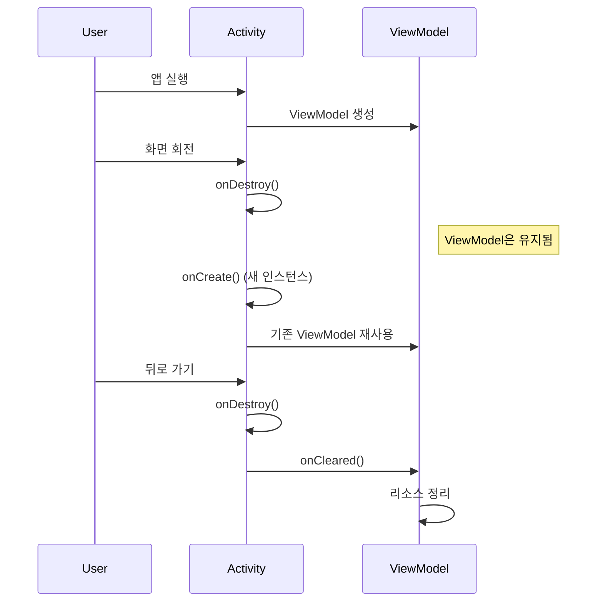

## Android ViewModel

ViewModel 은 Android Jetpack 의 핵심 아키텍처 컴포넌트로, **UI 상태를 관리하고 설정 변경에서 살아남는** 클래스다. UI 로직과 비즈니스 로직을 분리하여 테스트 가능하고 유지보수하기 쉬운 코드를 작성할 수 있다.

### ViewModel 의 목적

#### 1. 설정 변경에서 데이터 유지

화면 회전, 언어 변경 등으로 Activity 가 재생성될 때 ViewModel 의 데이터는 유지된다.

```kotlin
// ❌ 나쁜 예: Activity에서 직접 데이터 관리
class MainActivity : AppCompatActivity() {
    private var users: List<User> = emptyList() // 화면 회전 시 사라짐!
    
    override fun onCreate(savedInstanceState: Bundle?) {
        super.onCreate(savedInstanceState)
        loadUsers() // 회전할 때마다 다시 로드
    }
}

// ✅ 좋은 예: ViewModel 사용
class UserViewModel : ViewModel() {
    private val _users = MutableLiveData<List<User>>()
    val users: LiveData<List<User>> = _users
    // 설정 변경 시에도 데이터 유지됨
}

class MainActivity : AppCompatActivity() {
    private val viewModel: UserViewModel by viewModels()
    
    override fun onCreate(savedInstanceState: Bundle?) {
        super.onCreate(savedInstanceState)
        // 처음 생성 시에만 로드, 이후 회전 시에는 기존 ViewModel 재사용
        if (savedInstanceState == null) {
            viewModel.loadUsers()
        }
    }
}
```

#### 2. UI 와 비즈니스 로직 분리

Activity/Fragment 는 UI 표시에만 집중하고, 데이터 로직은 ViewModel 이 담당한다.

```kotlin
class UserViewModel(
    private val repository: UserRepository
) : ViewModel() {
    // 비즈니스 로직
    private val _uiState = MutableStateFlow<UiState>(UiState.Loading)
    val uiState: StateFlow<UiState> = _uiState.asStateFlow()
    
    fun loadUsers() {
        viewModelScope.launch {
            _uiState.value = UiState.Loading
            try {
                val users = repository.getUsers()
                _uiState.value = UiState.Success(users)
            } catch (e: Exception) {
                _uiState.value = UiState.Error(e.message)
            }
        }
    }
}

// Activity는 UI만 담당
class UserListActivity : AppCompatActivity() {
    private val viewModel: UserViewModel by viewModels()
    
    override fun onCreate(savedInstanceState: Bundle?) {
        super.onCreate(savedInstanceState)
        
        lifecycleScope.launch {
            viewModel.uiState.collect { state ->
                when (state) {
                    is UiState.Loading -> showLoading()
                    is UiState.Success -> showUsers(state.users)
                    is UiState.Error -> showError(state.message)
                }
            }
        }
    }
}
```

#### 3. 메모리 누수 방지

Activity 가 종료되면 ViewModel 도 자동으로 정리되어 메모리 누수를 방지한다.

### ViewModel 생명주기

ViewModel 은 Activity/Fragment 의 생명주기보다 길게 살아남는다.



**주요 특징:**
- Activity 가 `finish()` 되거나 Fragment 가 제거될 때만 `onCleared()` 호출
- 설정 변경으로 재생성될 때는 ViewModel 이 유지됨
- `onCleared()` 에서 코루틴 취소, 리스너 정리 등 수행

```kotlin
class MyViewModel : ViewModel() {
    private val job = Job()
    private val scope = CoroutineScope(Dispatchers.IO + job)
    
    override fun onCleared() {
        super.onCleared()
        // ViewModel이 완전히 제거될 때 호출
        job.cancel()
        Log.d("ViewModel", "Cleared")
    }
}
```

### 기본 구현

#### View 시스템에서 사용

```kotlin
// 1. ViewModel 정의
class UserViewModel : ViewModel() {
    private val _users = MutableLiveData<List<User>>()
    val users: LiveData<List<User>> = _users
    
    private val _isLoading = MutableLiveData<Boolean>()
    val isLoading: LiveData<Boolean> = _isLoading
    
    fun loadUsers() {
        viewModelScope.launch {
            _isLoading.value = true
            try {
                val result = fetchUsersFromApi()
                _users.value = result
            } finally {
                _isLoading.value = false
            }
        }
    }
}

// 2. Activity에서 사용
class UserActivity : AppCompatActivity() {
    private val viewModel: UserViewModel by viewModels()
    
    override fun onCreate(savedInstanceState: Bundle?) {
        super.onCreate(savedInstanceState)
        setContentView(R.layout.activity_user)
        
        // LiveData 관찰
        viewModel.users.observe(this) { users ->
            updateUI(users)
        }
        
        viewModel.isLoading.observe(this) { isLoading ->
            progressBar.isVisible = isLoading
        }
        
        loadButton.setOnClickListener {
            viewModel.loadUsers()
        }
    }
}

// 3. Fragment에서 사용
class UserFragment : Fragment() {
    // Fragment의 생명주기에 맞춘 ViewModel
    private val viewModel: UserViewModel by viewModels()
    
    // 또는 Activity와 공유하는 ViewModel
    private val sharedViewModel: SharedViewModel by activityViewModels()
    
    override fun onViewCreated(view: View, savedInstanceState: Bundle?) {
        viewModel.users.observe(viewLifecycleOwner) { users ->
            // viewLifecycleOwner 사용 필수!
            updateUI(users)
        }
    }
}
```

#### Jetpack Compose 에서 사용

```kotlin
// 1. StateFlow 사용 (Compose 권장)
class UserViewModel : ViewModel() {
    private val _users = MutableStateFlow<List<User>>(emptyList())
    val users: StateFlow<List<User>> = _users.asStateFlow()
    
    private val _isLoading = MutableStateFlow(false)
    val isLoading: StateFlow<Boolean> = _isLoading.asStateFlow()
    
    fun loadUsers() {
        viewModelScope.launch {
            _isLoading.value = true
            try {
                _users.value = fetchUsersFromApi()
            } finally {
                _isLoading.value = false
            }
        }
    }
}

// 2. Composable에서 사용
@Composable
fun UserScreen(
    viewModel: UserViewModel = viewModel()
) {
    // StateFlow를 Compose State로 변환
    val users by viewModel.users.collectAsStateWithLifecycle()
    val isLoading by viewModel.isLoading.collectAsStateWithLifecycle()
    
    Column {
        if (isLoading) {
            CircularProgressIndicator()
        }
        
        LazyColumn {
            items(users) { user ->
                UserItem(user = user)
            }
        }
        
        Button(onClick = { viewModel.loadUsers() }) {
            Text("Load Users")
        }
    }
}

// 3. Navigation Compose에서 공유
@Composable
fun NavGraph() {
    val navController = rememberNavController()
    
    NavHost(navController, startDestination = "list") {
        composable("list") { backStackEntry ->
            // Navigation 스코프의 ViewModel
            val viewModel = viewModel<UserViewModel>(
                viewModelStoreOwner = backStackEntry
            )
            UserListScreen(viewModel)
        }
        
        composable("detail/{userId}") { backStackEntry ->
            // 같은 ViewModel 공유
            val viewModel = viewModel<UserViewModel>(
                viewModelStoreOwner = navController.getBackStackEntry("list")
            )
            UserDetailScreen(viewModel)
        }
    }
}
```

### SavedStateHandle

프로세스 사망 후에도 데이터를 복원할 수 있게 해주는 기능이다. [android-process-and-memory](../01_system_internals/android-process-and-memory.md) 참고.

```kotlin
class DetailViewModel(
    private val savedStateHandle: SavedStateHandle
) : ViewModel() {
    
    // 1. 간단한 값 저장/복원
    var userId: String?
        get() = savedStateHandle.get<String>("user_id")
        set(value) = savedStateHandle.set("user_id", value)
    
    // 2. LiveData로 사용
    val userIdLiveData: LiveData<String> = savedStateHandle.getLiveData("user_id")
    
    // 3. StateFlow로 사용
    val userIdFlow: StateFlow<String?> = savedStateHandle.getStateFlow("user_id", null)
    
    // 4. 복잡한 객체도 저장 가능 (Parcelable/Serializable)
    var user: User?
        get() = savedStateHandle.get<User>("user")
        set(value) = savedStateHandle.set("user", value)
    
    fun loadUser(id: String) {
        userId = id // 자동으로 SavedStateHandle에 저장
        viewModelScope.launch {
            val result = repository.getUser(id)
            user = result // 프로세스 사망 후에도 복원됨
        }
    }
}

// Activity/Fragment에서 사용 (별도 설정 불필요)
class DetailActivity : AppCompatActivity() {
    private val viewModel: DetailViewModel by viewModels()
    // SavedStateHandle이 자동으로 주입됨
}
```

**SavedStateHandle vs onSaveInstanceState:**

| SavedStateHandle | onSaveInstanceState |
|-----------------|---------------------|
| ViewModel 내부에서 사용 | Activity/Fragment 에서 사용 |
| 자동으로 저장/복원 | 수동으로 Bundle 처리 |
| 타입 안전 | Bundle 로 타입 캐스팅 필요 |
| 권장 방식 | 레거시 방식 |

### ViewModelScope 와 코루틴

`viewModelScope` 는 ViewModel 의 생명주기에 맞춰 자동으로 취소되는 코루틴 스코프다.

```kotlin
class UserViewModel : ViewModel() {
    
    fun loadUsers() {
        // ✅ viewModelScope 사용 (권장)
        viewModelScope.launch {
            // ViewModel.onCleared() 시 자동 취소
            val users = repository.getUsers()
        }
    }
    
    // ❌ GlobalScope 사용 금지
    fun loadUsersWrong() {
        GlobalScope.launch {
            // 절대 취소되지 않아 메모리 누수 발생!
        }
    }
    
    // 여러 코루틴 동시 실행
    fun loadAllData() {
        viewModelScope.launch {
            val users = async { repository.getUsers() }
            val posts = async { repository.getPosts() }
            
            // 병렬 실행 후 결과 조합
            val allData = awaitAll(users, posts)
        }
    }
    
    // 에러 처리
    fun loadUsersWithErrorHandling() {
        viewModelScope.launch {
            try {
                val users = repository.getUsers()
                _users.value = users
            } catch (e: Exception) {
                _error.value = e.message
            }
        }
    }
}
```

### 상태 관리: LiveData vs StateFlow

#### LiveData (View 시스템 권장)

```kotlin
class UserViewModel : ViewModel() {
    private val _users = MutableLiveData<List<User>>()
    val users: LiveData<List<User>> = _users
    
    // Transformations
    val userCount: LiveData<Int> = Transformations.map(users) { it.size }
    
    val firstUser: LiveData<User?> = Transformations.switchMap(users) { list ->
        liveData { emit(list.firstOrNull()) }
    }
    
    // MediatorLiveData (여러 소스 결합)
    val combinedData = MediatorLiveData<String>().apply {
        addSource(users) { value = combineData() }
        addSource(posts) { value = combineData() }
    }
}
```

**장점:**
- 생명주기 자동 인식 (Activity 가 백그라운드면 업데이트 안 함)
- 메인 스레드에서만 관찰 가능
- 간단한 API

**단점:**
- 초기값 설정 불가
- 코루틴과의 통합이 약함

#### StateFlow (Compose 권장)

```kotlin
class UserViewModel : ViewModel() {
    private val _users = MutableStateFlow<List<User>>(emptyList())
    val users: StateFlow<List<User>> = _users.asStateFlow()
    
    // 초기값 필수
    private val _uiState = MutableStateFlow<UiState>(UiState.Loading)
    val uiState: StateFlow<UiState> = _uiState.asStateFlow()
    
    // Flow 연산자 사용
    val userCount: StateFlow<Int> = users
        .map { it.size }
        .stateIn(viewModelScope, SharingStarted.Lazily, 0)
    
    // combine으로 여러 Flow 결합
    val combinedState: StateFlow<CombinedState> = combine(
        users,
        posts,
        isLoading
    ) { users, posts, loading ->
        CombinedState(users, posts, loading)
    }.stateIn(viewModelScope, SharingStarted.Lazily, CombinedState())
}

// Activity에서 수집
lifecycleScope.launch {
    repeatOnLifecycle(Lifecycle.State.STARTED) {
        viewModel.users.collect { users ->
            // STARTED 상태일 때만 수집
        }
    }
}

// Compose에서 수집
@Composable
fun UserScreen(viewModel: UserViewModel = viewModel()) {
    val users by viewModel.users.collectAsStateWithLifecycle()
    // 생명주기 인식하며 자동 수집/취소
}
```

**장점:**
- 초기값 설정 가능
- 코루틴 Flow API 활용 가능
- Compose 와 완벽 통합
- cold stream 을 hot stream 으로 변환

**단점:**
- 생명주기 자동 인식 안 함 (직접 처리 필요)

### Factory 패턴

ViewModel 에 파라미터를 전달해야 할 때 사용한다.

```kotlin
// 1. ViewModelProvider.Factory 구현
class UserViewModelFactory(
    private val userId: String,
    private val repository: UserRepository
) : ViewModelProvider.Factory {
    override fun <T : ViewModel> create(modelClass: Class<T>): T {
        if (modelClass.isAssignableFrom(UserViewModel::class.java)) {
            @Suppress("UNCHECKED_CAST")
            return UserViewModel(userId, repository) as T
        }
        throw IllegalArgumentException("Unknown ViewModel class")
    }
}

class UserViewModel(
    private val userId: String,
    private val repository: UserRepository
) : ViewModel() {
    // userId 사용
}

// Activity에서 사용
class UserActivity : AppCompatActivity() {
    private val viewModel: UserViewModel by viewModels {
        UserViewModelFactory("user123", userRepository)
    }
}

// 2. SavedStateHandle과 함께 사용
class UserViewModelFactory(
    owner: SavedStateRegistryOwner,
    defaultArgs: Bundle? = null
) : AbstractSavedStateViewModelFactory(owner, defaultArgs) {
    override fun <T : ViewModel> create(
        key: String,
        modelClass: Class<T>,
        handle: SavedStateHandle
    ): T {
        if (modelClass.isAssignableFrom(UserViewModel::class.java)) {
            @Suppress("UNCHECKED_CAST")
            return UserViewModel(handle, repository) as T
        }
        throw IllegalArgumentException("Unknown ViewModel class")
    }
}

// 3. Hilt 사용 (권장)
@HiltViewModel
class UserViewModel @Inject constructor(
    private val repository: UserRepository,
    private val savedStateHandle: SavedStateHandle
) : ViewModel() {
    // 의존성 자동 주입
}

@AndroidEntryPoint
class UserActivity : AppCompatActivity() {
    private val viewModel: UserViewModel by viewModels()
    // Hilt가 자동으로 Factory 생성
}
```

더 자세한 내용은 [android-dependency-injection](android-dependency-injection.md) 참고.

### 모범 사례

#### 1. ViewModel 은 Android 프레임워크 참조 금지

```kotlin
// ❌ 나쁜 예
class BadViewModel(private val context: Context) : ViewModel() {
    fun showToast() {
        Toast.makeText(context, "Message", Toast.LENGTH_SHORT).show()
    }
}

// ✅ 좋은 예
class GoodViewModel : ViewModel() {
    private val _showToast = MutableLiveData<String>()
    val showToast: LiveData<String> = _showToast
    
    fun triggerToast() {
        _showToast.value = "Message"
    }
}

class MyActivity : AppCompatActivity() {
    override fun onCreate(savedInstanceState: Bundle?) {
        viewModel.showToast.observe(this) { message ->
            Toast.makeText(this, message, Toast.LENGTH_SHORT).show()
        }
    }
}
```

**예외:** `AndroidViewModel` 은 `Application` 컨텍스트를 받을 수 있음

```kotlin
class MyViewModel(application: Application) : AndroidViewModel(application) {
    private val context: Context
        get() = getApplication()
    
    // Application 컨텍스트는 메모리 누수 없음
    fun getString(resId: Int): String {
        return context.getString(resId)
    }
}
```

#### 2. UI 상태는 불변 객체로 관리

```kotlin
// ✅ 좋은 예: 불변 상태 객체
data class UiState(
    val users: List<User> = emptyList(),
    val isLoading: Boolean = false,
    val error: String? = null
)

class UserViewModel : ViewModel() {
    private val _uiState = MutableStateFlow(UiState())
    val uiState: StateFlow<UiState> = _uiState.asStateFlow()
    
    fun loadUsers() {
        _uiState.value = _uiState.value.copy(isLoading = true)
        viewModelScope.launch {
            try {
                val users = repository.getUsers()
                _uiState.value = _uiState.value.copy(
                    users = users,
                    isLoading = false
                )
            } catch (e: Exception) {
                _uiState.value = _uiState.value.copy(
                    isLoading = false,
                    error = e.message
                )
            }
        }
    }
}

// Compose에서 사용
@Composable
fun UserScreen(viewModel: UserViewModel = viewModel()) {
    val uiState by viewModel.uiState.collectAsStateWithLifecycle()
    
    when {
        uiState.isLoading -> LoadingView()
        uiState.error != null -> ErrorView(uiState.error!!)
        else -> UserList(uiState.users)
    }
}
```

#### 3. One-time event 처리

```kotlin
// LiveData로 일회성 이벤트 처리 (추천하지 않음)
class EventViewModel : ViewModel() {
    private val _navigationEvent = MutableLiveData<Event<String>>()
    val navigationEvent: LiveData<Event<String>> = _navigationEvent
    
    fun navigateToDetail() {
        _navigationEvent.value = Event("detail")
    }
}

// Event wrapper class
class Event<out T>(private val content: T) {
    private var hasBeenHandled = false
    
    fun getContentIfNotHandled(): T? {
        return if (hasBeenHandled) {
            null
        } else {
            hasBeenHandled = true
            content
        }
    }
}

// ✅ Channel 사용 (권장)
class EventViewModel : ViewModel() {
    private val _navigationEvents = Channel<String>()
    val navigationEvents = _navigationEvents.receiveAsFlow()
    
    fun navigateToDetail() {
        viewModelScope.launch {
            _navigationEvents.send("detail")
        }
    }
}

// Activity에서 수집
lifecycleScope.launch {
    repeatOnLifecycle(Lifecycle.State.STARTED) {
        viewModel.navigationEvents.collect { destination ->
            // 한 번만 처리됨
            navigate(destination)
        }
    }
}
```

#### 4. Repository 패턴과 함께 사용

```kotlin
// Repository
class UserRepository(
    private val api: ApiService,
    private val dao: UserDao
) {
    fun getUsers(): Flow<List<User>> = flow {
        emit(dao.getAll().first()) // 캐시 먼저
        val fresh = api.getUsers()  // 네트워크에서 최신 데이터
        dao.insertAll(fresh)
        emit(fresh)
    }
}

// ViewModel
class UserViewModel(
    private val repository: UserRepository
) : ViewModel() {
    val users: StateFlow<List<User>> = repository.getUsers()
        .stateIn(
            scope = viewModelScope,
            started = SharingStarted.WhileSubscribed(5000),
            initialValue = emptyList()
        )
}
```

### 안티패턴

```kotlin
// ❌ 1. ViewModel에서 다른 ViewModel 참조
class BadViewModel(private val otherViewModel: OtherViewModel) : ViewModel()

// ✅ 대신 공유 Repository 사용
class GoodViewModel(private val repository: SharedRepository) : ViewModel()

// ❌ 2. ViewModel에서 View 참조
class BadViewModel : ViewModel() {
    lateinit var textView: TextView // 메모리 누수!
}

// ✅ LiveData/StateFlow로 데이터 전달
class GoodViewModel : ViewModel() {
    val text = MutableLiveData<String>()
}

// ❌ 3. ViewModel에서 Activity/Fragment 참조
class BadViewModel(private val activity: Activity) : ViewModel()

// ✅ AndroidViewModel로 Application 컨텍스트만 사용
class GoodViewModel(application: Application) : AndroidViewModel(application)

// ❌ 4. ViewModel에 비즈니스 로직 과다
class BadViewModel : ViewModel() {
    fun complexBusinessLogic() { /* 너무 복잡 */ }
}

// ✅ UseCase/Repository로 분리
class GoodViewModel(private val useCase: GetUsersUseCase) : ViewModel() {
    fun loadUsers() = viewModelScope.launch {
        useCase() // 비즈니스 로직은 UseCase에
    }
}
```

### 디버깅

```kotlin
class DebugViewModel : ViewModel() {
    init {
        Log.d("ViewModel", "Created: ${this.hashCode()}")
    }
    
    override fun onCleared() {
        super.onCleared()
        Log.d("ViewModel", "Cleared: ${this.hashCode()}")
    }
}

// Activity
class MainActivity : AppCompatActivity() {
    private val viewModel: DebugViewModel by viewModels()
    
    override fun onCreate(savedInstanceState: Bundle?) {
        super.onCreate(savedInstanceState)
        Log.d("Activity", "ViewModel hash: ${viewModel.hashCode()}")
        // 화면 회전해도 같은 해시코드 출력됨
    }
}
```

### 테스팅

```kotlin
class UserViewModelTest {
    private lateinit var viewModel: UserViewModel
    private lateinit var repository: FakeUserRepository
    
    @Before
    fun setup() {
        repository = FakeUserRepository()
        viewModel = UserViewModel(repository)
    }
    
    @Test
    fun `loadUsers updates state correctly`() = runTest {
        // Given
        val expectedUsers = listOf(User("1", "John"))
        repository.setUsers(expectedUsers)
        
        // When
        viewModel.loadUsers()
        
        // Then
        val state = viewModel.uiState.value
        assertEquals(expectedUsers, state.users)
        assertEquals(false, state.isLoading)
    }
    
    @Test
    fun `loadUsers handles error`() = runTest {
        // Given
        repository.setShouldFail(true)
        
        // When
        viewModel.loadUsers()
        
        // Then
        val state = viewModel.uiState.value
        assertNotNull(state.error)
        assertEquals(false, state.isLoading)
    }
}
```

더 자세한 내용은 [android-testing-and-quality](../06_testing_performance/android-testing-and-quality.md) 참고.

### 더 보기

[android-app-components-deep-dive](android-app-components-deep-dive.md), [android-jetpack-architecture](android-jetpack-architecture.md), [android-compose-internals](android-compose-internals.md), [android-dependency-injection](android-dependency-injection.md), [android-process-and-memory](../01_system_internals/android-process-and-memory.md), [android-testing-and-quality](../06_testing_performance/android-testing-and-quality.md)
