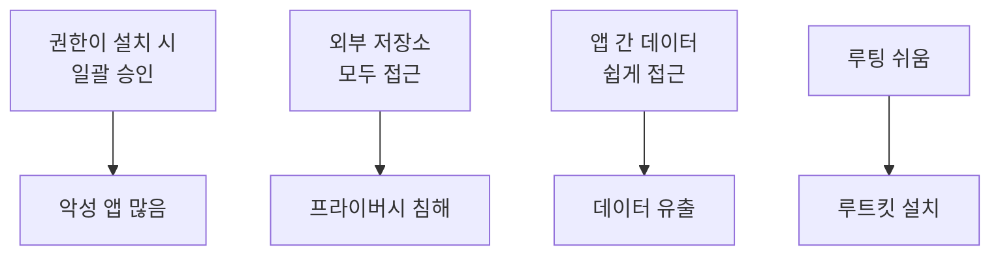
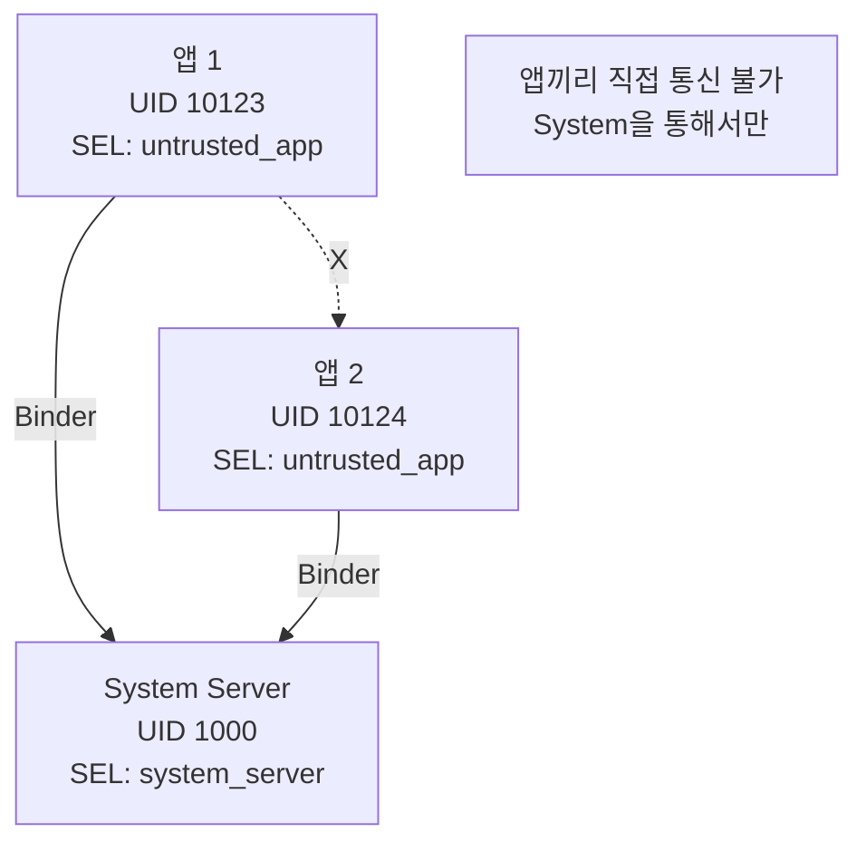
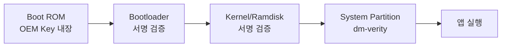

## Android Security 와 Sandboxing

안드로이드 보안 모델은 **Defense in Depth(다층 방어)** 원칙을 따른다. 앱 샌드박싱, 권한 시스템, [SELinux](../../../../selinux.md), 암호화, Verified Boot 등 여러 계층의 보안 메커니즘이 협력하여 사용자 데이터와 시스템을 보호한다. 모바일 환경의 특성상 ― 신뢰할 수 없는 써드파티 앱 수백만 개, 분실/도난 위험, 다양한 공격 벡터 ― 때문에 매우 정교한 보안 아키텍처가 필요하다.

### 왜 안드로이드는 특별한 보안이 필요한가

#### 모바일 환경의 위협 (2000 년대 후반~현재)

**데스크톱과의 차이**:

1. **신뢰할 수 없는 앱 생태계**:
   - Play Store: 수백만 개 앱, 매일 수천 개 신규 등록
   - 악의적 앱, 스파이웨어, 애드웨어 혼재
   - 사용자는 앱 내부를 알 수 없음

2. **민감한 개인정보 집중**:
   - 연락처, 위치, 사진, 메시지, 통화 기록
   - 금융 앱 (은행, 결제)
   - 생체인증 데이터

3. **물리적 접근 위험**:
   - 분실, 도난
   - 공격자가 디바이스를 물리적으로 소유

4. **다양한 공격 벡터**:
   - 네트워크 (공용 Wi-Fi)
   - USB (Juice Jacking)
   - NFC
   - 블루투스

#### 초기 안드로이드의 취약점 (Android 1.0~2.3)



---

## 핵심 보안 메커니즘 진화

### Timeline: 보안 기능 도입

| Android 버전 | 주요 보안 기능 |
|-------------|----------------|
| **1.0** (2008) | UID 기반 샌드박싱, 권한 시스템 |
| **3.0** (2011) | 전체 디스크 암호화 |
| **4.3** (2013) | [SELinux](../../../../selinux.md) (permissive) |
| **5.0** (2014) | SELinux enforcing, Smart Lock |
| **6.0** (2015) | **런타임 권한**, 지문인증 API |
| **7.0** (2016) | 파일 기반 암호화 (FBE), Direct Boot |
| **8.0** (2017) | Treble, GMS Integrity |
| **9.0** (2018) | BiometricPrompt API |
| **10** (2019) | **Scoped Storage**, Background Location 제한 |
| **11** (2020) | 일회성 권한, 자동 권한 리셋 |
| **12** (2021) | Approximate Location |
| **13** (2022) | Photo Picker, 알림 권한 |
| **14** (2023) | Credential Manager |

---

## 앱 샌드박싱

### UID 기반 격리

**핵심 원칙**: 각 앱은 **독립된 Linux UID**를 받는다.

```bash
$ adb shell ps -A | grep -E "u0_a[0-9]+"

u0_a123  12345  1234  com.example.app1
u0_a124  12346  1234  com.example.app2
u0_a125  12347  1234  com.google.android.gms
```

- `u0`: 사용자 0 (primary user)
- `a123`: 앱 UID (10123 = 10000 + 123)

**UID 범위**:
```
10000-19999: 일반 앱 (User 0)
20000-29999: 격리 프로세스 (isolated process)
1000-9999:   시스템 서비스
```

### 파일 시스템 격리

각 앱의 데이터 디렉토리:

```bash
/data/data/com.example.app/
drwx------  10  u0_a123  u0_a123  files/
drwx------   2  u0_a123  u0_a123  cache/
drwx------   5  u0_a123  u0_a123  code_cache/
drwx------   2  u0_a123  u0_a123  databases/
```

**권한**: `rwx------` (700) → 오직 소유 UID 만 접근 가능

**다른 앱이 접근 시도**:
```bash
$ adb shell
$ run-as com.example.app2  # UID u0_a124
$ cat /data/data/com.example.app1/databases/data.db
# Permission denied
```

### 프로세스 간 격리

[UID 기반](../../../../cpu-privilege-levels.md) + [SELinux](../../../../selinux.md) + Seccomp:



---

## 권한 시스템

### 설치 시 권한 (Android 5.x 이하)

```xml
<!-- AndroidManifest.xml -->
<uses-permission android:name="android.permission.CAMERA" />
<uses-permission android:name="android.permission.READ_CONTACTS" />
```

**문제**: 설치 시 모든 권한 일괄 승인 → 사용자가 잘 모르고 승인

### 런타임 권한 (Android 6.0+)

**위험 권한**은 실행 중 요청:

```java
// 권한 확인
if (checkSelfPermission(CAMERA) != PERMISSION_GRANTED) {
    // 권한 요청 다이얼로그
    requestPermissions(new String[]{CAMERA}, REQUEST_CODE);
}

@Override
public void onRequestPermissionsResult(int requestCode, String[] permissions, 
                                       int[] grantResults) {
    if (grantResults[0] == PERMISSION_GRANTED) {
        // 권한 획득
    }
}
```

**사용자 경험**:
```
[앱 이름] needs camera access
[ ] Don't ask again
[Deny] [Allow]
```

### 권한 그룹

| 그룹 | 포함 권한 |
|------|----------|
| **CAMERA** | CAMERA |
| **LOCATION** | ACCESS_FINE_LOCATION, ACCESS_COARSE_LOCATION |
| **MICROPHONE** | RECORD_AUDIO |
| **CONTACTS** | READ_CONTACTS, WRITE_CONTACTS, GET_ACCOUNTS |
| **PHONE** | READ_PHONE_STATE, CALL_PHONE, READ_CALL_LOG |
| **STORAGE** | READ_EXTERNAL_STORAGE, WRITE_EXTERNAL_STORAGE |

한 권한 허용 시 같은 그룹 다른 권한도 자동 허용 (Android 10 까지).

### 세분화된 권한 제어 (Android 11+)

**일회성 권한**:
```
[앱] needs location
[Deny] [Only this time] [While using the app] [Allow]
```

**자동 리셋**:
- 앱을 오래 사용 안 하면 (3 개월) 권한 자동 해제
- 다음 실행 시 재요청

**백그라운드 위치** (별도 승인):
```kotlin
// Foreground 위치 권한
requestPermissions(ACCESS_FINE_LOCATION)

// Background 위치는 별도
requestPermissions(ACCESS_BACKGROUND_LOCATION)
```

### AppOps

권한보다 세밀한 제어:

```bash
# 특정 앱의 AppOps 확인
adb shell appops get com.example.app

# 출력:
# COARSE_LOCATION: allow
# FINE_LOCATION: allow; time=+2d3h15m (running)
# CAMERA: allow; time=+5h30m
```

**제어 가능한 항목**:
- 언제 권한 사용했는지
- 포그라운드/백그라운드 구분
- 빈도 제한

---

## [SELinux](../../../../selinux.md) 통합

### 앱 도메인

```bash
# 일반 앱
u:r:untrusted_app:s0:c512,c768

# 시스템 앱 (/system/app)
u:r:system_app:s0

# 플랫폼 서명 앱
u:r:platform_app:s0

# 격리 프로세스
u:r:isolated_app:s0
```

**카테고리** (c512, c768):
- 앱마다 고유한 MLS 카테고리
- 같은 앱의 프로세스들만 같은 카테고리
- 다른 앱 데이터 접근 차단

### SELinux 정책 예시

```bash
# untrusted_app이 할 수 있는 것
allow untrusted_app app_data_file:file { read write };
allow untrusted_app sdcard_type:file { read write };
allow untrusted_app system_server:binder call;

# 할 수 없는 것
neverallow untrusted_app system_data_file:file write;
neverallow untrusted_app kernel:security *;
neverallow untrusted_app init:process signal;
```

**효과**:
- 루트 권한 획득해도 SELinux 가 차단
- 시스템 파일 수정 불가
- 다른 앱 공격 불가

---

## 저장소 보안

### Scoped Storage (Android 10+)

**문제 (Android 9 이하)**:
```
앱이 READ_EXTERNAL_STORAGE 권한만 있으면
→ 모든 사진, 문서, 다운로드 파일 읽기 가능
→ 프라이버시 침해
```

**Scoped Storage**:

```mermaid
graph TB
    App[앱] --> OwnDir[자신의 디렉토리<br/>/sdcard/Android/data/com.example]
    App -.권한 필요.-> MediaStore[MediaStore API<br/>사진/비디오/오디오]
    App -.SAF.-> SAF[Storage Access Framework<br/>파일 선택기]
    
    App -.X.-> OtherDir[다른 앱 디렉토리]
    App -.X.-> RootFiles[/sdcard/Download 직접 접근]
```

**코드 변화**:

```java
// Android 9: 직접 파일 접근
File file = new File("/sdcard/DCIM/photo.jpg");
Bitmap bitmap = BitmapFactory.decodeFile(file.getAbsolutePath());

// Android 10+: MediaStore
Uri uri = MediaStore.Images.Media.EXTERNAL_CONTENT_URI;
Cursor cursor = getContentResolver().query(uri, projection, selection, null, null);
// ...
```

### 파일 기반 암호화 (FBE)

**전체 디스크 암호화 (FDE, ~Android 6.x)** 문제:
- 부팅 시 비밀번호 입력 전까지 모든 데이터 접근 불가
- 알람, 전화 수신 불가

**FBE (Android 7.0+)**:

```
/data/
├─ user/          # 사용자 잠금 시 암호화
│  └─ 0/com.example/files/
└─ user_de/       # Device Encrypted (항상 복호화)
   └─ 0/com.example/files/
```

**Direct Boot**:
- 디바이스 부팅 → FDE 복호화 (비밀번호 불필요)
- 알람, 전화 앱은 `user_de` 에 데이터 저장 → 작동
- 사용자 잠금 해제 → CE (Credential Encrypted) 복호화

```java
// CE Storage (기본)
File ceDir = context.getFilesDir();

// DE Storage
Context deContext = context.createDeviceProtectedStorageContext();
File deDir = deContext.getFilesDir();
```

### 암호화 알고리즘

**FBE**:
- Metadata: AES-256-XTS
- Contents: AES-256-XTS 또는 Adiantum (저사양 기기)

**키 파생**:
```
사용자 비밀번호 → scrypt(password, salt) → 마스터 키 → 파일 암호화 키
```

**Hardware-backed Keystore**:
- 키는 TEE (Trusted Execution Environment)에 저장
- 소프트웨어로 추출 불가

---

## Verified Boot

### 부팅 체인 검증



### dm-verity

**목적**: 시스템 파티션 무결성 보장

**동작**:
1. 빌드 시 `/system` 파티션의 해시 트리 생성
2. 루트 해시를 bootloader 에 저장
3. 런타임에 블록 읽을 때마다 해시 검증

```
Block → Hash → 부모 Hash → ... → Root Hash (Bootloader에 저장)
```

**변조 시도**:
```
공격자가 /system/app/Settings.apk 수정
→ dm-verity 해시 불일치 감지
→ 부팅 실패 or 경고 화면
```

### Verified Boot States

- **Green**: 완전히 검증됨
- **Yellow**: 부팅 가능하지만 사용자 키로 서명 (커스텀 ROM)
- **Orange**: Bootloader 언락됨 (개발자 모드)
- **Red**: 검증 실패 (부팅 차단)

---

## 네트워크 보안

### Network Security Configuration

```xml
<!-- res/xml/network_security_config.xml -->
<network-security-config>
    <!-- 기본: HTTPS만 -->
    <base-config cleartextTrafficPermitted="false">
        <trust-anchors>
            <certificates src="system" />
        </trust-anchors>
    </base-config>
    
    <!-- 예외: 특정 도메인만 HTTP 허용 -->
    <domain-config cleartextTrafficPermitted="true">
        <domain includeSubdomains="true">example.com</domain>
    </domain-config>
</network-security-config>
```

**AndroidManifest.xml**:
```xml
<application
    android:networkSecurityConfig="@xml/network_security_config">
```

### Certificate Pinning

```xml
<network-security-config>
    <domain-config>
        <domain>example.com</domain>
        <pin-set>
            <pin digest="SHA-256">7HIpactkIAq2Y49orFOOQKurWxmmSFZhBCoQYcRhJ3Y=</pin>
            <!-- Backup pin -->
            <pin digest="SHA-256">fwza0LRMXouZHRC8Ei+4PyuldPDcf3UKgO/04cDM1oE=</pin>
        </pin-set>
    </domain-config>
</network-security-config>
```

**효과**: 중간자 공격(MITM) 차단

### Private DNS (DNS-over-TLS)

```
Settings → Network → Advanced → Private DNS
```

**기본값**: Automatic (dns.google 등)

---

## 생체 인증

### BiometricPrompt API

```kotlin
val promptInfo = BiometricPrompt.PromptInfo.Builder()
    .setTitle("Unlock with fingerprint")
    .setNegativeButtonText("Use password")
    .setAllowedAuthenticators(BIOMETRIC_STRONG or DEVICE_CREDENTIAL)
    .build()

biometricPrompt.authenticate(promptInfo)
```

**보안 등급**:
- **BIOMETRIC_STRONG** (Class 3): 지문, 얼굴 (1/50,000 오인식률)
- **BIOMETRIC_WEAK** (Class 2): 1/1,000 오인식률
- **DEVICE_CREDENTIAL**: PIN/패턴/비밀번호

### StrongBox Keymaster

**Titan M** (Pixel) 같은 별도 보안 칩:
- 생체 인증 템플릿 저장
- 암호화 키 저장
- 소프트웨어로 절대 추출 불가

```kotlin
val keyGenParameterSpec = KeyGenParameterSpec.Builder(...)
    .setIsStrongBoxBacked(true)  // Titan M 사용
    .build()
```

---

## Play Integrity API

### 기기 무결성 검증

```kotlin
val integrityManager = IntegrityManagerFactory.create(context)
val request = IntegrityTokenRequest.builder()
    .setCloudProjectNumber(PROJECT_NUMBER)
    .build()

integrityManager.requestIntegrityToken(request)
    .addOnSuccessListener { response ->
        val token = response.token()
        // 서버로 전송하여 검증
    }
```

**서버 측 검증**:
```
MEETS_DEVICE_INTEGRITY: 신뢰할 수 있는 기기
MEETS_BASIC_INTEGRITY: 기본 무결성 (커스텀 ROM 가능)
MEETS_STRONG_INTEGRITY: Google 인증 기기
```

**용도**:
- 게임 치팅 방지
- 금융 앱 보안
- DRM

---

## 개발자 모범 사례

### 보안 코딩

**1. 입력 검증**:
```kotlin
// 나쁜 예
val userId = intent.getStringExtra("user_id")
db.execSQL("SELECT * FROM users WHERE id = " + userId)  // SQL Injection!

// 좋은 예
val userId = intent.getStringExtra("user_id") ?: return
db.query("users", null, "id = ?", arrayOf(userId), null, null, null)
```

**2. 안전한 Intent**:
```kotlin
// Exported Component는 명시적으로
<activity
    android:name=".ExportedActivity"
    android:exported="true">
    <intent-filter>
        <action android:name="com.example.ACTION" />
    </intent-filter>
</activity>

// 내부 전용은 false
<activity
    android:name=".InternalActivity"
    android:exported="false" />
```

**3. PendingIntent**:
```kotlin
// Android 12+: 기본값 immutable
val pendingIntent = PendingIntent.getActivity(
    context, 0, intent, 
    PendingIntent.FLAG_IMMUTABLE  // 명시적으로
)
```

**4. 로그에 민감 정보 금지**:
```kotlin
// 나쁜 예
Log.d(TAG, "Password: $password")

// 좋은 예
Log.d(TAG, "Login attempt for user: ${username.take(3)}***")
```

---

## 디버깅 보안 이슈

### ADB 권한

```bash
# 앱 권한 강제 부여 (테스트용)
adb shell pm grant com.example.app android.permission.CAMERA

# AppOps 덮어쓰기
adb shell appops set com.example.app CAMERA allow
```

### SELinux 로그

```bash
# 거부된 접근
adb logcat | grep avc

# 출력:
# avc: denied { read } for scontext=u:r:untrusted_app:s0 \
#      tcontext=u:object_r:system_data_file:s0
```

### 네트워크 인터셉트

**개발 빌드에서만**:
```xml
<network-security-config>
    <debug-overrides>
        <trust-anchors>
            <certificates src="user" />  <!-- Charles, Fiddler -->
        </trust-anchors>
    </debug-overrides>
</network-security-config>
```

---

## 학습 리소스

**공식 문서**:
- [Security Overview](../../../../https:/source.android.com/docs/security.md)
- [App Sandboxing](../../../../https:/source.android.com/docs/security/app-sandbox.md)
- [Permissions](../../../../https:/developer.android.com/guide/topics/permissions/overview.md)

**보안 테스트**:
- [Android Security Checklist](../../../../https:/developer.android.com/privacy-and-security/security-checklist.md)
- OWASP Mobile Top 10

**도구**:
- `adb shell pm list permissions`: 모든 권한
- `adb shell dumpsys package <pkg>`: 앱 권한 상태
- Frida, Objection: 동적 분석

---

## 연결 문서

[selinux](../../../../selinux.md) - SELinux 정책 상세

[android-kernel](../01_system_internals/android-kernel.md) - 커널 보안 (SELinux, Seccomp)

[cpu-privilege-levels](../../../../cpu-privilege-levels.md) - UID 기반 격리

[android-binder-and-ipc](../01_system_internals/android-binder-and-ipc.md) - Binder 보안

[android-init-and-services](../01_system_internals/android-init-and-services.md) - Verified Boot 부팅 체인

[android-zygote-and-runtime](../01_system_internals/android-zygote-and-runtime.md) - 앱 프로세스 격리
