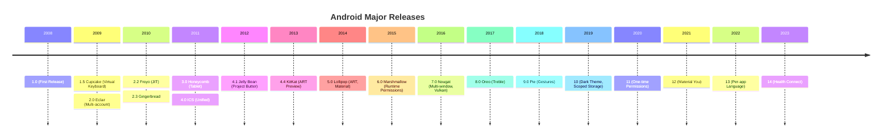

## Android 기술 진화

안드로이드는 2008 년 첫 출시 이후 모바일 환경의 변화에 맞춰 지속적으로 진화해왔다. 이 문서는 주요 기술적 전환점과 그 배경을 정리한다.

### Timeline



---

## 주요 기술 전환

### 런타임: Dalvik → ART (2014)

**배경**:
- Dalvik (2008-2013): JIT (Just-In-Time) 컴파일
- 앱 시작 시마다 컴파일 → 느린 시작
- 배터리 소모

**ART (Android Runtime)**:
- Android 4.4 (2013): 옵션으로 제공
- Android 5.0 (2014): 기본값

**장점**:
```
Dalvik (JIT):
  앱 시작 → DEX 해석 → 느림
  
ART (AOT):
  설치 시 → Native 코드 컴파일 → 빠른 시작
  
ART (현대, Profile-Guided):
  설치 → 부분 컴파일
  사용 → 프로파일 수집
  유휴 시 → 최적화 컴파일
```

**성능 개선**:
- 앱 시작: 2 배 빨라짐
- 배터리: 15-20% 절약
- GC 개선: Stop-the-World → Concurrent

---

### 언어: Java → Kotlin (2017+)

**배경**:
- Java 6 (2008-2014): 람다 없음, verbose
- Oracle vs Google 소송 (2010-2021)

**Kotlin 공식 지원** (Google I/O 2017):
```kotlin
// Java (verbose)
button.setOnClickListener(new View.OnClickListener() {
    @Override
    public void onClick(View v) {
        // ...
    }
});

// Kotlin (concise)
button.setOnClickListener {
    // ...
}
```

**현재 상태** (2023):
- Google 공식 권장: Kotlin-first
- 신규 Jetpack 라이브러리: Kotlin 우선 설계
- Coroutine 으로 비동기 처리 간소화

---

### 배포: APK → App Bundle (2018)

**APK (Android Package)**:
- 모든 리소스/코드 포함
- 모든 기기에 동일한 파일 → 비효율

**AAB (Android App Bundle, 2018)**:
```
Before (APK):
  app-release.apk (50MB)
  ├─ arm64-v8a libs
  ├─ armeabi-v7a libs  ← 불필요 (기기가 arm64일 때)
  ├─ x86 libs          ← 불필요
  ├─ xxhdpi resources
  └─ xxxhdpi resources ← 불필요

After (AAB):
  Play Store가 기기별 APK 생성
  Pixel 6 Pro → arm64 + xxxhdpi만 (30MB)
```

**효과**:
- 평균 15% 크기 감소
- Dynamic Feature Module 지원

---

### HAL: HIDL → AIDL (2019+)

**HIDL (Hardware Interface Definition Language, 2017)**:
```cpp
// HIDL (C++ 전용)
interface ICameraDevice {
    open(ICameraDeviceCallback callback) generates (Status status);
};
```

**문제**:
- C++ 만 지원
- 복잡한 문법
- 버전 관리 어려움

**AIDL HAL (2019+)**:
```java
// AIDL (다중 언어)
interface ICameraDevice {
    void open(in ICameraDeviceCallback callback);
}
```

**장점**:
- Java/Rust 도 지원
- 간단한 문법 (기존 AIDL 과 유사)
- 더 나은 버전 호환성

---

### 보안: 권한 진화

**Phase 1: 설치 시 권한** (2008-2014)
```
설치 화면:
"이 앱은 다음 권한이 필요합니다"
- 연락처 읽기
- 위치 접근
- 카메라 사용

[설치] [취소]
```

**문제**: 사용자가 잘 모르고 승인

**Phase 2: 런타임 권한** (Android 6.0, 2015)
```kotlin
// 실행 중 요청
if (checkSelfPermission(CAMERA) != GRANTED) {
    requestPermissions(arrayOf(CAMERA), CODE)
}
```

**Phase 3: 세분화** (Android 10+)
- 2019: 백그라운드 위치 별도 승인
- 2020: 일회성 권한 ("한 번만 허용")
- 2021: 자동 권한 리셋 (미사용 앱)
- 2022: 알림 권한 (POST_NOTIFICATIONS)
- 2023: 대략적 위치 (APPROXIMATE_LOCATION)

---

### 저장소: 무제한 → Scoped Storage (2019)

**Phase 1: 무제한 접근** (~Android 9)
```java
// READ_EXTERNAL_STORAGE만 있으면
// /sdcard의 모든 파일 읽기 가능
File photo = new File("/sdcard/DCIM/photo.jpg");
```

**문제**:
- 프라이버시 침해 (모든 사진 접근 가능)
- 앱 삭제 후에도 잔여 파일

**Phase 2: Scoped Storage** (Android 10+)
```kotlin
// MediaStore API 사용 필수
val uri = MediaStore.Images.Media.EXTERNAL_CONTENT_URI
contentResolver.query(uri, ...) // 권한 있는 파일만
```

**Phase 3: Photo Picker** (Android 13, 2022)
```kotlin
// 시스템 UI로 사진 선택
val intent = Intent(MediaStore.ACTION_PICK_IMAGES)
startActivityForResult(intent, REQUEST_CODE)
// → READ_MEDIA_IMAGES 권한 불필요
```

---

### 업데이트: Non-A/B → Virtual A/B (2016-2020)

**Non-A/B** (~Android 6.x):
```
1. 업데이트 다운로드
2. Recovery 모드 재부팅
3. 설치 (10-20분, 사용 불가)
4. 재부팅
5. 완료
```

**A/B Seamless Update** (Android 7.0, 2016):
```
Slot A (현재 부팅)
  ├─ boot_a
  ├─ system_a
  └─ vendor_a

Slot B (업데이트 설치 중)
  ├─ boot_b   ← 백그라운드 다운로드
  ├─ system_b
  └─ vendor_b

재부팅 → Slot B 부팅 (빠름!)
실패 시 → Slot A 자동 롤백
```

**문제**: 2 배 저장 공간 필요

**Virtual A/B** (Android 11, 2020):
```
Slot A (실제 파티션)
Slot B (스냅샷, 변경된 부분만)
  → 공간 50% 절약
```

---

### Treble: System/Vendor 분리 (2017)

**Before Treble**:
```
/system
  ├─ framework
  ├─ vendor 코드 (섞여있음)
  └─ HAL 구현

업데이트 시 vendor 재빌드 필요 → 지연
```

**After Treble** (Android 8.0):
```
/system (Google 관리)
  ├─ framework
  └─ 일반 HAL 인터페이스

/vendor (OEM 관리)
  ├─ HAL 구현
  └─ 드라이버

VINTF로 호환성 보장
```

**효과**:
- 업데이트 속도 향상
- Google 이 /system 만 업데이트 가능
- OEM 부담 감소

---

### Mainline: 모듈식 업데이트 (2019)

**문제**:
- 보안 패치도 OEM 업데이트 대기
- 중요 버그 수정 느림

**Mainline Modules** (Android 10):
```
com.android.media            # MediaCodec
com.android.wifi             # Wi-Fi 스택
com.android.tethering        # 테더링
com.android.conscrypt        # TLS/SSL

→ Google Play 통해 독립 업데이트
```

**APEX (Android Pony EXpress)**:
```
/apex/com.android.media/
  ├─ lib/
  ├─ bin/
  └─ apex_manifest.json
```

**효과**:
- 월별 보안 패치 → 주간 업데이트 가능
- OEM 무관하게 수정

---

### UI: View → Compose (2021)

**View System** (2008- 현재):
```xml
<!-- XML로 정의 -->
<LinearLayout>
    <TextView android:text="Hello" />
    <Button android:id="@+id/button" />
</LinearLayout>
```

```kotlin
// 코드로 조작
val button = findViewById<Button>(R.id.button)
button.setOnClickListener { }
```

**문제**:
- XML 과 코드 분리 → 유지보수 어려움
- Boilerplate 많음
- 상태 관리 복잡

**Jetpack Compose** (2021):
```kotlin
@Composable
fun Greeting(name: String) {
    var count by remember { mutableStateOf(0) }
    
    Column {
        Text("Hello $name")
        Button(onClick = { count++ }) {
            Text("Clicked $count times")
        }
    }
}
```

**장점**:
- 선언형 UI (React/SwiftUI 와 유사)
- 상태 자동 업데이트
- Preview 지원

---

### 그래픽: OpenGL → Vulkan (2016)

**OpenGL ES** (2008- 현재):
```cpp
// High-level API
glClear(GL_COLOR_BUFFER_BIT);
glDrawArrays(GL_TRIANGLES, 0, 3);
```

**문제**:
- 드라이버 오버헤드
- 멀티스레드 어려움

**Vulkan** (Android 7.0, 2016):
```cpp
// Low-level API
vkCmdBeginRenderPass(...);
vkCmdBindPipeline(...);
vkCmdDraw(...);
vkCmdEndRenderPass(...);
```

**장점**:
- CPU 오버헤드 50% 감소
- 멀티스레드 네이티브 지원
- 더 나은 제어

**현재**:
- OpenGL 은 ANGLE 로 Vulkan 위에서 실행
- 게임/고성능: Vulkan 직접 사용

---

## 버전별 주요 변화

### Android 5.0 Lollipop (2014) - 대전환
- ✨ ART 기본 런타임
- 🎨 Material Design
- 🔒 [SELinux](../../../02_references/operating-systems/selinux.md) Enforcing
- 💼 JobScheduler

### Android 6.0 Marshmallow (2015) - 권한 혁명
- 🔐 런타임 권한
- 💤 Doze 모드 (배터리 절약)
- 🔌 USB Type-C 지원

### Android 7.0 Nougat (2016) - 생산성
- 📱 멀티 윈도우
- 🎮 Vulkan API
- 📲 Direct Boot (FBE)
- 🔄 A/B Seamless Update

### Android 8.0 Oreo (2017) - 구조 개편
- 🏗️ **Treble** (System/Vendor 분리)
- 🔔 알림 채널
- ⛔ 백그라운드 서비스 제한
- 🎯 Picture-in-Picture

### Android 9 Pie (2018) - AI/잠금
- 🤖 Adaptive Battery/Brightness
- 📊 Digital Wellbeing
- 🔒 Biometric API 통합

### Android 10 (2019) - 프라이버시 1 단계
- 🌗 Dark Theme (시스템 전체)
- 📁 Scoped Storage (부분 강제)
- 📍 백그라운드 위치 별도 권한
- 🎨 Bubbles
- ♿ Live Caption

### Android 11 (2020) - 프라이버시 2 단계
- 🔐 일회성 권한
- 💬 Conversations (알림)
- 📱 Device Controls (스마트홈)
- 📦 Incremental File System

### Android 12 (2021) - Material You
- 🎨 Material You (동적 컬러)
- 🔒 Privacy Dashboard
- 📸 Camera/Mic 표시등
- 🌐 Private Compute Core

### Android 13 (2022) - 세분화
- 📸 Photo Picker
- 🔔 알림 권한 (POST_NOTIFICATIONS)
- 🌍 Per-app 언어 설정
- 📋 Clipboard 자동 삭제

### Android 14 (2023) - Health & AI
- ⚕️ Health Connect
- 📐 예측적 뒤로가기
- 🔒 Credential Manager

---

## 학습 리소스

**공식**:
- [Platform Releases](https://developer.android.com/about/versions)
- [Android History](https://en.wikipedia.org/wiki/Android_version_history)

**심화**:
- [Google I/O Sessions](https://www.youtube.com/googleio)
- [Android Developers Blog](https://android-developers.googleblog.com/)

---

## 연결 문서

[[android-customization-and-oem]] - OEM 의 버전 적용

[[android-security-and-sandboxing]] - 보안 진화

[[android-zygote-and-runtime]] - Dalvik→ART

[[android-hal-and-kernel]] - HIDL→AIDL

[[android-overview]] - 현재 아키텍처
