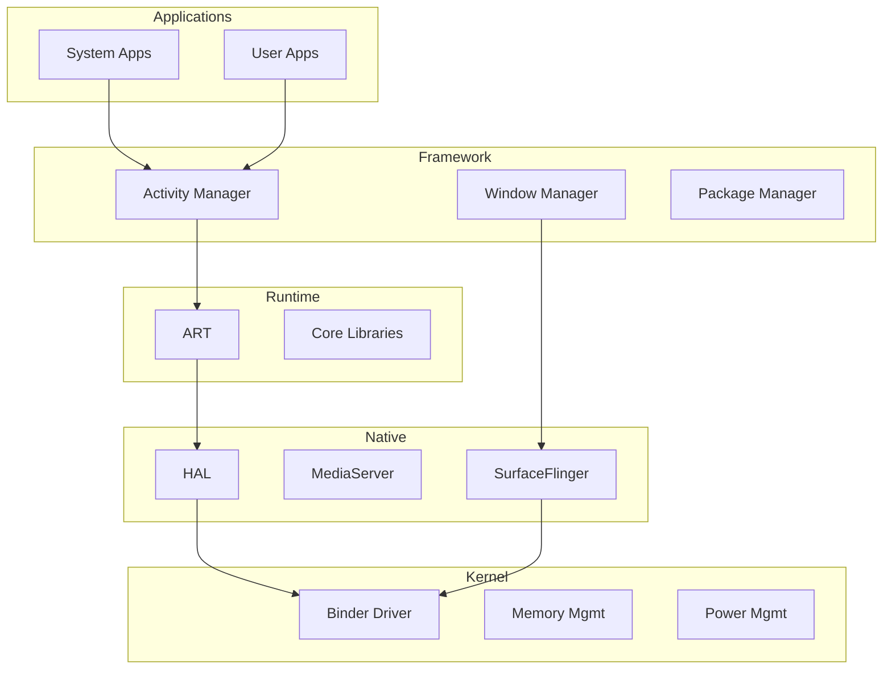
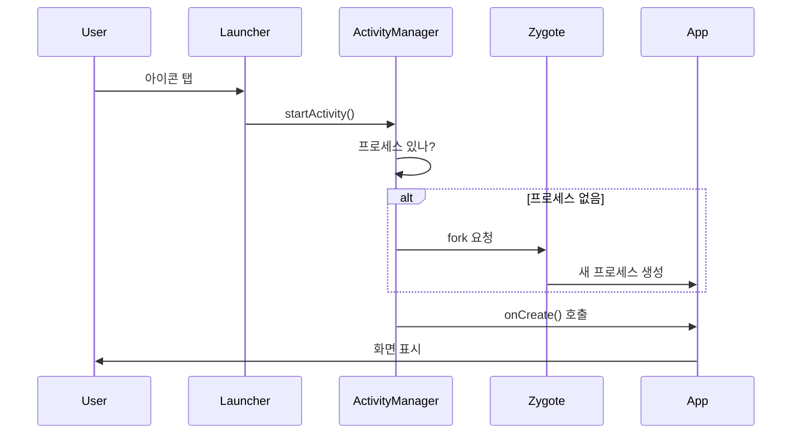
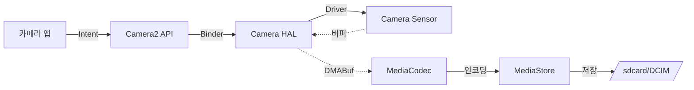

## Android 시스템 개요

이 문서는 안드로이드를 처음 접하는 사람을 위한 **전체 지도**다. 각 주제의 상세는 연결된 문서에서 확인한다.

---

## 안드로이드란?

스마트폰/태블릿을 위한 **오픈소스 운영체제**로:
- **Linux 커널** 기반
- **Java/Kotlin**으로 앱 개발
- **Google Play** 앱 스토어
- **Open Handset Alliance** (Google, Samsung, etc)

**핵심 특징**:
- 앱 **샌드박싱** (격리된 실행)
- **멀티태스킹**
- 풍부한 **하드웨어 지원**
- **오픈소스** (AOSP)

---

## 아키텍처 레이어



### 1. Linux Kernel (최하단)

**역할**: 하드웨어 관리
- 프로세스 스케줄링
- 메모리 관리
- 드라이버 (디스플레이, 카메라, 센서)
- 보안 ([[selinux|SELinux]])

**안드로이드 수정**:
- [[android-binder-and-ipc|Binder]] 드라이버 (IPC)
- [[android-kernel#LMKD|LMKD]] (메모리 부족 시 프로세스 종료)
- Wakelock (전원 관리)

**상세**: [[android-kernel]]

---

### 2. HAL (Hardware Abstraction Layer)

**역할**: 하드웨어와 안드로이드 연결

**왜 필요한가**:
- 칩셋마다 다른 드라이버
- OEM별 다른 하드웨어
- → 표준 인터페이스로 추상화

**예시**:
```
Camera HAL → 삼성/LG/Google 카메라 모두 동일 API
Audio HAL → Qualcomm/MediaTek 오디오 칩 통합
```

**상세**: [[android-hal-and-kernel]]

---

### 3. Native Services

C/C++로 작성된 시스템 서비스:

| 서비스 | 역할 |
|--------|------|
| **SurfaceFlinger** | 화면 합성 |
| **MediaServer** | 오디오/비디오 코덱 |
| **AudioFlinger** | 오디오 믹싱 |

**상세**: [[android-graphics-and-media]]

---

### 4. Android Runtime (ART)

**역할**: 앱 코드 실행 엔진

**진화**:
```
2008-2013: Dalvik (JIT)
2014-현재: ART (AOT + JIT)
```

**핵심 기능**:
- DEX 바이트코드 실행
- Garbage Collection
- Profile-Guided Optimization

**상세**: [[android-zygote-and-runtime]]

---

### 5. Java Framework

앱 개발자가 사용하는 API:

```kotlin
// Activity (화면)
class MainActivity : AppCompatActivity() {
    override fun onCreate(savedInstanceState: Bundle?) {
        super.onCreate(savedInstanceState)
        setContentView(R.layout.activity_main)
    }
}
```

**주요 시스템 서비스**:
- **ActivityManager**: 앱 생명주기
- **WindowManager**: 화면 관리
- **PackageManager**: 앱 설치/제거
- **LocationManager**: 위치
- **ConnectivityManager**: 네트워크

**상세**: [[android-activity-manager-and-system-services]]

---

### 6. 앱 (최상단)

**4대 컴포넌트**:

1. **Activity**: 화면
   ```kotlin
   class DetailActivity : AppCompatActivity()
   ```

2. **Service**: 백그라운드 작업
   ```kotlin
   class MusicService : Service()
   ```

3. **BroadcastReceiver**: 이벤트 수신
   ```kotlin
   class BootReceiver : BroadcastReceiver()
   ```

4. **ContentProvider**: 데이터 공유
   ```kotlin
   class ContactsProvider : ContentProvider()
   ```

---

## 앱 실행 과정

### 1. 앱 시작



**상세**: [[android-activity-manager-and-system-services]]

---

### 2. 프로세스 격리

각 앱은 독립된 환경에서 실행:

```
앱 A:
  UID: 10123
  프로세스: /data/app/com.example.a
  데이터: /data/data/com.example.a (A만 접근)
  SELinux: u:r:untrusted_app:s0:c512

앱 B:
  UID: 10124
  프로세스: /data/app/com.example.b
  데이터: /data/data/com.example.b (B만 접근)
  SELinux: u:r:untrusted_app:s0:c768
```

**상세**: [[android-security-and-sandboxing]]

---

### 3. 앱 간 통신 (Binder)

```kotlin
// 앱 A → 앱 B 서비스 호출
val intent = Intent("com.example.b.SERVICE")
bindService(intent, connection, Context.BIND_AUTO_CREATE)
```

**Binder가 하는 일**:
- 프로세스 간 메시지 전달
- 자동 신원 확인 (UID/PID)
- 권한 검사

**상세**: [[android-binder-and-ipc]]

---

## 실전 예시: 사진 찍기



**과정**:
1. 앱이 Camera2 API 호출
2. Camera Service (Binder)로 요청
3. Camera HAL이 센서에서 데이터 읽기
4. 공유 메모리 (DMABuf)로 전달
5. MediaCodec이 JPEG 인코딩
6. MediaStore에 저장 (권한 확인)

---

## 보안 메커니즘

### 1. 샌드박싱

```
앱은 자기 데이터만 접근 가능
다른 앱 파일 → Permission Denied
```

### 2. 권한 시스템

```kotlin
// 런타임 권한 요청
if (checkSelfPermission(CAMERA) != GRANTED) {
    requestPermissions(arrayOf(CAMERA), REQUEST_CODE)
}
```

### 3. SELinux

```bash
# 앱별 도메인 격리
u:r:untrusted_app:s0:c512  # 앱 1
u:r:platform_app:s0        # 시스템 앱
```

**상세**: [[android-security-and-sandboxing]]

---

## 개발 시작하기

### 1. 개발 환경

```bash
# Android Studio 설치
# SDK Tools 설치
# 에뮬레이터 또는 실기기
```

### 2. 첫 앱

```kotlin
class MainActivity : AppCompatActivity() {
    override fun onCreate(savedInstanceState: Bundle?) {
        super.onCreate(savedInstanceState)
        setContentView(R.layout.activity_main)
        
        val button = findViewById<Button>(R.id.button)
        button.setOnClickListener {
            Toast.makeText(this, "Hello Android!", LENGTH_SHORT).show()
        }
    }
}
```

### 3. 빌드/실행

```bash
# Gradle 빌드
./gradlew assembleDebug

# 설치
adb install app-debug.apk

# 로그 확인
adb logcat
```

---

## 학습 경로

**입문자**:
1. ✅ 이 문서 (전체 개요)
2. [[android-app-components-deep-dive]] (앱 구조)
3. [[android-jetpack-architecture]] (Jetpack)
4. [[android-compose-internals]] (Compose UI)

**시스템 이해**:
1. [[android-kernel]] (커널 수정)
2. [[android-binder-and-ipc]] (IPC)
3. [[android-zygote-and-runtime]] (런타임)
4. [[android-activity-manager-and-system-services]] (시스템 서비스)

**심화**:
1. [[android-hal-and-kernel]] (HAL)
2. [[android-init-and-services]] (부팅)
3. [[android-graphics-and-media]] (그래픽)
4. [[android-customization-and-oem]] (커스터마이징)

---

## 용어 참고

낯선 용어는 [[android-glossary]]에서 빠르게 확인 가능.

---

## 연결 문서

**기초**:
[[android-glossary]] - 용어집  
[[android-evolution-history]] - 역사와 진화

**시스템 핵심**:
[[android-kernel]] - 커널  
[[android-binder-and-ipc]] - IPC  
[[android-zygote-and-runtime]] - 런타임  
[[android-hal-and-kernel]] - HAL  

**보안**:
[[android-security-and-sandboxing]] - 보안 모델  
[[selinux]] - SELinux 상세
