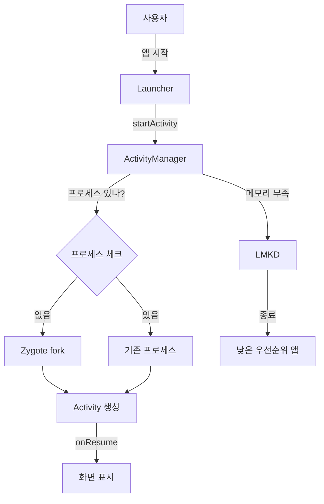
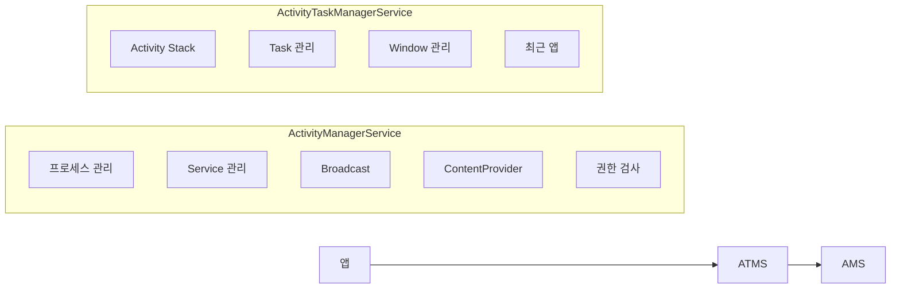
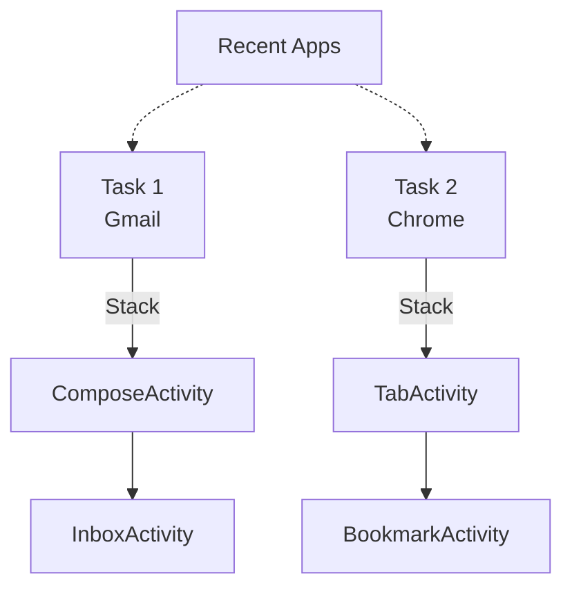

## ActivityManager와 System Services

ActivityManagerService(AMS)와 ActivityTaskManagerService(ATMS)는 안드로이드의 **앱 생명주기 관리자**다. 언제 앱을 시작하고, 어느 Activity를 보여주고, 메모리가 부족할 때 어떤 프로세스를 종료할지 결정한다. System Server 내에서 실행되며, 모든 앱의 생사여탈권을 가진 핵심 서비스다.

### 왜 ActivityManager가 필요한가

#### 모바일 멀티태스킹의 도전 (2000년대 후반)

**데스크톱 vs 모바일**:

데스크톱:
- 메모리: 4-16GB
- 앱 개수: 10-20개 동시 실행
- 사용자 패턴: 앱을 명시적으로 종료

모바일 (Android 초기):
- 메모리: 192MB-512MB
- 앱 개수: 수십 개 설치, 빈번한 전환
- 사용자 패턴: 홈 버튼 → 앱이 "사라짐" (실제로는 백그라운드)

**문제**:
1. 사용자가 뒤로가기/홈 버튼으로 앱 전환 → 이전 앱은?
2. 메모리 부족 시 어떤 앱 종료?
3. 앱이 백그라운드에서 무한정 실행 → 배터리 소진

#### 해결책: 중앙 집중식 프로세스 관리



---

## AMS vs ATMS 분리 (Android 10+)

### 분리 이전 (Android 9 이하)

**ActivityManagerService**가 모든 것을 담당:
- 프로세스 생명주기
- Activity 스택 관리
- Service 관리
- Broadcast
- ContentProvider
- 권한 검사

**문제**: 하나의 거대한 클래스 (~30,000줄), 유지보수 어려움

### 분리 이후 (Android 10+)



**책임 분리**:
- **ATMS**: Activity/Task/Window 관리 (UI 중심)
- **AMS**: 프로세스/Service/Broadcast (백그라운드 중심)

---

## 프로세스 생명주기

### 프로세스 우선순위

```java
// ProcessList.java
public static final int FOREGROUND_APP_ADJ = 0;          // 사용자가 보는 앱
public static final int VISIBLE_APP_ADJ = 100;           // 보이지만 포커스 없음
public static final int PERCEPTIBLE_APP_ADJ = 200;       // 인지 가능 (음악 재생)
public static final int BACKUP_APP_ADJ = 300;            // 백업 중
public static final int HEAVY_WEIGHT_APP_ADJ = 400;      // 무거운 프로세스
public static final int SERVICE_ADJ = 500;               // 서비스 실행 중
public static final int HOME_APP_ADJ = 600;              // Launcher
public static final int PREVIOUS_APP_ADJ = 700;          // 이전 앱
public static final int SERVICE_B_ADJ = 800;             // 오래된 서비스
public static final int CACHED_APP_MIN_ADJ = 900;        // 캐시된 앱 (시작)
public static final int CACHED_APP_MAX_ADJ = 999;        // 캐시된 앱 (끝)
```

**우선순위 결정 요소**:
1. 사용자 상호작용 (터치, 키보드)
2. 생명주기 상태 (onResume, onPause, onStop)
3. Service 바인딩 (foreground service 여부)
4. 프로세스 시작 시간 (LRU)

### OOM Adjuster

메모리 부족 시 [[android-kernel#4 LMKD 선제적 프로세스 종료|LMKD]]와 협력하여 프로세스 종료:

```java
// ProcessRecord.java
void updateOomAdjLocked() {
    // 1. Activity 상태 확인
    if (hasActivityInForeground()) {
        adj = FOREGROUND_APP_ADJ;
    } else if (hasActivityVisible()) {
        adj = VISIBLE_APP_ADJ;
    }
    
    // 2. Service 상태 확인
    if (hasForegroundService()) {
        adj = Math.min(adj, PERCEPTIBLE_APP_ADJ);
    }
    
    // 3. ContentProvider 바인딩
    if (hasExternalClientBindings()) {
        adj = Math.min(adj, clientAdj);
    }
    
    // 4. LMKD에 알림
    setOomAdj(pid, uid, adj);
}
```

**LMKD 연동**:
```c
// lmkd.c
if (free_memory < low_threshold) {
    int target_oom_adj = find_target_adj(free_memory);
    kill_processes_with_adj(target_oom_adj);  // 낮은 우선순위부터 종료
}
```

---

## Activity 생명주기 관리

### Activity Stack



### 생명주기 전환

```java
// ActivityStackSupervisor.java
void startActivityLocked() {
    // 1. Intent 분석
    ActivityInfo aInfo = resolveActivity(intent);
    
    // 2. 프로세스 확인
    ProcessRecord app = getProcessRecordLocked(packageName);
    
    if (app == null) {
        // 3. 프로세스 생성
        app = startProcessLocked(packageName);
    }
    
    // 4. Activity 생성 요청
    scheduleTransaction(app, CREATE_ACTIVITY_TRANSACTION);
}
```

**클라이언트 측 (앱)**:
```java
// ActivityThread.java
public void handleLaunchActivity(ActivityClientRecord r) {
    Activity a = performLaunchActivity(r);  // onCreate
    
    if (a != null) {
        handleResumeActivity(r);  // onResume
    }
}
```

### Launch Modes

```xml
<activity
    android:name=".MainActivity"
    android:launchMode="singleTask" />
```

| Launch Mode | 동작 |
|-------------|------|
| **standard** | 항상 새 인스턴스 생성 |
| **singleTop** | 스택 최상단이면 재사용 (onNewIntent) |
| **singleTask** | Task 내 하나만 존재, 위의 Activity 제거 |
| **singleInstance** | 전용 Task, 다른 Activity 불가 |

---

## Service 관리

### Service 타입

#### 1. Foreground Service

```kotlin
class MusicService : Service() {
    override fun onStartCommand(intent: Intent?, flags: Int, startId: Int): Int {
        val notification = createNotification()
        startForeground(NOTIFICATION_ID, notification)  // 필수
        
        // 음악 재생
        return START_STICKY
    }
}
```

**특징**:
- 알림 필수 (사용자가 인지)
- 높은 우선순위 (PERCEPTIBLE_APP_ADJ)
- 배터리 최적화 제외

#### 2. Background Service (제한적)

```kotlin
// Android 8.0+ 제한
startService(Intent(this, BackgroundService::class.java))
// → IllegalStateException (백그라운드에서 호출 시)

// 대안: WorkManager
WorkManager.getInstance(context).enqueue(
    OneTimeWorkRequest.from(MyWorker::class.java)
)
```

**제한 사항** (Android 8.0+):
- 백그라운드 앱은 startService() 호출 불가
- 예외: 

위치 추적, 음악 재생 등
- 대부분의 경우 WorkManager/JobScheduler 사용 권장

#### 3. Bound Service

```kotlin
class MyService : Service() {
    private val binder = LocalBinder()
    
    inner class LocalBinder : Binder() {
        fun getService(): MyService = this@MyService
    }
    
    override fun onBind(intent: Intent): IBinder = binder
}

// 클라이언트
bindService(intent, connection, Context.BIND_AUTO_CREATE)
```

---

## Broadcast 관리

### Registered vs Manifest

**Registered** (코드):
```kotlin
val receiver = object : BroadcastReceiver() {
    override fun onReceive(context: Context, intent: Intent) {
        // 처리
    }
}

registerReceiver(receiver, IntentFilter(ACTION_BATTERY_LOW))
```

**Manifest** (제한적, Android 8.0+):
```xml
<!-- 대부분 금지, 일부 예외만 -->
<receiver android:name=".BootReceiver">
    <intent-filter>
        <action android:name="android.intent.action.BOOT_COMPLETED" />
    </intent-filter>
</receiver>
```

**제한 이유**: 수백 개 앱이 동일 Broadcast 대기 → 시스템 부하

### Ordered vs Normal Broadcast

```kotlin
// Ordered: 순서대로 전달, 중간에 취소 가능
sendOrderedBroadcast(intent, permission)

// Normal: 모두에게 동시 전달
sendBroadcast(intent)
```

---

## 주요 System Services

### WindowManager

```java
// Window 추가
WindowManager.LayoutParams params = new WindowManager.LayoutParams(
    TYPE_APPLICATION_OVERLAY,  // 타입
    FLAG_NOT_FOCUSABLE,        // 플래그
    PixelFormat.TRANSLUCENT
);
windowManager.addView(floatingView, params);
```

**Window 타입**:
- `TYPE_APPLICATION`: 일반 앱 창
- `TYPE_APPLICATION_OVERLAY`: 오버레이 (SYSTEM_ALERT_WINDOW 권한)
- `TYPE_SYSTEM_ALERT`: 시스템 알림

### PackageManager

```java
// 앱 설치 정보
PackageInfo info = packageManager.getPackageInfo(packageName, 0);

// 권한 체크
int result = packageManager.checkPermission(
    Manifest.permission.CAMERA, 
    packageName
);

// 컴포넌트 활성화/비활성화
packageManager.setComponentEnabledSetting(
    component,
    PackageManager.COMPONENT_ENABLED_STATE_DISABLED,
    PackageManager.DONT_KILL_APP
);
```

### NotificationManager

```kotlin
val channel = NotificationChannel(
    CHANNEL_ID,
    "채널 이름",
    NotificationManager.IMPORTANCE_HIGH
)
notificationManager.createNotificationChannel(channel)

val notification = NotificationCompat.Builder(context, CHANNEL_ID)
    .setSmallIcon(R.drawable.icon)
    .setContentTitle("제목")
    .build()

notificationManager.notify(NOTIFICATION_ID, notification)
```

---

## 메모리 관리

### Process Freezer (Android 11+)

백그라운드 프로세스를 "얼림":

```
앱 백그라운드 전환 → 60초 대기 → Freeze
```

**Freeze 상태**:
- CPU 사용 0%
- Wake lock 무효화
- 네트워크 차단
- 메모리는 유지

**해제**:
- 포그라운드 복귀
- Foreground Service 시작
- Broadcast 수신

### Memory Compaction

```bash
# Compaction 강제 실행
adb shell am compact <package_name>

# 통계 확인
adb shell dumpsys activity compaction
```

**효과**: RSS 메모리 ~30% 감소

---

## JobScheduler / WorkManager

### JobScheduler

```kotlin
val job = JobInfo.Builder(JOB_ID, componentName)
    .setRequiredNetworkType(JobInfo.NETWORK_TYPE_UNMETERED)  // Wi-Fi
    .setRequiresCharging(true)                                // 충전 중
    .setPeriodic(15 * 60 * 1000)                             // 15분마다
    .build()

jobScheduler.schedule(job)
```

### WorkManager (권장)

```kotlin
val constraints = Constraints.Builder()
    .setRequiredNetworkType(NetworkType.CONNECTED)
    .setRequiresBatteryNotLow(true)
    .build()

val work = OneTimeWorkRequestBuilder<MyWorker>()
    .setConstraints(constraints)
    .setBackoffCriteria(BackoffPolicy.EXPONENTIAL, 10, TimeUnit.SECONDS)
    .build()

WorkManager.getInstance(context).enqueue(work)
```

---

## ANR 감지

### Watchdog

```java
// ActivityManagerService.java
private static class AnrMonitor implements Runnable {
    @Override
    public void run() {
        long lastUpdate = mLastInputEventTime;
        long now = SystemClock.uptimeMillis();
        
        if (now - lastUpdate > INPUT_DISPATCHING_TIMEOUT) {  // 5000ms
            // ANR 발생
            appNotResponding(app, annotation);
        }
    }
}
```

**ANR 트리거**:
1. Input event 5초 미응답
2. BroadcastReceiver 10초 미응답 (포그라운드) / 60초 (백그라운드)
3. Service 20초 미응답

### Rescue Party

반복 크래시/ANR 시 복구 시도:

```
Level 1: 위험 권한 리셋
Level 2: 모든 앱 데이터 삭제
Level 3: 공장 초기화 제안
```

---

## 디버깅

### dumpsys activity

```bash
# Activity 스택
adb shell dumpsys activity activities

# 프로세스 목록
adb shell dumpsys activity processes

# 서비스 상태
adb shell dumpsys activity services

# 최근 앱
adb shell dumpsys activity recents

# OOM Adj 점수
adb shell dumpsys activity oom
```

### cmd activity

```bash
# Activity 강제 시작
adb shell am start -n com.example/.MainActivity

# Service 시작
adb shell am startservice -n com.example/.MyService

# Broadcast 전송
adb shell am broadcast -a android.intent.action.BOOT_COMPLETED

# 프로세스 종료
adb shell am force-stop com.example

# 앱 데이터 삭제
adb shell pm clear com.example
```

---

## 학습 리소스

**공식 문서**:
- [ActivityManager](https://developer.android.com/reference/android/app/ActivityManager)
- [Services](https://developer.android.com/guide/components/services)
- [Processes and App Lifecycle](https://developer.android.com/guide/components/activities/process-lifecycle)

**소스 코드**:
- [ActivityManagerService](https://cs.android.com/android/platform/superproject/+/master:frameworks/base/services/core/java/com/android/server/am/ActivityManagerService.java)
- [ActivityTaskManagerService](https://cs.android.com/android/platform/superproject/+/master:frameworks/base/services/core/java/com/android/server/wm/ActivityTaskManagerService.java)

---

## 연결 문서

[[android-binder-and-ipc]] - System Service 통신  
[[android-zygote-and-runtime]] - 프로세스 생성  
[[android-kernel]] - LMKD와 메모리 관리  
[[android-security-and-sandboxing]] - 권한 검사  
[[android-process-and-memory]] - 메모리 관리 상세
