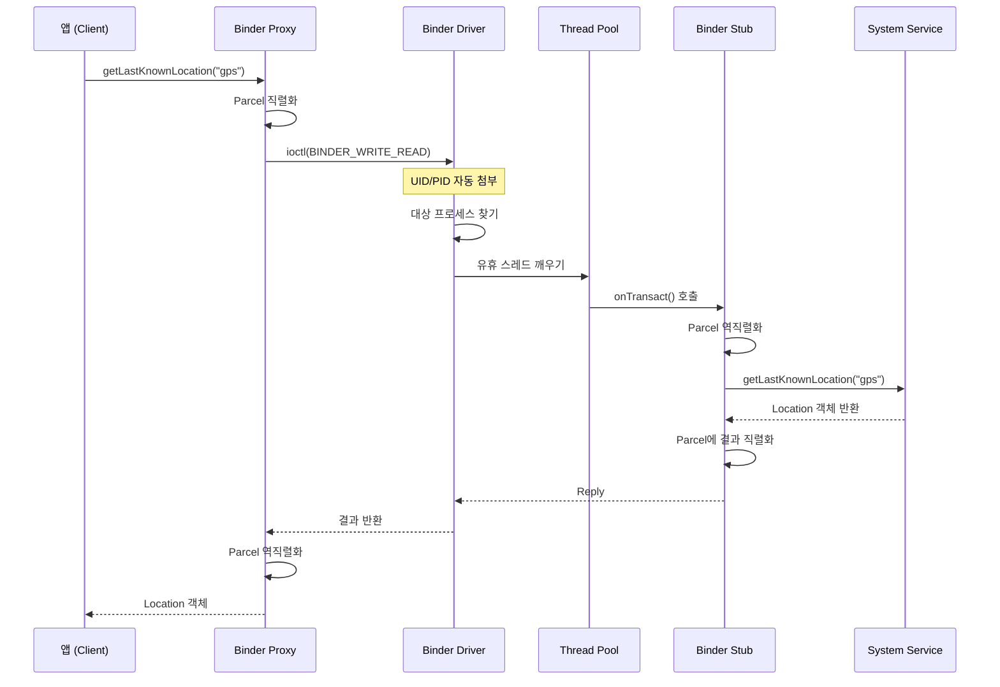

## Binder와 안드로이드 IPC

Binder는 안드로이드의 **프로세스 간 통신(IPC, Inter-Process Communication)** 메커니즘이다. 앱과 시스템 서비스, 시스템 서비스들 간의 모든 통신이 Binder를 통해 이루어진다. 일반적인 리눅스 IPC(파이프, 소켓, 메시지 큐)와 달리, Binder는 모바일 환경에 최적화된 성능과 보안을 제공한다.

### 왜 Binder가 필요했나

#### 모바일 환경의 IPC 요구사항 (2000년대 초반)

구글이 안드로이드를 개발할 당시, 스마트폰은 다음과 같은 특성을 가졌다:

1. **빈번한 프로세스 간 통신**: 데스크톱과 달리 모바일 앱은 시스템 서비스에 끊임없이 의존한다.
   - 화면 그리기 → SurfaceFlinger와 통신
   - 위치 정보 → LocationManager와 통신
   - 알림 → NotificationManager와 통신
   - 한 앱이 실행되는 동안 수백~수천 번의 IPC 발생

2. **제한된 리소스**: 배터리와 메모리가 제한적이므로 IPC 오버헤드를 최소화해야 함.

3. **보안 격리**: 신뢰할 수 없는 써드파티 앱이 수백만 개 설치됨. 앱 간, 앱-시스템 간 엄격한 격리 필요.

#### 전통적인 Linux IPC의 한계

**Unix Domain Socket**:
```c
// Server
int sock = socket(AF_UNIX, SOCK_STREAM, 0);
bind(sock, "/tmp/service.sock", ...);
listen(sock, 5);

// Client
connect(sock, "/tmp/service.sock", ...);
write(sock, data, len);
```

**문제점**:
- **신원 확인 어려움**: 클라이언트의 UID/PID를 신뢰하기 어렵다. `SO_PEERCRED`로 확인 가능하지만 별도 처리 필요.
- **객체 전달 불가**: 복잡한 데이터 구조(파일 디스크립터, 콜백 객체)를 전달하기 어렵다.
- **성능**: 소켓 생성, 연결, 데이터 복사의 오버헤드.

**Pipe / Message Queue**:
- 단방향 또는 제한적인 양방향 통신.
- RPC(Remote Procedure Call) 패턴 구현이 복잡.

#### Binder의 탄생: OpenBinder

**Be Inc.**가 BeOS를 개발할 때 만든 IPC 메커니즘이 **OpenBinder**의 전신이다. 이후 Palm이 OpenBinder를 오픈소스로 공개했고, **구글이 안드로이드에 포팅**했다(2008년).

핵심 설계 원칙:
1. **객체 지향**: 원격 객체 참조를 전달 가능
2. **투명성**: 로컬 함수 호출처럼 느껴지는 RPC
3. **보안**: 커널이 신원을 자동으로 검증
4. **성능**: 최소한의 메모리 복사

---

## Binder 아키텍처

### 전체 구조

```mermaid
graph TB
    subgraph Client Process
        Proxy[Binder Proxy]
    end
    
    subgraph Kernel Space
        Driver[/dev/binder<br/>Binder Driver]
    end
    
    subgraph Server Process
        Stub[Binder Stub]
        Impl[Service Implementation]
        ThreadPool[Binder Thread Pool]
    end
    
    subgraph Service Manager
        SM[ServiceManager]
    end
    
    Proxy -->|ioctl BINDER_WRITE_READ| Driver
    Driver -->|Wake thread| ThreadPool
    ThreadPool --> Stub
    Stub --> Impl
    
    Proxy -.register/lookup.-> SM
    SM -.return handle.-> Proxy
```

### 주요 컴포넌트

#### 1. Binder Driver (`/dev/binder`)

커널 공간에서 실행되는 캐릭터 디바이스 드라이버(`drivers/android/binder.c`).

**역할**:
- 프로세스 간 메시지 라우팅
- 메모리 매핑 관리
- 트랜잭션 큐 관리
- 데드 프로세스 감지 및 알림

**데이터 구조**:
```c
struct binder_transaction {
    int debug_id;
    struct binder_work work;
    struct binder_thread *from;
    struct binder_proc *from_parent;
    struct binder_proc *to_proc;
    struct binder_thread *to_thread;
    struct binder_buffer *buffer;
    unsigned int code;
    unsigned int flags;
    // ...
};
```

#### 2. ServiceManager

안드로이드의 **네임 서버**. 모든 시스템 서비스는 ServiceManager에 자신을 등록한다.

```java
// 서비스 등록 (system_server에서)
ServiceManager.addService("activity", new ActivityManagerService());

// 서비스 조회 (앱에서)
IBinder binder = ServiceManager.getService("activity");
IActivityManager am = IActivityManager.Stub.asInterface(binder);
```

**동작**:
- Context handle 0번을 가진 특별한 프로세스
- 부팅 시 init이 가장 먼저 실행
- 문자열 이름 → Binder 핸들 매핑 관리

#### 3. Binder Proxy와 Stub

**AIDL(Android Interface Definition Language)**로 인터페이스를 정의하면, 자동으로 Proxy/Stub 생성.

```java
// ILocationManager.aidl
interface ILocationManager {
    Location getLastKnownLocation(String provider);
    void requestLocationUpdates(String provider, ILocationListener listener);
}
```

**생성된 코드**:
```java
public interface ILocationManager extends IInterface {
    // Client-side Proxy
    public static class Proxy implements ILocationManager {
        private IBinder mRemote;
        
        public Location getLastKnownLocation(String provider) {
            Parcel data = Parcel.obtain();
            Parcel reply = Parcel.obtain();
            try {
                data.writeInterfaceToken(DESCRIPTOR);
                data.writeString(provider);
                mRemote.transact(TRANSACTION_getLastKnownLocation, data, reply, 0);
                reply.readException();
                return reply.readParcelable(Location.class.getClassLoader());
            } finally {
                data.recycle();
                reply.recycle();
            }
        }
    }
    
    // Server-side Stub
    public static abstract class Stub extends Binder implements ILocationManager {
        @Override
        public boolean onTransact(int code, Parcel data, Parcel reply, int flags) {
            switch (code) {
                case TRANSACTION_getLastKnownLocation:
                    String provider = data.readString();
                    Location result = this.getLastKnownLocation(provider);
                    reply.writeNoException();
                    reply.writeParcelable(result, 0);
                    return true;
            }
        }
    }
}
```

---

## Binder 트랜잭션 흐름

### 단계별 상세 분석



#### 1. 클라이언트 측 (앱)

```java
LocationManager lm = (LocationManager) getSystemService(Context.LOCATION_SERVICE);
Location loc = lm.getLastKnownLocation(LocationManager.GPS_PROVIDER);
```

내부적으로 `ILocationManager.Proxy`가 호출됨:
1. `Parcel` 객체 생성 (직렬화 버퍼)
2. 인자 직렬화: `writeString("gps")`
3. `mRemote.transact()` 호출

#### 2. Binder Driver

`ioctl(fd, BINDER_WRITE_READ, &bwr)` 시스템 콜 처리:

```c
// drivers/android/binder.c
static long binder_ioctl(struct file *filp, unsigned int cmd, unsigned long arg) {
    struct binder_thread *thread;
    struct binder_write_read bwr;
    
    thread = binder_get_thread(proc);  // 현재 스레드
    
    copy_from_user(&bwr, ubuf, sizeof(bwr));
    
    if (bwr.write_size > 0)
        ret = binder_thread_write(proc, thread, bwr.write_buffer, ...);
    
    if (bwr.read_size > 0)
        ret = binder_thread_read(proc, thread, bwr.read_buffer, ...);
}
```

**핵심 동작**:
- 호출자 UID/PID를 `binder_transaction.sender_euid/pid`에 자동 기록
- 대상 서비스의 Binder 핸들로 라우팅
- 서버 프로세스의 대기 중인 스레드를 깨움
- 클라이언트 스레드는 `binder_thread_read()`에서 블록 (동기 호출)

#### 3. 서버 측 (system_server)

Binder 스레드 풀의 한 스레드가 깨어남:

```java
// Looper.loop() 내부
IPCThreadState::self()->joinThreadPool();  // C++ 레이어
```

`onTransact()` 호출:
```java
public boolean onTransact(int code, Parcel data, Parcel reply, int flags) {
    // 권한 검사
    int callingUid = Binder.getCallingUid();
    enforcePermission(android.Manifest.permission.ACCESS_FINE_LOCATION, callingUid);
    
    // 실제 작업
    String provider = data.readString();
    Location result = mService.getLastKnownLocation(provider);
    
    // 응답
    reply.writeNoException();
    reply.writeParcelable(result, 0);
    return true;
}
```

**응답 전송**:
- Reply `Parcel`을 Binder 드라이버에 전달
- 드라이버가 클라이언트 스레드를 깨움
- 클라이언트가 `transact()`에서 반환

---

## 성능 최적화

### 메모리 복사 최소화

**전통적인 IPC (소켓)**:
```
Client 버퍼 → 커널 버퍼 → Server 버퍼  (2번 복사)
```

**Binder**:
```
Client 버퍼 → Server 버퍼 (1번 복사)
```

Binder 드라이버는 서버 프로세스의 주소 공간에 미리 메모리를 매핑(`mmap`). 클라이언트 데이터를 직접 서버의 매핑된 영역으로 복사.

### 성능 측정 (Android 13, Pixel 7)

| IPC 메커니즘 | 라운드트립 시간 | 처리량 (1MB 데이터) |
|-------------|----------------|---------------------|
| **Binder** | ~25μs | ~80 MB/s |
| **Unix Socket** | ~50μs | ~40 MB/s |
| **Pipe** | ~60μs | ~35 MB/s |
| **로컬 함수 호출** | ~1μs | - |

**결론**: Binder는 소켓보다 2배 빠르지만, 여전히 로컬 호출 대비 25배 느리다. 따라서 빈번한 호출을 최소화해야 함.

### 대용량 데이터 전송

Binder 트랜잭션 버퍼 크기 제한: **1MB**

```java
try {
    service.sendLargeData(hugeByteArray);  // > 1MB
} catch (TransactionTooLargeException e) {
    // 실패!
}
```

**해결책**:
1. **Ashmem (Anonymous Shared Memory)**:
   ```java
   MemoryFile memFile = new MemoryFile("data", size);
   memFile.writeBytes(data, 0, 0, size);
   ParcelFileDescriptor pfd = memFile.getParcelFileDescriptor();
   service.sendFileDescriptor(pfd);  // FD만 전달
   ```

2. **ContentProvider + Pipe**:
   ```java
   ParcelFileDescriptor[] pipe = ParcelFileDescriptor.createPipe();
   // 백그라운드 스레드에서 pipe[1]에 쓰기
   // pipe[0]을 Binder로 전달
   ```

---

## 보안과 권한 검증

### 자동 신원 확인

Binder는 **커널 레벨**에서 호출자 정보를 첨부하므로 위조 불가능.

```java
public void sensitiveOperation() {
    int callingUid = Binder.getCallingUid();
    int callingPid = Binder.getCallingPid();
    
    if (callingUid != Process.SYSTEM_UID) {
        throw new SecurityException("Only system can call this");
    }
}
```

### 권한 검증 패턴

```java
public Location getLastKnownLocation(String provider) {
    // 1. 권한 검사
    if (mContext.checkCallingPermission(ACCESS_FINE_LOCATION) != PERMISSION_GRANTED) {
        throw new SecurityException("Requires ACCESS_FINE_LOCATION");
    }
    
    // 2. AppOps 검사 (사용 기록)
    if (mAppOpsManager.noteOp(AppOpsManager.OP_FINE_LOCATION, 
                              Binder.getCallingUid(), 
                              callingPackage) != AppOpsManager.MODE_ALLOWED) {
        return null;  // 권한 거부됨
    }
    
    // 3. 실제 작업
    return mLocationProvider.getLastLocation();
}
```

### [[selinux|SELinux]] 통합

Binder 도메인 전환과 서비스 접근도 SELinux로 제어:

```bash
# untrusted_app이 activity_service를 찾을 수 있는지
allow untrusted_app activity_service:service_manager find;

# system_server와 Binder 호출 가능 여부
allow untrusted_app system_server:binder call;
```

거부 시:
```bash
adb logcat | grep avc
# avc: denied { find } for service=activity_service 
# scontext=u:r:untrusted_app:s0 tcontext=u:object_r:activity_service:s0
```

[[selinux#안드로이드에서의 SELinux|SELinux 상세]] 참고.

---

## Binder 스레드 관리

### 스레드 풀

각 프로세스는 Binder 트랜잭션을 처리하기 위한 **스레드 풀**을 유지.

```cpp
// ProcessState.cpp
#define DEFAULT_MAX_BINDER_THREADS 15

ProcessState::ProcessState(const char *driver) {
    // Binder 드라이버 열기
    mDriverFD = open("/dev/binder", O_RDWR | O_CLOEXEC);
    
    // 스레드 풀 크기 설정
    ioctl(mDriverFD, BINDER_SET_MAX_THREADS, &maxThreads);
}
```

**동작**:
- system_server 시작 시 Binder 스레드 풀 생성
- 트랜잭션 도착 시 유휴 스레드가 처리
- 모든 스레드가 busy면 새 스레드 생성 (최대 15개까지)

### 데드락 방지

**문제**: A → B → A 순환 호출 시 데드락 가능

```java
// Service A
public void methodA() {
    serviceB.methodB();  // B 호출
}

// Service B
public void methodB() {
    serviceA.methodA();  // A 호출 → 데드락!
}
```

**해결책**:
1. **oneway 호출**: 비동기, 응답 대기 안 함
   ```java
   oneway interface ICallback {
       void onResult(int result);
   }
   ```

2. **별도 스레드**: Binder 스레드에서 장시간 작업 금지
   ```java
   public void longRunningTask() {
       new Thread(() -> {
           // 긴 작업
       }).start();
       // 즉시 반환
   }
   ```

---

## 디버깅 도구

### dumpsys

모든 Binder 서비스의 상태 확인:

```bash
adb shell dumpsys -l  # 서비스 목록
adb shell dumpsys activity  # ActivityManager 상태
adb shell dumpsys binder  # Binder 통계
```

**출력 예**:
```
Binder transaction log:
  8261: 0 android.app.IActivityManager.attachApplication in 1234
  ...

Binder stats:
  proc 1234 (system_server)
    context com.android.server.am.ActivityManagerService@abcd1234
      thread 8261: l 01 incoming transactions: 12345
```

### service call

Binder 서비스를 직접 호출 (개발 빌드):

```bash
# ActivityManager의 method 코드 1 호출
adb shell service call activity 1
```

### Systrace/Perfetto

Binder 트랜잭션 지연 시각화:

```bash
python systrace.py -t 10 -o trace.html sched binder_driver binder_lock
```

Perfetto UI에서:
- Binder 트랜잭션 시작/종료 시간
- 어느 서비스가 블록되었는지
- 대기 시간 분석

---

## 고급 주제

### Death Notification

서비스 프로세스가 크래시하면 클라이언트에 알림:

```java
IBinder binder = ServiceManager.getService("myservice");

IBinder.DeathRecipient recipient = new IBinder.DeathRecipient() {
    @Override
    public void binderDied() {
        Log.e(TAG, "Service died! Reconnecting...");
        // 재연결 로직
    }
};

binder.linkToDeath(recipient, 0);
```

커널이 프로세스 종료 감지 → 모든 등록된 DeathRecipient에 알림.

### AIDL 안정성 어노테이션

```java
interface IStableInterface {
    @nullable String getNullableValue();
    @FixedSize int[10] getFixedArray();
    @VintfStability void systemOnly();  // vendor 접근 금지
}
```

- `@nullable`: null 가능성 명시
- `@FixedSize`: 배열 크기 고정 (성능 최적화)
- `@VintfStability`: VINTF 호환성 보장

### oneway 호출

비동기 호출:

```java
oneway interface ICallback {
    void onProgress(int percent);
}
```

**특징**:
- 클라이언트는 즉시 반환
- 서버는 큐에 쌓인 순서대로 처리
- **주의**: 큐가 가득 차면 blocking될 수 있음 (기본 큐 크기: 16)

---

## 실전: Binder 서비스 만들기

### 1. AIDL 정의

```java
// IHelloService.aidl
package com.example;

interface IHelloService {
    String sayHello(String name);
    oneway void asyncNotify(int value);
}
```

### 2. 서비스 구현

```java
public class HelloService extends Service {
    private final IHelloService.Stub mBinder = new IHelloService.Stub() {
        @Override
        public String sayHello(String name) {
            // 권한 검사
            checkCallingPermission("com.example.HELLO");
            
            return "Hello, " + name;
        }
        
        @Override
        public void asyncNotify(int value) {
            // 비동기 처리
            Log.d(TAG, "Received: " + value);
        }
    };
    
    @Override
    public IBinder onBind(Intent intent) {
        return mBinder;
    }
}
```

### 3. 클라이언트 사용

```java
// AndroidManifest.xml에 permission 선언 필요
Intent intent = new Intent();
intent.setComponent(new ComponentName("com.example", ".HelloService"));

bindService(intent, new ServiceConnection() {
    @Override
    public void onServiceConnected(ComponentName name, IBinder service) {
        IHelloService hello = IHelloService.Stub.asInterface(service);
        
        try {
            String result = hello.sayHello("World");
            Log.d(TAG, result);  // "Hello, World"
        } catch (RemoteException e) {
            e.printStackTrace();
        }
    }
    
    @Override
    public void onServiceDisconnected(ComponentName name) {
        // 서비스 연결 끊김
    }
}, Context.BIND_AUTO_CREATE);
```

---

## 문제 해결

### ANR (Application Not Responding)

```
I/ActivityManager: ANR in com.example.app
    Reason: Binder call took 5003ms
```

**원인**: Binder 호출에서 장시간 블록 (기본 timeout: 5초)

**해결**:
1. 서버 측에서 긴 작업을 별도 스레드로 이동
2. oneway 호출로 변경 (응답 불필요 시)
3. 작업을 더 작은 청크로 분할

### TransactionTooLargeException

```
E/JavaBinder: Caused by: android.os.TransactionTooLargeException
    data parcel size 1048576 bytes
```

**해결**:
- Ashmem/MemoryFile 사용
- ContentProvider를 통한 스트리밍
- 데이터 압축

### Binder 고갈

```
E/Binder: Binder thread pool (15 threads) exhausted
```

**원인**: 모든 Binder 스레드가 블록됨

**해결**:
- 서비스에서 동기 작업 제거
- 스레드 풀 크기 증가 (신중하게)

---

## 학습 리소스

**공식 문서**:
- [Android Binder](https://source.android.com/docs/core/architecture/hidl/binder-ipc)
- [AIDL Overview](https://developer.android.com/develop/background-work/services/aidl)

**소스 코드**:
- [Binder Driver](https://android.googlesource.com/kernel/common/+/refs/heads/android-mainline/drivers/android/binder.c)
- [libbinder](https://android.googlesource.com/platform/frameworks/native/+/refs/heads/main/libs/binder/)

**도구**:
- `adb shell dumpsys binder`
- Perfetto: binder_driver tracepoint

---

## 연결 문서

[[android-kernel]] - Binder 커널 드라이버 상세  
[[selinux]] - Binder 서비스 접근 제어  
[[android-zygote-and-runtime]] - 프로세스 생성과 Binder 초기화  
[[android-activity-manager-and-system-services]] - System 서비스와 Binder  
[[android-security-and-sandboxing]] - Binder 보안 모델
