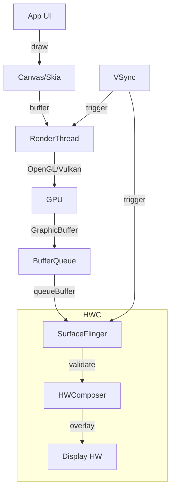
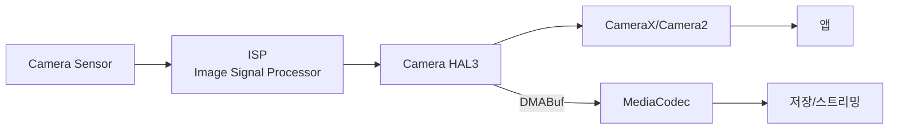

## Graphics와 Media Pipeline

안드로이드의 그래픽 시스템은 **하드웨어 가속 렌더링**과 **다층 합성**을 통해 부드러운 60fps(또는 90/120fps) 화면을 제공한다. Media Framework는 카메라 캡처부터 비디오 재생까지 담당한다.

### 왜 복잡한 그래픽 파이프라인이 필요한가

#### 모바일 그래픽의 도전

**데스크톱**:
- 단일 앱의 전체 화면
- GPU 리소스 독점
- 60Hz 고정

**모바일**:
- 여러 앱 레이어 (상태바, 네비게이션, 플로팅 윈도우, 키보드)
- 제한된 GPU/배터리
- 다양한 화면 주사율 (60/90/120Hz)
- 터치 지연 최소화 필요

**해결**: 하드웨어 기반 다층 합성

---

## 그래픽 아키텍처



### 핵심 컴포넌트

#### 1. Canvas / Skia

```kotlin
// Custom View
override fun onDraw(canvas: Canvas) {
    canvas.drawRect(0f, 0f, 100f, 100f, paint)
    canvas.drawText("Hello", 50f, 50f, textPaint)
}
```

**Skia**:
- 2D 그래픽 라이브러리
- GPU 가속 (OpenGL/Vulkan 백엔드)
- Chrome도 사용하는 검증된 엔진

#### 2. RenderThread

앱의 UI 스레드와 별도로 실행:

```java
// View.java
void draw(Canvas canvas) {
    // UI 스레드: View 트리 순회
    drawBackground(canvas);
    onDraw(canvas);
    dispatchDraw(canvas);  // 자식 View
    
    // → RenderThread로 전달
}
```

**RenderThread**:
- DisplayList 구축
- GPU 명령 생성
- VSync 대기

#### 3. BufferQueue

프로듀서(앱)-컨슈머(SurfaceFlinger) 패턴:

```cpp
// 앱 쪽 (Producer)
ANativeWindow_Buffer buffer;
ANativeWindow_lock(window, &buffer, nullptr);
// buffer에 픽셀 쓰기
ANativeWindow_unlockAndPost(window);

// SurfaceFlinger 쪽 (Consumer)
acquireBuffer(&buffer);
// buffer 합성
releaseBuffer(&buffer);
```

**트리플 버퍼링**:
```
Front Buffer:  화면에 표시 중
Back Buffer 1: GPU가 렌더링 중
Back Buffer 2: CPU가 다음 프레임 준비 중
```

#### 4. SurfaceFlinger

모든 레이어를 합성:

```
Layer Stack:
  [Status Bar]       Z-order: 100
  [Navigation Bar]            90
  [App Window]                50
  [Wallpaper]                 10
```

**합성 방법**:
1. **GPU Composition**: OpenGL로 모든 레이어 합성
2. **HWC Overlay**: 하드웨어가 직접 합성 (전력 절약)

```cpp
// SurfaceFlinger.cpp
void SurfaceFlinger::composite() {
    for (Layer* layer : layers) {
        if (hwc->canUseOverlay(layer)) {
            hwc->setLayerBuffer(layer);  // 하드웨어 오버레이
        } else {
            gpu->compositeLayer(layer);  // GPU 합성
        }
    }
}
```

---

## VSync와 Choreographer

### VSync

디스플레이 수직 동기화 신호 (60Hz = 16.67ms마다):

```
VSync ───┬───┬───┬───┬───→ 시간
         │   │   │   │
       Frame Frame Frame
```

**문제 (VSync 없이)**:
```
GPU가 화면 업데이트 중간에 버퍼 교체
→ Screen Tearing (화면 찢어짐)
```

### Choreographer

```kotlin
Choreographer.getInstance().postFrameCallback { frameTimeNanos ->
    // 입력 처리
    processInput()
    
    // 애니메이션
    updateAnimations(frameTimeNanos)
    
    // 레이아웃 측정
    measure()
    layout()
    
    // 그리기
    draw()
    
    // 다음 프레임 예약
    post FrameCallback(this)
}
```

**프레임 파이프라인**:
```
Input → Animation → Measure/Layout → Draw → (다음 VSync) → Display
  2ms      2ms           4ms           6ms        16ms
```

---

## Jetpack Compose

### 선언형 UI

```kotlin
@Composable
fun Greeting(name: String) {
    Text(
        text = "Hello $name",
        modifier = Modifier.padding(16.dp)
    )
}
```

**Compose Runtime**:
1. **Composition**: UI 트리 구축
2. **Layout**: 위치/크기 계산
3. **Drawing**: Skia로 그리기

### 리컴포지션 최적화

```kotlin
@Composable
fun Counter() {
    var count by remember { mutableStateOf(0) }
    
    Button(onClick = { count++ }) {
        Text("Count: $count")  // count 변경 시만 리컴포지션
    }
}
```

**스마트 리컴포지션**:
- 변경된 상태를 사용하는 Composable만 재실행
- `remember`, `derivedStateOf`로 최적화

---

## Camera Pipeline



### Camera2 API

```kotlin
val cameraManager = getSystemService(CameraManager::class.java)
val cameraId = cameraManager.cameraIdList[0]

cameraManager.openCamera(cameraId, object : CameraDevice.StateCallback() {
    override fun onOpened(camera: CameraDevice) {
        val captureRequest = camera.createCaptureRequest(TEMPLATE_PREVIEW)
        captureRequest.addTarget(surface)
        
        camera.createCaptureSession(listOf(surface), callback, handler)
    }
}, handler)
```

### CameraX (권장)

```kotlin
val preview = Preview.Builder().build()
val imageCapture = ImageCapture.Builder().build()

cameraProvider.bindToLifecycle(
    this,
    cameraSelector,
    preview,
    imageCapture
)

preview.setSurfaceProvider(previewView.surfaceProvider)
```

---

## Media Codec

### 비디오 인코딩

```kotlin
val codec = MediaCodec.createEncoderByType(MediaFormat.MIMETYPE_VIDEO_AVC)
val format = MediaFormat.createVideoFormat(MIMETYPE_VIDEO_AVC, width, height)
format.setInteger(MediaFormat.KEY_BIT_RATE, bitRate)
format.setInteger(MediaFormat.KEY_FRAME_RATE, frameRate)
format.setInteger(MediaFormat.KEY_I_FRAME_INTERVAL, 1)

codec.configure(format, null, null, MediaCodec.CONFIGURE_FLAG_ENCODE)
codec.start()

// 입력
val inputBufferId = codec.dequeueInputBuffer(timeout)
val inputBuffer = codec.getInputBuffer(inputBufferId)
inputBuffer.put(rawData)
codec.queueInputBuffer(inputBufferId, 0, size, presentationTimeUs, 0)

// 출력
val bufferInfo = MediaCodec.BufferInfo()
val outputBufferId = codec.dequeueOutputBuffer(bufferInfo, timeout)
val outputBuffer = codec.getOutputBuffer(outputBufferId)
// encoded data 사용
codec.releaseOutputBuffer(outputBufferId, false)
```

### 하드웨어 가속

```kotlin
// Surface 입력 모드 (Camera → Encoder 직접 연결)
codec.configure(format, null, null, MediaCodec.CONFIGURE_FLAG_ENCODE)
val inputSurface = codec.createInputSurface()

// Camera를 inputSurface로
camera.setPreviewTexture(SurfaceTexture(inputSurface))
```

**이점**: CPU/메모리 복사 없음 (Zero-copy)

---

## Audio

### AudioTrack (Low-level)

```kotlin
val bufferSize = AudioTrack.getMinBufferSize(
    sampleRate,
    AudioFormat.CHANNEL_OUT_STEREO,
    AudioFormat.ENCODING_PCM_16BIT
)

val audioTrack = AudioTrack(
    AudioAttributes.Builder()
        .setUsage(AudioAttributes.USAGE_MEDIA)
        .setContentType(AudioAttributes.CONTENT_TYPE_MUSIC)
        .build(),
    AudioFormat.Builder()
        .setSampleRate(sampleRate)
        .setEncoding(AudioFormat.ENCODING_PCM_16BIT)
        .setChannelMask(AudioFormat.CHANNEL_OUT_STEREO)
        .build(),
    bufferSize,
    AudioTrack.MODE_STREAM,
    AudioManager.AUDIO_SESSION_ID_GENERATE
)

audioTrack.play()
audioTrack.write(pcmData, 0, pcmData.size)
```

### Oboe (권장, NDK)

```cpp
#include <oboe/Oboe.h>

oboe::AudioStreamBuilder builder;
builder.setDirection(oboe::Direction::Output)
       ->setPerformanceMode(oboe::PerformanceMode::LowLatency)
       ->setFormat(oboe::AudioFormat::Float)
       ->setSampleRate(48000)
       ->setChannelCount(oboe::ChannelCount::Stereo)
       ->setCallback(this);

oboe::AudioStream *stream;
builder.openStream(&stream);
stream->start();
```

**지연 시간**:
- AAudio/Oboe: ~10ms
- AudioTrack: ~45ms

### AudioFocus

```kotlin
val focusRequest = AudioFocusRequest.Builder(AudioManager.AUDIOFOCUS_GAIN)
    .setOnAudioFocusChangeListener { focusChange ->
        when (focusChange) {
            AudioManager.AUDIOFOCUS_GAIN -> resumePlayback()
            AudioManager.AUDIOFOCUS_LOSS -> stopPlayback()
            AudioManager.AUDIOFOCUS_LOSS_TRANSIENT -> pausePlayback()
        }
    }
    .build()

audioManager.requestAudioFocus(focusRequest)
```

---

## ExoPlayer

```kotlin
val player = ExoPlayer.Builder(context).build()
playerView.player = player

val mediaItem = MediaItem.fromUri(videoUri)
player.setMediaItem(mediaItem)
player.prepare()
player.play()
```

### Adaptive Streaming (DASH/HLS)

```kotlin
val dataSourceFactory = DefaultHttpDataSource.Factory()
val dashMediaSource = DashMediaSource.Factory(dataSourceFactory)
    .createMediaSource(MediaItem.fromUri(dashUri))

player.setMediaSource(dashMediaSource)
```

**자동 품질 조정**:
```
네트워크 속도 감지 → 낮은 비트레이트로 전환
속도 회복 → 높은 비트레이트로 전환
```

---

## DRM

### Widevine

```kotlin
val drmSessionManager = DefaultDrmSessionManager.Builder()
    .setUuidAndExoMediaDrmProvider(
        C.WIDEVINE_UUID,
        FrameworkMediaDrm.DEFAULT_PROVIDER
    )
    .build(object : MediaDrmCallback {
        override fun executeProvisionRequest(request: ProvisionRequest): ByteArray {
            // 라이선스 서버에서 provision 받기
        }
        
        override fun executeKeyRequest(request: KeyRequest): ByteArray {
            // 콘텐츠 키 받기
        }
    })

val mediaSource = DashMediaSource.Factory(dataSourceFactory)
    .setDrmSessionManagerProvider { drmSessionManager }
    .createMediaSource(mediaItem)
```

**보안**:
- L1: 하드웨어 보안 (TEE)
- L3: 소프트웨어 보안

---

## 성능 최적화

### Systrace

```bash
python systrace.py -t 10 -o trace.html gfx view sched freq idle

# Perfetto (최신)
adb shell perfetto -c - --txt -o /data/local/tmp/trace <<EOF
buffers {
    size_kb: 65536
}
data_sources {
    config {
        name: "android.surfaceflinger.frametimeline"
    }
}
EOF
```

### GPU Profiling

```kotlin
// Android Studio → Profiler → GPU
// 또는
adb shell dumpsys gfxinfo <package_name>
```

**출력**:
```
Janky frames: 15 (5.2%)
90th percentile: 18ms
95th percentile: 25ms
99th percentile: 40ms
```

### 오버드로우 감소

```bash
# 개발자 옵션 → GPU 오버드로우 표시
adb shell setprop debug.hwui.overdraw show
```

**색상**:
- 파란색: 1회 그리기
- 녹색: 2회
- 분홍색: 3회
- 빨간색: 4회 이상 (개선 필요!)

---

## 디버깅

### dumpsys

```bash
# SurfaceFlinger 상태
adb shell dumpsys SurfaceFlinger

# Graphics 통계
adb shell dumpsys gfxinfo

# Media 코덱
adb shell dumpsys media.codec

# Audio
adb shell dumpsys media.audio_flinger
```

### GPU 렌더링

```bash
# 렌더링 프로파일 활성화
adb shell setprop debug.hwui.profile true

# 화면에 표시
adb shell setprop debug.hwui.profile visual_bars
```

---

## 학습 리소스

**공식 문서**:
- [Graphics Architecture](https://source.android.com/docs/core/graphics)
- [Media](https://developer.android.com/guide/topics/media)
- [Camera2](https://developer.android.com/training/camera2)
- [ExoPlayer](https://exoplayer.dev/)

**도구**:
- Perfetto/Systrace
- AGI (Android GPU Inspector)
- GPU Profiler

---

## 연결 문서

[[android-hal-and-kernel]] - Graphics/Camera/Audio HAL  
[[buffer]] - GraphicBuffer와 [[android-kernel#2 Ashmem과 공유 메모리의 진화|DMABuf]]  
[[android-binder-and-ipc]] - SurfaceFlinger 통신  
[[android-compose-internals]] - Compose 상세  
[[android-performance-and-debug]] - 렌더링 성능 최적화
