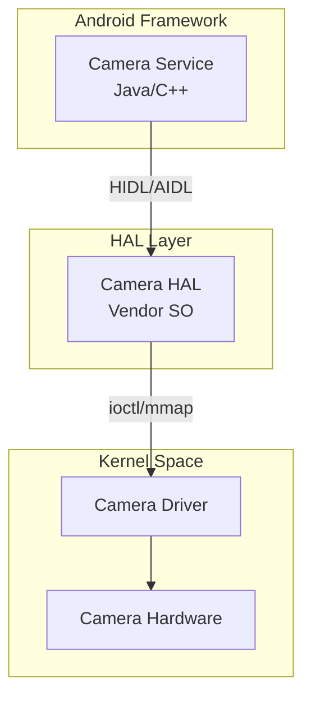
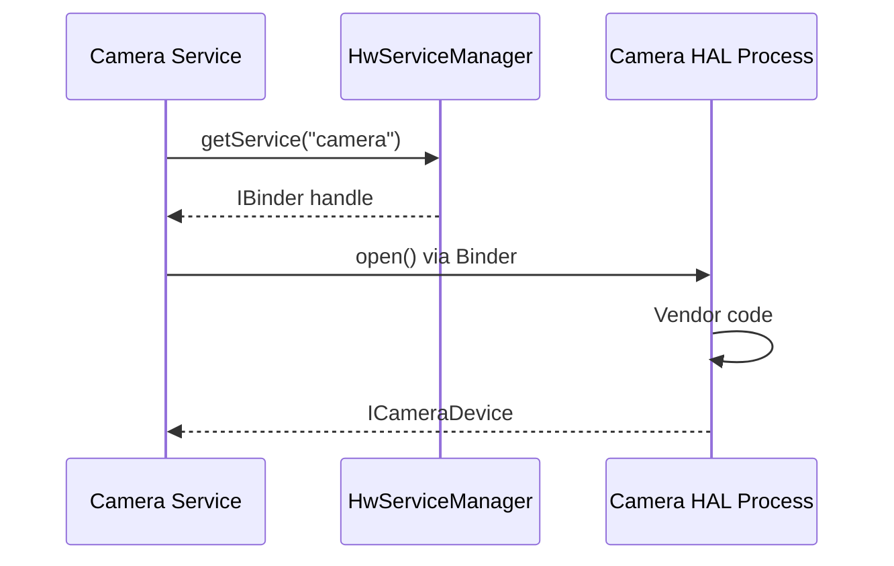
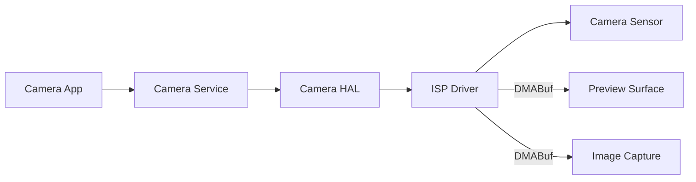

## Android HAL과 Linux Kernel

안드로이드는 **Linux Kernel** 위에서 실행되지만, 표준 리눅스와는 다른 하드웨어 추상화 계층인 **HAL(Hardware Abstraction Layer)**을 사용한다. 이는 다양한 하드웨어를 지원하면서도 프레임워크를 하드웨어 변경으로부터 격리하기 위한 설계다.

### 왜 HAL이 필요했나

#### 모바일 하드웨어의 다양성 (2000년대 중반)

안드로이드 초기 개발 당시, 스마트폰 시장은 극도로 파편화되어 있었다:

1. **칩셋 제조사**: Qualcomm, MediaTek, Samsung Exynos, NVIDIA Tegra, TI OMAP...
2. **GPU**: Adreno, Mali, PowerVR, Tegra...
3. **카메라 센서**: Sony, Samsung, OmniVision... (각기 다른 ISP)
4. **오디오 코덱**: Realtek, Cirrus Logic, Wolfson...
5. **모뎀**: 2G/3G/4G/5G, 각 벤더마다 다른 인터페이스

**문제**: 하드웨어가 바뀔 때마다 Android Framework 코드를 수정하면?
- 플랫폼 안정성 저하
- OEM마다 다른 안드로이드 버전
- 업데이트 불가능 (하드웨어 의존성)

#### 전통적인 리눅스 방식의 한계

리눅스는 커널 드라이버로 하드웨어 추상화:

```
User App → /dev/video0 (V4L2) → Camera Driver → Hardware
```

**문제점**:
1. **GPL 라이선스**: 커널 드라이버는 GPL로 공개해야 함. 칩셋 벤더는 proprietary 드라이버를 공개하고 싶지 않음.
2. **커널 안정성**: 잘못된 드라이버 하나가 커널 패닉 유발.
3. **표준화 부족**: 각 벤더가 다른 인터페이스 사용.

#### HAL의 해결책

하드웨어 접근을 **유저 공간 라이브러리**로 분리:



**이점**:
1. **라이선스**: HAL은 Apache 2.0, 벤더는 proprietary 코드 숨길 수 있음
2. **안정성**: HAL 크래시 → 서비스 재시작, 커널은 안전
3. **표준화**: Google이 HAL 인터페이스 정의 (ICamera, IAudio 등)
4. **업그레이드**: Framework와 HAL 독립적으로 업데이트 가능

---

## HAL의 역사적 진화

### 1세대: Legacy HAL (Android 1.0~7.1)

**구조**: 단순한 함수 포인터 구조체

```c
// hardware/libhardware/include/hardware/camera.h
typedef struct camera_device {
    hw_device_t common;
    
    int (*set_preview_window)(struct camera_device *, 
                              struct preview_stream_ops *window);
    void (*start_preview)(struct camera_device *);
    void (*stop_preview)(struct camera_device *);
    // ...
} camera_device_t;

// Vendor implementation
camera_device_t* open_camera() {
    camera_device_t *dev = malloc(sizeof(*dev));
    dev->start_preview = vendor_start_preview;
    // ...
    return dev;
}
```

**문제점**:
- 타입 안전성 없음 (void* 남발)
- 버전 관리 어려움
- 프로세스 격리 불가 (같은 프로세스에서 실행)
- 테스트 어려움

### 2세대: HIDL HAL (Android 8.0~12)

**Treble 프로젝트**의 일환으로 도입. HIDL (HAL Interface Definition Language)로 인터페이스 정의.

**목표**:
- **프로세스 격리**: HAL을 별도 프로세스로 실행 (Binderized HAL)
- **버전 관리**: 인터페이스 버전 명시 (android.hardware.camera@2.4)
- **테스트**: VTS (Vendor Test Suite)로 자동 검증

```cpp
// hardware/interfaces/camera/2.4/ICamera.hal
package android.hardware.camera@2.4;

interface ICamera {
    open(CameraId id) generates (Status status, ICameraDevice device);
    getNumberOfCameras() generates (uint32_t count);
};
```

**생성된 코드**:
```cpp
// C++ Stub (Vendor)
class BnHwCamera : public ICamera {
    // Binder transact 처리
};

// C++ Proxy (Client)
class BpHwCamera : public ICamera {
    // Binder 호출
};
```

**동작**:


### 3세대: AIDL HAL (Android 11+)

HIDL의 복잡성을 줄이고, 앱 레벨 AIDL과 통합.

```java
// hardware/interfaces/camera/aidl/ICameraProvider.aidl
package android.hardware.camera.provider;

@VintfStability
interface ICameraProvider {
    void setCallback(ICameraProviderCallback callback);
    parcelable CameraIdAndStreamCombination getCameraIdList();
    ICameraDevice getCameraDeviceInterface(in String cameraDeviceName);
}
```

**장점**:
- HIDL 대비 단순함
- Java/C++ 모두 지원
- 기존 [[android-binder-and-ipc|Binder]] 인프라 재사용

---

## HAL 타입

### Binderized HAL

별도 프로세스에서 실행, Binder IPC로 통신.

```bash
# HAL 프로세스 목록
adb shell ps -A | grep android.hardware

# 예시:
system  1234  1  android.hardware.camera.provider@2.4-service
system  1235  1  android.hardware.audio@6.0-service
```

**프로세스 격리 이점**:
- HAL 크래시 시 system_server 안전
- [[selinux|SELinux]]로 HAL 별 권한 제한
- 메모리 격리

### Passthrough HAL

Framework와 같은 프로세스에서 실행 (동적 라이브러리 로딩).

```cpp
// Passthrough 로딩
sp<ICamera> camera = ICamera::getService("camera", true);  // passthrough=true
```

**용도**:
- 성능 critical (그래픽, 오디오)
- 레거시 호환성

**단점**:
- 크래시 위험
- [[selinux|SELinux]] 격리 어려움

---

## VINTF (Vendor Interface)

### 호환성 매트릭스

**문제**: Android 9 Framework가 Android 8 HAL과 호환되는지 어떻게 보장?

**해결**: VINTF 매트릭스로 명시

**Framework Manifest** (`/system/etc/vintf/manifest.xml`):
```xml
<manifest version="2.0" type="framework">
    <hal format="hidl">
        <name>android.frameworks.cameraservice</name>
        <transport>hwbinder</transport>
        <version>2.0</version>
        <interface>
            <name>ICameraService</name>
            <instance>default</instance>
        </interface>
    </hal>
</manifest>
```

**Vendor Manifest** (`/vendor/etc/vintf/manifest.xml`):
```xml
<manifest version="2.0" type="device">
    <hal format="hidl">
        <name>android.hardware.camera.provider</name>
        <transport>hwbinder</transport>
        <version>2.4</version>
        <interface>
            <name>ICameraProvider</name>
            <instance>internal/0</instance>
        </interface>
    </hal>
</manifest>
```

**호환성 검증**:
```bash
# 부팅 시 자동 검증
vintf check

# 수동 확인
adb shell vintf

# 출력:
# Device manifest: OK
# Framework compatibility matrix: OK
# Device compatibility matrix: OK
```

불일치 시 → 부팅 실패 (bootloop)

---

## Treble 아키텍처

### System/Vendor 분리

**Before Treble** (Android 7.x):
```
/system
  ├─ framework.jar (Google)
  ├─ libcamera.so (Vendor)
  └─ libaudio.so (Vendor)
```

문제: Vendor 코드가 /system에 섞임 → OTA 업데이트 시 Vendor도 재빌드 필요

**After Treble** (Android 8.0+):
```
/system (Google, 독립 업데이트)
  └─ framework.jar

/vendor (OEM/Chipset, 고정)
  ├─ libcamera_vendor.so
  └─ android.hardware.camera@2.4-service
```

### VNDK (Vendor NDK)

Vendor HAL이 사용 가능한 라이브러리 제한:

```
Vendor HAL → libhardware.so (VNDK)  ✓
          → libc++.so (VNDK)        ✓
          → libui.so (Framework)    ✗ (금지)
```

**vndk-sp** (Same Process VNDK): Passthrough HAL용 특수 라이브러리

---

## 주요 HAL 서브시스템

### Camera HAL

```cpp
// ICameraProvider 인터페이스
int32_t getCameraIdList(out string[] cameraIds);
ICameraDevice getCameraDeviceInterface(in string cameraId);

// ICameraDevice
void open(in ICameraDeviceCallback callback);
void configureStreams(in StreamConfiguration config);
void processCaptureRequest(in CaptureRequest request);
```

**파이프라인**:


### Audio HAL

```cpp
// IDevice
createAudioPatch(in AudioPortConfig[] sources, 
                 in AudioPortConfig[] sinks);
setMasterVolume(float volume);
openInputStream(in AudioConfig config);
openOutputStream(in AudioConfig config);
```

**Low-latency 경로**:
- FastMixer: 오디오 믹싱을 별도 스레드에서 (< 10ms 지연)
- MMAP (Memory Mapped): HAL이 직접 버퍼 쓰기 (< 5ms)

### Graphics HAL (HWComposer)

SurfaceFlinger가 레이어를 합성할 때 사용:

```cpp
// IComposer
validateDisplay(displayId);
presentDisplay(displayId);
setLayerBuffer(Layer layer, Buffer buffer);
```

**작동**:
```
App → Surface → SurfaceFlinger → HWComposer HAL → Display Driver
```

HWC가 하드웨어 오버레이 사용 가능 여부 결정:
- GPU 합성 (느림)
- 하드웨어 오버레이 (빠름, 전력 절감)

---

## 안드로이드 커널 수정

### Binder Driver

표준 리눅스에 없는 안드로이드 전용 드라이버. [[android-binder-and-ipc]] 참고.

### Ashmem / ION / DMABuf

**목적**: 프로세스 간 대용량 메모리 공유 (카메라 프레임, GPU 버퍼)

**진화**:
1. **Ashmem** (Android 1.0~9): 익명 공유 메모리
2. **ION** (Android 4.0~11): 물리 연속 메모리 할당기
3. **DMABuf Heaps** (Android 11+): 리눅스 메인라인과 통합

[[android-kernel#2 Ashmem과 공유 메모리의 진화|상세 내용]] 참고.

### Wakelock

[[android-kernel#3 Wakelocks 배터리 수명의 싸움|Wakelock 상세]] 참고.

### Low Memory Killer Daemon (LMKD)

[[android-kernel#4 LMKD 선제적 프로세스 종료|LMKD 상세]] 참고.

---

## HAL 개발 예시

### 1. AIDL 인터페이스 정의

```java
// hardware/interfaces/example/aidl/IExample.aidl
package android.hardware.example;

@VintfStability
interface IExample {
    void doSomething(in String parameter);
    int getValue();
}
```

### 2. Vendor 구현

```cpp
// vendor/example/ExampleImpl.cpp
namespace android::hardware::example::implementation {

class ExampleImpl : public BnExample {
public:
    ndk::ScopedAStatus doSomething(const std::string& parameter) override {
        ALOGI("Parameter: %s", parameter.c_str());
        // 하드웨어 제어 코드
        return ndk::ScopedAStatus::ok();
    }
    
    ndk::ScopedAStatus getValue(int32_t* _aidl_return) override {
        *_aidl_return = 42;
        return ndk::ScopedAStatus::ok();
    }
};

}  // namespace
```

### 3. 서비스 등록

```cpp
// service.cpp
int main() {
    ABinderProcess_setThreadPoolMaxThreadCount(0);
    
    std::shared_ptr<IExample> example = ndk::SharedRefBase::make<ExampleImpl>();
    
    const std::string instance = std::string() + IExample::descriptor + "/default";
    binder_status_t status = AServiceManager_addService(
        example->asBinder().get(), instance.c_str());
    
    if (status != STATUS_OK) {
        return 1;
    }
    
    ABinderProcess_joinThreadPool();
    return 0;
}
```

### 4. rc 스크립트

```bash
# android.hardware.example@1.0-service.rc
service example-hal /vendor/bin/hw/android.hardware.example@1.0-service
    class hal
    user system
    group system
    capabilities NET_BIND_SERVICE
    seclabel u:r:hal_example:s0
```

### 5. [[selinux|SELinux]] 정책

```bash
# hal_example.te
type hal_example, domain;
hal_server_domain(hal_example, hal_example)

# /dev/example_device 접근 허용
allow hal_example example_device:chr_file rw_file_perms;

# 시스템 속성 읽기
get_prop(hal_example, vendor_example_prop)
```

---

## 디버깅 HAL

### dumpsys

HAL 상태 확인:

```bash
# 등록된 HAL 서비스 목록
adb shell lshal

# 출력:
# android.hardware.camera.provider@2.4::ICameraProvider/internal/0
#   R  hwbinder  1234  1234  vendor.qti.hardware.camera.device

# 특정 HAL 디버그 정보
adb shell dumpsys android.hardware.camera.provider@2.4::ICameraProvider/internal/0
```

### logcat 필터링

```bash
# HAL 로그만
adb logcat | grep 'hardware\|HAL'

# 특정 HAL
adb logcat -s CameraHAL
```

### strace

```bash
# HAL 프로세스의 시스템 콜 추적
adb shell
ps -A | grep camera
strace -p 1234 -e trace=ioctl,mmap,open
```

### Perfetto

HAL 호출 추적:

```bash
perfetto -c - --txt -o trace.perfetto <<EOF
buffers {
    size_kb: 65536
}
data_sources {
    config {
        name: "linux.ftrace"
        ftrace_config {
            ftrace_events: "binder/binder_transaction"
        }
    }
}
EOF
```

---

## 고급 주제

### HAL Passthrough → Binderized 마이그레이션

```cpp
// Before: Passthrough
sp<ICamera> camera = ICamera::getService("camera", true);  // passthrough

// After: Binderized
sp<ICamera> camera = ICamera::getService("camera");  // hwbinder
```

**마이그레이션 checklist**:
1. rc 파일에서 HAL 서비스 추가
2. [[selinux|SELinux]] 정책 업데이트 (hwbinder 허용)
3. VINTF manifest 업데이트
4. VTS 테스트 통과

### Lazy HAL

필요할 때만 시작, 유휴 시 종료:

```cpp
// service.cpp
AServiceManager_forceLazyPersistence(true);
LazyServiceRegistrar::getInstance().registerService(example);
```

**이점**: 메모리 절약 (~수백 MB)

**단점**: 첫 호출 지연 (~100ms)

### Virtual HAL

에뮬레이터/테스트용 가상 HAL:

```cpp
class VirtualCameraHAL : public ICameraProvider {
    // 가상 카메라 프레임 생성 (파일에서 읽기 등)
};
```

**Cuttlefish** (Android 가상 디바이스)에서 사용.

---

## 학습 리소스

**공식 문서**:
- [HAL Types](https://source.android.com/docs/core/architecture/hal-types)
- [HIDL](https://source.android.com/docs/core/architecture/hidl)
- [AIDL for HAL](https://source.android.com/docs/core/architecture/aidl/aidl-hals)
- [Treble](https://source.android.com/docs/core/architecture/treble)

**소스 코드**:
- [HAL Interfaces](https://android.googlesource.com/platform/hardware/interfaces/)
- [VINTF](https://android.googlesource.com/platform/system/libvintf/)

**도구**:
- `lshal`: HAL 목록
- `vts-tradefed`: VTS 테스트
- Perfetto: HAL 호출 추적

---

## 연결 문서

[[android-kernel]] - 안드로이드 커널 수정 상세  
[[android-binder-and-ipc]] - HAL-Framework 통신  
[[selinux]] - HAL 프로세스 격리  
[[android-init-and-services]] - HAL 서비스 시작  
[[android-boot-flow]] - 부팅 시 HAL 초기화  
[[android-graphics-and-media]] - Graphics/Audio HAL 상세
