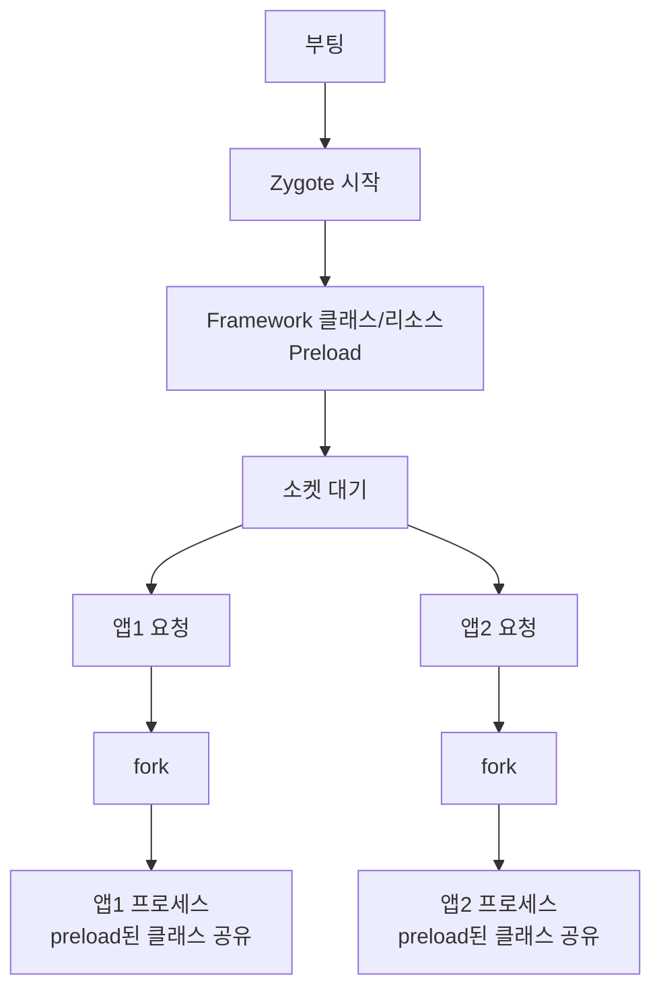
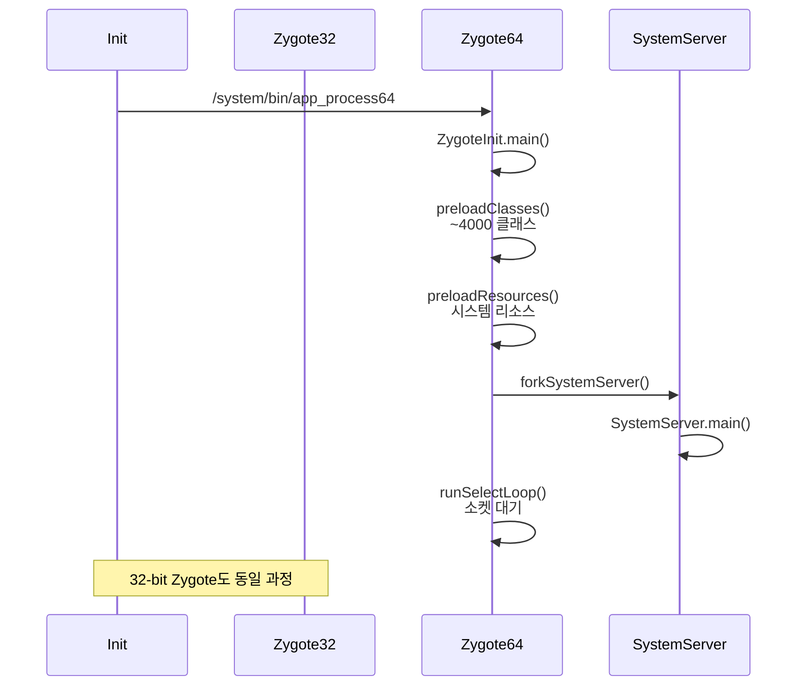
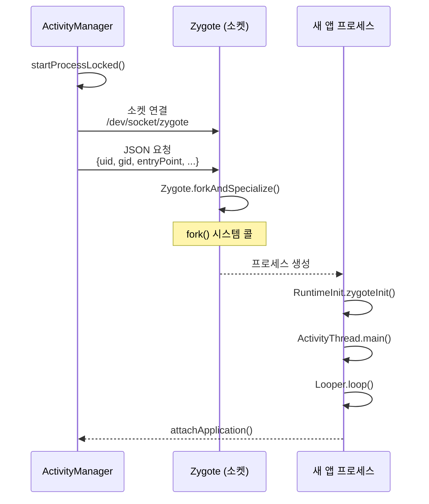
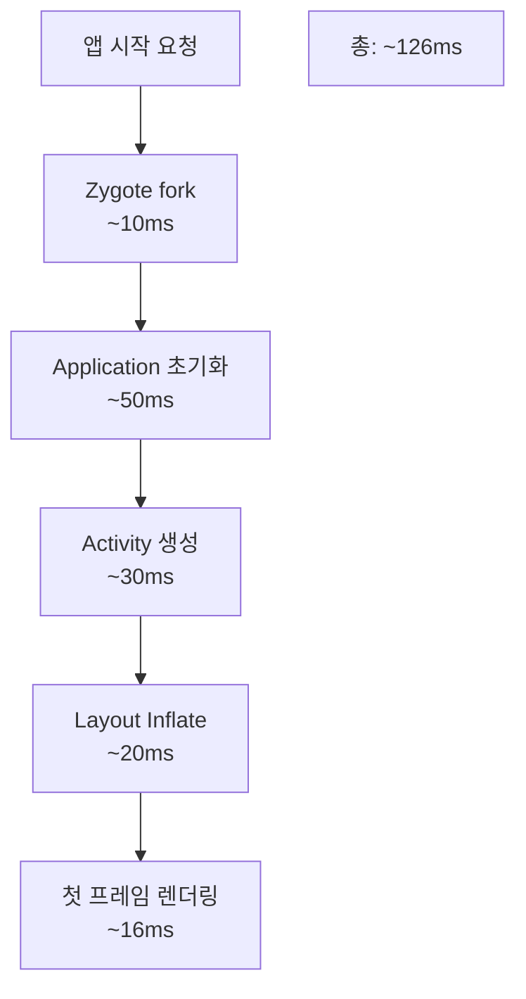

## Zygote 와 Android Runtime

Zygote 와 ART(Android Runtime) 는 안드로이드 앱 실행의 핵심이다. Zygote 는 **앱 프로세스를 빠르게 생성**하는 특수한 프로세스이고, ART 는 **DEX 바이트코드를 실행**하는 런타임이다. 이 두 가지가 협력하여 앱 시작 속도를 극적으로 개선하고 메모리를 효율적으로 사용한다.

### 왜 Zygote 가 필요했나

#### 모바일 앱 실행의 문제 (2000 년대 초반)

초기 안드로이드 개발 시 직면한 문제:

1. **빈번한 앱 시작**: 사용자가 앱을 자주 전환 (하루 수십~수백 번)
2. **시작 지연**: 새 프로세스 생성 + 런타임 초기화 + 클래스 로딩 → 수 초 소요
3. **메모리 낭비**: 각 앱이 독립적으로 Android Framework 클래스 로딩 → 수십 MB 중복

**전통적인 방식 (fork + exec)**:
```c
// 일반 Unix 프로세스 생성
pid_t pid = fork();
if (pid == 0) {
    execve("/system/bin/app_process", ...);  // 새 프로그램 로드
    // 문제: 모든 메모리 교체, 처음부터 다시 초기화
}
```

**측정된 문제**:
- 프로세스 생성: ~50ms
- Dalvik VM 초기화: ~200ms
- Framework 클래스 로딩 (Activity, View 등): ~500ms
- **총 앱 시작 시간: ~750ms** (사용자 체감 불가능)

#### Zygote 의 해결책

**핵심 아이디어**: 미리 초기화된 "템플릿" 프로세스를 만들고, 필요할 때 **복사 (fork)**만 한다.



**이점**:
1. **속도**: fork() 만 수행 (~10ms, exec 없음)
2. **메모리**: Copy-on-Write 로 클래스 공유 → 메모리 절약
3. **예측 가능**: 모든 앱이 동일한 상태에서 시작

---

## Zygote 동작 원리

### 부팅 과정에서의 Zygote



### Preloading 메커니즘

**ZygoteInit.java**:
```java
public static void main(String argv[]) {
    // 1. Native 라이브러리 로딩
    preloadNativeLibraries();
    
    // 2. 클래스 Preload
    preloadClasses();  // frameworks/base/config/preloaded-classes
    
    // 3. 리소스 Preload
    preloadResources();
    
    // 4. SharedLibrary Preload
    preloadSharedLibraries();
    
    // 5. 텍스트 렌더링 캐시
    preloadTextResources();
    
    // 6. WebView 초기화
    WebViewFactory.prepareWebViewInZygote();
    
    // 7. SystemServer 포크
    if (startSystemServer) {
        Runnable r = forkSystemServer(...);
        r.run();  // SystemServer 프로세스에서만 실행
    }
    
    // 8. 앱 요청 대기
    caller = zygoteServer.runSelectLoop(abiList);
}
```

**preloaded-classes 예시**:
```
android.app.Activity
android.view.View
android.widget.TextView
android.content.res.Resources
java.lang.String
java.util.ArrayList
...
```

총 ~4000 개 클래스, 순서는 런타임 프로파일링 결과 기반.

### 앱 프로세스 생성 흐름



**Zygote 소켓 요청 포맷**:
```
--runtime-args
--setuid=10123
--setgid=10123
--runtime-flags=0
--mount-external-default
--target-sdk-version=33
--nice-name=com.example.app
--seinfo=default
--instruction-set=arm64
com.android.internal.os.RuntimeInit
--application
com.android.server.SystemServer
```

**ForkAndSpecialize C++ 코드**:
```cpp
// dalvik/vm/native/dalvik_system_Zygote.cpp
static pid_t ForkAndSpecializeCommon(...) {
    pid_t pid = fork();
    
    if (pid == 0) {
        // 자식 프로세스 (새 앱)
        
        // 1. UID/GID 설정
        setgid(gid);
        setuid(uid);
        
        // 2. [[selinux|SELinux]] 컨텍스트 전환
        selinux_android_setcontext(uid, is_system_server, se_info, nice_name);
        
        // 3. Capabilities 설정
        SetCapabilities(permitted_capabilities, effective_capabilities);
        
        // 4. Seccomp 필터 적용
        SetSeccompFilter();
        
        // 5. 시그널 핸들러 재설정
        UnsetSignalHandlers();
        
        // 6. 파일 디스크립터 정리
        DetachDescriptors(env, fds_to_close);
        
        // 7. 프로세스 그룹 설정
        SetProcessName(nice_name);
        
        return pid;
    } else {
        // 부모 프로세스 (Zygote)
        return pid;
    }
}
```

### Copy-on-Write 메모리 공유

**fork() 직후**:
```
Zygote 프로세스:     [Code | Preloaded Classes | Heap]
                       ↑           ↑                ↑
앱 프로세스 1:        공유        공유             공유
앱 프로세스 2:        공유        공유             공유
```

**앱이 메모리 수정 시**:
```
Zygote:              [Code | Preloaded] | [Heap]
앱1:                  공유               | [Own Heap]  ← COW 발생
앱2:                  공유               | [Own Heap]
```

**메모리 절약 효과**:
- Preloaded classes: ~30MB
- 100 개 앱 실행 시: 30MB × 100 = 3GB → 실제 30MB + α
- **90% 이상 메모리 절약**

---

## Android Runtime (ART)

### Dalvik → ART 진화

#### Dalvik VM (Android 1.0 ~ 4.4)

**특징**:
- **JIT (Just-In-Time) 컴파일**: 실행 중 자주 쓰는 메서드를 네이티브 코드로 변환
- **레지스터 기반 VM**: 스택 기반 JVM 보다 모바일에 효율적
- **.dex 파일 포맷**: 여러 .class 를 하나로 합쳐 크기 절감

**문제점**:
- JIT 컴파일 시간이 앱 실행 시간에 포함 → 지연
- GC(Garbage Collection) 가 stop-the-world → UI 프레임 드롭
- 메모리 사용량 높음

#### ART (Android 5.0+)

2014 년 Android 5.0 Lollipop 에서 Dalvik 완전 교체.

**핵심 변화**:
1. **AOT (Ahead-Of-Time) 컴파일**: 앱 설치 시 네이티브 코드로 미리 변환
2. **Concurrent GC**: 백그라운드에서 GC 수행, UI 스레드 멈춤 최소화
3. **64-bit 지원**: ARMv8-A, x86-64

**컴파일 전략 진화**:

| Android 버전 | 컴파일 방식 | 특징 |
|-------------|-------------|------|
| **5.0-6.0** | Full AOT | 설치 시 모든 코드 컴파일<br/>설치 느림, 실행 빠름 |
| **7.0-8.1** | AOT + JIT + Profile | 자주 쓰는 코드만 AOT<br/>나머지는 JIT |
| **9.0+** | Cloud Profile | 사용자 프로파일 수집→구글 서버→다운로드 |
| **12.0+** | Baseline Profile | 개발자가 중요 경로 명시 |

### 컴파일 모드 상세

#### 1. Full AOT (Android 5.0~6.0)

```bash
# 설치 시
dex2oat --dex-file=/data/app/com.example/base.apk \
        --oat-file=/data/dalvik-cache/arm64/base.odex \
        --instruction-set=arm64
```

**장점**: 앱 실행이 빠름 (이미 네이티브 코드)
**단점**: 설치 시간 길어짐 (수 분), 저장 공간 많이 사용

#### 2. Profile-Guided Compilation (Android 7.0+)


**프로파일 파일** (`/data/misc/profiles/cur/0/com.example/primary.prof`):
```
# 자주 호출된 메서드 목록
Lcom/example/MainActivity;->onCreate(Landroid/os/Bundle;)V
Lcom/example/MainViewModel;->loadData()V
...
```

**컴파일 명령**:
```bash
# 프로파일 기반 컴파일
cmd package compile -m speed-profile -f com.example.app

# 전체 AOT
cmd package compile -m speed -f com.example.app

# 상태 확인
cmd package bg-dexopt-job
```

#### 3. Baseline Profile (개발자 정의)

앱 개발자가 중요한 코드 경로를 명시:

```kotlin
// app/src/main/baseline-prof.txt
HSPLandroidx/compose/ui/Modifier;->then(Landroidx/compose/ui/Modifier;)Landroidx/compose/ui/Modifier;
HSPLcom/example/ui/HomeScreen;->HomeScreen(...)V
```

빌드 시 APK 에 포함 → 설치 직후 해당 코드만 AOT 컴파일.

**효과** (Google 측정):
- 앱 시작 30% 빠름
- Jank(프레임 드롭) 27% 감소

---

## GC (Garbage Collection) 진화

### Dalvik GC

**Stop-the-World**: GC 실행 중 모든 앱 스레드 멈춤 → 16ms 목표 프레임 시간 초과 → Jank

```
Frame: 0ms ----GC(100ms)---- 116ms  ← 프레임 드롭!
```

### ART Concurrent Mark Sweep (Android 5.0~7.1)

**대부분 작업을 백그라운드**에서:
1. **Initial Mark**: 짧은 pause, 루트 마킹
2. **Concurrent Mark**: 앱 실행 중 힙 스캔
3. **Final Mark**: 짧은 pause, 나머지 마킹
4. **Concurrent Sweep**: 메모리 회수

**Pause 시간**: ~10ms (Dalvik 대비 90% 감소)

### ART Concurrent Copying (Android 8.0+)

**Compacting GC**: 메모리 단편화 제거

```
Before:  [Object A][ free ][Object B][ free ]
After:   [Object A][Object B][       free      ]
```

**Pause 시간**: ~3ms
**부작용**: Read Barrier 오버헤드 (~5% 성능 저하)

---

## App Startup Optimization

### Cold Start 성능 분석



### Baseline Profile 적용

```gradle
// app/build.gradle
plugins {
    id 'androidx.baselineprofile'
}

dependencies {
    baselineProfile(project(':baselineprofile'))
}
```

**프로파일 생성** (Macrobenchmark):
```kotlin
@Test
fun generateBaselineProfile() {
    baselineProfileRule.collect(
        packageName = "com.example.app",
        profileBlock = {
            startActivityAndWait()
            device.waitForIdle()
        }
    )
}
```

### App Startup Library

```kotlin
class MyInitializer : Initializer<Unit> {
    override fun create(context: Context) {
        // 초기화 작업 (라이브러리 설정 등)
    }
    
    override fun dependencies(): List<Class<out Initializer<*>>> {
        return listOf(WorkManagerInitializer::class.java)
    }
}
```

자동으로 의존성 순서 관리 + 병렬 초기화.

---

## 보안과 격리

### [[selinux|SELinux]] 도메인 전환

```bash
# Zygote 도메인
u:r:zygote:s0

# 앱 fork 후 도메인 전환
u:r:untrusted_app:s0:c512,c768  # 앱마다 고유 카테고리
```

정책 예시:

```bash
# Zygote가 untrusted_app으로 전환 가능
allow zygote untrusted_app:process transition;

# 앱이 자신의 데이터 디렉토리만 접근
allow untrusted_app app_data_file:dir { read write };
neverallow untrusted_app system_data_file:file write;
```

### Seccomp 필터

앱 프로세스에서 위험한 시스템 콜 차단:

```c
// bionic/libc/seccomp/
ALLOW(read);
ALLOW(write);
ALLOW(mmap);
DENY(ptrace);         // 다른 프로세스 디버깅 금지
DENY(setuid);         // 권한 상승 금지
DENY(mount);          // 파일시스템 조작 금지
```

위반 시:

```
F/libc: FORTIFY: syscall not allowed: 101 (ptrace)
```

### Isolated Process

특수한 격리 모드 (SDK 33+):

```xml
<service android:name=".MyService"
         android:isolatedProcess="true" />
```

**특징**:
- UID 99000~99999 범위 (임시 할당)
- 네트워크 접근 금지
- 저장소 접근 금지
- Binder 서비스 접근 제한

**용도**: 신뢰할 수 없는 코드 실행 (광고 SDK, WebView 렌더러)

---

## 디버깅과 프로파일링

### 컴파일 상태 확인

```bash
# 앱의 컴파일 상태
adb shell dumpsys package dexopt

# 출력 예:
# com.example.app
#   [arm64] /data/app/.../base.apk
#     [status=speed-profile] [reason=bg-dexopt]
```

**상태 종류**:
- `verify`: DEX 검증만
- `quicken`: Quicken 최적화 (deprecated)
- `speed-profile`: 프로파일 기반 AOT
- `speed`: 전체 AOT
- `everything`: 최대 최적화

### GC 로깅

```java
// 명시적 GC 호출 (디버깅용)
System.gc();

// Logcat
adb logcat | grep "GC"
// I/art: Explicit concurrent mark sweep GC freed 1234KB, 45% free
```

**Perfetto**:
```bash
perfetto -t 10s -o trace.perfetto sched freq idle am wm gfx view \
         binder_driver dalvik vm art gc
```

Perfetto UI 에서 확인:

- GC pause 시간
- 메모리 할당 패턴
- ART JIT 컴파일 이벤트

### 앱 시작 시간 측정

```bash
adb shell am start -W com.example.app/.MainActivity

# 출력:
# ThisTime: 512        # 이 Activity 시작 시간
# TotalTime: 612       # 프로세스 시작~화면 표시
# WaitTime: 623        # 시스템 지연 포함
```

---

## 고급 주제

### Zygote Preload 커스터마이징

OEM/커스텀 ROM 에서 preload 클래스 수정:

```xml
<!-- frameworks/base/config/preloaded-classes -->
android.app.Activity
com.example.CustomFramework  <!-- 추가 -->
```

재빌드 후:

```bash
adb root
adb shell stop zygote
adb push preloaded-classes /system/etc/
adb shell start zygote
```

### App Zygote (Android 10+)

앱이 자체 Zygote 를 만들어 자신의 자식 프로세스 생성:

```xml
<application android:zygotePreloadName=".MyZygotePreload" />
```

**용도**:
- WebView 렌더러 프로세스
- 게임 엔진 워커 프로세스

### Usap (Unspecialized App Process, Android 10+)

미리 fork 한 "예비" 프로세스 풀:

```
Zygote → [Usap1] [Usap2] [Usap3]  ← 대기 중
         ↓
       앱1 요청 → Usap1 특수화 → 앱1
```

**효과**: 앱 시작 시간 ~20% 단축

---

## 학습 리소스

**공식 문서**:
- [ART and Dalvik](https://source.android.com/docs/core/runtime)
- [App Startup](https://developer.android.com/topic/performance/vitals/launch-time)
- [Baseline Profiles](https://developer.android.com/topic/performance/baselineprofiles)

**소스 코드**:
- [ZygoteInit.java](https://cs.android.com/android/platform/superproject/+/master:frameworks/base/core/java/com/android/internal/os/ZygoteInit.java)
- [ART Runtime](https://cs.android.com/android/platform/superproject/+/master:art/runtime/)

**도구**:
- Android Studio Profiler
- Perfetto (GC, ART 이벤트)
- Macrobenchmark (Baseline Profile 생성)

---

## 연결 문서

[[android-kernel]] - Zygote fork 와 [[cpu-privilege-levels|프로세스 권한]]

[[android-binder-and-ipc]] - 프로세스 간 통신

[[android-init-and-services]] - Zygote 부팅 과정

[[selinux]] - 프로세스 격리와 도메인 전환

[[virtual-memory]] - Copy-on-Write 메커니즘

[[android-activity-manager-and-system-services]] - 앱 시작 요청 흐름
