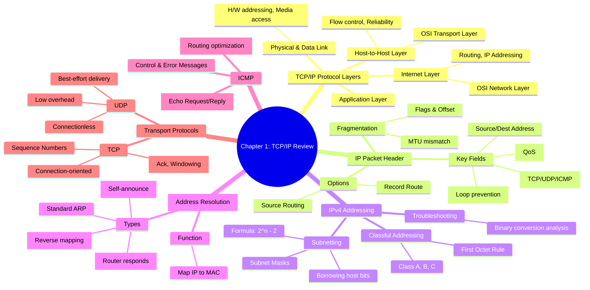

[[01_inbox/books/routing_tcp_ip_1/roadmap|📖 Return to Roadmap]]

### See Also
- [[01_inbox/books/tcp_ip_illustrated_1/chapter5|TCP/IP Illustrated Vol.1 - Ch.5 IP]]
- [[01_inbox/books/tcp_ip_illustrated_1/chapter4|TCP/IP Illustrated Vol.1 - Ch.4 ARP]]

### 1. Mermaid Mindmap 요약

---

### 2. 상세 Markdown 요약

**제1장: TCP/IP Review (TCP/IP 복습)**

이 장은 라우팅을 이해하기 위한 필수 기초인 TCP/IP 프로토콜 슈트의 핵심 구성 요소, 특히 인터넷 계층(Internet Layer)과 주소 지정(Addressing)에 중점을 두고 설명합니다.

#### 1. TCP/IP 프로토콜 계층 (TCP/IP Protocol Layers)

TCP/IP는 OSI 참조 모델보다 먼저 개발되었으며, 다음과 같은 계층 구조를 가집니다.
*   **물리 및 데이터 링크 계층:** OSI의 하위 2개 계층에 해당하며, 물리적 매체와 MAC 주소 같은 하드웨어 주소 지정을 담당합니다,.
*   **인터넷 계층 (Internet Layer):** OSI의 네트워크 계층에 해당하며, 논리적 경로(라우팅)와 IP 주소 지정, 패킷 포맷 정의를 담당합니다. 이 책의 주된 관심사입니다.
*   **호스트-대-호스트 계층 (Host-to-Host Layer):** OSI의 전송 계층에 해당하며, 종단 간(End-to-End) 논리적 연결과 흐름 제어를 담당합니다 (예: TCP, UDP).
*   **응용 계층 (Application Layer):** 사용자 애플리케이션 인터페이스를 제공하며, 일부 라우팅 프로토콜(BGP, RIP)도 이 계층에서 동작합니다.

#### 2. IP 패킷 헤더 (IP Packet Header)
라우팅 결정에 중요한 정보들이 IP 헤더에 포함되어 있습니다.
*   **TOS (Type of Service):** 패킷의 우선순위와 처리 방식을 지정합니다. 최근에는 DiffServ(Differentiated Services) 프레임워크로 재정의되어 DSCP(DiffServ Code Point)로 사용되며 QoS 구현에 활용됩니다,.
*   **Total Length & Identification/Flags:** 패킷의 전체 길이를 나타내며, MTU(Maximum Transmission Unit)보다 큰 패킷이 전송될 때 단편화(Fragmentation)를 제어하기 위해 사용됩니다. 'Don't Fragment (DF)' 비트는 MTU 경로 탐색에 유용합니다,.
*   **TTL (Time to Live):** 라우팅 루프를 방지하기 위해 사용됩니다. 라우터를 거칠 때마다 1씩 감소하며, 0이 되면 패킷은 폐기됩니다. Traceroute 유틸리티가 이 필드를 활용합니다,.
*   **Protocol:** 상위 계층 프로토콜(TCP=6, UDP=17, ICMP=1 등)을 식별합니다.
*   **Options:** 소스 라우팅(Source Routing), 경로 기록(Record Route) 등 테스트나 특수 목적을 위해 사용됩니다.

#### 3. IPv4 주소 지정 (IPv4 Addresses)
IP 주소는 32비트로 구성되며, 점으로 구분된 10진수(Dotted-Decimal)로 표기되지만, 라우터는 이를 이진수로 처리한다는 점을 기억해야 합니다,.

*   **클래스 주소 (First Octet Rule):** 네트워크 크기에 따라 클래스를 구분합니다. 첫 번째 옥텟의 비트 패턴으로 클래스를 식별합니다.
    *   **Class A:** 첫 비트 `0` (1~126). 대규모 네트워크용.
    *   **Class B:** 첫 두 비트 `10` (128~191). 중규모 네트워크용.
    *   **Class C:** 첫 세 비트 `110` (192~223). 소규모 네트워크용.
*   **서브넷과 서브넷 마스크 (Subnets and Masks):** 호스트 비트의 일부를 네트워크 비트로 빌려와 네트워크를 더 작은 단위로 나눕니다. 마스크는 IP 주소와 AND 연산을 통해 네트워크 주소를 판별하는 데 사용됩니다,.
*   **서브넷 설계:** 가용 서브넷과 호스트 수는 $2^n - 2$ 공식을 사용합니다(모두 0 또는 1인 경우 제외). 정확한 설계를 위해서는 이진수 레벨에서 계산하는 것이 필수적입니다,.

#### 4. ARP (Address Resolution Protocol)

논리적 IP 주소를 물리적 MAC 주소로 매핑하는 프로토콜입니다.
*   **동작 원리:** 송신자는 타겟 IP에 대한 ARP Request를 브로드캐스트하고, 타겟은 자신의 MAC 주소를 담아 ARP Reply를 유니캐스트합니다,.
*   **Proxy ARP:** 라우터가 자신의 인터페이스 MAC 주소로 타겟 호스트를 대신해 응답하는 기능으로, 호스트가 서브넷을 인식하지 못해도 통신이 가능하게 합니다.
*   **Gratuitous ARP:** 자신의 IP 주소에 대해 ARP 요청을 보내 중복 주소를 확인하거나, HSRP 등에서 변경된 MAC 주소를 알리는 데 사용됩니다.

#### 5. ICMP (Internet Control Message Protocol)

네트워크 관리를 위한 메시지 프로토콜입니다.
*   **Echo Request/Reply:** Ping 유틸리티에서 연결 확인을 위해 사용합니다.
*   **Redirect:** 라우터가 호스트에게 더 최적의 경로(다른 라우터)가 있음을 알릴 때 사용합니다.
*   **Router Discovery (IRDP):** 호스트가 로컬 라우터를 발견하는 데 사용됩니다.

#### 6. 호스트-대-호스트 계층 (Transport Layer)

*   **TCP (Transmission Control Protocol):** 연결 지향적이며 신뢰성 있는 전송을 보장합니다. 순서 번호(Sequence Number), 확인 응답(Ack), 윈도우(Windowing) 기능을 통해 데이터 손실을 복구하고 흐름을 제어합니다,.
*   **UDP (User Datagram Protocol):** 비연결형이며 신뢰성을 보장하지 않지만, 오버헤드가 적고 전송 속도가 빠릅니다. DNS, SNMP, RIP 등에서 사용됩니다.