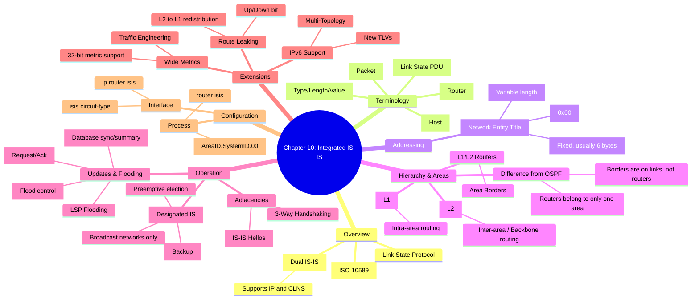

[[01_inbox/books/routing_tcp_ip_1/roadmap|📖 Return to Roadmap]]

## 1. Mermaid Mindmap 요약

---

## 2. 상세 Markdown 요약

**제 10 장: Integrated IS-IS (통합 IS-IS)**

이 장에서는 OSPF 의 대안이자 주로 서비스 제공업체 (ISP) 네트워크에서 사용되는 링크 상태 라우팅 프로토콜인 **Integrated IS-IS**를 다룹니다. 원래 OSI 프로토콜 스택 (CLNS) 을 위해 개발되었으나, IP 라우팅을 지원하도록 확장된 "통합 (Integrated)" 또는 "이중 (Dual)" IS-IS 의 동작 원리와 구성 방법을 설명합니다.

### 1. 개요 및 용어 (Overview & Terminology)

IS-IS 는 ISO 10589 에 정의된 링크 상태 프로토콜로, OSPF 와 유사하게 다익스트라 (Dijkstra) 알고리즘을 사용합니다. OSPF 와 달리 IETF 가 아닌 ISO 표준이므로 용어가 다릅니다.

- **IS (Intermediate System):** 라우터.
- **ES (End System):** 호스트.
- **PDU (Protocol Data Unit):** 패킷 (예: Hello PDU, LSP).
- **LSP (Link State PDU):** OSPF 의 LSA 와 유사하며, 링크 상태 정보를 전달합니다.
- **TLV (Type/Length/Value):** 가변 길이 필드를 사용하여 정보를 전달하는 방식으로, 프로토콜의 확장을 유연하게 만듭니다.

### 2. 주소 지정: NET (Network Entity Titles)

IP 라우팅만 수행하더라도 IS-IS 는 CLNS 주소 체계를 사용하여 라우터 자체를 식별합니다. 이를 **NET**이라고 합니다.

- **구성:** `Area ID` + `System ID` + `NSEL`
    - **Area ID:** 가변 길이 (1~13 바이트). 라우터가 속한 영역을 식별합니다.
    - **System ID:** 고정 길이 (Cisco 에서는 6 바이트). 영역 내에서 라우터를 고유하게 식별합니다 (OSPF 의 Router ID 와 유사).
    - **NSEL (NSAP Selector):** NET 에서는 항상 `0x00` 이어야 합니다.
- **특징:** 하나의 라우터는 하나의 System ID 를 가지며, Area ID 는 최대 3 개 (확장 시 그 이상) 까지 가질 수 있어 영역 마이그레이션 시 유용합니다.

### 3. 계층 구조 및 영역 (Hierarchy & Areas)

OSPF 와 마찬가지로 2 계층 구조를 가지지만, 영역의 경계 설정 방식이 다릅니다.

- **영역 경계:** OSPF 는 라우터 내부에 영역 경계가 있어 인터페이스별로 영역이 나뉘지만, **IS-IS 는 링크 위에 영역 경계가 있습니다**. 즉, 라우터 전체가 하나의 영역에 속합니다.
- **라우터 유형:**
    - **Level 1 (L1):** 동일 영역 내부 라우팅 (Intra-area). OSPF 의 Internal Router 와 유사합니다.
    - **Level 2 (L2):** 영역 간 라우팅 (Inter-area). 백본을 형성합니다.
    - **L1/L2:** 두 레벨 모두 수행하며 영역 간 경계 역할을 합니다. OSPF 의 ABR 과 유사합니다.
- **동작:** L1 라우터는 자신의 영역 밖을 모르며, 외부로 나가기 위해 가장 가까운 L1/L2 라우터에게 기본 경로 (Default Route) 를 설정합니다 (L1/L2 라우터가 LSP 의 **ATT 비트**를 설정하여 알림).

### 4. 인접성 및 지정 라우터 (Adjacencies & Designated Router)

- **Hello 프로토콜:** IIH(IS-IS Hello) PDU 를 교환하여 이웃을 발견합니다. OSPF 와 달리 Hello Interval 등이 일치하지 않아도 인접성을 맺을 수 있는 경우가 많습니다.
- **DIS (Designated IS):** 브로드캐스트 네트워크에서 OSPF 의 DR 과 같은 역할을 합니다.
    - **차이점 1:** **Backup DIS 가 없습니다**.
    - **차이점 2:** 선출이 **선점형 (Preemptive)**입니다. 우선순위가 더 높은 라우터가 등장하면 즉시 DIS 가 바뀝니다.
    - **차이점 3:** 모든 라우터는 DIS 뿐만 아니라 서로 간에도 인접성을 맺습니다.

### 5. 업데이트 프로세스 (Update Process)

- **LSP Flooding:** 링크 상태 정보를 전파합니다.
- **CSNP (Complete Sequence Number PDU):** 데이터베이스의 요약 정보를 담고 있습니다. 브로드캐스트 네트워크에서는 DIS 가 주기적으로 (기본 10 초) 보내 동기화를 유지하며, P2P 링크에서는 초기 동기화 시에만 사용됩니다.
- **PSNP (Partial Sequence Number PDU):** 특정 LSP 를 요청하거나 (Request), 수신을 확인 (Ack) 하는 데 사용됩니다.
- **Mesh Groups:** 풀 메시 (Full-mesh) 토폴로지에서 불필요한 플러딩을 방지하기 위해 사용되는 메커니즘입니다.

### 6. 확장 기능 및 IPv6 (Extensions & IPv6)

IS-IS 는 TLV 구조 덕분에 새로운 기능을 쉽게 추가할 수 있습니다.

- **Wide Metrics:** 기본 6 비트 메트릭의 한계를 극복하기 위해 32 비트 확장 메트릭을 지원합니다. 트래픽 엔지니어링 (TE) 등에 필수적입니다.
- **IPv6 지원:** 새로운 TLV(IPv6 Reachability, IPv6 Interface Address) 를 추가하여 IPv6 를 지원합니다. OSPFv3 처럼 프로토콜을 새로 만들 필요가 없습니다.
- **Multi-Topology (MT):** IPv4 와 IPv6 토폴로지가 다를 경우 각각 별도의 SPF 계산을 수행할 수 있도록 지원합니다.
- **Route Leaking:** L1/L2 라우터가 L2 경로 정보를 L1 영역으로 내려보내 (Leaking), L1 라우터가 최적의 출구를 찾을 수 있게 합니다. 루프 방지를 위해 **Up/Down 비트**를 사용합니다.

### 7. 구성 및 문제 해결 (Configuration & Troubleshooting)
- **기본 설정:**
    1. `router isis` 로 프로세스 활성화.
    2. `net <NET주소>` 로 주소 설정.
    3. 인터페이스 모드에서 `ip router isis` (또는 `ipv6 router isis`) 로 활성화.
- **문제 해결:**
    - `show clns is-neighbors`: 이웃 관계 확인 (System ID, State, Type 등).
    - `show isis database`: 링크 상태 데이터베이스 확인.
    - **IP 주소 매칭:** 같은 서브넷에 있지 않아도 인접성을 맺을 수 있지만 (IP unnumbered 등), 일반적인 경우 IP 서브넷이 일치해야 올바르게 동작합니다.
