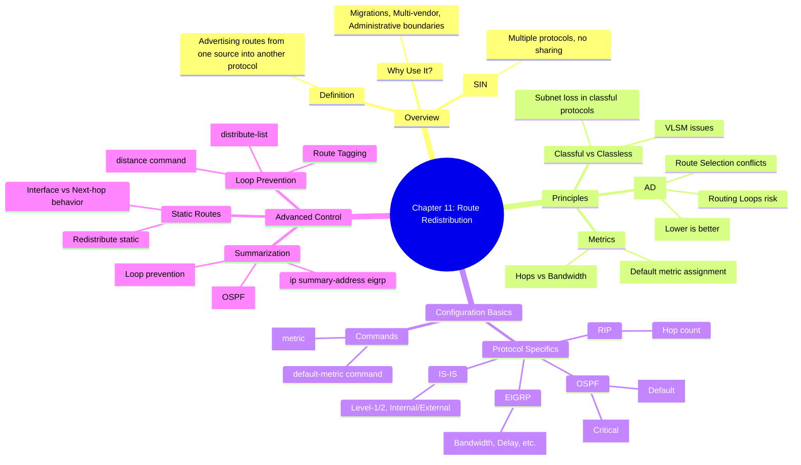

[[01_inbox/books/routing_tcp_ip_1/roadmap|📖 Return to Roadmap]]

## 1. Mermaid Mindmap 요약

---

## 2. 상세 Markdown 요약

**제 11 장: Route Redistribution (경로 재분배)**

이 장에서는 서로 다른 라우팅 프로토콜 간에 경로 정보를 교환하는 **경로 재분배 (Route Redistribution)**의 원리, 구성 방법, 그리고 발생할 수 있는 문제 (루프, 최적 경로 실패) 와 해결책을 다룹니다.

### 1. 재분배의 개요 (Overview)

- **정의:** 한 라우팅 프로토콜 (또는 정적 경로, 직접 연결된 경로) 을 통해 학습한 경로 정보를 다른 라우팅 프로토콜의 업데이트 메시지에 포함시켜 광고하는 것입니다.
- **필요성:** 부서 합병, 다중 벤더 장비 사용, 마이그레이션, 혹은 특정 설계 (예: Dial-up 환경에서 정적 경로와 동적 라우팅의 결합) 등을 위해 사용됩니다.
- **Ships in the Night (SIN):** 하나의 라우터에서 여러 라우팅 프로토콜이 돌지만, 서로 경로를 교환하지 않고 독립적으로 동작하는 상태를 말합니다. 재분배를 설정해야만 이들이 정보를 공유합니다.

### 2. 재분배의 원칙 (Principles)

서로 다른 프로토콜은 "언어"가 다르기 때문에 다음과 같은 근본적인 차이를 고려해야 합니다.

- **메트릭 (Metrics):** 각 프로토콜은 경로 비용을 계산하는 방식이 다릅니다 (예: RIP 은 홉 수, OSPF 는 비용, EIGRP 는 대역폭/지연). 따라서 재분배 시 **시드 메트릭 (Seed Metric)** 또는 **기본 메트릭 (Default Metric)**을 반드시 정의하여, 받는 쪽 프로토콜이 이해할 수 있는 값으로 변환해야 합니다,.
- **관리 거리 (Administrative Distances, AD):** 라우터가 동일한 목적지에 대해 서로 다른 프로토콜로부터 경로를 학습할 때, 어떤 정보를 신뢰할지 결정하는 값입니다.
    - 기본값: EIGRP(90) < OSPF(110) < RIP(120).
    - **문제점:** 재분배 시 AD 차이로 인해 최적 경로가 아닌 경로가 선택되거나 (Suboptimal Routing), **라우팅 루프**가 발생할 수 있습니다,.
- **클래스풀 vs 클래스리스:** 클래스리스 프로토콜 (OSPF, EIGRP) 에서 클래스풀 프로토콜 (RIPv1, IGRP) 로 재분배할 때, VLSM(가변 길이 서브넷 마스크) 정보가 손실될 수 있습니다. 클래스풀 프로토콜은 자신의 인터페이스 마스크와 일치하지 않는 서브넷 정보를 무시할 수 있습니다,.

### 3. 재분배 구성 (Configuring Redistribution)

기본 명령어는 `redistribute <source-protocol> [options]` 입니다.

- **메트릭 설정:**
    - `default-metric`: 해당 프로세스로 재분배되는 모든 경로에 대한 기본값을 설정합니다.
    - `metric` 키워드: 특정 `redistribute` 명령어 내에서 우선적으로 적용되는 메트릭을 설정합니다.
- **OSPF 재분배:**
    - **`subnets` 키워드:** 이 키워드가 없으면 주 네트워크 (Major network) 만 재분배되고 서브넷은 무시됩니다. 반드시 사용해야 합니다,.
    - **메트릭 타입:** 기본값은 **E2**(비용 고정) 입니다. 내부 비용을 누적하려면 **E1**으로 변경해야 합니다.
- **EIGRP 재분배:** 대역폭, 지연, 신뢰성, 부하, MTU 의 5 가지 복합 메트릭 값을 명시해야 합니다.
- **IS-IS 재분배:** 레벨 (L1/L2) 과 메트릭 타입 (Internal/External) 을 지정할 수 있습니다.

### 4. 고급 기능 및 제어 (Advanced Control)

- **경로 요약 (Summarization):** 재분배 지점 (ASBR) 에서 경로를 요약하여 테이블 크기를 줄일 수 있습니다.
    - OSPF: `summary-address` 사용.
    - EIGRP: 인터페이스 레벨에서 `ip summary-address eigrp` 사용.
    - **Null0 인터페이스:** 요약 경로 생성 시, 루프 방지를 위해 Null0 인터페이스로 향하는 경로가 라우팅 테이블에 자동 생성됩니다.
- **정적 경로 재분배:** `redistribute static` 을 사용합니다. 만약 정적 경로가 Next-hop IP 대신 **출구 인터페이스**를 가리키면, 해당 경로는 "직접 연결된 (Directly Connected)" 것으로 간주되어 `redistribute connected` 등의 영향을 받을 수 있습니다.
- **루프 방지 및 경로 제어:**
    - 다중 지점에서 양방향 재분배 (Mutual Redistribution) 를 할 때 루프 위험이 큽니다.
    - **Route Filtering:** `distribute-list` 를 사용하여 특정 경로의 재분배를 차단합니다.
    - **Distance 변경:** `distance` 명령어를 사용하여 특정 라우터에서 학습한 경로의 AD 값을 높여, 내부 경로를 선호하도록 유도할 수 있습니다.
    - **Route Tagging:** 경로에 태그를 붙여 재분배 시 필터링에 활용합니다 (14 장에서 상세히 다룸).
