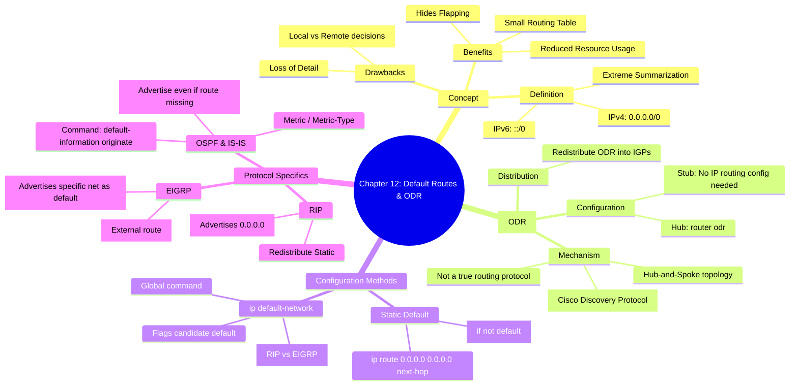

[[01_inbox/books/routing_tcp_ip_1/roadmap|📖 Return to Roadmap]]

### 1. Mermaid Mindmap 요약

---

### 2. 상세 Markdown 요약

**제12장: Default Routes and On-Demand Routing (디폴트 경로와 ODR)**

이 장에서는 라우팅 테이블 크기를 최소화하고 토폴로지 변화를 숨기는 가장 극단적인 형태의 요약인 **디폴트 경로(Default Route)**의 개념과, Cisco 전용 기능인 **ODR(On-Demand Routing)**, 그리고 각 라우팅 프로토콜에서 디폴트 경로를 생성하고 전파하는 방법을 다룹니다.

#### 1. 디폴트 경로의 기초 (Fundamentals of Default Routes)

*   **개념:** 디폴트 경로는 가능한 모든 IP 주소를 요약한 것입니다(IPv4: `0.0.0.0/0`, IPv6: `::/0`). 라우터는 패킷의 목적지가 라우팅 테이블의 어떤 상세 경로와도 일치하지 않을 때 디폴트 경로를 사용합니다.
*   **용도:** 인터넷 연결 지점이나 허브-앤-스포크(Hub-and-Spoke) 토폴로지의 스터브(Stub) 라우터에서 주로 사용됩니다.
*   **장단점:**
    *   **장점:** 라우팅 테이블 크기를 줄여 메모리와 CPU를 절약하고, 외부 네트워크의 불안정성(Flapping)이 내부로 전파되는 것을 막습니다.
    *   **단점:** 경로의 세부 정보가 사라지므로, 트래픽이 최적의 경로가 아닌 곳으로 전송될 수 있습니다(예: Los Angeles에서 Seattle로 갈 때, 더 가까운 San Francisco 대신 San Diego로 잘못된 디폴트 경로를 탈 수 있음).

#### 2. On-Demand Routing (ODR)

ODR은 정적 경로 설정의 관리적 부담을 줄이기 위해 Cisco IOS 11.2부터 도입된 기능으로, 진정한 라우팅 프로토콜이라기보다는 **CDP(Cisco Discovery Protocol)**를 활용한 경로 발견 메커니즘입니다.

*   **동작 원리:** 허브 라우터만 설정하면 됩니다. 스터브 라우터는 CDP를 통해 자신의 연결된 네트워크 정보를 허브에게 보냅니다(IP Prefix 정보 포함). 스터브 라우터는 허브를 가리키는 디폴트 경로만 있으면 됩니다.
*   **설정:** 허브 라우터에서 `router odr` 명령어를 사용합니다.
*   **재분배:** 허브 라우터는 ODR로 학습한 경로를 OSPF, EIGRP 등 다른 동적 라우팅 프로토콜로 재분배할 수 있습니다 (`redistribute odr`).

#### 3. 디폴트 경로 구성 및 전파 (Configuring Default Routes)

디폴트 경로가 올바르게 동작하려면 라우터가 **클래스리스 라우트 조회(Classless Route Lookups)**를 수행해야 합니다. 그렇지 않으면 주 네트워크 번호는 일치하지만 서브넷이 일치하지 않는 패킷이 디폴트 경로를 타지 못하고 드롭될 수 있습니다. (`ip classless` 명령어로 활성화).

**프로토콜별 생성 방법:**

*   **정적 설정 (Static):**
    *   `ip route 0.0.0.0 0.0.0.0 <next-hop>` 명령어로 설정합니다.
    *   이 정적 경로를 동적 라우팅 프로토콜로 재분배(`redistribute static`)하여 이웃에게 알립니다.

*   **ip default-network 명령어:**
    *   IGRP, EIGRP, RIP에서 사용되는 글로벌 명령어입니다. 특정 네트워크를 후보 디폴트 경로로 지정합니다.
    *   **RIP:** 이 명령어를 사용하면 0.0.0.0 네트워크를 광고합니다.
    *   **EIGRP:** 지정된 실제 네트워크 주소를 디폴트로 표시하여 광고합니다.

*   **OSPF 및 IS-IS:**
    *   `redistribute` 명령어를 사용하지 않고, **`default-information originate`** 명령어를 사용합니다.
    *   **always 옵션:** 라우팅 테이블에 디폴트 경로가 실제로 존재하지 않더라도 강제로 디폴트 경로를 광고하게 합니다. 이는 디폴트 경로가 자주 변경(Flapping)될 때 안정성을 높이는 데 유용합니다.
    *   **IPv6:** OSPFv3와 IS-IS에서도 `default-information originate` 명령어를 사용하여 `::/0` 디폴트 경로를 생성합니다.