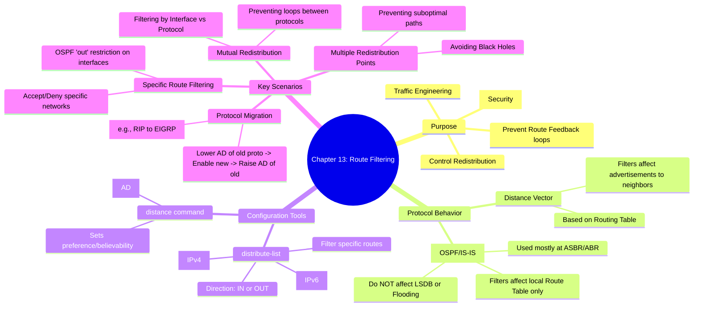

[[01_inbox/books/routing_tcp_ip_1/roadmap|📖 Return to Roadmap]]

### 1. Mermaid Mindmap 요약

---

### 2. 상세 Markdown 요약

**제13장: Route Filtering (경로 필터링)**

이 장에서는 라우팅 프로토콜 간의 재분배 시 발생할 수 있는 라우팅 루프, 피드백, 최적 경로 실패 등을 방지하고, 네트워크 보안 및 트래픽 제어를 수행하기 위한 **경로 필터링** 기술을 다룹니다.

#### 1. 경로 필터링의 목적과 원리

경로 필터링은 라우팅 테이블에 입력되거나 광고되는 경로를 규제하는 규칙입니다.
*   **주요 목적:** 재분배 시 잘못된 방향으로 경로가 광고되는 **라우트 피드백(Route Feedback)** 방지, 라우팅 도메인 분리(Subdomains), 보안을 위한 **라우트 방화벽(Route firewall)** 역할 수행 등이 있습니다,.
*   **프로토콜별 동작 차이:**
    *   **거리 벡터 (RIP, EIGRP 등):** 라우팅 테이블을 기반으로 광고하므로, 필터링은 이웃에게 보내는 광고에 직접적인 영향을 미칩니다.
    *   **링크 상태 (OSPF, IS-IS):** 링크 상태 데이터베이스(LSDB)를 동기화해야 하므로, 필터링은 **로컬 라우터의 라우팅 테이블**에만 영향을 미치며, 이웃에게 플러딩되는 LSA나 LSDB에는 영향을 주지 않습니다. 따라서 링크 상태 프로토콜에서는 주로 ASBR이나 ABR과 같은 경계 라우터에서 사용됩니다.

#### 2. 경로 필터링 구성 (Configuring Route Filters)

경로 필터링은 주로 `distribute-list`를 사용한 특정 경로 차단과 `distance` 명령어를 사용한 관리 거리(AD) 조작으로 수행됩니다.

*   **특정 경로 필터링 (Filtering Specific Routes):**
    *   **IPv4:** `distribute-list <access-list> <in | out> [interface]` 명령어를 사용합니다. 표준 또는 확장 액세스 리스트를 참조하여 허용할 네트워크를 지정합니다.
    *   **IPv6:** `distribute-list prefix-list <name> <in | out> [interface]` 명령어를 사용하여 프리픽스 리스트를 참조합니다.
    *   **OSPF 제약사항:** 링크 상태 프로토콜인 OSPF에서는 인터페이스에 대해 `out` 방향으로 `distribute-list`를 적용할 수 없습니다. 이는 OSPF가 라우트가 아닌 LSA를 플러딩하기 때문입니다.

*   **관리 거리 조작 (distance command):**
    *   서로 다른 프로토콜에서 동일한 경로를 학습할 때, `distance` 명령어를 통해 특정 프로토콜이나 특정 라우터로부터 학습한 경로의 **신뢰도(Administrative Distance)**를 조정하여 경로 선택을 제어합니다.

#### 3. 주요 활용 시나리오 (Key Scenarios)

*   **재분배와 라우트 피드백 방지:**
    *   서로 다른 프로토콜(예: RIP과 OSPF) 간에 **상호 재분배(Mutual Redistribution)**를 할 때, RIP에서 가져온 경로가 다시 RIP으로 들어가는 루프를 막기 위해 필터링이 필수적입니다.
    *   인터페이스 단위로 필터링하거나, 라우팅 프로세스 단위(`distribute-list out rip` 등)로 필터링할 수 있습니다. 단, 프로세스 단위 필터링은 광고는 막지만 로컬 테이블에 잘못된 경로가 설치되는 것을 막지 못할 수 있어, 인터페이스 레벨의 `in` 필터링이 피드백 방지에 더 효과적입니다.

*   **프로토콜 마이그레이션 (Protocol Migration):**
    *   기존 프로토콜(예: RIP)에서 새로운 프로토콜(예: EIGRP)로 전환할 때, `distance` 명령어를 사용하여 안전하게 전환할 수 있습니다.
    *   **절차:**
        1.  기존 프로토콜(RIP)의 AD를 낮춤 (예: 70).
        2.  새 프로토콜(EIGRP, AD 90) 설정 (RIP이 우선하므로 영향 없음).
        3.  기존 프로토콜(RIP)의 AD를 기본값(120)으로 복구. 이때 EIGRP 경로가 우선하게 되며 자연스럽게 트래픽이 넘어갑니다,.

*   **다중 재분배 지점 (Multiple Redistribution Points):**
    *   두 개 이상의 라우터가 동일한 두 도메인을 연결할 때, AD 차이로 인해 최적 경로가 아닌 경로(예: 내부 경로 대신 외부에서 재분배된 경로)를 선택하거나 루프가 발생할 수 있습니다.
    *   해결책으로 `distribute-list`를 사용하여 특정 경로의 유입을 차단하거나, `distance` 명령어를 사용하여 특정 라우터나 특정 경로에 대한 AD를 낮춰서 선호 경로를 강제할 수 있습니다,.