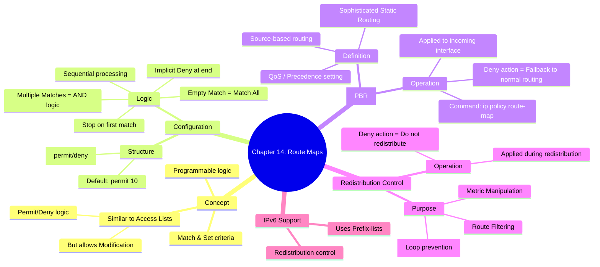

[[01_inbox/books/routing_tcp_ip_1/roadmap|📖 Return to Roadmap]]

## 1. Mermaid Mindmap 요약

---

## 2. 상세 Markdown 요약

**제 14 장: Route Maps (루트 맵)**

이 장에서는 액세스 리스트 (ACL) 보다 훨씬 강력하고 유연한 제어 기능을 제공하는 **루트 맵 (Route Maps)**에 대해 다룹니다. 루트 맵은 단순한 패킷 필터링을 넘어, 라우팅 정보를 변경하거나 정책 기반 라우팅 (Policy-Based Routing, PBR) 을 구현하는 데 핵심적인 역할을 합니다.

### 1. 루트 맵의 기본 개념 및 구성 (Basic Uses & Configuration)

루트 맵은 프로그래밍 로직과 유사하게 동작하며, 특정 조건 (**Match**) 을 만족하는 패킷이나 경로에 대해 특정 동작 (**Set**) 을 수행하거나 허용/거부 (**Permit/Deny**) 를 결정합니다.

- **구조:** `route-map <map-tag> [permit | deny] [sequence-number]` 명령어로 정의합니다.
    - **시퀀스 번호 (Sequence Number):** 여러 구문으로 구성된 루트 맵을 순서대로 처리하며, 특정 구문만 삽입하거나 삭제할 수 있게 해줍니다. 번호를 지정하지 않으면 기본값은 10 입니다,.
    - **처리 로직:** ACL 과 마찬가지로 위에서 아래로 순차적으로 검사하며, 일치하는 항목을 찾으면 처리를 중단하고 해당 동작을 수행합니다. 끝까지 일치하는 항목이 없으면 **암시적 거부 (Implicit Deny)**가 적용됩니다,.
- **Match 와 Set:**
    - **Match:** 패킷이나 경로를 식별하는 조건입니다. Match 구문이 없으면 "모든 것과 일치 (Match Everything)"하는 것으로 간주합니다.
    - **Set:** Match 된 대상에 대해 수행할 변경 작업 (예: 메트릭 변경, Next-hop 변경, 태그 설정 등) 을 정의합니다.
    - **논리 연산:** 하나의 route-map 구문 안에 여러 개의 `match` 명령어가 있으면, 모든 조건이 만족되어야 하는 **AND 연산**으로 처리됩니다.

### 2. 정책 라우팅 (Policy Routing - PBR)

정책 라우팅은 목적지 주소만을 기반으로 경로를 결정하는 전통적인 라우팅 방식을 넘어, 소스 주소, 프로토콜 유형, 패킷 크기 등 다양한 요소를 기반으로 패킷을 포워딩하는 기술입니다. 이는 "복잡한 정적 라우팅 (Sophisticated static routes)"으로 볼 수 있습니다.

- **동작 원리:** 인터페이스에 들어오는 (Incoming) 패킷에 대해 적용되며, `ip policy route-map <map-name>` 명령어를 사용합니다,.
- **Deny 동작의 의미:** PBR 에서 루트 맵의 `deny` 문에 매치되면, 패킷을 버리는 것이 아니라 **일반 라우팅 테이블을 사용하여 포워딩**합니다 (PBR 을 적용하지 않음).
- **활용 사례:**
    - **경로 분산:** 특정 부서 (소스 서브넷) 의 트래픽은 ISP 1 로, 다른 부서의 트래픽은 ISP 2 로 보내는 등 트래픽 엔지니어링에 사용됩니다.
    - **QoS (Quality of Service):** 중요 트래픽 (예: 보안 시스템 데이터) 은 고속 링크로 보내고 IP Precedence 를 높게 설정하며, 덜 중요한 트래픽 (예: 웹 서핑) 은 저속 링크로 보내는 등의 차별화된 서비스를 제공할 수 있습니다,.

### 3. 재분배 제어 (Route Maps for Redistribution)

루트 맵은 서로 다른 라우팅 프로토콜 간의 재분배 (Redistribution) 시 경로를 필터링하거나 속성을 변경하는 데 필수적인 도구입니다.

- **동작 원리:** `redistribute` 명령어와 함께 사용되어 라우팅 테이블에 등록된 경로가 다른 프로토콜로 광고되기 전에 검사 및 수정합니다.
- **Deny 동작의 의미:** 재분배에서 루트 맵의 `deny` 문에 매치되면, 해당 경로는 **재분배되지 않습니다** (광고 차단).
- **주요 기능:**
    - **경로 태깅 (Route Tagging):** 외부 라우팅 프로토콜에서 재분배된 경로에 태그 (Tag) 를 붙여 추적하거나, 다시 원래 도메인으로 재분배되는 것을 방지 (루프 방지) 하는 데 사용됩니다,. 예를 들어, RIP 에서 OSPF 로 재분배할 때 태그를 설정하고, 다른 라우터가 OSPF 에서 RIP 로 재분배할 때 해당 태그가 있는 경로는 차단할 수 있습니다.
    - **메트릭 조작:** 특정 경로에 대해서만 다른 메트릭이나 메트릭 유형 (예: OSPF E1 vs E2) 을 설정할 수 있습니다,.

### 4. IPv6 지원 (IPv6 Support)

루트 맵은 IPv6 환경에서도 동일하게 동작합니다. IPv4 의 액세스 리스트 대신 **Prefix-list**를 `match` 조건으로 사용하여 재분배되는 IPv6 경로를 제어하거나 정책 라우팅을 수행할 수 있습니다,.
