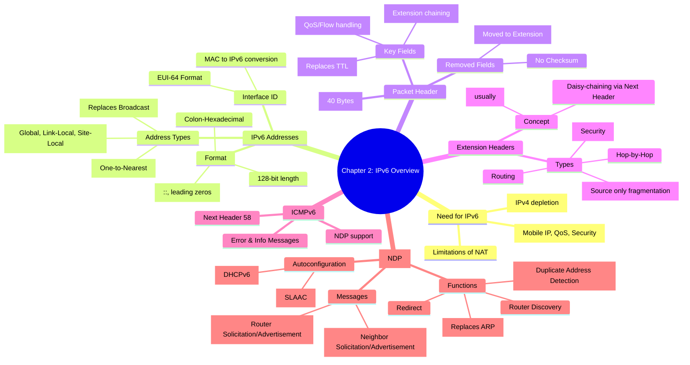

[[01_inbox/books/routing_tcp_ip_1/roadmap|📖 Return to Roadmap]]

## See Also
- [[01_inbox/books/tcp_ip_illustrated_1/chapter2|TCP/IP Illustrated Vol.1 - Ch.2 Internet Address Architecture]]

## 1. Mermaid Mindmap 요약

---

## 2. 상세 Markdown 요약

**제 2 장: IPv6 Overview (IPv6 개요)**

이 장은 IPv4 주소 고갈 문제와 NAT(Network Address Translation) 의 한계를 극복하기 위해 등장한 IPv6 의 구조, 주소 체계, 헤더 포맷, 그리고 핵심 동작 원리인 NDP(Neighbor Discovery Protocol) 를 다룹니다.

### 1. IPv6 의 필요성 및 주소 표기 (IPv6 Addresses)

IPv4 주소 공간의 고갈과 NAT 로 인한 종단 간 (End-to-End) 투명성 상실은 IPv6 도입의 주된 원인입니다. IPv6 는 128 비트 주소 체계를 사용하여 사실상 무한한 주소를 제공합니다.

- **주소 표기법:** 16 비트씩 8 개 블록으로 나누어 콜론 (:) 으로 구분된 16 진수로 표기합니다.
    - **압축 규칙 1:** 각 블록의 선행 0(leading zeros) 은 생략 가능합니다.
    - **압축 규칙 2:** 연속된 0 의 블록들은 더블 콜론 (`::`) 으로 대체할 수 있습니다. 단, 주소당 한 번만 사용 가능합니다.
- **주소 유형:**
    - **Unicast:** 단일 인터페이스 식별. Global Unicast(2000::/3), Link-Local(FE80::/10) 등이 있습니다.
    - **Multicast:** 여러 인터페이스 그룹 식별. IPv4 의 Broadcast 를 대체합니다.
    - **Anycast:** 여러 인터페이스에 할당되지만, 라우팅 토폴로지상 가장 가까운 (nearest) 인터페이스로 전달됩니다.

### 2. IPv6 패킷 헤더 (IPv6 Packet Header Format)

IPv6 헤더는 처리 효율성을 위해 고정 길이 (40 바이트) 를 가지며 불필요한 필드가 제거되었습니다.

- **Flow Label:** 패킷의 흐름을 식별하여 QoS 처리를 돕기 위해 신설된 필드입니다.
- **Next Header:** IPv4 의 Protocol 필드와 유사하지만, 상위 계층 프로토콜뿐만 아니라 확장 헤더 (Extension Header) 를 연결하는 데 사용됩니다.
- **Hop Limit:** IPv4 의 TTL(Time to Live) 과 동일한 기능을 하며, 이름이 기능을 더 명확히 반영하도록 변경되었습니다.
- **제거된 필드:** Checksum(상위 계층이나 데이터 링크 계층에서 처리), Fragmentation 관련 필드 (기본 헤더에서 제거됨) 등이 있습니다.

### 3. 확장 헤더 (Extension Headers)

IPv4 옵션 필드의 비효율성을 개선하기 위해, IPv6 는 확장 헤더를 사용하여 선택적 기능을 구현합니다. 확장 헤더는 `Next Header` 필드를 통해 체인처럼 연결됩니다.

- **처리 방식:** Hop-by-Hop 옵션 헤더를 제외한 모든 확장 헤더는 경로상의 라우터가 아닌 최종 목적지 노드에서만 처리되므로 라우팅 성능이 향상됩니다.
- **단편화 (Fragmentation):** IPv6 라우터는 패킷을 단편화하지 않습니다. 단편화는 오직 소스 노드에서만 수행되며, Fragment 확장 헤더를 사용합니다.

### 4. ICMPv6

IPv4 의 ICMP 기능을 포함하여 IGMP(멀티캐스트 그룹 관리) 와 ARP(주소 해석) 기능까지 통합한 프로토콜입니다. Next Header 값은 58 입니다.

- **주요 기능:** 에러 보고 (Destination Unreachable 등), 정보 메시지 (Echo Request/Reply), 그리고 NDP 메시지 처리를 담당합니다.

### 5. 이웃 탐색 프로토콜 (Neighbor Discovery Protocol - NDP)

IPv4 의 ARP, RARP, ICMP Redirect, Router Discovery 기능을 대체하고 개선한 프로토콜입니다. 링크 - 로컬 (Link-Local) 범위의 멀티캐스트를 사용합니다.

- **주요 메시지 (ICMPv6 메시지 타입):**
    - **RS (Router Solicitation, Type 133):** 호스트가 라우터를 찾기 위해 보냅니다.
    - **RA (Router Advertisement, Type 134):** 라우터가 자신의 존재와 프리픽스 정보 등을 주기적으로 또는 요청에 의해 알립니다.
    - **NS (Neighbor Solicitation, Type 135):** IPv4 의 ARP Request 와 유사하게, 특정 IPv6 주소의 링크 계층 주소를 알아내거나 이웃의 도달 가능성을 확인 (NUD) 할 때 사용합니다.
    - **NA (Neighbor Advertisement, Type 136):** NS 에 대한 응답 또는 자신의 정보 변경을 알릴 때 사용합니다.
    - **Redirect (Type 137):** 더 나은 경로를 호스트에게 알릴 때 사용합니다.
- **주소 자동 설정 (Address Autoconfiguration):**
    - **Stateless (SLAAC):** DHCP 서버 없이 라우터의 RA 메시지 (Prefix 정보) 와 자신의 MAC 주소를 기반으로 생성한 Interface ID(EUI-64) 를 결합하여 주소를 생성합니다.
    - **EUI-64 변환:** 48 비트 MAC 주소 중간에 `FFFE` 를 삽입하고, 7 번째 비트 (U/L 비트) 를 반전시켜 64 비트 Interface ID 를 만듭니다.
    - **DAD (Duplicate Address Detection):** 주소를 사용하기 전에 NS 메시지를 보내 중복 여부를 반드시 확인해야 합니다.
