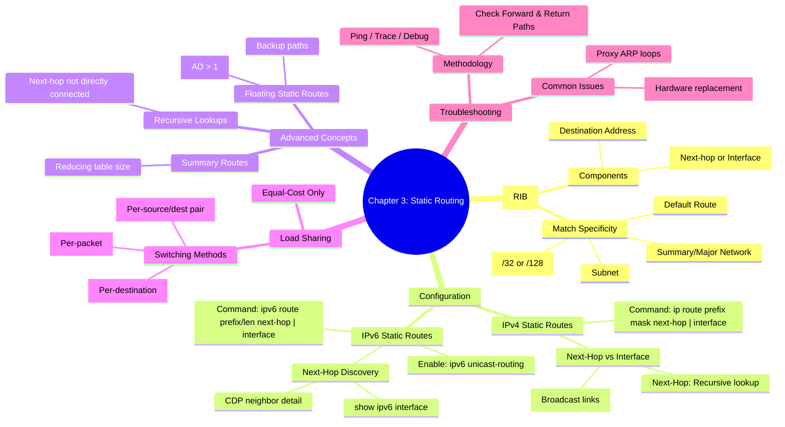

[📖 Return to Roadmap](../tcp_ip_illustrated_1/roadmap.md)

## 1. Mermaid Mindmap 요약

---

## 2. 상세 Markdown 요약

**제 3 장: Static Routing (정적 라우팅)**

이 장에서는 라우터가 패킷을 전달하기 위해 사용하는 정보가 저장되는 **라우트 테이블 (Route Table)**의 구조와, 관리자가 수동으로 경로를 입력하는 **정적 라우팅 (Static Routing)**의 구성 및 문제 해결 방법을 다룹니다.

### 1. 라우트 테이블 (The Route Table)

라우트 테이블 (RIB) 은 전송/네트워크 계층이 논리적 경로를 통해 데이터를 전달하기 위해 필요한 정보를 저장합니다.

- **필수 정보:** 각 경로 항목은 최소한 **목적지 주소 (Destination address)**와 그 목적지로 가기 위한 **포인터 (Pointer)**를 포함해야 합니다. 포인터는 직접 연결된 인터페이스이거나 다음 홉 (Next-hop) 라우터의 주소입니다.
- **매칭 우선순위 (Specificity):** 라우터는 패킷의 목적지 주소와 가장 구체적으로 일치하는 경로를 선택합니다 (Longest Match). 우선순위는 다음과 같습니다:
    1. Host address (호스트 경로)
    2. Subnet (서브넷)
    3. Group of subnets (Summary route)
    4. Major network number
    5. Supernet
    6. Default address (기본 경로)

### 2. 정적 경로 구성 (Configuring Static Routes)

정적 라우팅은 네트워크 토폴로지 변경 시 수동 재구성이 필요하지만, 동적 라우팅보다 정밀한 제어가 가능합니다.

- **IPv4 정적 경로:**
    - 명령어: `ip route <network> <mask> <next-hop-address | exit-interface>`.
    - **Next-hop 주소 지정:** 라우터가 해당 주소의 연결 인터페이스를 찾기 위해 재귀적 조회 (Recursive Lookup) 를 수행합니다.
    - **출구 인터페이스 지정:** 라우터는 해당 네트워크가 직접 연결된 것으로 간주합니다. 브로드캐스트 인터페이스 (Ethernet 등) 에서 사용 시, 모든 목적지에 대해 ARP 요청을 보내게 되므로 **Proxy ARP**에 의존하게 되며 과도한 ARP 트래픽과 테이블 부하를 유발할 수 있습니다. 따라서 브로드캐스트 네트워크에서는 Next-hop 주소를 함께 지정하는 것이 좋습니다.
- **IPv6 정적 경로:**
    - 먼저 `ipv6 unicast-routing` 명령어로 IPv6 라우팅을 활성화해야 합니다.
    - 명령어: `ipv6 route <prefix>/<length> <next-hop | interface>`.
    - **Next-hop 찾기:** IPv6 의 링크 로컬 주소나 EUI-64 주소는 예측하기 어렵기 때문에, `show cdp neighbor detail` 명령어를 통해 인접 라우터의 주소를 확인하여 설정에 활용할 수 있습니다.

### 3. 고급 정적 라우팅 기법
- **요약 경로 (Summary Routes):** 여러 개의 세부 서브넷 경로 대신 하나의 요약된 경로를 정적 경로로 설정하여 라우팅 테이블의 크기를 줄일 수 있습니다.
- **플로팅 정적 경로 (Floating Static Routes):** 주 경로가 실패했을 때만 사용되는 백업 경로입니다. 정적 경로의 **Administrative Distance(AD)**를 기본값 (1) 보다 높게 설정 (예: 50) 하여, 동적 라우팅 프로토콜이나 주 정적 경로가 사라졌을 때만 라우팅 테이블에 등록되도록 합니다.
- **재귀적 테이블 조회 (Recursive Table Lookups):** 정적 경로의 Next-hop 이 직접 연결된 라우터가 아닌 경우, 라우터는 해당 Next-hop 에 도달하기 위해 라우팅 테이블을 다시 조회해야 합니다. 이는 라우터의 처리 부하를 늘리지만, 네트워크 변경 시 설정 변경을 최소화하는 설계에 활용될 수 있습니다.

### 4. 부하 분산 (Load Sharing)

정적 라우팅은 **동일 비용 (Equal-cost)** 경로에 대해서만 부하 분산을 지원합니다. 부하 분산 방식은 스위칭 방식에 따라 달라집니다.

- **Process Switching:** **패킷 단위 (Per-packet)** 로 부하를 분산합니다. CPU 부하가 높습니다.
- **Fast Switching:** **목적지 단위 (Per-destination)** 로 부하를 분산합니다. 목적지별로 캐시를 생성하여 처리합니다.
- **CEF (Cisco Express Forwarding):** 기본적으로 **소스 - 목적지 쌍 (Per source-destination pair)** 단위로 부하를 분산합니다. `ip load-sharing per-packet` 명령어로 패킷 단위 분산도 가능합니다.

### 5. 문제 해결 (Troubleshooting)
- **경로 추적:** 문제 발생 시 `ping` 과 `traceroute` 를 사용하여 경로를 확인하되, 반드시 **돌아오는 경로 (Return path)**도 확인해야 합니다.
- **Proxy ARP 문제:** 인터페이스를 가리키는 정적 경로 설정 시, 잘못된 장비가 Proxy ARP 로 응답하여 트래픽이 엉뚱한 곳으로 향하거나 라우팅 루프가 발생할 수 있습니다.
- **하드웨어 교체와 IPv6:** EUI-64 형식의 주소를 사용하는 IPv6 정적 경로가 설정된 경우, 라우터나 인터페이스 카드를 교체하면 MAC 주소 변경에 따라 링크 로컬 주소가 바뀌어 정적 경로가 무효화될 수 있습니다.
