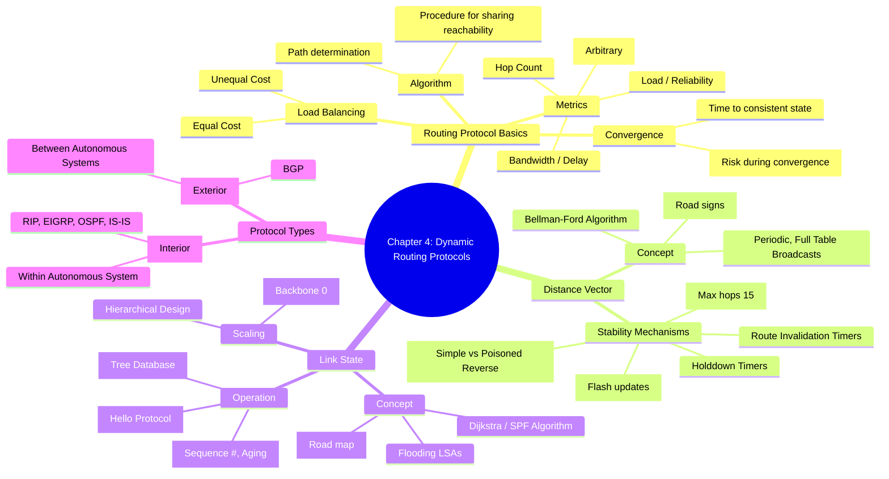

[[01_inbox/books/routing_tcp_ip_1/roadmap|📖 Return to Roadmap]]

### 1. Mermaid Mindmap 요약

---

### 2. 상세 Markdown 요약

**제4장: Dynamic Routing Protocols (동적 라우팅 프로토콜)**

이 장은 정적 라우팅에서 벗어나, 라우터들이 자동으로 경로 정보를 교환하고 토폴로지 변화에 적응하는 **동적 라우팅 프로토콜**의 기본 원리와 두 가지 주요 알고리즘(Distance Vector, Link State)을 비교 분석합니다.

#### 1. 라우팅 프로토콜 기초 (Routing Protocol Basics)
동적 라우팅 프로토콜은 네트워크의 가용성 및 상태 정보를 공유하기 위한 언어입니다. 모든 라우팅 알고리즘은 경로 결정, 정보 교환 절차, 그리고 토폴로지 변화에 대한 반응 절차를 포함해야 합니다.

*   **메트릭 (Metrics):** 최적의 경로를 선택하기 위해 경로에 할당하는 값입니다.
    *   **Hop Count:** 거치는 라우터의 수.
    *   **Bandwidth/Delay:** 링크의 대역폭과 전송 지연 시간.
    *   **Load/Reliability:** 트래픽 부하량과 링크의 에러율.
    *   **Cost:** 관리자가 임의로 지정하거나 링크 특성에 기반한 값.
*   **수렴 (Convergence):** 모든 라우터가 네트워크 토폴로지에 대해 일관된 정보를 갖게 되는 상태입니다. 수렴 시간(Convergence time)은 빠를수록 좋으며, 수렴되지 않은 상태에서는 라우팅 루프가 발생할 수 있습니다,.
*   **부하 분산 (Load Balancing):** 동일한 목적지로 가는 여러 경로에 트래픽을 분산시키는 것입니다. 대부분의 프로토콜은 동일 비용(Equal-cost) 부하 분산을 지원하며, EIGRP와 같은 일부 프로토콜은 불균등 비용(Unequal-cost) 부하 분산도 지원합니다.

#### 2. 거리 벡터 라우팅 프로토콜 (Distance Vector Routing Protocols)

거리(Distance)와 방향(Vector) 정보를 기반으로 라우팅하며, **Bellman-Ford 알고리즘**을 사용합니다. 라우터는 이웃 라우터가 주는 정보를 전적으로 신뢰해야 하므로 **"소문에 의한 라우팅(Routing by rumor)"**이라고도 하며, 도로 표지판(Road sign)에 비유됩니다,.

*   **동작 특성:** 주기적으로(Periodic) 전체 라우팅 테이블을 이웃에게 브로드캐스트합니다.
*   **루프 방지 및 안정화 메커니즘:**
    *   **Split Horizon:** 정보를 학습한 인터페이스로는 해당 정보를 다시 보내지 않습니다. **Poisoned Reverse**를 사용하는 경우, 해당 경로를 "도달 불가능(infinite metric)"으로 표시하여 역으로 광고함으로써 더 안전하게 루프를 방지합니다,.
    *   **Counting to Infinity:** 루프 발생 시 홉 카운트가 무한히 증가하는 것을 막기 위해, 최대 홉(예: RIP의 경우 16)을 정의하여 이를 초과하면 도달 불가능으로 간주합니다.
    *   **Triggered Updates (Flash Updates):** 주기적 업데이트를 기다리지 않고, 변경 사항이 발생한 즉시 업데이트를 보냅니다.
    *   **Holddown Timers:** 특정 경로가 실패했다는 정보를 받으면, 일정 시간 동안 해당 경로에 대한 덜 좋은 정보(루프일 가능성이 있는 정보)를 무시하여 테이블 안정성을 높입니다.

#### 3. 링크 상태 라우팅 프로토콜 (Link State Routing Protocols)

**Dijkstra의 SPF(Shortest Path First) 알고리즘**을 사용합니다. 각 라우터는 네트워크 전체의 연결 상태 정보(Link-State)를 수집하여 **위상 데이터베이스(Topological Database)**를 구축합니다. 이는 전체 지도를 가지고 직접 경로를 계산하는 것과 같아 **"도로 지도(Road map)"**에 비유됩니다.

*   **동작 과정:**
    1.  **Hello 프로토콜:** 이웃(Neighbor)을 발견하고 인접성(Adjacency)을 맺습니다.
    2.  **LSA Flooding:** 자신의 링크 상태 정보(Link State Advertisement)를 영역 내 모든 라우터에게 전달(Flooding)합니다.
    3.  **SPF 계산:** 모든 라우터가 동일한 데이터베이스를 갖게 되면, 각자 자신을 루트(Root)로 하는 최단 경로 트리(Shortest Path Tree)를 계산합니다.
*   **플러딩 제어:** LSA의 중복 처리를 막고 최신 정보를 유지하기 위해 **Sequence Numbers(순서 번호)**와 **Aging(에이징)**을 사용합니다. 순서 번호 공간으로는 Linear, Circular, Lollipop 방식 등이 있습니다,.
*   **영역 (Areas):** 대규모 네트워크에서 데이터베이스 크기와 SPF 계산 부하를 줄이기 위해 네트워크를 계층적 영역으로 나눕니다. 백본 영역(Area 0)이 다른 영역들을 연결합니다,.

#### 4. IGP와 EGP (Interior and Exterior Gateway Protocols)

라우팅 프로토콜은 자율 시스템(Autonomous System, AS)을 기준으로 분류됩니다. AS는 공통된 관리 하에 있는 네트워크 집합입니다.

*   **IGP (Interior Gateway Protocol):** AS 내부에서 사용됩니다 (예: RIP, EIGRP, OSPF, IS-IS).
*   **EGP (Exterior Gateway Protocol):** AS 간의 라우팅에 사용됩니다 (예: BGP).
*   참고: IGRP/EIGRP에서는 AS 번호를 프로세스 도메인을 식별하는 용도로 사용하기도 합니다,.

#### 5. 정적 vs 동적 라우팅 (Static or Dynamic Routing?)

동적 라우팅이 항상 정답은 아닙니다. 동적 라우팅은 토폴로지 변화에 자동 대응하지만 CPU, 메모리, 대역폭을 소비합니다. 반면, 정적 라우팅은 관리가 번거롭지만 리소스 소모가 적고 경로 제어가 명확합니다. 허브 앤 스포크(Hub-and-spoke)와 같은 단순한 구조에서는 정적 라우팅이 더 효율적일 수 있습니다.