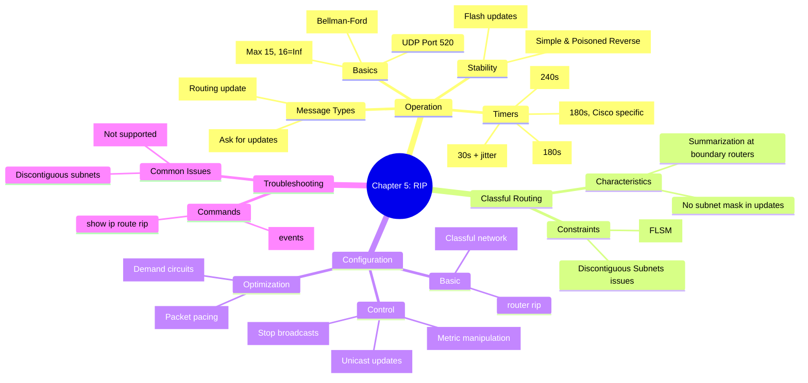

[[01_inbox/books/routing_tcp_ip_1/roadmap|📖 Return to Roadmap]]

## 1. Mermaid Mindmap 요약

---

## 2. 상세 Markdown 요약

**제 5 장: Routing Information Protocol (RIP)**

이 장에서는 가장 오래되고 널리 사용되는 거리 벡터 라우팅 프로토콜 중 하나인 **RIP(Routing Information Protocol) 버전 1**의 동작 원리, 구성 방법, 그리고 문제 해결 방법을 다룹니다.

### 1. RIP 의 동작 (Operation of RIP)

RIP 는 **UDP 포트 520**을 사용하며, **거리 벡터 (Distance Vector)** 알고리즘 (Bellman-Ford) 을 기반으로 합니다.

- **메시지 유형:**
    - **Request:** 이웃 라우터에게 전체 또는 특정 경로 정보를 요청할 때 사용합니다. 라우터가 처음 부팅될 때 브로드캐스트됩니다.
    - **Response:** 요청에 대한 응답 또는 주기적인 업데이트 메시지입니다. 자신의 라우팅 테이블 정보를 담고 있습니다.
- **메트릭 (Metric):** **홉 수 (Hop Count)**를 사용합니다. 1 은 직접 연결된 네트워크를 의미하며, **16 은 도달 불가능 (Unreachable)**을 의미합니다. 이는 네트워크 지름을 최대 15 홉으로 제한합니다.
- **타이머 (Timers):** 안정성을 위해 여러 타이머를 사용합니다.
    - **Update Timer:** 기본값 **30 초**. 라우팅 테이블을 주기적으로 브로드캐스트합니다. 동기화를 방지하기 위해 랜덤 변수 (Jitter) 가 추가됩니다.
    - **Invalid Timer (Expiration):** 기본값 **180 초**. 이 시간 동안 업데이트가 없으면 해당 경로를 홀드다운 상태로 변경하거나 도달 불가능 (메트릭 16) 으로 표시합니다.
    - **Flush Timer (Garbage Collection):** 기본값 **240 초**. 이 시간이 지나면 라우팅 테이블에서 경로를 완전히 삭제합니다.
    - **Holddown Timer:** 기본값 **180 초**. Cisco 구현에서 사용되며, 경로 실패 정보가 전파될 때까지 잘못된 갱신 정보를 받아들이지 않도록 대기합니다.
- **안정화 기능:** 루프 방지를 위해 Split Horizon(단순 및 포이즌 리버스), Triggered Updates(토폴로지 변경 시 즉시 업데이트) 등을 사용합니다.

### 2. 클래스풀 라우팅 (Classful Routing)

RIPv1 은 **클래스풀 (Classful)** 라우팅 프로토콜입니다. 이는 라우팅 업데이트 패킷에 **서브넷 마스크 정보를 포함하지 않음**을 의미합니다.

- **서브넷 마스크 결정:** 라우터는 수신된 패킷의 목적지 주소가 직접 연결된 주 네트워크 (Major Network) 에 속하면 해당 인터페이스의 서브넷 마스크를 적용합니다. 그렇지 않으면 클래스 A, B, C 의 기본 마스크를 적용합니다.
- **제약 사항:**
    - **FLSM (Fixed Length Subnet Mask):** 동일한 주 네트워크 내에서는 모든 서브넷 마스크가 동일해야 합니다 (VLSM 지원 불가).
    - **자동 요약 (Automatic Summarization):** 네트워크 경계 라우터 (Boundary Router) 에서 다른 주 네트워크로 정보를 보낼 때, 서브넷 정보를 숨기고 주 네트워크 주소만 요약하여 전달합니다.
    - **불연속 서브넷 (Discontiguous Subnets):** 자동 요약으로 인해, 동일한 주 네트워크의 서브넷들이 다른 네트워크에 의해 분리되어 있을 경우 라우팅 정보가 모호해져 통신이 실패할 수 있습니다.

### 3. RIP 구성 (Configuring RIP)

RIP 설정은 비교적 간단하지만, 네트워크 환경에 따라 세밀한 조정이 필요할 수 있습니다.

- **기본 설정:** `router rip` 명령어로 프로세스를 시작하고, `network <major-network-number>` 명령어로 RIP 를 활성화할 인터페이스를 지정합니다. 서브넷이 아닌 클래스풀 주소를 입력해야 합니다.
- **패시브 인터페이스 (Passive Interface):** `passive-interface` 명령어를 사용하여 특정 인터페이스로 라우팅 업데이트가 나가는 것을 막을 수 있습니다. 하지만 들어오는 업데이트는 계속 수신합니다.
- **유니캐스트 업데이트 (Unicast Updates):** `passive-interface` 와 `neighbor` 명령어를 조합하면, 브로드캐스트 대신 특정 이웃에게만 유니캐스트로 업데이트를 보낼 수 있습니다. 이는 비브로드캐스트 네트워크나 보안이 필요한 경우 유용합니다.
- **불연속 서브넷 해결:** 클래스풀 프로토콜의 한계를 극복하기 위해 **Secondary Address**를 사용하여 논리적으로 네트워크를 연결하는 방법이 있습니다.
- **메트릭 조작 (Offset-list):** `offset-list` 명령어를 사용하여 수신하거나 송신하는 경로의 메트릭 (홉 수) 을 인위적으로 증가시켜 경로 선택을 제어할 수 있습니다.
- **업데이트 최적화:** 시리얼 링크 등 대역폭이 낮은 구간에서는 `ip rip triggered` 명령어를 사용하여 주기적인 업데이트 대신 변경 시에만 업데이트를 보내도록 설정할 수 있습니다.

### 4. 문제 해결 (Troubleshooting)

- **명령어:**
    - `show ip route rip`: RIP 로 학습한 경로만 확인합니다.
    - `debug ip rip`: RIP 업데이트 송수신 내역을 실시간으로 확인합니다.
- **주요 문제:**
    - 서브넷 마스크 불일치 (VLSM 사용 시도).
    - 불연속 서브넷으로 인한 경로 요약 문제.
    - Split Horizon 으로 인한 경로 광고 누락 확인.
