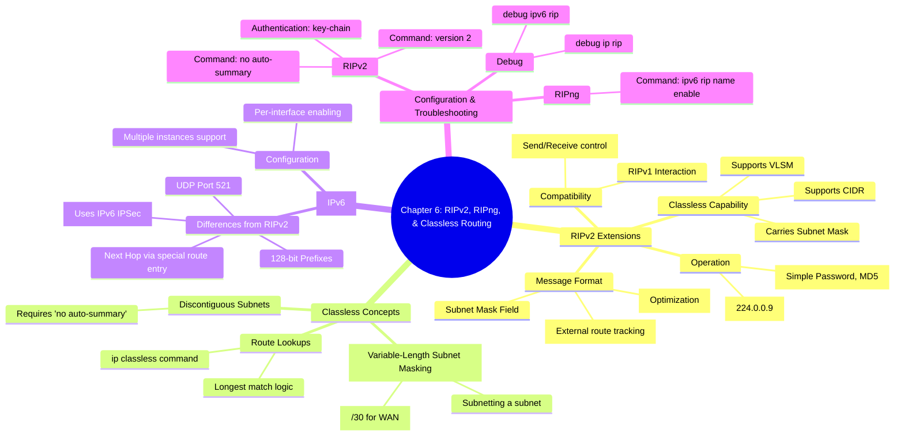

[[01_inbox/books/routing_tcp_ip_1/roadmap|📖 Return to Roadmap]]

### 1. Mermaid Mindmap 요약

---

### 2. 상세 Markdown 요약

**제6장: RIPv2, RIPng, and Classless Routing (RIPv2, RIPng 및 클래스리스 라우팅)**

이 장에서는 RIPv1의 한계를 극복하기 위해 확장된 **RIPv2**, 클래스리스 라우팅의 핵심 개념인 **VLSM**, 그리고 IPv6를 지원하기 위한 **RIPng**에 대해 다룹니다.

#### 1. RIPv2의 동작 및 확장 (Operation of RIPv2)

RIPv2는 새로운 프로토콜이 아니라 RIPv1의 확장이므로, 기본 타이머와 절차는 동일하지만 메시지 포맷의 사용하지 않던 필드(Unused fields)를 활용하여 기능을 추가했습니다.
*   **메시지 포맷 확장:**
    *   **Subnet Mask:** 각 경로 엔트리에 서브넷 마스크를 포함하여 **클래스리스(Classless)** 라우팅을 지원합니다.
    *   **Next Hop:** 업데이트를 보내는 라우터보다 목적지에 더 가까운 라우터가 동일 서브넷에 있을 경우, 그 라우터의 주소를 명시하여 최적 경로를 안내합니다.
    *   **Route Tag:** 외부 라우팅 프로토콜에서 재분배된 경로를 추적하기 위해 태그(예: AS 번호)를 붙일 수 있습니다.
*   **멀티캐스트 업데이트:** 브로드캐스트 대신 **224.0.0.9** 멀티캐스트 주소를 사용하여, RIP을 실행하지 않는 호스트의 부하를 줄입니다.
*   **호환성 (Compatibility):** RIPv2는 RIPv1과 하위 호환성을 가질 수 있으며, 인터페이스별로 전송/수신 버전을 제어할 수 있습니다.

#### 2. 클래스리스 라우팅과 VLSM (Classless Routing & VLSM)

클래스리스 라우팅 프로토콜은 업데이트 패킷에 서브넷 마스크를 포함함으로써 주소 클래스의 제약을 벗어납니다.
*   **VLSM (Variable-Length Subnet Masking):** 서브넷을 다시 서브넷팅하는 개념입니다. 이를 통해 링크의 필요에 따라 다양한 크기의 마스크를 사용할 수 있습니다. 예를 들어, 포인트-투-포인트 시리얼 링크에는 `/30` 마스크를 사용하여 주소 낭비를 최소화할 수 있습니다,.
*   **클래스리스 라우트 조회 (Classless Route Lookups):** 목적지 주소와 가장 길게 일치하는(Longest match) 경로를 선택하며, 클래스 경계를 무시합니다. Cisco IOS 11.3 이후부터는 기본 동작입니다.

#### 3. 인증 (Authentication)

RIPv2는 보안을 위해 라우팅 업데이트 인증 기능을 제공합니다.
*   **단순 암호 (Simple Password):** 평문으로 암호를 전송하므로 보안에 취약합니다.
*   **MD5 인증:** 메시지 다이제스트 알고리즘을 사용하여 암호화된 체크섬을 전송하므로 더 안전합니다. Cisco 라우터는 Key Chain을 사용하여 키 관리를 수행합니다.

#### 4. RIPng (RIP next generation)

IPv6를 위한 RIP 버전으로, RFC 2080에 정의되어 있습니다. RIPv2와 유사한 알고리즘을 사용하지만 독립적인 프로토콜입니다.
*   **주요 특징:**
    *   **UDP 포트 521**을 사용합니다.
    *   IPv4를 지원하지 않으며 IPv6만 지원합니다.
    *   **인증 제거:** RIPng 자체의 인증 메커니즘이 없으며, IPv6의 AH/ESP 헤더(IPSec)를 사용하여 보안을 처리합니다.
    *   **Next Hop 처리:** 각 경로 항목마다 Next Hop 필드를 두는 대신, **Next Hop Entry**라는 특별한 라우트 엔트리(Metric 0xFF)를 사용하여 그 뒤에 나오는 경로들의 다음 홉을 지정합니다.
*   **설정 방식의 차이:** 전역 라우팅 프로세스에서 네트워크를 선언하는 것이 아니라, 각 **인터페이스 레벨**에서 `ipv6 rip <process-name> enable` 명령어로 활성화합니다. 이를 통해 링크별로 여러 RIPng 프로세스를 돌릴 수도 있습니다.

#### 5. 구성 및 문제 해결 (Configuration & Troubleshooting)

*   **RIPv2 구성:** `router rip` 모드에서 `version 2` 명령어로 활성화합니다. 불연속 서브넷(Discontiguous Subnets) 통신을 위해 `no auto-summary` 명령어가 필수적일 수 있습니다.
*   **인증 설정:** Key Chain을 정의하고 인터페이스 모드에서 `ip rip authentication key-chain` 및 `ip rip authentication mode` 명령어를 사용합니다.
*   **RIPng 구성:** `ipv6 unicast-routing`을 활성화한 후, 인터페이스에서 RIPng 프로세스를 시작합니다.
*   **문제 해결:** `debug ip rip`, `debug ipv6 rip` 명령어를 통해 업데이트 송수신 내역을 확인할 수 있으며, 버전 불일치나 인증 실패 등의 문제를 파악할 수 있습니다.