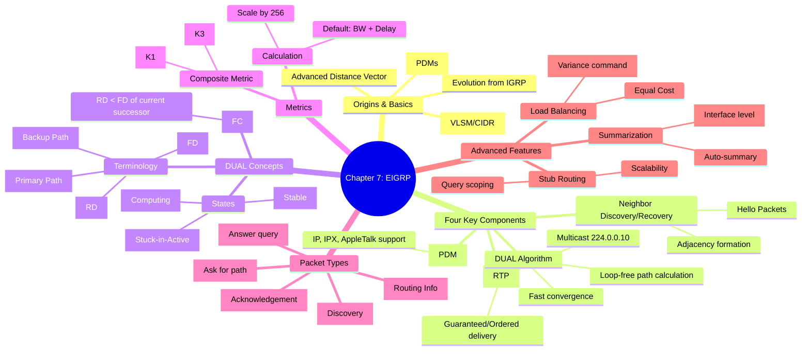

[📖 Return to Roadmap](../tcp_ip_illustrated_1/roadmap.md)

## 1. Mermaid Mindmap 요약

---

## 2. 상세 Markdown 요약

**제 7 장: Enhanced Interior Gateway Routing Protocol (EIGRP)**

이 장에서는 Cisco 전용 프로토콜인 IGRP 에서 발전하여, 거리 벡터 (Distance Vector) 의 특성과 링크 상태 (Link-State) 의 장점을 결합한 고급 라우팅 프로토콜인 **EIGRP**의 동작 원리, DUAL 알고리즘, 구성 및 문제 해결 방법을 다룹니다.

### 1. IGRP 에서 EIGRP 로의 진화 (The Roots: From IGRP to EIGRP)

EIGRP 는 IGRP 의 한계 (홉 카운트 제한, 클래스풀 라우팅 등) 를 극복하기 위해 개발되었습니다.

- **하이브리드 특성:** EIGRP 는 거리 벡터 프로토콜로 분류되지만, 링크 상태 프로토콜처럼 부분 업데이트 (Partial updates) 와 네이버 관계를 유지하여 빠른 수렴을 보장합니다.
- **주요 개선점:**
    - **클래스리스 라우팅:** VLSM 및 CIDR 을 지원합니다.
    - **다중 프로토콜 지원:** IP 뿐만 아니라 IPX, AppleTalk 등을 동시에 라우팅할 수 있습니다.
    - **메트릭 호환:** IGRP 의 복합 메트릭을 그대로 사용하되, 32 비트 정밀도를 위해 256 을 곱하여 확장했습니다.

### 2. EIGRP 의 4 가지 주요 구성 요소 (Operation of EIGRP)

EIGRP 는 다음 4 가지 핵심 기술을 기반으로 동작합니다,.

1. **프로토콜 종속 모듈 (Protocol-Dependent Modules - PDM):** IP, IPX, AppleTalk 등 각 네트워크 계층 프로토콜에 맞는 라우팅 작업을 처리하고 DUAL 에 정보를 전달합니다.
2. **신뢰할 수 있는 전송 프로토콜 (Reliable Transport Protocol - RTP):** EIGRP 패킷의 배달을 보장하고 순서를 유지합니다. 멀티캐스트 주소 **224.0.0.10**을 사용하며, 필요한 경우 유니캐스트로 재전송하여 신뢰성을 확보합니다.
3. **이웃 발견 및 복구 (Neighbor Discovery/Recovery):** Hello 패킷을 주기적으로 전송하여 인접 라우터 (Neighbor) 를 식별하고 상태를 유지합니다. Hello 간격 (기본 5 초 또는 60 초) 과 Hold 시간 (Hello 간격의 3 배) 을 사용합니다.
4. **확산 업데이트 알고리즘 (Diffusing Update Algorithm - DUAL):** EIGRP 의 핵심 엔진으로, 모든 순간에 루프 없는 경로를 계산하고 토폴로지 변경 시 빠른 수렴을 제공합니다.

### 3. DUAL 알고리즘과 용어 (DUAL Concepts)

DUAL 은 전체 네트워크 토폴로지를 알지 못해도 이웃이 제공한 정보만으로 루프 없는 경로를 보장합니다. 이를 위해 다음과 같은 개념을 사용합니다,.

- **Feasible Distance (FD):** 현재 라우터에서 목적지까지의 최적 메트릭 (거리) 입니다.
- **Reported Distance (RD) / Advertised Distance (AD):** 이웃 라우터가 목적지까지 도달하는 데 걸리는 메트릭입니다.
- **Successor (후속 라우터):** 목적지까지의 최단 경로 (최소 FD) 를 제공하는 이웃 라우터입니다. 라우팅 테이블에 등록됩니다.
- **Feasible Successor (FS, 피저블 후속 라우터):** 루프가 없는 백업 경로를 제공하는 이웃 라우터입니다. FS 가 되기 위해서는 **적합성 조건 (Feasibility Condition, FC)**을 만족해야 합니다.
    - **FC 조건:** 이웃의 RD < 현재의 FD. (즉, 이웃이 나보다 목적지에 더 가깝다는 것이 수학적으로 증명되어야 함).
- **상태 (States):**
    - **Passive:** 경로가 안정적이고 사용 가능한 상태.
    - **Active:** 경로가 실패했고 FS 가 없어, 이웃에게 대체 경로를 쿼리 (Query) 하고 있는 상태.

### 4. 패킷 형식 (Packet Formats)

EIGRP 는 IP 프로토콜 번호 88 을 사용하며, TLV(Type/Length/Value) 방식을 사용하여 정보를 전달합니다.

- **Hello:** 이웃 발견 및 유지.
- **Update:** 라우팅 정보 전달 (변경 시에만, 필요한 라우터에게만 전달).
- **Query:** 경로 실패 시 대체 경로를 이웃에게 문의.
- **Reply:** Query 에 대한 응답.
- **ACK:** 패킷 수신 확인 (Hello 패킷 포맷 사용, 데이터 없음).

### 5. EIGRP 구성 및 고급 기능 (Configuring EIGRP)

- **기본 설정:** `router eigrp <AS-number>` 로 프로세스를 시작하고 `network` 명령어로 인터페이스를 지정합니다. 와일드카드 마스크를 사용하여 특정 인터페이스를 정밀하게 지정할 수 있습니다.
- **부하 분산 (Load Balancing):**
    - **동일 비용 (Equal Cost):** 기본적으로 지원합니다.
    - **비동일 비용 (Unequal Cost):** `variance` 명령어를 사용하여 최적 경로 메트릭의 N 배 이내인 경로까지 라우팅 테이블에 포함시켜 트래픽을 분산할 수 있습니다.
- **축약 (Summarization):** 인터페이스 레벨에서 `ip summary-address eigrp <AS> <address> <mask>` 명령어를 사용하여 수동 축약을 설정할 수 있습니다. 축약 시 루프 방지를 위해 Null0 인터페이스에 대한 경로가 자동 생성됩니다.
- **Stub 라우팅:** `eigrp stub` 명령어를 사용하여 리모트 라우터를 스텁으로 지정하면, 허브 라우터가 해당 스텁 라우터에게 불필요한 Query 를 보내지 않아 네트워크 안정성과 확장성을 높일 수 있습니다.
- **인증 (Authentication):** MD5 인증만 지원하며, 키 체인 (Key chain) 을 사용하여 설정합니다.

### 6. 문제 해결 (Troubleshooting EIGRP)

- **이웃 관계 확인:** `show ip eigrp neighbors` 를 통해 이웃이 정상적으로 맺어졌는지 확인합니다. 서브넷 마스크 불일치나 K-value(메트릭 가중치) 불일치는 이웃 형성을 방해합니다.
- **SIA (Stuck-in-Active):** 쿼리를 보냈으나 응답이 오지 않아 Active 상태에 갇히는 현상입니다. 대규모 네트워크나 저속 링크에서 발생할 수 있으며, `timers active-time` 조정이나 Stub 라우팅 설정으로 완화할 수 있습니다.
