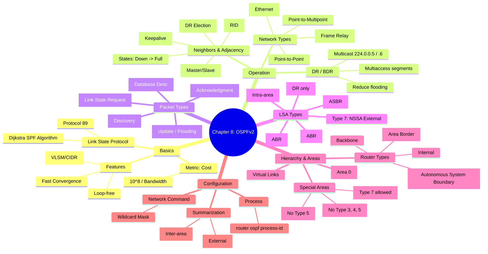

[[01_inbox/books/routing_tcp_ip_1/roadmap|📖 Return to Roadmap]]

## 1. Mermaid Mindmap 요약

---

## 2. 상세 Markdown 요약

**제 8 장: OSPFv2 (Open Shortest Path First Version 2)**

이 장에서는 IETF 표준이자 가장 널리 사용되는 링크 상태 (Link-State) 라우팅 프로토콜인 **OSPFv2**의 동작 원리, 계층적 구조 (Area), LSA 유형, 구성 및 문제 해결 방법을 다룹니다.

### 1. OSPF 의 기본 동작 (Operation of OSPF)

OSPF 는 다익스트라 (Dijkstra) 의 최단 경로 우선 (SPF) 알고리즘을 사용하는 링크 상태 프로토콜입니다. 빠른 수렴, 대규모 네트워크 지원, 클래스리스 라우팅 지원 등의 장점을 가집니다.

- **동작 과정:**
    1. **Hello 프로토콜:** 이웃 (Neighbor) 을 발견하고, 매개변수 (Hello/Dead interval, Area ID, 인증 등) 를 검증하여 인접성 (Adjacency) 을 맺습니다.
    2. **LSA 플러딩:** 링크 상태 정보 (LSA) 를 영역 내의 모든 라우터에게 전달하여 동일한 링크 상태 데이터베이스 (LSDB) 를 구축합니다.
    3. **SPF 계산:** 각 라우터는 자신을 루트 (Root) 로 하는 최단 경로 트리 (SPF Tree) 를 계산하여 라우팅 테이블을 작성합니다.
- **라우터 ID (Router ID):** OSPF 도메인 내에서 라우터를 식별하는 32 비트 값입니다. 수동 설정 (`router-id`) > 루프백 인터페이스 IP > 물리적 인터페이스 IP(가장 높은 주소) 순서로 결정됩니다.

### 2. 네트워크 유형과 DR/BDR (Network Types & DR/BDR)

OSPF 는 연결된 네트워크 유형에 따라 동작 방식이 달라집니다.

- **네트워크 유형:**
    - **Point-to-Point:** DR 선출 없음. 멀티캐스트 (224.0.0.5) 사용.
    - **Broadcast:** 이더넷 등. DR/BDR 선출.
    - **NBMA (Non-Broadcast Multi-Access):** 프레임 릴레이 등. DR/BDR 선출하지만, 이웃을 수동으로 지정하거나 모드를 변경해야 함.
    - **Point-to-Multipoint:** NBMA 를 논리적 P2P 집합으로 처리.
- **DR (Designated Router) / BDR (Backup DR):** 브로드캐스트 및 NBMA 네트워크에서 플러딩 오버헤드를 줄이기 위해 선출합니다. 모든 라우터는 DR/BDR 과만 인접성 (Full) 을 맺습니다,.
    - **선출 기준:** 우선순위 (Priority) 가 가장 높은 라우터 > 라우터 ID 가 높은 라우터. (Priority 0 은 선출 제외).
    - **주소:** DR/BDR 은 `224.0.0.6` 을 수신하고, `224.0.0.5` 로 업데이트를 보냅니다.

### 3. OSPF 패킷과 이웃 상태 (Packets & Neighbor States)

OSPF 는 IP 프로토콜 번호 **89**를 사용하며 5 가지 패킷 타입을 가집니다.

- **패킷 유형:** Hello(1), Database Description(DBD, 2), Link State Request(LSR, 3), Link State Update(LSU, 4), Link State Acknowledgment(LSAck, 5).
- **이웃 상태 머신 (Neighbor State Machine):**
    - **Down:** 초기 상태.
    - **Init:** Hello 를 수신했으나 내 라우터 ID 가 Hello 패킷에 없음.
    - **2-Way:** 양방향 통신 확인. DR/BDR 선출이 이루어짐.
    - **ExStart:** Master/Slave 결정 및 초기 DBD 교환.
    - **Exchange:** DBD 패킷을 통해 LSDB 요약 정보 교환.
    - **Loading:** LSR 을 보내 상세 LSA 정보를 요청하고 LSU 로 받음.
    - **Full:** 데이터베이스 동기화 완료 (인접성 형성).

### 4. LSA 유형 (LSA Types)

OSPF 는 네트워크 정보를 다양한 LSA 타입으로 분류하여 전달합니다 -.

- **Type 1 (Router LSA):** 모든 라우터가 생성. 자신의 링크 정보를 알림. 영역 (Area) 내부로 제한.
- **Type 2 (Network LSA):** DR 이 생성. 세그먼트에 연결된 라우터 목록을 알림. 영역 내부로 제한.
- **Type 3 (Network Summary LSA):** ABR 이 생성. 다른 영역의 네트워크 정보를 알림.
- **Type 4 (ASBR Summary LSA):** ABR 이 생성. 외부 라우터 (ASBR) 까지의 경로를 알림.
- **Type 5 (AS External LSA):** ASBR 이 생성. OSPF 외부 (재분배된) 경로를 알림. 전체 도메인으로 전파.
- **Type 7 (NSSA External LSA):** NSSA 내의 ASBR 이 생성. NSSA 내부로 제한되며, ABR 이 Type 5 로 변환하여 외부로 전파.

### 5. 영역과 계층적 구조 (Areas)

대규모 네트워크를 효율적으로 관리하기 위해 2 계층 구조를 사용합니다.

- **Backbone Area (Area 0):** 모든 비백본 영역은 반드시 백본 영역에 물리적 또는 논리적으로 연결되어야 합니다.
- **Router Types:** Internal Router (모든 인터페이스가 동일 영역), Backbone Router (Area 0 에 속함), ABR (영역 간 연결), ASBR (외부 경로 재분배).
- **특수 영역 (Special Areas):**
    - **Stub Area:** Type 5 LSA 차단. 외부 경로 대신 디폴트 경로 사용.
    - **Totally Stubby Area:** Type 3, 4, 5 LSA 차단. Cisco 전용. 오직 디폴트 경로만으로 외부 통신.
    - **NSSA (Not-So-Stubby Area):** Stub 와 유사하나 외부 경로를 가져올 수 있음 (Type 7 사용).
- **가상 링크 (Virtual Links):** 비백본 영역을 통해 백본에 연결되지 않은 영역을 논리적으로 연결하거나, 분할된 백본을 연결할 때 사용.

### 6. 구성 및 요약 (Configuration & Summarization)

- **기본 설정:** `router ospf <process-id>` 후 `network <address> <wildcard-mask> area <area-id>` 명령어로 인터페이스를 OSPF 에 포함시킵니다.
- **축약 (Summarization):**
    - **Inter-Area (ABR):** `area <id> range <address> <mask>` 명령어로 영역 간 경로를 요약합니다.
    - **External (ASBR):** `summary-address <address> <mask>` 명령어로 재분배된 외부 경로를 요약합니다.

### 7. 문제 해결 (Troubleshooting)

- **인접성 문제:** `show ip ospf neighbor` 로 상태 확인. Hello/Dead 타이머 불일치, Area ID 불일치, 인증 실패, 서브넷 마스크 불일치 등을 확인해야 합니다.
- **데이터베이스 확인:** `show ip ospf database` 를 통해 LSA 동기화 여부와 경로 정보를 확인합니다.
- **디버깅:** `debug ip ospf adj`, `debug ip ospf events` 등을 사용하여 실시간 상태 변화를 추적할 수 있습니다.
