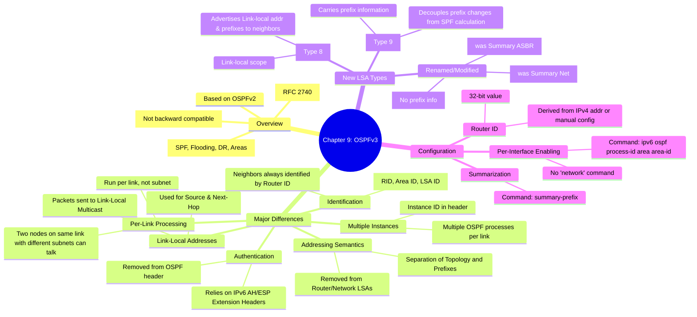

[[01_inbox/books/routing_tcp_ip_1/roadmap|📖 Return to Roadmap]]

### 1. Mermaid Mindmap 요약

---

### 2. 상세 Markdown 요약

**제9장: OSPFv3 (Open Shortest Path First Version 3)**

이 장에서는 IPv6를 지원하기 위해 새롭게 설계된 **OSPFv3**를 다룹니다. OSPFv2의 기본 알고리즘(SPF, 플러딩, DR 선출 등)은 유지하면서, IPv6의 특성(긴 주소, 링크 로컬 주소 등)을 반영하고 프로토콜의 확장성을 개선한 점이 핵심입니다.

#### 1. OSPFv3 개요 및 OSPFv2와의 차이점 (Operation of OSPFv3)

OSPFv3는 RFC 2740에 정의되어 있으며, OSPFv2와 하위 호환되지 않는 독립적인 프로토콜입니다. 따라서 듀얼 스택 네트워크에서는 v2와 v3를 동시에 실행해야 합니다.

*   **주요 변경 사항:**
    *   **링크 단위 처리 (Per-link processing):** OSPFv2는 서브넷 단위로 동작하지만, OSPFv3는 링크 단위로 동작합니다. 동일한 링크에 있으면서 서로 다른 IPv6 서브넷에 속한 라우터끼리도 통신이 가능합니다.
    *   **주소 정보 제거 (Removal of addressing semantics):** Router LSA와 Network LSA에서 IP 주소 정보가 제거되었습니다. 이들은 오직 토폴로지 정보만 전달하며, 주소 정보는 새로운 LSA(Intra-Area Prefix LSA)로 분리되었습니다. 이로 인해 주소 변경이 발생해도 SPF 계산을 다시 할 필요가 없어 확장성이 향상되었습니다.
    *   **이웃 식별 (Neighbor Identification):** 네트워크 유형(Broadcast, NBMA 등)에 관계없이 모든 이웃은 **Router ID (RID)**로만 식별됩니다. OSPFv2에서는 브로드캐스트 네트워크에서 인터페이스 주소로 식별했던 것과 다릅니다.
    *   **링크 로컬 주소 사용 (Use of link-local addresses):** OSPFv3 패킷의 소스 주소와 라우팅 테이블의 Next-hop 주소로 항상 IPv6 링크 로컬 주소(FE80::/10)를 사용합니다.
    *   **다중 인스턴스 지원 (Multiple instances per link):** 패킷 헤더에 `Instance ID` 필드가 추가되어, 하나의 물리적 링크 위에서 여러 OSPF 프로세스를 독립적으로 실행할 수 있습니다.
    *   **인증 제거:** OSPF 자체의 인증 필드가 제거되었으며, IPv6의 확장 헤더(AH/ESP)를 이용한 인증 및 보안에 의존합니다.

#### 2. 패킷 포맷 (OSPFv3 Messages)

OSPFv2와 동일한 5가지 메시지 타입(Hello, DD, Request, Update, Ack)을 사용하며, 프로토콜 번호는 89입니다.
*   **헤더 변경:** 인증 필드가 제거되고 **Instance ID**가 추가되었습니다.
*   **Hello 패킷:** IPv6는 마스크가 필요 없으므로 Network Mask 필드가 제거되었습니다. Interface ID가 추가되었습니다.

#### 3. LSA 포맷 및 유형 (OSPFv3 LSA Formats)

OSPFv3는 LSA 구조를 개편하여 토폴로지와 프리픽스 정보를 분리했습니다. LSA 헤더의 `LSA Type` 필드가 16비트로 확장되었으며, 플러딩 범위(Link-local, Area, AS)를 지정하는 비트(S1, S2)와 알 수 없는 LSA 처리 방식(U 비트)을 포함합니다.

*   **Router LSA (Type 1) & Network LSA (Type 2):** 더 이상 IP 주소 정보를 싣지 않습니다. 오직 라우터 간의 연결 상태(토폴로지)만 설명합니다.
*   **Inter-Area Prefix LSA (Type 3):** OSPFv2의 Network Summary LSA에 해당하며, 다른 영역의 네트워크 정보를 알립니다.
*   **Inter-Area Router LSA (Type 4):** OSPFv2의 ASBR Summary LSA에 해당하며, ASBR의 위치를 알립니다.
*   **AS-External LSA (Type 5):** 외부 경로를 알립니다.
*   **Link LSA (Type 8, 신규):** 링크 로컬 범위(Link-local scope)를 가집니다. 해당 링크에 연결된 라우터들에게 링크 로컬 주소와 해당 링크에 설정된 IPv6 프리픽스 정보를 알립니다.
*   **Intra-Area Prefix LSA (Type 9, 신규):** Router LSA와 Network LSA에서 빠진 프리픽스(주소) 정보를 전달합니다. 이 LSA가 변경되어도 전체 토폴로지는 변하지 않으므로 SPF 재계산을 유발하지 않습니다.

#### 4. 구성 (Configuring OSPFv3)

OSPFv3 설정은 기존의 `network` 명령어를 사용하지 않고 인터페이스 모드에서 직접 활성화합니다.

*   **기본 설정:** 인터페이스 모드에서 `ipv6 ospf <process-id> area <area-id>` 명령어를 사용하여 해당 인터페이스를 OSPF 프로세스 및 영역에 할당합니다. 이 명령을 입력하면 OSPF 프로세스가 자동으로 생성됩니다.
*   **Router ID:** 32비트 숫자를 사용하므로, IPv4 주소가 설정되어 있다면 그것을 사용하고, 없다면 `router-id` 명령어로 수동 설정해야 프로세스가 시작됩니다.
*   **스텁 영역 (Stub Areas):** OSPFv2와 동일하게 `area <id> stub` 등의 명령어로 구성합니다.
*   **주소 축약 (Summarization):** ABR에서 `summary-prefix` 명령어를 사용하여 IPv6 프리픽스를 축약합니다.

#### 5. 문제 해결 (Troubleshooting OSPFv3)

*   **링크 로컬 주소 매핑:** NBMA(프레임 릴레이 등) 네트워크에서는 이웃의 링크 로컬 주소(FE80...)를 DLCI에 매핑해야 합니다. OSPFv3는 링크 로컬 주소를 사용하여 패킷을 교환하기 때문입니다.
*   **디버깅:** `debug ipv6 ospf adjacency`, `debug ipv6 ospf hello` 등을 사용하여 인접성 형성 과정을 확인할 수 있습니다.