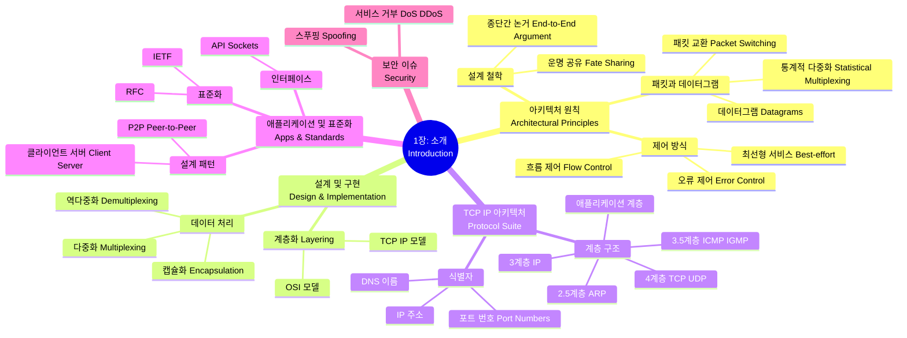

[[01_inbox/books/tcp_ip_illustrated_1/roadmap|📖 Return to Roadmap]]

### See Also
- [[01_inbox/books/routing_tcp_ip_1/chapter1|Routing TCP/IP Vol.1 - Ch.1 TCP/IP Review]]

### 1. Mermaid Mindmap

---

### 2. 중요 정보 및 맥락 요약

**1장: 소개 (Introduction)**

이 장에서는 프로토콜, 프로토콜 스위트, 그리고 TCP/IP의 기반이 되는 인터넷 아키텍처의 역사와 핵심 원칙을 다룹니다.

#### 1. 아키텍처 원칙 (Architectural Principles)

*   **패킷 교환과 데이터그램:** 초기 회선 교환(circuit switching) 방식과 달리, 인터넷은 패킷 교환 방식을 채택했습니다. 이는 데이터를 '패킷'이라는 덩어리로 나누어 전송하며, **통계적 다중화(statistical multiplexing)**를 통해 네트워크 링크와 스위치의 효율성을 높입니다,. TCP/IP는 연결 상태를 스위치에 저장하지 않는 **데이터그램(datagram)** 방식을 사용하여 복잡한 신호 프로토콜 없이도 연결 비지향성 네트워크를 구축했습니다.
*   **종단간 논거 (End-to-End Argument):** 기능의 정확성과 완전성은 통신 시스템의 종단(애플리케이션)에 있는 지식과 도움을 통해서만 구현될 수 있다는 원칙입니다. 따라서 중요한 기능(오류 제어, 암호화 등)은 하위 계층보다는 상위 계층(종단 호스트)에 구현되어야 하며, 이는 "멍청한 네트워크와 똑똑한 단말(dumb network, smart endpoints)" 모델을 지지합니다,.
*   **운명 공유 (Fate Sharing):** 통신 상태 정보를 통신하는 종단 호스트에만 저장함으로써, 네트워크 중간 장비가 실패하더라도 종단이 살아있다면 통신이 유지될 수 있도록 하는 설계 철학입니다.
*   **오류 및 흐름 제어:** 인터넷 프로토콜은 **최선형 서비스(best-effort delivery)**를 제공하며, 데이터의 손실이나 순서 변경을 네트워크 내부에서 완벽히 해결하려 하지 않습니다. 대신 TCP와 같은 상위 계층 프로토콜이 신뢰성을 보장합니다.

#### 2. 설계 및 구현 (Design and Implementation)

*   **계층화 (Layering):** 통신 시스템의 복잡성을 관리하기 위해 계층화된 구조를 사용합니다. OSI 7계층 모델이 유명하지만, TCP/IP는 더 단순한 5계층 모델(물리, 링크, 네트워크, 전송, 애플리케이션)을 따릅니다,.
*   **다중화, 역다중화, 캡슐화:** 계층 구조의 장점은 다중화입니다. 상위 계층의 데이터(PDU)는 하위 계층으로 내려갈 때 헤더가 추가되어 **캡슐화(encapsulation)**되며, 수신 측에서는 헤더를 통해 적절한 상위 프로토콜로 데이터를 전달하는 **역다중화(demultiplexing)**가 일어납니다-.

#### 3. TCP/IP 프로토콜 스위트 (TCP/IP Suite)

*   **ARPANET 참조 모델:** TCP/IP는 OSI 모델보다 ARPANET 참조 모델에 기반합니다. 주요 계층 및 프로토콜은 다음과 같습니다.
    *   **2.5 계층:** ARP (주소 변환 프로토콜) - IPv4 주소를 링크 계층 주소로 매핑.
    *   **3 계층:** IP (인터넷 프로토콜) - 비신뢰성 데이터그램 서비스 제공, 라우팅 및 주소 지정 담당 (IPv4/IPv6),.
    *   **3.5 계층:** ICMP (인터넷 제어 메시지 프로토콜) - 오류 보고 및 정보 교환용 IP의 보조 프로토콜.
    *   **4 계층:** TCP (연결 지향, 신뢰성 보장, 바이트 스트림) 및 UDP (비연결성, 비신뢰성, 데이터그램 보존).
    *   **애플리케이션 계층:** 사용자 애플리케이션 (HTTP, DNS 등).
*   **식별자:** 각 계층은 고유한 주소 체계를 가집니다. 링크 계층은 MAC 주소, 네트워크 계층은 IP 주소, 전송 계층은 **포트 번호(Port Numbers)**를 사용하여 애플리케이션을 식별합니다-.
*   **DNS:** IP 주소를 사람이 기억하기 쉬운 호스트 이름으로 매핑해주는 분산 데이터베이스 시스템입니다.

#### 4. 애플리케이션 설계 및 표준화

*   **설계 패턴:**
    *   **클라이언트/서버:** 서버가 서비스를 제공하고 클라이언트가 요청하는 구조입니다. 서버는 반복적(Iterative)이거나 병행적(Concurrent)일 수 있습니다-.
    *   **P2P (Peer-to-Peer):** 중앙 서버 없이 피어들이 클라이언트와 서버 역할을 동시에 수행하며 오버레이 네트워크를 형성합니다.
*   **API:** 애플리케이션은 소켓(Sockets) API를 통해 네트워크 기능을 호출합니다.
*   **표준화:** 인터넷 표준은 IETF(Internet Engineering Task Force)에서 논의되며, 공식 문서는 **RFC(Request for Comments)** 형태로 발행됩니다,.

#### 5. 보안 (Security)

*   초기 인터넷 아키텍처는 보안을 주요 목표로 설계하지 않았습니다.
*   **주요 위협:** IP 주소 스푸핑(Spoofing), 서비스 거부 공격(DoS/DDoS), 패킷 스니핑을 통한 정보 유출 등이 있습니다. 현대에는 IPsec, TLS 등 암호화 프로토콜을 통해 이를 보완합니다,.