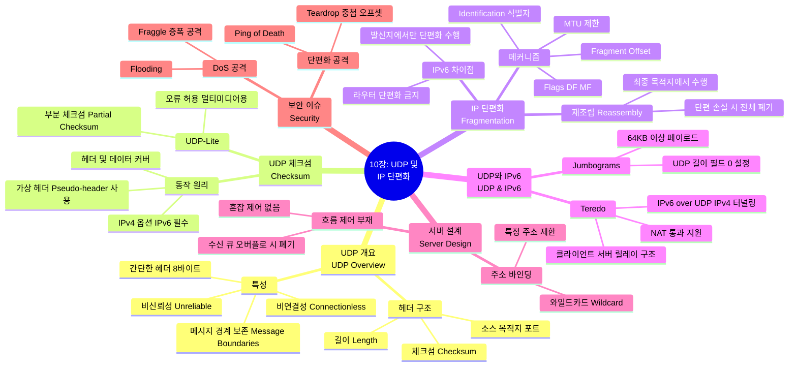

[[01_inbox/books/tcp_ip_illustrated_1/roadmap|📖 Return to Roadmap]]

## See Also
- [[01_inbox/books/routing_tcp_ip_1/chapter1|Routing TCP/IP Vol.1 - Ch.1 TCP/IP Review]]

## 1. Mermaid Mindmap

---

## 2. 중요 정보 및 맥락 요약

**10 장: 사용자 데이터그램 프로토콜 (UDP) 과 IP 단편화**

이 장에서는 TCP/IP 프로토콜 스위트의 단순하고 비연결성 전송 계층 프로토콜인 UDP 의 구조와 동작, 그리고 UDP 가 자주 직면하는 IP 단편화 (Fragmentation) 문제와 IPv6 환경에서의 UDP 확장 기능 (Teredo 등) 을 다룹니다.

### 1. UDP 개요 (Introduction)

- **특성:** UDP 는 **비연결성 (Connectionless)**이며 **비신뢰성 (Unreliable)** 데이터그램 서비스를 제공합니다. TCP 와 달리 오류 수정, 순서 보장, 흐름 제어 기능을 제공하지 않습니다. 대신 오버헤드가 적고, 애플리케이션이 쓴 데이터의 **메시지 경계 (Message Boundaries)**를 보존합니다.
- **캡슐화:** UDP 데이터그램은 IP 데이터그램 안에 캡슐화됩니다. IPv4 의 프로토콜 필드 값과 IPv6 의 Next Header 필드 값은 **17**입니다.
- **헤더 구조:** UDP 헤더는 8 바이트로 매우 간단합니다. 소스 포트 (선택적), 목적지 포트, UDP 길이 (헤더 + 데이터), UDP 체크섬 필드로 구성됩니다.

### 2. UDP 체크섬 (UDP Checksum)

- **동작 원리:** UDP 체크섬은 진정한 **종단 간 (End-to-End)** 검증을 제공합니다. 체크섬 계산 시 UDP 헤더와 데이터뿐만 아니라, IP 헤더의 일부 (소스/목적지 IP, 프로토콜, 길이) 를 포함하는 **가상 헤더 (Pseudo-header)**를 함께 계산하여 데이터가 올바른 목적지로 전달되었는지 검증합니다,.
- **IPv4 vs IPv6:** IPv4 에서 UDP 체크섬은 선택 사항 (사용 권장) 이지만, **IPv6 에서는 필수 (Mandatory)**입니다. IPv6 는 IP 헤더 자체에 체크섬이 없기 때문입니다.
- **UDP-Lite:** 멀티미디어와 같이 일부 비트 오류를 허용하는 애플리케이션을 위해 설계되었습니다. 전체 데이터가 아닌 **부분 체크섬 (Partial Checksum)**을 지원하며, 헤더의 길이 필드를 '체크섬 커버리지' 필드로 대체하여 사용합니다.

### 3. IP 단편화 (IP Fragmentation)

- **개념:** 전송할 데이터가 링크 계층의 **MTU(Maximum Transmission Unit)**보다 클 때, IP 계층에서 데이터를 여러 조각 (Fragment) 으로 나누는 과정입니다.
- **IPv4 단편화:** 라우터나 호스트가 수행할 수 있습니다. 헤더의 **Identification(식별자)**, **Flags(DF: 단편화 금지, MF: 추가 단편 있음)**, **Fragment Offset** 필드를 사용하여 관리합니다.
- **재조립 (Reassembly):** 단편화된 패킷은 최종 목적지 호스트에서만 재조립됩니다. 하나의 조각이라도 손실되면 전체 데이터그램이 폐기되므로, 단편화는 전송 효율을 떨어뜨릴 수 있습니다,.
- **IPv6 차이점:** IPv6 는 라우터가 단편화를 수행하지 않으며, 오직 **발신지 (Source) 호스트**만이 단편화를 수행할 수 있습니다. 이를 위해 확장 헤더를 사용합니다.
- **PMTUD:** 단편화를 피하기 위해 경로 MTU 발견 (Path MTU Discovery) 을 사용합니다. UDP 는 애플리케이션이 데이터 크기를 제어하므로, ICMP Packet Too Big 메시지를 통해 적절한 크기를 학습해야 합니다.

### 4. UDP 와 IPv6, 그리고 Teredo

- **Jumbograms:** IPv6 는 65,535 바이트를 초과하는 데이터그램 (Jumbograms) 을 지원합니다. 이때 UDP 헤더의 길이 필드는 0 으로 설정됩니다.
- **Teredo:** IPv6 전환 기술 중 하나로, IPv6 패킷을 **UDP/IPv4 패킷 안에 캡슐화**하여 NAT 를 통과할 수 있게 해줍니다. Teredo 클라이언트, 서버, 릴레이로 구성되며, 주로 IPv4 만 지원하는 네트워크 뒤에 있는 호스트가 IPv6 연결을 얻기 위해 사용됩니다,.

### 5. UDP 서버 설계 (UDP Server Design)

- **상호작용:** UDP 서버는 보통 **반복적 (Iterative)** 서버로 동작하며, 하나의 소켓으로 여러 클라이언트의 요청을 처리합니다. 수신된 데이터그램에는 IP 헤더가 제거되어 있으므로, 응답을 위해 소스 주소와 포트 정보를 운영체제로부터 별도로 얻어야 합니다.
- **바인딩:** 서버는 로컬 IP 주소를 **와일드카드 (*)**로 설정하여 모든 인터페이스의 트래픽을 받거나, 특정 IP 로 제한할 수 있습니다.
- **흐름/혼잡 제어 부재:** UDP 자체에는 흐름 제어나 혼잡 제어 메커니즘이 없습니다. 수신 버퍼가 가득 차면 패킷은 묵시적으로 폐기되며, 송신자에게 통지되지 않습니다.

### 6. 보안 (Attacks Involving UDP)

- **DoS 공격:** UDP 는 연결 상태가 없으므로 소스 주소를 위조 (Spoofing) 하기 쉽습니다. 이를 이용해 대량의 트래픽을 보내는 플러딩 (Flooding) 공격이나, **Fraggle** 공격 (UDP 에코 서비스 등을 이용한 증폭 공격) 이 가능합니다.
- **단편화 공격:** **Teardrop** 공격 (중첩된 오프셋을 가진 단편을 보내 재조립 오류 유발) 이나 **Ping of Death**(재조립 시 허용 크기를 초과하게 만듦) 와 같은 공격이 존재합니다.
