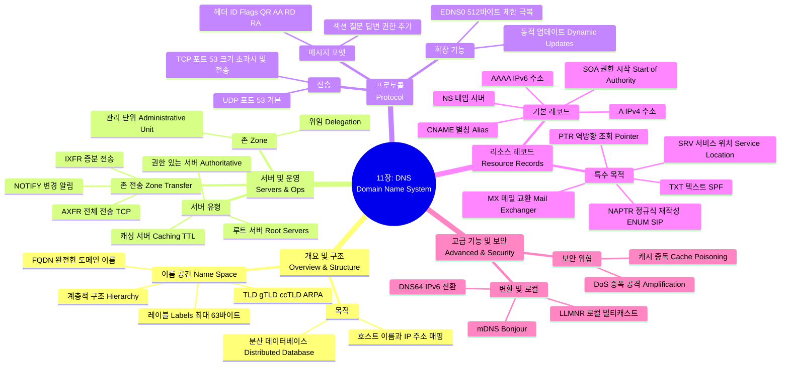

[[01_inbox/books/tcp_ip_illustrated_1/roadmap|📖 Return to Roadmap]]

### 1. Mermaid Mindmap

---

### 2. 중요 정보 및 맥락 요약

**11장: 이름 해석과 도메인 이름 시스템 (Name Resolution and the Domain Name System)**

이 장에서는 사람이 기억하기 쉬운 호스트 이름을 네트워크 프로토콜이 사용하는 IP 주소로 변환하는 분산 데이터베이스 시스템인 DNS의 구조, 프로토콜, 레코드 유형 및 보안 문제를 다룹니다.

#### 1. DNS 개요 및 이름 공간 (The DNS Name Space)

*   **목적:** DNS는 호스트 이름과 IP 주소 간의 매핑을 제공하는 분산 클라이언트/서버 데이터베이스입니다. TCP/IP 구현 자체는 DNS를 모르며 오직 IP 주소만 사용하지만, 애플리케이션은 **리졸버(Resolver)**를 통해 DNS를 사용합니다.
*   **계층 구조:** DNS 이름 공간은 루트(이름 없음)에서 시작하여 역트리 구조를 가집니다. 최상위에는 **TLD(Top-Level Domain)**가 있으며, 여기에는 일반 TLD(gTLD, 예: .com, .edu), 국가 코드 TLD(ccTLD, 예: .kr, .uk), 그리고 인프라용 TLD(.arpa)가 포함됩니다.
*   **문법:** 도메인 이름은 점(.)으로 구분된 레이블의 시퀀스입니다. 각 레이블은 최대 63자이며, 전체 FQDN(Fully Qualified Domain Name)은 255자로 제한됩니다. 대소문자를 구분하지 않습니다.

#### 2. 서버, 존, 캐싱 (Name Servers, Zones, and Caching)

*   **존(Zone):** 관리의 위임 단위입니다. 하나의 네임 서버는 여러 존에 대한 정보를 가질 수 있습니다. 권한 있는(Authoritative) 서버는 해당 존의 공식 데이터베이스를 보유합니다.
*   **캐싱(Caching):** DNS 트래픽을 줄이고 성능을 높이기 위해 서버와 클라이언트는 조회 결과를 캐시합니다. 데이터의 유효 기간은 **TTL(Time to Live)** 값에 의해 결정됩니다. 존재하지 않는 도메인에 대한 응답(Negative Caching)도 캐시됩니다.

#### 3. DNS 프로토콜 (The DNS Protocol)

*   **전송 프로토콜:** DNS는 주로 **UDP 포트 53**을 사용합니다. 응답이 512바이트를 초과하면 잘림(Truncation) 플래그가 설정되고, 클라이언트는 **TCP 포트 53**을 사용하여 재요청할 수 있습니다. 존 전송(Zone Transfer)은 대량의 데이터가 이동하므로 주로 TCP를 사용합니다.
*   **메시지 포맷:** 고정된 12바이트 헤더와 4개의 가변 길이 섹션(질문, 답변, 권한, 추가 정보)으로 구성됩니다. 헤더에는 트랜잭션 ID와 플래그(QR:질문/응답, AA:권한있는 응답, RD:재귀요청 등)가 포함됩니다.
*   **압축(Compression):** 메시지 크기를 줄이기 위해 도메인 이름의 중복되는 뒷부분(예: .edu)을 포인터로 대체하여 압축합니다.
*   **EDNS0:** UDP 패킷 크기 제한(512바이트)을 확장하고 추가적인 기능을 제공하기 위한 확장 메커니즘입니다. DNSSEC 등에 필수적입니다.

#### 4. 주요 리소스 레코드 (Resource Records)

DNS의 핵심은 다양한 유형의 리소스 레코드(RR)입니다.
*   **A / AAAA:** 호스트 이름을 각각 IPv4 주소(A)와 IPv6 주소(AAAA)로 매핑합니다.
*   **NS (Name Server):** 해당 존에 대한 권한 있는 네임 서버를 지정합니다.
*   **CNAME (Canonical Name):** 도메인 이름에 대한 별칭(Alias)을 정의합니다.
*   **PTR (Pointer):** IP 주소를 도메인 이름으로 변환하는 **역방향 조회(Reverse DNS Lookup)**에 사용됩니다. IPv4는 `in-addr.arpa`, IPv6는 `ip6.arpa` 도메인을 사용하며 IP 주소를 역순으로 표기합니다.
*   **SOA (Start of Authority):** 존의 기본 속성(관리자 이메일, 시리얼 번호, 갱신 주기, 기본 TTL 등)을 정의합니다.
*   **MX (Mail Exchanger):** 도메인의 이메일을 수신할 메일 서버를 지정하며, 우선순위(Preference) 값을 가집니다.
*   **TXT:** 텍스트 데이터를 저장하며, 스팸 방지를 위한 **SPF(Sender Policy Framework)** 레코드로도 사용됩니다.
*   **SRV (Service):** 특정 서비스(예: LDAP, SIP)를 제공하는 서버의 호스트 이름과 **포트 번호**를 지정합니다.
*   **NAPTR (Name Authority Pointer):** 전화번호를 URI로 매핑하는 ENUM이나 SIP 서비스 발견 등에 사용되며 정규 표현식을 통한 재작성 규칙을 포함합니다.

#### 5. 운영 및 고급 기능 (Operations and Advanced Features)

*   **존 전송 및 알림:** 보조 서버가 주 서버의 데이터를 복제하는 과정입니다. 전체 전송은 **AXFR**, 변경분만 전송하는 것은 **IXFR**입니다. **DNS NOTIFY**는 주 서버가 변경 사항을 보조 서버에 즉시 알리는 메커니즘입니다.
*   **동적 업데이트 (Dynamic Updates):** DHCP 서버 등이 DNS 존 데이터를 실시간으로 수정할 수 있게 해주는 프로토콜입니다.
*   **DNS64:** IPv6 전용 클라이언트가 IPv4 전용 서버에 접속할 수 있도록, A 레코드를 합성된 AAAA 레코드로 변환해주는 기술입니다. NAT64와 함께 사용됩니다.
*   **mDNS & LLMNR:** 로컬 네트워크에서 중앙 DNS 서버 없이 멀티캐스트를 통해 이름을 해석하는 프로토콜입니다(예: Apple의 Bonjour).

#### 6. 보안 (Attacks on the DNS)

*   **DoS 공격:** 루트 서버나 TLD 서버에 과도한 트래픽을 보내 마비시키는 공격입니다.
*   **캐시 중독 (Cache Poisoning):** 위조된 DNS 응답을 캐싱 서버에 주입하여 사용자를 피싱 사이트 등으로 유도하는 공격입니다(예: Kaminsky Attack). 이를 방지하기 위해 포트 번호 무작위화, DNSSEC(18장) 등이 사용됩니다.