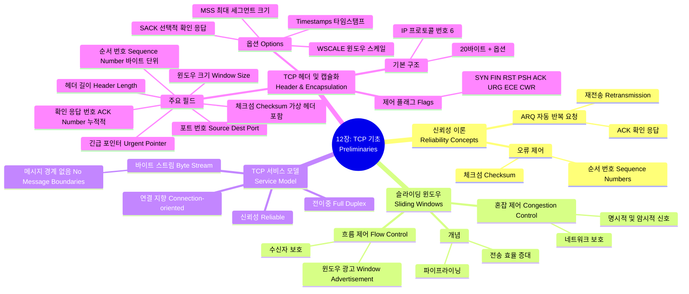

[📖 Return to Roadmap](roadmap.md)

## 1. Mermaid Mindmap

---

## 2. 중요 정보 및 맥락 요약

**12 장: TCP: 전송 제어 프로토콜 (기초)**

이 장에서는 손실이 발생할 수 있는 채널 (IP) 위에서 신뢰성 있는 통신을 제공하기 위한 이론적 배경 (ARQ, 슬라이딩 윈도우) 과 TCP 의 구체적인 서비스 모델 및 헤더 구조를 다룹니다.

### 1. 신뢰성 통신의 기초 (Introduction to Reliability)

- **ARQ (Automatic Repeat Request):** 패킷 손실이나 손상을 처리하기 위해 수신자가 확인 응답 (ACK) 을 보내고, 송신자는 ACK 가 오지 않으면 재전송하는 방식입니다. 가장 단순한 형태는 "Stop-and-Wait"이지만, 이는 RTT(왕복 시간) 가 길 경우 처리량이 매우 낮아지는 단점이 있습니다,.
- **슬라이딩 윈도우 (Sliding Windows):** 처리량을 높이기 위해 여러 패킷을 네트워크에 동시에 보낼 수 있게 하는 기법입니다. "윈도우"는 송신자가 ACK 를 기다리지 않고 보낼 수 있는 데이터의 양을 의미하며, ACK 가 도착하면 윈도우가 오른쪽으로 이동 (슬라이딩) 하여 새로운 데이터를 보낼 수 있게 합니다.
- **흐름 제어 vs. 혼잡 제어:**
    - **흐름 제어 (Flow Control):** 수신자가 처리할 수 있는 속도보다 송신자가 빠르게 보내지 못하도록 제어하는 것입니다. TCP 에서는 수신자가 "윈도우 광고 (Window Advertisement)"를 통해 남은 버퍼 크기를 송신자에게 알림으로써 수행됩니다.
    - **혼잡 제어 (Congestion Control):** 중간 라우터나 네트워크 링크가 처리할 수 있는 용량을 초과하지 않도록 송신 속도를 조절하는 것입니다. 이는 네트워크의 패킷 손실 등을 감지하여 수행됩니다.
- **RTT 추정:** 재전송 타이머를 얼마나 설정할지 결정하기 위해 왕복 시간 (RTT) 을 추정하는 것은 TCP 성능에 매우 중요합니다.

### 2. TCP 서비스 모델 (The TCP Service Model)

- **연결 지향 및 바이트 스트림:** TCP 는 데이터를 교환하기 전에 연결을 맺어야 하며 (Connection-oriented), 데이터를 별도의 메시지 경계가 없는 연속된 "바이트 스트림 (Byte Stream)"으로 처리합니다. 즉, 애플리케이션이 10 바이트를 쓰고 20 바이트를 써도, 수신 측은 30 바이트를 한 번에 읽거나 나눠서 읽을 수 있습니다.
- **패킷화 (Packetization):** TCP 는 데이터를 **세그먼트 (Segment)**라는 단위로 나누어 IP 에 전달합니다. 이때 데이터의 크기는 최대 세그먼트 크기 (MSS) 등을 고려하여 결정됩니다,.
- **신뢰성 보장:**
    - **순서 번호 (Sequence Number):** TCP 는 패킷 번호가 아닌 **바이트 번호**를 사용하여 순서를 매깁니다. 이를 통해 중복을 제거하고 순서를 재조립합니다.
    - **누적 ACK (Cumulative ACK):** 수신자는 자신이 연속적으로 받은 마지막 바이트의 다음 번호를 ACK 로 보냅니다. 이는 중간에 ACK 가 유실되어도 후속 ACK 가 이를 커버할 수 있게 합니다.

### 3. TCP 헤더 구조 (TCP Header and Encapsulation)

TCP 헤더는 일반적으로 20 바이트이며, 옵션이 포함될 경우 최대 60 바이트까지 커질 수 있습니다,.

- **포트 번호 (Source/Destination Port):** IP 주소와 결합하여 연결의 양 끝점 (소켓) 을 식별합니다.
- **순서 번호 (Sequence Number):** 해당 세그먼트의 첫 번째 데이터 바이트의 순서 번호입니다. (SYN 플래그가 설정된 경우 초기 순서 번호 ISN 이 됩니다).
- **확인 응답 번호 (Acknowledgment Number):** 수신자가 다음에 받기를 기대하는 바이트의 순서 번호입니다. ACK 플래그가 설정된 경우에만 유효합니다.
- **헤더 길이 (Header Length):** 32 비트 워드 단위로 헤더의 길이를 나타냅니다.
- **제어 비트 (Flags):**
    - **CWR, ECE:** 혼잡 제어 및 ECN(명시적 혼잡 알림) 지원에 사용됩니다.
    - **URG:** 긴급 포인터 필드가 유효함을 알립니다.
    - **ACK:** 확인 응답 필드가 유효함을 알립니다 (연결 수립 후 모든 패킷에 설정됨).
    - **PSH:** 수신자가 데이터를 버퍼링하지 않고 애플리케이션에 즉시 전달하도록 요청합니다.
    - **RST:** 연결을 강제로 리셋 (중단) 합니다.
    - **SYN:** 연결을 시작할 때 순서 번호를 동기화합니다.
    - **FIN:** 송신자가 데이터 전송을 마쳤음을 알립니다.
- **윈도우 크기 (Window Size):** 수신자가 현재 받을 수 있는 데이터의 양 (바이트) 을 알립니다. 기본적으로 16 비트 필드이므로 최대 65,535 바이트지만, 윈도우 스케일 옵션을 통해 확장 가능합니다.
- **체크섬 (Checksum):** TCP 헤더, 데이터, 그리고 IP 헤더의 일부 (가상 헤더) 를 포함하여 계산하는 필수 필드입니다. IPv4 와 IPv6 모두에서 필수입니다,.
- **긴급 포인터 (Urgent Pointer):** URG 플래그가 설정된 경우, 긴급 데이터의 끝 위치를 가리킵니다.
- **옵션 (Options):** 최대 세그먼트 크기 (MSS), 윈도우 스케일 (WSCALE), 타임스탬프 (Timestamps), 선택적 확인 응답 (SACK) 등이 협상되거나 사용됩니다.
