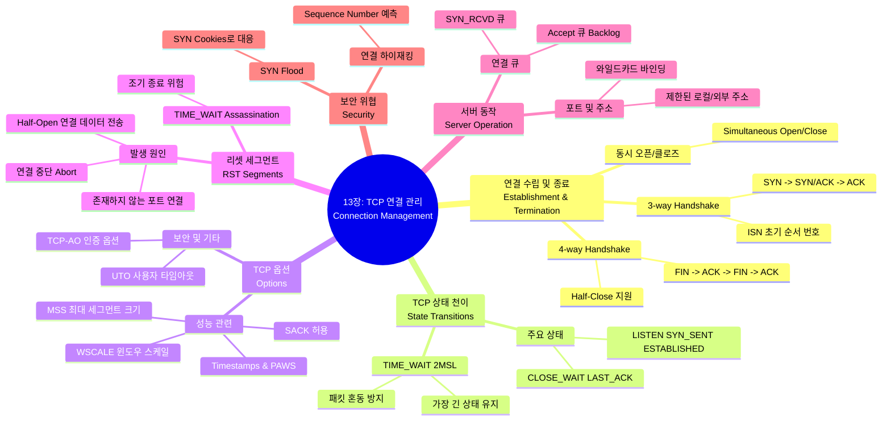

[[01_inbox/books/tcp_ip_illustrated_1/roadmap|📖 Return to Roadmap]]

### 1. Mermaid Mindmap

---

### 2. 중요 정보 및 맥락 요약

**13장: TCP 연결 관리 (TCP Connection Management)**

이 장에서는 신뢰성 있는 바이트 스트림 서비스를 제공하기 위해 TCP가 연결을 생성하고, 유지하고, 종료하는 구체적인 메커니즘과 상태 변화, 그리고 관련 옵션들을 다룹니다.

#### 1. 연결 수립과 종료 (Establishment and Termination)

*   **3방향 핸드셰이크 (3-Way Handshake):** 연결을 시작할 때 클라이언트와 서버는 **SYN** 세그먼트를 교환하여 각자의 **초기 순서 번호(ISN)**를 동기화합니다. 과정은 SYN → SYN+ACK → ACK 순서로 진행됩니다. ISN은 보안을 위해 난수화된 방식을 사용하여 예측을 어렵게 만듭니다,.
*   **4방향 종료 (4-Way Handshake):** 연결을 종료할 때는 양쪽이 각각 **FIN** 세그먼트를 보내고 이에 대해 **ACK**를 받습니다. 한쪽만 종료하고 데이터를 계속 받을 수 있는 **Half-Close** 기능도 지원하지만 자주 사용되지는 않습니다,.
*   **동시 오픈/클로즈 (Simultaneous Open/Close):** 드물지만 두 애플리케이션이 동시에 서로에게 연결을 요청하거나 종료를 요청하는 경우도 TCP는 처리할 수 있습니다. 이 경우 4개의 세그먼트가 교환됩니다.

#### 2. TCP 상태 천이와 TIME_WAIT (State Transitions)

*   **상태 다이어그램:** TCP 연결은 CLOSED, LISTEN, SYN_SENT, ESTABLISHED, FIN_WAIT 등 11가지의 상태를 오가며 관리됩니다.
*   **TIME_WAIT (2MSL Wait):** 능동적으로 연결을 종료한(먼저 FIN을 보낸) 쪽은 **TIME_WAIT** 상태에 들어가 **2MSL(Maximum Segment Lifetime)** 시간 동안 대기합니다. 이는 1) 마지막 ACK가 유실되었을 경우 재전송을 허용하고, 2) 이전 연결의 지연된 패킷이 새로운 연결의 패킷으로 오인되는 것을 방지하기 위함입니다. 이 상태 동안에는 해당 소켓 쌍(IP, 포트)을 재사용할 수 없는 것이 원칙입니다.

#### 3. TCP 옵션 (TCP Options)

연결 수립 시 SYN 세그먼트에는 다양한 옵션이 포함될 수 있습니다.
*   **MSS (Maximum Segment Size):** 수신 가능한 최대 세그먼트 크기를 알립니다.
*   **WSCALE (Window Scale):** 16비트 윈도우 크기 필드의 한계를 극복하기 위해 비트 시프트 값을 지정하여 최대 1GB까지 윈도우 크기를 확장합니다.
*   **Timestamps & PAWS:** RTT(Round-Trip Time)를 더 정밀하게 측정하고, **PAWS(Protection Against Wrapped Sequence Numbers)**를 통해 고속 네트워크에서 순서 번호가 회전(Wrap around)했을 때 오래된 패킷을 구분할 수 있게 합니다,.
*   **기타:** SACK-Permitted(선택적 확인 응답 허용), TCP-AO(인증 옵션), UTO(사용자 타임아웃) 등이 있습니다,.

#### 4. 리셋(RST)과 비정상 종료 (Reset Segments)

*   **RST 세그먼트:** **RST** 플래그가 설정된 세그먼트는 연결을 강제로 즉시 종료하거나 거부할 때 사용됩니다.
    *   **존재하지 않는 포트:** 서버가 리스닝하지 않는 포트로 연결 요청(SYN)이 오면 RST로 응답합니다.
    *   **연결 중단 (Abort):** 정상적인 FIN 교환 대신 즉시 연결을 끊고 데이터를 폐기할 때 사용됩니다(SO_LINGER 옵션 사용 등).
    *   **Half-Open 연결:** 한쪽 호스트가 크래시 후 재부팅되면 이전 연결 정보를 잃습니다. 이때 상대방이 데이터를 보내면 RST를 보내 연결을 정리합니다.

#### 5. 서버 동작 및 큐 관리 (Server Operation)

*   **포트 바인딩:** 서버는 특정 로컬 IP 또는 와일드카드(모든 인터페이스)에 포트를 바인딩하여 연결을 기다립니다.
*   **연결 큐:** 서버는 들어오는 연결을 처리하기 위해 두 개의 큐를 관리합니다.
    1.  **SYN_RCVD 큐:** 핸드셰이크가 아직 완료되지 않은 반(half) 연결 상태.
    2.  **Accept 큐 (Backlog):** 핸드셰이크가 완료되어 애플리케이션이 `accept()` 하기를 기다리는 연결들,.

#### 6. 보안 이슈 (Attacks)

*   **SYN Flood:** 공격자가 소스 IP를 위조하여 대량의 SYN을 보내 서버의 SYN_RCVD 큐를 가득 채우는 서비스 거부(DoS) 공격입니다. 이를 완화하기 위해 **SYN Cookies** 기술(서버가 상태를 저장하지 않고 시퀀스 번호에 정보를 인코딩하여 응답)이 사용됩니다.
*   **연결 하이재킹:** 공격자가 시퀀스 번호 등을 추측하여 기존 연결에 악의적인 데이터를 주입하거나 연결을 끊는 공격입니다.