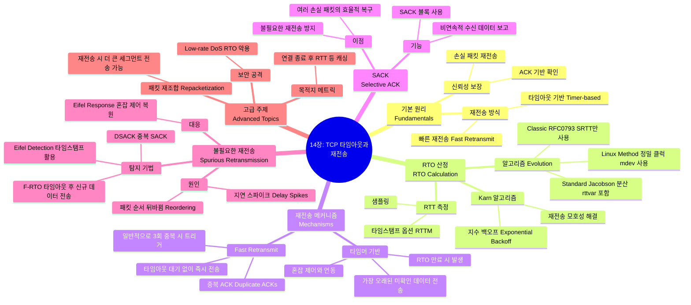

[[01_inbox/books/tcp_ip_illustrated_1/roadmap|📖 Return to Roadmap]]

### 1. Mermaid Mindmap

---

### 2. 중요 정보 및 맥락 요약

**14장: TCP 타임아웃과 재전송 (TCP Timeout and Retransmission)**

이 장에서는 불안정한 네트워크 위에서 TCP가 어떻게 데이터를 신뢰성 있게 전달하는지 설명합니다. 핵심은 **재전송 타이머(RTO)**를 얼마나 정확하게 설정하느냐와, 타이머가 만료되기 전에 손실을 감지하는 **빠른 재전송** 메커니즘을 어떻게 운용하느냐에 있습니다.

#### 1. 재전송 타임아웃(RTO) 설정 (Setting the RTO)
TCP는 연결의 **왕복 시간(RTT)**을 측정하고 이를 바탕으로 RTO를 동적으로 설정합니다.
*   **표준 방식 (Standard Method):** 초기 [RFC0793]의 클래식 방식은 RTT의 분산을 고려하지 못해 불필요한 재전송을 유발했습니다. 이후 Jacobson이 제안한 표준 방식은 평활화된 RTT 평균(**srtt**)뿐만 아니라 평균 편차(**rttvar**)를 함께 계산하여 `RTO = srtt + 4*rttvar`로 설정함으로써 RTT 변동에 더 잘 적응합니다.
*   **리눅스 방식 (The Linux Method):** 리눅스는 1ms 단위의 정밀한 클럭과 타임스탬프 옵션을 사용하여 RTT를 빈번하게 측정합니다. 표준 방식과 달리, RTT가 급격히 감소할 때 RTO가 불필요하게 증가하는 것을 막기 위해 `mdev` 변수를 사용하여 변동성을 더 정교하게 관리하며, 최소 RTO를 200ms로 제한합니다,.
*   **Karn의 알고리즘:** 재전송된 패킷에 대한 ACK가 도착했을 때, 이것이 원래 전송에 대한 것인지 재전송에 대한 것인지 알 수 없는 **재전송 모호성** 문제가 발생합니다. Karn의 알고리즘은 재전송된 세그먼트에 대해서는 RTT 샘플을 업데이트하지 않음으로써 이를 해결합니다. 또한, 재전송이 발생할 때마다 RTO에 **이진 지수 백오프(binary exponential backoff)**를 적용하여 네트워크 부하를 줄입니다.

#### 2. 재전송 메커니즘 (Retransmission Mechanisms)

*   **타이머 기반 재전송:** 데이터를 보낼 때 타이머를 설정하고, ACK가 오지 않고 타이머가 만료되면 가장 오래된 미확인 데이터를 재전송합니다. 이는 최후의 수단으로 간주되며, 발생 시 혼잡 제어에 의해 전송 속도가 크게 줄어듭니다.
*   **빠른 재전송 (Fast Retransmit):** 수신측은 순서가 바뀐 세그먼트를 받으면 즉시 **중복 ACK(Duplicate ACK)**를 보내 빈 공간(hole)을 알립니다. 송신측은 보통 3개의 중복 ACK를 받으면 타이머 만료를 기다리지 않고 즉시 해당 세그먼트를 재전송합니다. 이는 타이머 기반 재전송보다 훨씬 효율적입니다.

#### 3. 선택적 확인 응답 (SACK)

*   **동작 원리:** **SACK(Selective Acknowledgment)** 옵션을 사용하면 수신측은 누적 ACK 외에도 자신이 받은 비연속적인 데이터 블록들의 범위를 송신측에 알릴 수 있습니다.
*   **효과:** SACK 정보를 통해 송신측은 어떤 세그먼트가 손실되었는지 정확히 파악하여, 손실된 데이터만 **선택적으로 재전송(Selective Repeat)**할 수 있습니다. 이는 불필요한 재전송을 줄이고, 한 번의 RTT 동안 여러 개의 손실된 패킷을 복구할 수 있게 합니다.

#### 4. 불필요한(Spurious) 타임아웃과 재전송 관리

네트워크 지연이 갑자기 증가하면 패킷이 손실되지 않았음에도 타임아웃이 발생하여 불필요한 재전송(Spurious Retransmission)이 일어날 수 있습니다.
*   **탐지 알고리즘:**
    *   **DSACK (Duplicate SACK):** 수신측이 중복된 데이터를 받았음을 SACK 옵션을 통해 알립니다.
    *   **Eifel 탐지 알고리즘:** 타임스탬프 옵션을 사용하여 ACK가 원래 전송에 대한 것인지 재전송에 대한 것인지 구별합니다.
    *   **F-RTO (Forward-RTO):** 타임아웃 후 재전송을 한 뒤, 새로운 데이터를 전송해 봅니다. 만약 이에 대한 ACK가 정상적으로 온다면 이전 타임아웃이 거짓이었다고 판단합니다.
*   **복구:** **Eifel 응답 알고리즘**과 같은 메커니즘은 재전송이 불필요했던 것으로 판명되면, 타임아웃으로 인해 축소되었던 혼잡 제어 변수(ssthresh 등)를 원래대로 복원합니다.

#### 5. 기타 주요 기능

*   **패킷 재조합 (Repacketization):** TCP는 재전송 시 원래의 세그먼트와 똑같은 크기로 보낼 필요가 없습니다. 더 큰 세그먼트로 데이터를 묶어서(repacketize) 보내는 것이 허용되며 이는 효율성을 높일 수 있습니다.
*   **목적지 메트릭 (Destination Metrics):** 최신 TCP 구현체들은 연결이 종료된 후에도 RTT나 혼잡 윈도우 등의 경로 정보를 캐시에 저장해 두었다가, 나중에 동일한 목적지로 연결할 때 초기값으로 활용합니다.
*   **공격:** 공격자가 RTO 타이밍을 예측하여 그 시점에 맞춰 트래픽을 폭주시켜 재전송을 유도하는 **Low-rate DoS** 공격 등이 존재합니다.