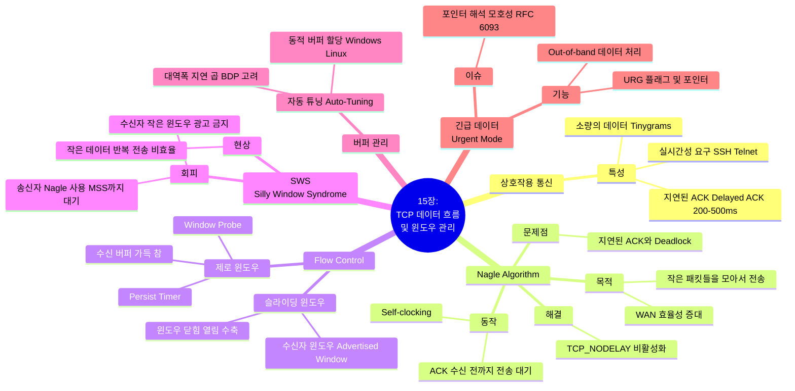

[📖 Return to Roadmap](roadmap.md)

## 1. Mermaid Mindmap

---

## 2. 중요 정보 및 맥락 요약

**15 장: TCP 데이터 흐름과 윈도우 관리 (TCP Data Flow and Window Management)**

이 장에서는 TCP 가 대화형 (interactive) 통신과 대량 (bulk) 데이터 전송을 처리하는 방법, 그리고 수신자의 버퍼 용량을 초과하지 않도록 흐름 제어를 수행하는 윈도우 관리 메커니즘을 다룹니다.

### 1. 상호작용 통신과 지연된 ACK (Interactive Communication & Delayed ACK)

- **상호작용 트래픽:** SSH 나 Telnet 과 같은 애플리케이션은 사용자의 키스트로크마다 개별 패킷을 생성할 수 있습니다. 이러한 작은 패킷 (Tinygrams) 은 헤더 오버헤드가 커서 네트워크 효율을 떨어뜨릴 수 있습니다,.
- **지연된 ACK (Delayed Acknowledgments):** 네트워크 트래픽을 줄이기 위해, TCP 는 데이터를 수신하자마자 ACK 를 보내지 않고 잠시 기다립니다 (보통 200ms, 최대 500ms). 이는 ACK 를 반대 방향으로 가는 데이터에 실어 보내는 **피기백 (piggybacking)**을 가능하게 하거나, 여러 패킷에 대한 ACK 를 하나로 묶어서 보내기 위함입니다,.

### 2. 네이글 알고리즘 (Nagle Algorithm)

- **목적 및 동작:** WAN(Wide Area Network) 에서 수많은 작은 패킷으로 인한 혼잡을 막기 위해 고안되었습니다. 이 알고리즘은 연결에 확인 응답 (ACK) 을 받지 않은 데이터가 있다면, 작은 세그먼트 (MSS 보다 작은 데이터) 를 전송하지 않고 버퍼에 모아둡니다. ACK 가 도착하면 모아둔 데이터를 한 번에 전송합니다.
- **지연된 ACK 와의 충돌:** 네이글 알고리즘 (ACK 가 올 때까지 전송 지연) 과 지연된 ACK(데이터가 올 때까지 ACK 지연) 가 결합되면, 양쪽이 서로를 기다리는 일시적인 **교착 상태 (Deadlock)**가 발생하여 성능이 저하될 수 있습니다.
- **비활성화:** 마우스 움직임이나 실시간 게임처럼 지연 시간이 중요한 애플리케이션은 `TCP_NODELAY` 소켓 옵션을 사용하여 네이글 알고리즘을 끄고 데이터를 즉시 전송할 수 있습니다.

### 3. 흐름 제어와 슬라이딩 윈도우 (Flow Control & Sliding Windows)

- **윈도우 광고:** 수신자는 ACK 를 보낼 때 자신의 버퍼 여유 공간 (Window Size) 을 송신자에게 알립니다. 송신자는 이 크기를 넘어서 데이터를 보내지 않음으로써 수신자를 보호합니다.
- **윈도우 동작:** ACK 가 도착하면 윈도우의 왼쪽 가장자리가 오른쪽으로 이동 (슬라이드) 합니다. 수신 애플리케이션이 데이터를 읽어가면 윈도우 크기가 커집니다 (열림). 윈도우의 오른쪽 가장자리가 왼쪽으로 이동하는 '수축 (Shrinking)'은 지양됩니다,.

### 4. 제로 윈도우와 영속 타이머 (Zero Windows & Persist Timer)

- **제로 윈도우:** 수신 버퍼가 가득 차면 수신자는 윈도우 크기를 0 으로 광고하여 전송을 중단시킵니다.
- **영속 타이머 (Persist Timer):** 윈도우가 다시 열렸다는 업데이트 (ACK) 가 손실될 경우 교착 상태가 발생할 수 있습니다. 이를 방지하기 위해 송신자는 주기적으로 **윈도우 프로브 (Window Probe)** 패킷을 보내 수신자의 윈도우 상태를 확인합니다. 이 타이머는 지수적 백오프 (exponential backoff) 를 사용하여 주기를 늘려갑니다,.

### 5. 실리 윈도우 신드롬 (Silly Window Syndrome - SWS)

- **문제점:** 송신자가 아주 작은 양의 데이터를 보내거나, 수신자가 아주 작은 양의 윈도우만 광고하여, 헤더 오버헤드가 큰 작은 패킷들이 네트워크를 채우는 현상입니다.
- **해결책:**
    - **송신자:** 네이글 알고리즘 등을 사용하여 데이터를 모아서 보냅니다.
    - **수신자:** 버퍼 공간이 충분히 (예: MSS 크기 또는 버퍼의 절반) 비워질 때까지 윈도우 크기를 0 으로 유지하여 작은 윈도우를 광고하지 않습니다,.

### 6. 버퍼 자동 튜닝 (Auto-Tuning)

- 과거에는 고정된 버퍼 크기를 사용했으나, 현대의 TCP(Windows Vista/7, Linux 2.4+ 등) 는 네트워크의 대역폭 지연 곱 (BDP) 을 추정하여 송수신 버퍼 크기를 동적으로 조절하는 **자동 튜닝 (Auto-Tuning)** 기능을 제공합니다. 이를 통해 고속 네트워크의 성능을 최대한 활용할 수 있습니다,.

### 7. 긴급 데이터 (Urgent Mechanism)

- TCP 헤더의 URG 플래그와 긴급 포인터를 사용하여 데이터를 "긴급"으로 표시할 수 있습니다. 이는 논리적으로 별도의 채널 (Out-of-band) 처럼 취급되지만 실제로는 데이터 스트림 내에 포함됩니다. 긴급 포인터가 가리키는 위치 (마지막 바이트인지 그 다음 바이트인지) 에 대한 모호성이 있었으나, RFC 6093 은 이를 명확히 하고 사용을 지양할 것을 권고합니다,.
