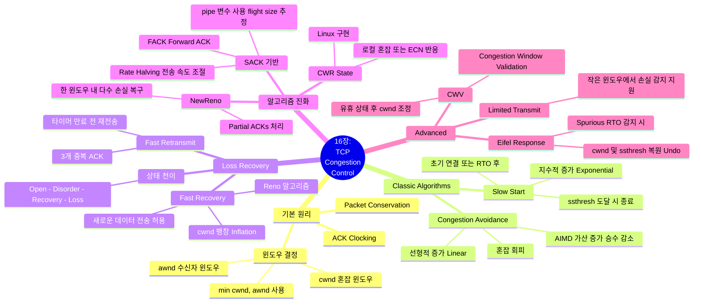

[📖 Return to Roadmap](roadmap.md)

## 1. Mermaid Mindmap

---

## 2. 중요 정보 및 맥락 요약

**16 장: TCP 혼잡 제어 (TCP Congestion Control)**

이 장에서는 네트워크가 처리할 수 있는 용량을 초과하지 않도록 송신 속도를 조절하는 TCP 의 핵심 메커니즘인 혼잡 제어에 대해 다룹니다.

### 1. 혼잡 제어의 개요 (Introduction)

- **필요성:** 라우터가 처리할 수 있는 속도보다 데이터가 빨리 도착하면 버퍼가 가득 차고 패킷 손실 (Congestion) 이 발생합니다. TCP 는 이를 감지하고 전송 속도를 줄여 네트워크 붕괴 (Congestion Collapse) 를 방지합니다.
- **패킷 보존 원칙 (Conservation of Packets):** 안정 상태 (steady state) 에서는 패킷이 네트워크에서 하나 빠져나갈 때 (ACK 도착) 새로운 패킷을 하나 집어넣어야 한다는 원칙입니다. 이를 통해 **ACK 클로킹 (ACK Clocking)**이 이루어져 별도의 타이머 없이도 전송 속도가 네트워크 속도에 맞춰집니다,.
- **윈도우 크기:** 송신자는 수신자가 광고한 윈도우 (`awnd`) 와 네트워크 상태를 추정한 혼잡 윈도우 (`cwnd`) 중 작은 값을 실제 전송 윈도우 ($W$) 로 사용합니다. $W = \min(cwnd, awnd)$.

### 2. 클래식 알고리즘 (The Classic Algorithms)

TCP 는 연결 초기나 손실 발생 시 `cwnd` 를 조절하기 위해 두 가지 주요 알고리즘을 사용합니다.

- **슬로우 스타트 (Slow Start):** 연결 시작이나 재전송 타임아웃 (RTO) 발생 직후 사용됩니다. `cwnd` 를 1(또는 초기 윈도우값) 에서 시작하여 ACK 를 받을 때마다 지수적 (Exponential) 으로 증가시킵니다. `cwnd` 가 `ssthresh`(Slow Start Threshold) 에 도달하면 혼잡 회피 단계로 전환합니다,.
- **혼잡 회피 (Congestion Avoidance):** `ssthresh` 도달 이후에는 `cwnd` 를 선형적 (Linear) 으로 증가시킵니다 (RTT 당 약 1 세그먼트 증가). 패킷 손실이 감지되면 `ssthresh` 를 현재 윈도우의 절반으로 줄이고 (Multiplicative Decrease), 다시 윈도우를 키워가는 **AIMD (Additive Increase Multiplicative Decrease)** 방식을 따릅니다,.

### 3. 손실 복구 및 알고리즘의 진화 (Evolution of Algorithms)

패킷 손실은 혼잡의 신호로 간주되며, TCP 는 이에 대응하여 다양한 복구 전략을 발전시켰습니다.

- **Tahoe & Reno:** 초기 Tahoe 는 손실 시 무조건 슬로우 스타트 (cwnd=1) 로 돌아갔으나, Reno 는 **빠른 회복 (Fast Recovery)**을 도입했습니다. 빠른 재전송 (3 개의 중복 ACK) 후 `cwnd` 를 1 로 줄이는 대신 절반으로 줄이고, 중복 ACK 가 올 때마다 윈도우를 일시적으로 팽창 (Inflation) 시켜 데이터 흐름을 유지합니다,.
- **NewReno:** Reno 는 한 윈도우 내에서 여러 패킷이 손실되면 효율이 떨어집니다. NewReno 는 **부분 ACK (Partial ACK)**를 처리하여, RTO 를 기다리지 않고도 한 윈도우 내의 다수 손실을 복구할 수 있게 개선되었습니다.
- **SACK 기반 제어:** SACK(선택적 확인 응답) 정보를 이용해 송신자는 네트워크에 있는 데이터 양 (`pipe`) 을 더 정확히 추정할 수 있습니다. 이를 통해 **FACK (Forward Acknowledgment)** 및 **Rate Halving**과 같은 기법을 사용하여, 손실 복구 중에도 전송 속도를 부드럽게 조절합니다,.

### 4. 고급 메커니즘 및 예외 처리

- **CWR (Congestion Window Reduced) 상태:** Linux TCP 등은 로컬 장치의 큐가 가득 차거나 ECN(명시적 혼잡 알림) 신호를 받았을 때 CWR 상태로 진입하여 전송 속도를 줄입니다. 이는 패킷 손실 없이도 혼잡에 선제적으로 대응하는 방식입니다.
- **Limited Transmit:** 전송 윈도우가 작아 3 개의 중복 ACK 를 받기 어려운 상황에서도, 1~2 개의 중복 ACK 만으로도 새 데이터를 전송할 수 있게 허용하여 빠른 재전송을 유도하는 기법입니다.
- **CWV (Congestion Window Validation):** 연결이 일정 시간 유휴 (idle) 상태였던 경우, 예전의 큰 `cwnd` 를 그대로 사용하는 것은 위험할 수 있습니다. CWV 는 유휴 기간 후 `cwnd` 를 적절히 줄여서 네트워크 스파이크를 방지합니다.
- **Eifel Response Algorithm:** RTO 가 발생했지만 나중에 그것이 불필요한 (Spurious) 타임아웃임이 밝혀졌을 때 (예: ACK 지연 도착), 줄어들었던 `cwnd` 와 `ssthresh` 를 원래대로 복구 (Undo) 하는 알고리즘입니다.

### 5. 실제 동작 분석 (Extended Example Insights)

실제 트레이스 분석을 통해 다음과 같은 현상이 관찰됩니다.

- **Local Congestion:** 송신자의 애플리케이션이 TCP 로 데이터를 너무 빨리 보내면 하위 계층 큐가 가득 차서 로컬에서 패킷 드롭이 발생할 수 있으며, 이때도 TCP 는 속도를 줄입니다.
- **Stretch ACK:** 수신자가 여러 개의 데이터 세그먼트에 대해 하나의 ACK 만 보내는 현상 (예: 3 개 패킷당 1 ACK) 이 발생하면, 송신자의 `cwnd` 관리에 영향을 줄 수 있습니다.
