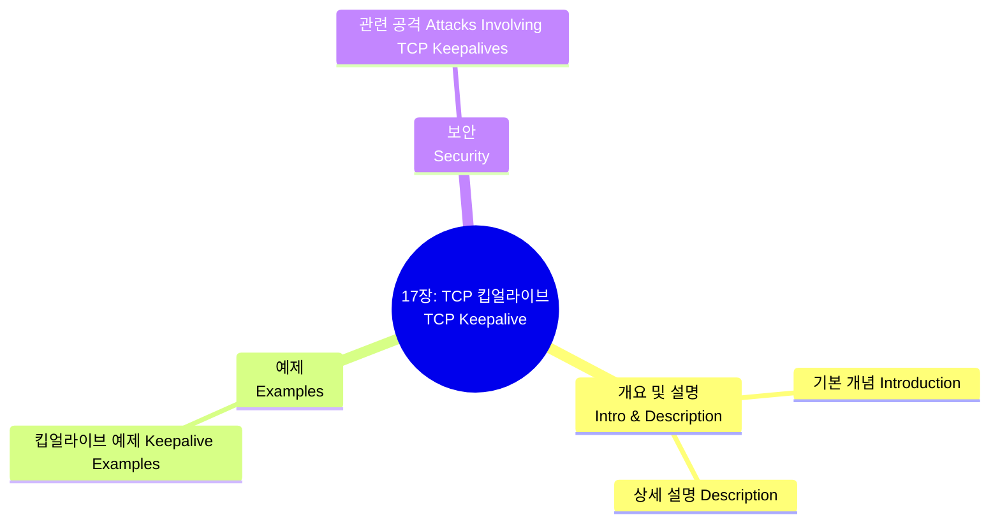

[📖 Return to Roadmap](roadmap.md)

## 1. Mermaid Mindmap

---

## 2. 중요 정보 및 맥락 요약 (목차 기반)

**17 장: TCP 킵얼라이브 (TCP Keepalive)**

이 장은 데이터가 흐르지 않는 유휴 (Idle) 상태의 연결을 유지하거나 죽은 연결을 탐지하기 위한 TCP 의 킵얼라이브 기능에 대해 다룹니다. (본문 내용이 소스에 부재하여 목차를 기반으로 주제만 나열합니다.)

### 1. 개요 및 설명 (Introduction & Description)

- TCP 킵얼라이브의 기본 개념과 동작 원리를 설명하는 섹션입니다.
- 일반적으로 킵얼라이브는 선택적 기능이며, 연결이 여전히 유효한지 확인하기 위해 주기적으로 프로브 패킷을 전송하는 메커니즘을 포함합니다.

### 2. 예제 (Examples)

- **Keepalive Examples:** 실제 네트워크 환경에서 킵얼라이브가 어떻게 설정되고 동작하는지 보여주는 예제들을 다루는 섹션입니다.

### 3. 보안 (Security)

- **Attacks Involving TCP Keepalives:** TCP 킵얼라이브 메커니즘과 관련된 보안 위협이나 공격 유형에 대해 논의합니다.
