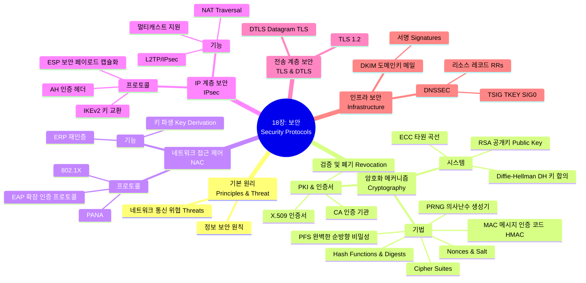

[[01_inbox/books/tcp_ip_illustrated_1/roadmap|📖 Return to Roadmap]]

### 1. Mermaid Mindmap

---

### 2. 중요 정보 및 맥락 요약 (목차 기반)

**18장: 보안: EAP, IPsec, TLS, DNSSEC, 및 DKIM**

이 장에서는 TCP/IP 프로토콜 스위트의 보안을 담당하는 핵심 암호화 기술, 인프라, 그리고 각 계층별 주요 보안 프로토콜을 포괄적으로 다룹니다.

#### 1. 정보 보안의 기초와 위협 (Principles & Threats)

*   **기본 원칙:** 정보 보안의 기본 원칙과 네트워크 통신에 대한 위협을 정의합니다.
*   **암호화 기술 (Cryptography):** 보안 메커니즘의 기반이 되는 다양한 암호화 시스템과 기법을 다룹니다.
    *   **공개키 암호화:** RSA, Diffie-Hellman(DH) 키 합의, 타원 곡선 암호화(ECC) 등을 포함합니다.
    *   **키 관리:** 키 파생(Key Derivation)과 과거 세션 키가 노출되어도 이전 통신의 기밀성을 보장하는 **PFS(Perfect Forward Secrecy)**를 다룹니다.
    *   **무결성 및 인증:** 암호화 해시 함수, 메시지 다이제스트, 그리고 메시지 인증 코드(MAC, HMAC, CMAC, GMAC)를 설명합니다.
    *   **기타 요소:** 의사난수 생성기(Pseudorandom Numbers), Nonces, Salt, 그리고 암호화 제품군(Cipher Suites) 등을 다룹니다,.

#### 2. 공개키 인프라 (PKI & Certificates)

*   **인증서 (Certificates):** 공개키와 소유자의 신원을 연결하는 X.509 공개키 인증서와 이를 발급하는 인증 기관(CA)의 역할을 설명합니다.
*   **관리:** 인증서의 유효성 검증(Validating)과 폐기(Revoking) 메커니즘을 다룹니다.

#### 3. 네트워크 접근 제어 (Network Access Control)

*   **802.1X 및 EAP:** 네트워크 접속 시 인증을 수행하는 IEEE 802.1X 표준과 다양한 인증 방식을 캡슐화할 수 있는 **EAP(Extensible Authentication Protocol)**를 다룹니다. 이는 Wi-Fi 보안(WPA2 등)의 핵심 요소입니다,.
*   **PANA:** 네트워크 접근 인증을 운반하는 프로토콜(Protocol for Carrying Authentication for Network Access)을 설명합니다.

#### 4. 계층별 보안 프로토콜 (Layered Security Protocols)

*   **IPsec (3계층):** IP 패킷 단위의 보안을 제공합니다.
    *   **IKEv2:** 보안 연관(SA)을 수립하기 위한 인터넷 키 교환 프로토콜입니다.
    *   **AH & ESP:** 무결성을 보장하는 인증 헤더(AH)와 암호화를 포함하는 보안 페이로드 캡슐화(ESP)를 설명합니다.
    *   **기타:** NAT 통과(NAT Traversal), L2TP/IPsec VPN, 멀티캐스트 지원 등을 포함합니다.
*   **TLS & DTLS (4계층/애플리케이션):** 웹(HTTPS) 등에서 널리 쓰이는 전송 계층 보안(TLS 1.2)과, UDP와 같은 데이터그램 프로토콜을 위한 DTLS를 다룹니다.

#### 5. 인프라 보안 (Infrastructure Security)

*   **DNSSEC:** DNS 데이터의 위조를 방지하고 무결성을 보장하기 위한 DNS 보안 확장입니다. 새로운 리소스 레코드, 동작 방식, 그리고 트랜잭션 인증(TSIG, TKEY) 등을 다룹니다.
*   **DKIM (DomainKeys Identified Mail):** 이메일 발신자 인증을 통해 스팸과 피싱을 방지하는 기술로, 이메일에 디지털 서명을 추가하는 방식입니다.