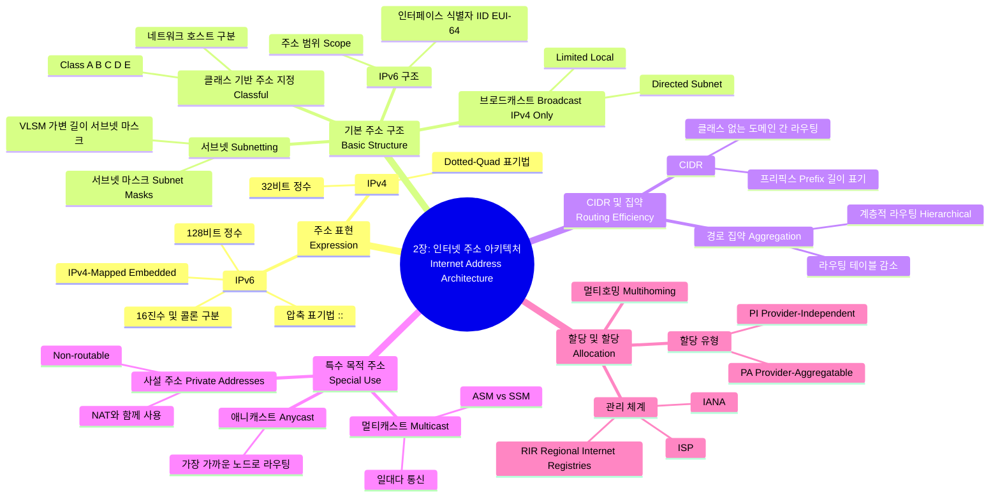

[📖 Return to Roadmap](roadmap.md)

## See Also

- [Routing TCP/IP Vol.1 - Ch.1 TCP/IP Review](chapter1.md)
- [Routing TCP/IP Vol.1 - Ch.2 IPv6 Overview](chapter2.md)

---

## 중요 정보 및 맥락 요약

**2 장: 인터넷 주소 아키텍처 (The Internet Address Architecture)**

이 장에서는 인터넷의 호스트와 라우터를 식별하고 트래픽을 전달하는 데 필수적인 IP 주소의 구조, 할당 방식, 그리고 IPv4 와 IPv6 의 차이점을 다룹니다.

### 1. IP 주소의 표현 (Expressing IP Addresses)

- **IPv4:** 32 비트 정수로, 일반적으로 4 개의 10 진수를 점으로 구분하는 **Dotted-Quad 표기법** (예: 165.195.130.107) 을 사용합니다.
- **IPv6:** 128 비트 정수로, 4 배 더 큽니다. 16 진수 블록을 콜론으로 구분하며 (예: 5f05:2000:…), 연속된 0 블록을 `::` 로 압축하여 표현할 수 있습니다,. IPv4 주소를 내포하는 IPv4-mapped IPv6 주소나 IPv4-compatible 주소 형식도 지원합니다.

### 2. 기본 IP 주소 구조 (Basic IP Address Structure)

- **클래스 기반 주소 지정 (Classful Addressing):** 초기 인터넷은 주소 공간을 클래스 A, B, C(유니캐스트용), D(멀티캐스트용), E(예비용) 로 나누었습니다. 이는 네트워크 크기에 따라 할당되었으나, 주소 고갈과 라우팅 테이블 증가 문제를 야기했습니다,.
- **서브넷 (Subnetting):** 클래스 기반 주소의 호스트 부분을 나누어 사이트 내에서 독자적으로 네트워크를 분할하는 방식입니다. **서브넷 마스크 (Subnet Mask)**를 사용하여 네트워크/서브넷 부분과 호스트 부분을 구분합니다,.
- **VLSM (Variable-Length Subnet Masks):** 사이트 내의 서로 다른 서브넷에 대해 서로 다른 길이의 서브넷 마스크를 적용하여 주소 공간을 효율적으로 사용하는 기법입니다.
- **브로드캐스트 (Broadcast):** IPv4 는 특정 서브넷의 모든 호스트로 전송하는 **Directed Broadcast**와 로컬 네트워크로 제한되는 **Limited Broadcast (255.255.255.255)**를 지원합니다. IPv6 는 브로드캐스트 주소가 없으며 멀티캐스트를 대신 사용합니다,.
- **IPv6 인터페이스 식별자 (IID):** IPv6 유니캐스트 주소의 하위 64 비트는 인터페이스 식별자로 사용되며, 주로 MAC 주소를 기반으로 한 **EUI-64** 형식을 따르거나 개인정보 보호를 위해 무작위로 생성됩니다.

### 3. CIDR 및 집약 (CIDR and Aggregation)

- **CIDR (Classless Inter-Domain Routing):** 클래스 (A, B, C) 구분을 없애고 **프리픽스 (Prefix)** 길이 (예: /24) 를 사용하여 네트워크를 유연하게 할당하는 방식입니다. 이는 주소 공간 효율성을 높이고 라우팅 테이블 크기 문제를 완화하기 위해 도입되었습니다.
- **경로 집약 (Aggregation):** 계층적 라우팅을 통해 인접한 여러 IP 프리픽스를 하나의 짧은 프리픽스로 묶어 광고함으로써, 글로벌 라우팅 테이블의 크기를 줄이고 확장성을 확보합니다,.

### 4. 특수 목적 주소 (Special-Use Addresses)

- **사설 주소 (Private Addresses):** 인터넷에서 라우팅되지 않는 주소 공간 (예: IPv4 의 10.0.0.0/8, 192.168.0.0/16) 으로, 주로 NAT(Network Address Translation) 와 함께 내부망에서 사용됩니다.
- **멀티캐스트 (Multicast):** IPv4(클래스 D) 와 IPv6(ff00::/8) 모두 지원하며, 하나의 패킷을 그룹에 속한 여러 인터페이스로 전달합니다. 전송 방식에 따라 **ASM(Any-Source Multicast)**과 **SSM(Source-Specific Multicast)**으로 나뉩니다,.
- **애니캐스트 (Anycast):** 단일 주소가 여러 위치의 호스트에 할당되며, 라우팅 토폴로지상 "가장 가까운" 호스트로 패킷이 전달됩니다. 주로 DNS 루트 서버나 6to4 게이트웨이를 찾는 데 사용됩니다.

### 5. 할당 및 할당 (Allocation)

- **계층적 관리:** IANA 가 최상위 권한을 가지며, RIR(지역 인터넷 레지스트리) -> ISP -> 최종 사용자 순으로 주소 블록이 할당됩니다,.
- **PA vs. PI 주소:**
    - **PA (Provider-Aggregatable):** ISP 의 주소 블록의 일부를 할당받는 것으로, 라우팅 집약에 유리하지만 ISP 변경 시 주소를 변경 (renumbering) 해야 합니다.
    - **PI (Provider-Independent):** 사용자가 직접 주소를 소유하는 것으로, ISP 변경 시 주소 유지가 가능하지만 글로벌 라우팅 테이블 크기를 증가시킵니다.
- **멀티호밍 (Multihoming):** 신뢰성을 위해 여러 ISP 에 연결하는 방식입니다. PA 주소를 사용할 경우 라우팅 경로 선택이 복잡해질 수 있으며, IPv6 에서는 Shim6 등의 새로운 접근 방식이 연구되었습니다,.
