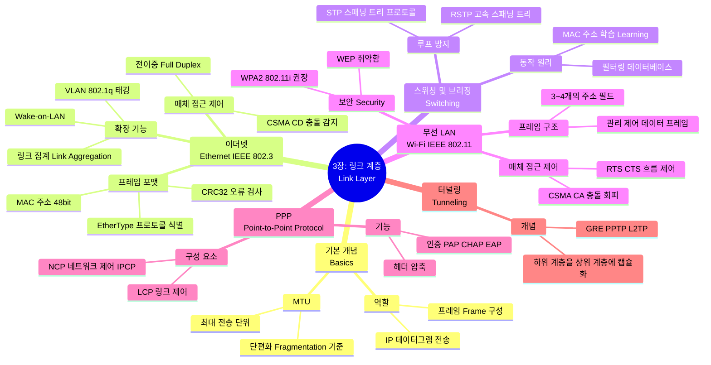

[📖 Return to Roadmap](roadmap.md)

## See Also

- [Routing TCP/IP Vol.1 - Ch.1 TCP/IP Review](chapter1.md)

---

## 중요 정보 및 맥락 요약

**3 장: 링크 계층 (Link Layer)**

이 장에서는 TCP/IP 프로토콜 스위트의 최하단에 위치하며, 물리적 네트워크 하드웨어를 통해 IP 데이터그램을 전송하는 역할을 담당하는 링크 계층을 다룹니다.

### 1. 이더넷 (Ethernet) 및 IEEE 802 표준

- **CSMA/CD:** 초기의 이더넷은 공유 매체 (케이블) 를 사용했기 때문에, 여러 스테이션이 동시에 전송할 때 발생하는 충돌을 처리하기 위해 **CSMA/CD (Carrier Sense Multiple Access with Collision Detection)** 방식을 사용했습니다. 이는 충돌을 감지하면 일정 시간 대기 후 재전송하는 방식입니다.
- **전이중 (Full Duplex) 및 스위치:** 현대의 이더넷은 주로 스위치를 사용하여 **전이중 (Full Duplex)** 모드로 작동합니다. 이는 송신과 수신이 동시에 가능하며 CSMA/CD 의 충돌 감지 기능이 사실상 비활성화됨을 의미합니다,.
- **프레임 포맷:** 이더넷 프레임은 48 비트의 목적지 및 소스 MAC 주소, 상위 계층 프로토콜 (IPv4, IPv6, ARP 등) 을 식별하는 16 비트 **EtherType (Length/Type)** 필드, 페이로드 (데이터), 그리고 오류 검출을 위한 **CRC(Cyclic Redundancy Check)**로 구성됩니다,,.
- **VLAN (802.1q):** 스위치 네트워크를 논리적으로 분할하여 브로드캐스트 트래픽을 격리하고 보안을 강화하기 위해 가상 LAN(VLAN) 을 사용합니다. 프레임에 12 비트 VLAN ID 를 포함하는 태그가 추가됩니다,.

### 2. 브리지와 스위치 (Bridges and Switches)

- **학습 (Learning):** 스위치는 들어오는 프레임의 소스 MAC 주소를 보고 어떤 포트에 어떤 장비가 연결되어 있는지 학습하여 필터링 데이터베이스 (Forwarding Database) 를 구축합니다. 이를 통해 불필요한 포트로의 트래픽 전송 (Flooding) 을 줄입니다,.
- **스패닝 트리 프로토콜 (STP):** 이중화된 경로가 있는 네트워크에서 프레임이 무한히 순환하는 루프 (Loop) 를 방지하기 위해 **STP (Spanning Tree Protocol)**를 사용합니다. 이는 논리적으로 루프 없는 트리 구조를 생성하며, 포트를 차단 (Blocking) 상태로 두어 루프를 막습니다. 최신 표준은 수렴 속도를 개선한 **RSTP (Rapid STP)**를 사용합니다,.

### 3. 무선 LAN (IEEE 802.11 / Wi-Fi)

- **CSMA/CA:** 무선 환경에서는 충돌을 감지하기 어렵기 때문에, 충돌을 회피하는 **CSMA/CA (Collision Avoidance)** 방식을 사용합니다. 숨겨진 노드 문제 (Hidden Terminal Problem) 를 해결하기 위해 **RTS/CTS (Request-to-Send/Clear-to-Send)** 메커니즘을 선택적으로 사용합니다,,.
- **프레임 및 모드:** Wi-Fi 는 이더넷보다 복잡한 프레임 구조를 가지며, 액세스 포인트 (AP) 를 통하는 인프라스트럭처 모드와 기기 간 직접 통신하는 애드혹 (Ad-hoc) 모드를 지원합니다,.
- **보안:** 초기 보안 표준인 WEP 는 취약점이 발견되어 사용되지 않으며, 현재는 **WPA2 (IEEE 802.11i)**가 표준으로 사용됩니다. 이는 AES 암호화 등을 통해 강력한 보안을 제공합니다,.

### 4. 점대점 프로토콜 (PPP)

- **구조:** PPP 는 두 노드 간의 직접적인 연결 (예: DSL, 다이얼업) 을 위해 설계되었습니다. 링크를 설정하고 유지하는 **LCP (Link Control Protocol)**와 상위 네트워크 계층 프로토콜 (IP 등) 을 설정하는 **NCP (Network Control Protocol)**로 구성됩니다. IPv4 를 위한 NCP 는 IPCP 입니다,.
- **기능:** PPP 는 인증 (PAP, CHAP, EAP), 데이터 압축, 헤더 압축 (VJ compression) 등의 기능을 협상하고 지원할 수 있습니다,,.

### 5. 기타 핵심 개념

- **MTU (Maximum Transmission Unit):** 링크 계층이 전송할 수 있는 최대 데이터 크기입니다. 이더넷의 기본 MTU 는 1500 바이트입니다. 상위 계층 (IP) 은 MTU 보다 큰 데이터를 전송할 때 단편화 (Fragmentation) 를 수행해야 합니다,.
- **터널링 (Tunneling):** 하위 계층 프로토콜을 상위 계층 프로토콜 안에 캡슐화하여 가상 링크를 생성하는 기술입니다. VPN 이나 IPv6 전환 기술 등에 사용되며 GRE, PPTP, L2TP 등이 있습니다.
- **루프백 (Loopback):** `127.0.0.1` (IPv4) 또는 `::1` (IPv6) 주소를 사용하여 트래픽이 네트워크로 나가지 않고 호스트 내부에서 다시 수신되도록 하는 가상 인터페이스입니다.

### 6. 보안 이슈

- 링크 계층은 물리적 접근이 가능한 공격자에 의해 스니핑 (Sniffing), MAC 플러딩 (MAC Flooding), ARP 스푸핑 (ARP Spoofing, 4 장에서 다룸), 무선 네트워크의 불법 AP(Rogue AP) 등 다양한 공격의 대상이 될 수 있습니다. 상위 계층의 암호화 (SSL/TLS, IPsec) 가 중요한 방어 수단이 됩니다,.
