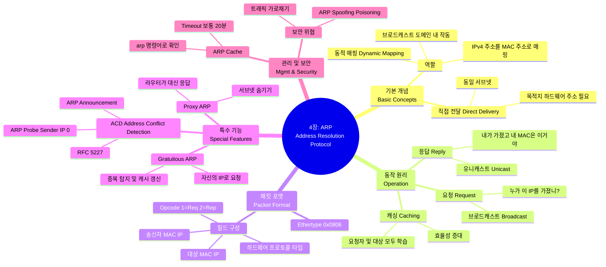

[[01_inbox/books/tcp_ip_illustrated_1/roadmap|📖 Return to Roadmap]]

## See Also

- [[01_inbox/books/routing_tcp_ip_1/chapter1|Routing TCP/IP Vol.1 - Ch.1 TCP/IP Review]]

---

## 중요 정보 및 맥락 요약

**4 장: ARP (Address Resolution Protocol)**

이 장에서는 논리적인 인터넷 주소 (IPv4) 를 물리적인 하드웨어 주소 (MAC) 로 변환하여 동일한 물리적 네트워크 내에서 통신을 가능하게 하는 ARP 의 동작 원리와 다양한 기능을 다룹니다.

### 1. 기본 개념 및 동작 (Introduction & Operation)

- **역할:** ARP 는 32 비트 IPv4 주소를 이더넷과 같은 네트워크 인터페이스 하드웨어에서 사용하는 48 비트 주소로 동적으로 매핑합니다. IPv6 는 ARP 대신 ICMPv6 를 사용하는 Neighbor Discovery 프로토콜을 사용합니다.
- **직접 전달 (Direct Delivery):** 동일한 IP 서브넷에 있는 호스트로 데이터그램을 보낼 때, 송신 호스트는 목적지의 하드웨어 주소를 알아야 합니다. 이를 위해 ARP 요청 (Request) 을 브로드캐스트하여 "이 IP 주소를 가진 호스트는 하드웨어 주소를 응답해달라"고 요청합니다.
- **요청과 응답:** ARP 요청은 링크 계층 브로드캐스트 (ff:ff:ff:ff:ff:ff) 로 전송되어 네트워크의 모든 호스트가 수신하지만, 해당 IP 를 가진 호스트만 유니캐스트로 응답 (Reply) 합니다.

### 2. ARP 캐시 및 패킷 포맷 (Cache & Format)

- **ARP 캐시:** 효율성을 위해 호스트와 라우터는 ARP 매핑 정보를 캐시 (Cache) 에 저장합니다. 일반적인 완료된 항목의 타임아웃은 20 분이며, 미완료 항목은 3 분입니다.
- **패킷 구조:** 이더넷 프레임의 EtherType 은 `0x0806` 입니다. ARP 메시지 내부에는 하드웨어 타입 (이더넷=1), 프로토콜 타입 (IPv4=0x0800), 연산 코드 (Opcode: 요청=1, 응답=2), 그리고 송신자와 타겟의 하드웨어 및 프로토콜 주소가 포함됩니다.
- **최적화:** 타겟 호스트가 ARP 요청을 받으면, 요청을 보낸 호스트의 IP 와 MAC 주소 정보를 자신의 캐시에 저장하여 향후 통신에 대비합니다.

### 3. 특수 기능 (Special Features)

- **Proxy ARP:** 라우터가 자신의 인터페이스에 없는 호스트 (예: 다른 네트워크에 있는 호스트) 에 대한 ARP 요청에 자신의 MAC 주소로 대신 응답하는 기능입니다. 이를 통해 발신자는 마치 목적지가 로컬 네트워크에 있는 것처럼 통신할 수 있습니다.
- **Gratuitous ARP:** 호스트가 자신의 IP 주소에 대해 ARP 요청을 보내는 것입니다. 주로 부팅 시 IP 주소 중복을 확인하거나, 인터페이스 카드가 교체되었을 때 이웃 호스트들의 ARP 캐시를 갱신하기 위해 사용됩니다.
- **ACD (Address Conflict Detection):** [RFC 5227] 에 정의된 기능으로, Gratuitous ARP 를 확장하여 지속적으로 주소 충돌을 감지합니다. **ARP Probe** 패킷 (송신자 IP 가 0 으로 설정됨) 을 사용하여 캐시를 오염시키지 않고 주소 사용 여부를 확인하며, 이후 **ARP Announcement**를 통해 주소 사용을 선언합니다.

### 4. 관리 및 보안 (Management & Security)

- **arp 명령어:** `arp -a` 를 통해 캐시를 확인하고, `-d` 로 삭제하며, `-s` 로 정적 (static) 항목을 추가할 수 있습니다.
- **임베디드 장치 설정:** 키보드가 없는 장비의 초기 IP 를 설정할 때, 수동으로 정적 ARP 항목을 생성한 후 핑 (ping) 을 보내 장비가 해당 패킷의 목적지 IP 를 자신의 주소로 설정하게 하는 방식이 사용되기도 했습니다.
- **보안 이슈:** ARP 는 인증 기능이 없어 스푸핑 (Spoofing) 공격에 취약합니다. 공격자가 라우터나 다른 호스트인 척 위장하여 트래픽을 가로채는 ARP Poisoning 공격이 가능합니다.
