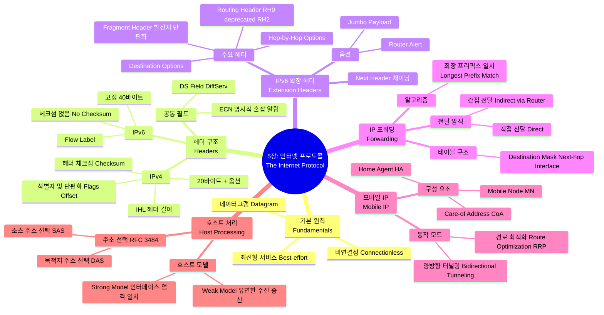

[[01_inbox/books/tcp_ip_illustrated_1/roadmap|📖 Return to Roadmap]]

## See Also

- [[01_inbox/books/routing_tcp_ip_1/chapter1|Routing TCP/IP Vol.1 - Ch.1 TCP/IP Review]]

---

## 중요 정보 및 맥락 요약

**5 장: 인터넷 프로토콜 (The Internet Protocol)**

이 장에서는 TCP/IP 프로토콜 스위트의 핵심인 IP(Internet Protocol) 의 구조, 동작 원리, IPv4 와 IPv6 의 차이점, 그리고 모바일 IP 와 같은 확장 기능을 다룹니다.

### 1. IP 의 기본 특성 및 헤더 (IPv4 vs. IPv6)
- **서비스 모델:** IP 는 **최선형 (best-effort)**, **비연결성 (connectionless)** 데이터그램 서비스를 제공합니다. 데이터의 신뢰성 (재전송, 순서 보장 등) 은 상위 계층 (TCP 등) 이 담당합니다.
- **IPv4 헤더:** 가변 길이 (일반적으로 20 바이트) 이며, 헤더 길이를 나타내는 **IHL**, 전체 길이를 나타내는 **Total Length**, 단편화를 위한 **Identification/Flags/Offset**, 루핑 방지를 위한 **TTL**, 상위 프로토콜을 지시하는 **Protocol**, 그리고 헤더 오류 검출을 위한 **Header Checksum** 필드를 포함합니다.
- **IPv6 헤더:** 고정 40 바이트 크기로 단순화되었습니다. **IHL, Header Checksum 필드가 제거**되었으며 (상위 계층 체크섬에 의존), 단편화 정보는 확장 헤더로 이동했습니다. **Flow Label**이 추가되었고, Protocol 필드는 **Next Header**로 대체되어 확장 헤더 체이닝을 지원합니다,.
- **DS Field & ECN:** IPv4 의 ToS(Type of Service) 와 IPv6 의 Traffic Class 는 **DS Field(Differentiated Services)**와 **ECN(Explicit Congestion Notification)**으로 재정의되어, QoS(서비스 품질) 및 혼잡 제어에 사용됩니다,.

### 2. IPv6 확장 헤더 (Extension Headers)
- **구조:** IPv6 는 기본 헤더 뒤에 **Next Header** 필드를 통해 연결된 일련의 확장 헤더들을 가질 수 있습니다. 이는 유연성과 효율성을 제공합니다.
- **주요 확장 헤더:**
    - **Hop-by-Hop Options:** 경로상의 모든 라우터가 처리해야 하는 옵션 (예: Router Alert, Jumbogram).
    - **Routing Header:** 발신자가 패킷의 경로를 지정. **RH0(Source Routing)**는 보안 문제로 사용 중단 (deprecated) 되었으며, MIPv6 를 위한 **RH2**가 사용됩니다.
    - **Fragment Header:** IPv6 에서는 발신자 (Source) 만이 단편화를 수행할 수 있으며, 중간 라우터는 단편화를 하지 않습니다. MTU 보다 큰 패킷을 보낼 때 이 헤더를 사용합니다.
- **Jumbo Payload:** 64KB 이상의 페이로드를 지원하기 위해 사용됩니다.

### 3. IP 포워딩 (IP Forwarding)
- **전달 방식:** 목적지가 동일한 링크에 있으면 **직접 전달 (Direct Delivery)**하고, 그렇지 않으면 라우터를 통해 **간접 전달 (Indirect Delivery)**합니다.
- **포워딩 테이블:** 목적지, 마스크, 넥스트 홉 (Next-hop), 인터페이스 정보를 포함합니다. IP 는 **홉 - 바이 - 홉 (hop-by-hop)** 방식을 따르며, 전체 경로를 알지 못합니다.
- **최장 프리픽스 일치 (Longest Prefix Match):** 포워딩 테이블 검색 시, 목적지 주소와 가장 많은 비트가 일치하는 (마스크가 가장 긴) 엔트리를 선택하여 패킷을 전달합니다.

### 4. 모바일 IP (Mobile IP)
- **개념:** 호스트 (Mobile Node, MN) 가 네트워크 접속 위치를 변경해도 (IP 주소가 변경되어도) 기존 연결을 유지하게 해주는 기술입니다. **홈 주소 (HoA)**와 현재 위치의 **CoA(Care-of Address)**를 사용합니다.
- **동작 모드:**
    - **양방향 터널링 (Bidirectional Tunneling):** 모든 트래픽이 **홈 에이전트 (Home Agent, HA)**를 거쳐 터널링되어 전달됩니다. 설정이 간단하지만 경로 비효율성이 발생할 수 있습니다.
    - **경로 최적화 (Route Optimization):** MN 과 통신 상대 (Correspondent Node, CN) 가 직접 통신합니다. 이를 위해 **RRP(Return Routability Procedure)**를 통해 보안 검증 (HoTI/CoTI 메시지 교환) 을 수행한 후 바인딩을 맺습니다,.

### 5. 호스트 처리 및 주소 선택 (Host Processing)
- **호스트 모델:**
    - **Strong Host Model:** 패킷이 도착한 인터페이스에 할당된 주소와 목적지 주소가 일치해야만 패킷을 수락합니다 (보안 강화).
    - **Weak Host Model:** 로컬 시스템의 어떤 IP 주소라도 목적지와 일치하면 어느 인터페이스로 들어오든 수락합니다.
- **주소 선택 알고리즘 (RFC 3484):** 멀티홈 호스트나 IPv4/IPv6 듀얼 스택 환경에서 소스 및 목적지 주소를 선택하는 규칙입니다. 일반적으로 **동일한 스코프 (Scope)**, **더 작은 스코프**, **사용되지 않는 (deprecated) 주소 회피** 등의 우선순위를 따릅니다.

### 6. 보안 이슈 (Attacks Involving IP)
- **스푸핑 (Spoofing):** 소스 IP 주소를 위조하여 공격하거나 신원을 숨기는 행위입니다. **Ingress Filtering**을 통해 완화할 수 있습니다.
- **단편화 공격:** 단편화된 패킷 처리에 버그가 있거나, 방화벽을 우회하기 위해 조작된 조각을 보내는 공격 등이 있습니다.
